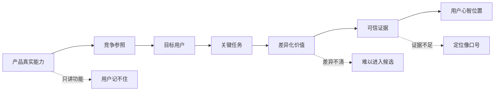
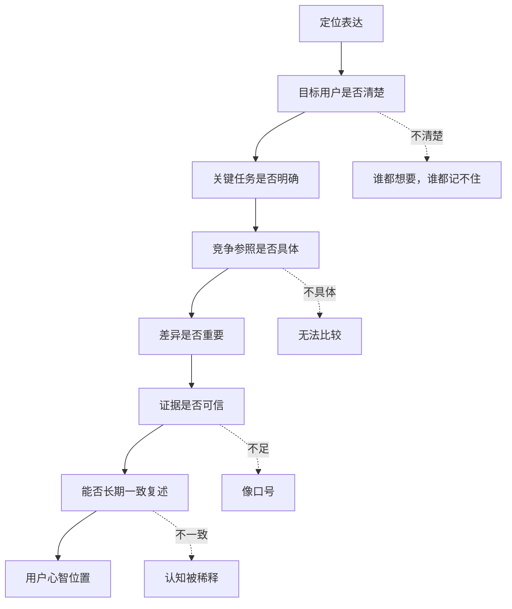

## 产品运营思维筑基课: 产品运营的上层定律: 定位理论
  
### 作者  
digoal  
  
### 日期  
2026-05-13
  
### 标签  
定位理论 , 产品运营 , 用户心智 , 品牌定位 , 差异化 , 技术产品 , 市场认知 , 竞争策略 , 品牌影响力 , 上层定律
  
----  
  
## 背景 

> 面向对象: 高中生、大学生、产品运营新人、技术产品市场与运营同学  
> 核心问题: 为什么一个产品明明功能很多、技术也不错，用户却说不清它是谁、适合什么、和别人有什么不同？  
> 先说结论: 定位理论的核心不是“给产品写一句漂亮口号”，而是在目标用户心智中占据一个清楚、可信、可持续的位置。技术产品的定位尤其要回答: 面向谁、解决什么关键任务、相对哪个替代方案有什么差异、凭什么相信。

## 一张图先看懂



可以把定位理解成用户脑子里的一个“标签格子”:

```text
当用户想到某个问题时，
他脑子里会先浮现少数几个候选产品。

定位做得好:
用户知道什么时候该想起你。

定位做得差:
用户听过你，却不知道该把你放在哪个格子里。
```

技术产品也是一样:

```text
“我们是新一代智能数据基础设施”太宽。
“我们帮 PostgreSQL 用户低成本迁移到云原生架构”更像定位。
```

## 求真讲法

### 它到底说了什么

定位理论说的是:

市场竞争不只发生在产品货架上，也发生在用户心智中。用户的注意力有限，记忆位置有限，不会记住所有产品的全部信息。一个产品要被选择，必须在目标用户心里占据一个清楚位置。

这个位置通常由四个问题组成:

| 问题 | 含义 | 技术产品例子 |
|---|---|---|
| 面向谁 | 目标用户是谁 | 开发者、DBA、架构师、CTO、数据团队 |
| 解决什么 | 关键任务是什么 | 迁移数据库、构建 RAG、降低运维成本 |
| 相比谁 | 替代方案是什么 | 自研、旧系统、竞品、开源组件、不行动 |
| 凭什么 | 差异和证据是什么 | 兼容性、性能、案例、生态、成本、支持 |

所以，定位不是一句孤立表达，而是一组清晰选择。

一个弱定位常常长这样:

```text
我们是企业级一站式智能数据平台。
```

它的问题是: 太大、太满、太难比较。

一个更强的定位可能是:

```text
面向已经使用 PostgreSQL 的企业，
我们提供兼容 PostgreSQL 生态的云原生数据库，
让应用在少改代码的前提下获得弹性、管控和企业级运维能力。
```

它更清楚地说明了用户、任务、替代路径和差异。

### 它是怎么来的

定位理论通常与 Al Ries 和 Jack Trout 的著作 *Positioning: The Battle for Your Mind* 联系在一起。它的基本观察是: 现代市场信息过载，用户无法完整处理所有品牌信息，于是会用简单标签、类别和顺序来组织记忆。

例如，人在选择产品时常常不是从零开始分析，而是先问:

```text
这个领域我先想到谁？
谁最专业？
谁最便宜？
谁最稳定？
谁最适合开发者？
谁最适合大企业？
```

这些“先想到”的位置，就是定位竞争的结果。

对技术产品来说，定位理论尤其重要，因为技术产品常常复杂、相似、术语多。如果没有清楚定位，用户会把你归入一个模糊类别:

```text
又一个数据库。
又一个 AI 平台。
又一个低代码工具。
又一个监控系统。
```

一旦进入模糊类别，产品就容易被价格、渠道、老品牌或默认方案压制。

### 它依赖哪些假设

定位理论依赖几个前提:

1. 用户注意力有限，无法记住所有产品细节。
2. 用户会用类别、标签和对比来理解产品。
3. 用户心智中每个类别能容纳的强记忆位置有限。
4. 产品选择通常发生在替代方案比较中。
5. 清晰、一致、可信的表达比频繁变化的表达更容易沉淀心智。

如果一个市场没有竞争、用户没有选择、产品极其简单，定位的重要性会下降。但在技术产品市场里，用户通常面对多个替代方案，因此定位几乎总是运营的基础工作。

### 常见误解

**误解一: 定位就是 slogan。**

不对。Slogan 是定位的表达之一。定位本身是战略选择: 服务谁、不服务谁、解决什么、不解决什么、与谁比较、凭什么胜出。

**误解二: 定位越大越好。**

通常相反。越大的定位越难被记住，也越难被相信。技术产品说自己“一站式、全场景、智能化平台”，如果没有强证据，往往会变得空泛。

**误解三: 定位一旦确定就永远不能变。**

不对。定位可以随着产品能力、市场阶段、客户结构变化而调整。但调整要有连续性和证据，不能每次活动换一个说法。

**误解四: 技术强就不需要定位。**

错。技术强只是原材料。定位决定用户如何理解技术强在哪里、为什么和自己有关、何时应该选择你。

## 求存讲法

### 它有什么用

定位理论能帮助产品运营做三件事:

1. 减少用户理解成本。
2. 减少内部表达混乱。
3. 提高内容、渠道、销售、产品路线的一致性。

如果没有定位，运营会把所有优点都说出来:

```text
高性能、高可靠、低成本、云原生、AI 原生、安全合规、开放生态、开发者友好、企业级服务。
```

如果有定位，运营会先排序:

```text
我们最想在谁心里，占据哪个问题的首选位置？
```

一个实用定位公式是:

```text
对于 [目标用户]，
当他们遇到 [关键任务/问题] 时，
我们的产品是 [清晰类别]，
相比 [主要替代方案]，
因为 [核心差异和证据]，
所以能带来 [重要结果]。
```

技术产品定位示例:

```text
对于正在构建企业知识库的 AI 应用团队，
当他们需要把权限、结构化过滤和语义检索放在同一条链路里时，
我们的数据库提供内置向量和混合检索能力，
相比额外维护一套独立向量服务，
能降低系统复杂度和长期运维成本。
```

### 它怎么迁移到熟悉领域

假设学校要选一个同学做运动会志愿者负责人。

三个人都说自己“能力强”:

```text
甲: 我什么都能做。
乙: 我最擅长把复杂安排拆成清单，保证大家按时到位。
丙: 我跑得快，体力好。
```

如果任务是“组织全班按时检录、拿物资、排队入场”，乙更容易被选中。不是因为乙所有能力最强，而是他的定位和任务最匹配。

产品也是这样。用户不是在抽象地选择“最强产品”，而是在具体任务里选择“最适合这个问题的产品”。

所以定位要从“我有什么”转向:

```text
用户在什么任务里，最应该想起我？
```

### 它的适用范围和边界

定位理论特别适用于:

- 新产品进入市场
- 技术产品做品牌影响力
- 开源项目争取开发者心智
- B2B 产品做线索和销售支持
- 多功能产品需要讲清主线
- 竞争激烈、同质化明显的市场

它的边界是:

| 场景 | 定位作用 | 说明 |
|---|---:|---|
| 垄断市场 | 较低 | 用户选择少，但长期仍需品牌认知 |
| 极低价冲动消费 | 中等 | 包装和渠道可能更直接 |
| 早期探索产品 | 中等 | 定位可能需要随发现持续迭代 |
| 技术基础设施 | 高 | 用户需要明确适用场景和可信差异 |
| 开发者工具 | 高 | 开发者需要知道何时用你、为何不用别人 |
| 新品类产品 | 极高 | 需要先定义类别，再定义位置 |

定位也不能替代产品能力。一个清晰但不真实的定位，会让用户更快发现落差。定位必须建立在真实能力、真实用户、真实证据上。

### 正例: 怎么用它提升能力

假设你运营一个国产数据库产品。

低水平定位是:

```text
新一代企业级分布式云原生智能数据库。
```

这句话听起来很大，但用户难以判断你到底适合什么。

更好的定位过程是:

1. 目标用户: 已经大量使用 PostgreSQL 的企业技术团队。
2. 关键任务: 希望获得企业级管控、云原生弹性和国产化支持。
3. 竞争参照: 继续自建 PostgreSQL、迁移到完全不同的新数据库、使用封闭商业数据库。
4. 核心差异: 兼容 PostgreSQL 生态，降低应用改造和人才迁移成本。
5. 可信证据: 兼容性测试、迁移案例、性能报告、客户实践、生态工具支持。

形成定位表达:

```text
面向 PostgreSQL 生态用户的企业级云原生数据库，
在保留熟悉生态和应用兼容性的同时，
提供更适合企业生产环境的弹性、管控和服务能力。
```

然后所有运营资产围绕这个定位展开:

| 资产 | 如何服务定位 |
|---|---|
| 技术文章 | 解释兼容性、弹性、管控的技术机制 |
| 客户案例 | 展示 PostgreSQL 迁移和生产落地 |
| Demo | 证明现有应用如何低成本接入 |
| 白皮书 | 说明企业级能力和边界 |
| 社区内容 | 连接 PostgreSQL 用户已有认知 |

### 反例: 前提不成立会怎样

反例一: 定位过宽，用户记不住。

某产品说自己是“企业数字化智能底座”，既讲数据、又讲 AI、又讲流程、又讲安全、又讲协同。用户听完不知道它到底优先解决哪个问题，也不知道应该让哪个部门来评估。

这里失败的前提是:

```text
用户心智容量有限，不能记住一个过宽、过满的位置。
```

反例二: 定位清楚，但没有证据。

某 AI 产品定位为“最懂金融风控的大模型平台”，但没有金融场景案例、风控指标、合规说明、专家背书和可复现测试。定位听起来清楚，却无法被相信。

这里失败的前提是:

```text
技术产品定位必须有证据支撑。
```

反例三: 定位频繁变化。

某开发者工具这个月强调“低代码”，下个月强调“AI Agent 平台”，再下个月强调“企业级自动化中台”。每个方向都有内容，但用户无法形成稳定认知。

这里失败的前提是:

```text
定位需要长期一致地进入心智，频繁变化会稀释记忆。
```

## 思考

定位理论最重要的启发是: 产品运营不是把产品所有优点讲完，而是帮助用户在一个清晰问题里想起你、理解你、相信你。

可以用这张图检查一个技术产品的定位是否成立:



对技术影响力来说，定位理论意味着:

```text
技术影响力不是证明你什么都懂，
而是让专业用户知道你在某个关键技术问题上最值得被认真评估。
```

对品牌影响力来说，定位理论意味着:

```text
品牌影响力不是让用户听过你，
而是让用户在特定任务或类别里稳定想起你。
```

可以进一步追问:

1. 用户遇到什么问题时，应该第一时间想起我们？
2. 我们现在的定位是否能用一句话讲清楚？
3. 这句话是否说明了目标用户、任务、替代方案和差异？
4. 我们的内容、案例、渠道、销售是否都在强化同一个位置？
5. 如果竞争对手也说类似的话，我们的证据是否足够区分？

## 最后记住

1. 定位不是口号，而是在用户心智中占据一个清楚位置。
2. 好定位要说明目标用户、关键任务、竞争参照、差异价值和可信证据。
3. 技术产品越复杂，越需要定位降低用户理解和比较成本。
4. 定位不能贪大求全，过宽的位置很难被记住和相信。
5. 技术影响力和品牌影响力，来自长期一致地强化一个可信、重要、可复述的位置。

## 参考资料

- Al Ries and Jack Trout, *Positioning: The Battle for Your Mind*, 1981.
- Jack Trout and Steve Rivkin, *The New Positioning*, 1996.
- Philip Kotler and Kevin Lane Keller, *Marketing Management*, multiple editions.
- Geoffrey A. Moore, *Crossing the Chasm*, 1991.
- David A. Aaker, *Managing Brand Equity*, 1991.
- 本文基于定位理论、品牌资产、技术产品运营、B2B 产品营销和开发者关系中的通用经验整理；未使用实时联网资料。
  
#### [PostgreSQL 解决方案集合](../201706/20170601_02.md "40cff096e9ed7122c512b35d8561d9c8")
  
  
#### [德哥 / digoal's Github - 公益是一辈子的事.](https://github.com/digoal/blog/blob/master/README.md "22709685feb7cab07d30f30387f0a9ae")
  
  
#### [About 德哥](https://github.com/digoal/blog/blob/master/me/readme.md "a37735981e7704886ffd590565582dd0")
  
  

  
