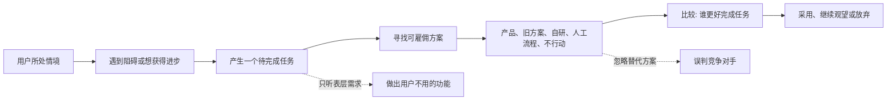
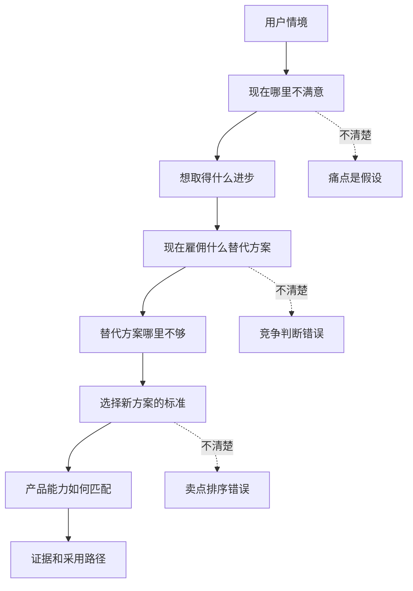

## 产品运营思维筑基课: 产品运营的上层定律: Jobs To Be Done
  
### 作者  
digoal  
  
### 日期  
2026-05-13
  
### 标签  
Jobs To Be Done , 用户任务 , 产品运营 , 需求分析 , 场景洞察 , 用户价值 , 技术产品 , 采用动机 , 产品策略 , 上层定律
  
----  
  
## 背景 

> 面向对象: 高中生、大学生、产品运营新人、技术产品市场与运营同学  
> 核心问题: 为什么用户说想要某个功能，产品做出来后却没人用；为什么同一个产品在不同用户手里价值完全不同？  
> 先说结论: Jobs To Be Done 不是问用户“想要什么功能”，而是问用户在什么情境下，想完成什么进步。用户不是单纯购买产品，而是在“雇佣”产品帮自己完成一个任务；技术产品运营要围绕这个任务解释价值、设计内容、建立证据和推动转化。

## 一张图先看懂



可以用一句话理解:

```text
用户不是想买一把锤子，
用户是想把钉子钉进去；
更深一层，用户是想把相框挂稳，让房间变得像自己的家。
```

技术产品也是这样:

```text
用户不是想买向量数据库、AI 平台、监控系统。
用户想完成的是: 让知识库答得准、让研发更高效、让系统故障更快被定位。
```

## 求真讲法

### 它到底说了什么

Jobs To Be Done，常译为“待完成任务”理论。它的核心观点是:

用户选择产品，是因为在某个具体情境下，他想取得某种进步，于是“雇佣”一个产品或方案来帮他完成这件事。

这里有几个关键点:

| 概念 | 含义 | 技术产品例子 |
|---|---|---|
| 情境 | 用户在什么情况下产生需求 | 企业知识库接入大模型后答非所问 |
| 任务 | 用户想完成什么进步 | 让员工更准确地查询内部知识 |
| 阻碍 | 现在为什么做不好 | 文档分散、检索不准、权限复杂 |
| 替代方案 | 用户现在雇佣什么方案 | 人工问专家、关键词搜索、自研系统 |
| 雇佣标准 | 用户如何判断谁更合适 | 准确率、权限、成本、维护复杂度 |
| 结果 | 用户希望看到什么变化 | 回答更准、维护更省、上线更快 |

JTBD 的重点不是“用户是谁”这么简单，也不是“用户想要什么功能”这么直接，而是:

```text
在什么情境下，
用户为什么不满意现状，
他想取得什么进步，
他现在用什么替代方案，
什么条件会让他换用你的产品。
```

### 它是怎么来的

Jobs To Be Done 常与 Clayton Christensen 等人的创新理论和产品研究联系在一起。它反对只按人口属性或功能清单理解市场。

比如，只知道一个人是“35 岁、在一线城市、互联网从业者”，并不能直接说明他为什么购买某个产品。真正有解释力的是:

```text
他在什么时刻遇到什么困难？
他想让生活或工作变成什么样？
他现在用什么方法凑合？
他为什么愿意改变？
```

对产品运营来说，JTBD 的价值在于把视角从“我们有什么产品”转向“用户要完成什么任务”。

这和产品运营的底层公理“用户不关心产品，用户关心自己的任务”高度一致。JTBD 提供了一套更具体的分析框架，让运营能把用户任务拆成情境、阻碍、进步、替代方案和选择标准。

### 它依赖哪些假设

JTBD 依赖几个前提:

1. 用户行为通常有情境和动机，不是完全随机。
2. 用户选择产品，是为了取得某种进步。
3. 用户总有替代方案，包括不行动、人工处理、自研、继续使用旧工具。
4. 表层需求不一定等于真实任务。
5. 同一个产品可以被不同用户雇佣来完成不同任务。

如果产品是强冲动、强娱乐、强身份象征的消费品，JTBD 仍然有用，但任务会更偏情绪和社会表达，而不只是功能任务。技术产品里，JTBD 通常非常有用，因为技术产品往往服务清晰工作任务和组织结果。

### 常见误解

**误解一: JTBD 就是用户需求。**

不够。用户需求常常停留在“我要一个按钮”“我要一个报表”。JTBD 要追问的是: 为什么要这个按钮？他想完成什么进步？现在没有它会怎样？

**误解二: JTBD 只看功能任务。**

不对。任务可以分为功能任务、情绪任务和社会任务。技术负责人选择一个数据库，不只是为了查询更快，也可能为了降低事故焦虑、证明技术判断专业、获得团队认可。

**误解三: 用户说的任务都是真的。**

不一定。用户会用自己熟悉的语言表达问题，有时说的是解决方案，不是任务。运营和产品要通过追问情境和替代方案来还原真实任务。

**误解四: 找到一个 JTBD 就能覆盖所有用户。**

不一定。同一个产品可能服务多个任务，但运营要区分主任务和次任务。否则内容会失焦，定位会变宽。

## 求存讲法

### 它有什么用

JTBD 能帮助产品运营解决四类问题:

1. 内容写给谁看。
2. 产品价值怎么表达。
3. 转化路径怎么设计。
4. 竞争对手到底是谁。

如果不用 JTBD，运营容易这样写:

```text
我们支持多模态 RAG、向量检索、混合检索、权限过滤、实时更新。
```

如果用 JTBD，运营会先写:

```text
当企业把内部文档接入大模型后，经常遇到答非所问、权限越界和知识过期。
数据团队真正要完成的任务，不是买一个向量库，而是让员工能安全、准确、及时地获得可信答案。
```

这时技术能力才有位置:

```text
向量检索解决语义匹配；
混合检索解决关键词和结构化过滤；
权限过滤解决越权访问；
实时更新解决知识过期。
```

JTBD 让功能回到任务里，用户才听得懂为什么重要。

### 它怎么迁移到熟悉领域

假设你看到一个同学买了一个很贵的笔记本。

表面看，他买的是“笔记本”。但可能有不同任务:

| 情境 | 真正任务 | 替代方案 |
|---|---|---|
| 上课听不懂 | 课后重新整理知识 | 普通本子、拍照、问同学 |
| 准备考试 | 把错题按知识点归类 | 错题本、APP、老师讲义 |
| 想显得自律 | 让自己进入学习状态 | 打卡、学习小组、买课程 |
| 做项目管理 | 记录任务和进度 | 表格、白板、协作软件 |

同一个“笔记本”，可能被雇佣来完成不同任务。

技术产品也一样。一个监控系统可能被不同角色雇佣:

```text
开发者: 快速发现自己代码引起的问题。
运维: 降低故障定位时间。
老板: 减少业务不可用时间。
客户成功: 向客户解释服务状态。
```

运营不能只写“我们支持全链路监控”，而要按不同任务组织内容和证据。

### 它的适用范围和边界

JTBD 特别适用于:

- 技术产品定位
- 用户访谈和需求分析
- 产品内容策划
- B2B 销售材料
- 新品类教育市场
- 开发者工具和企业软件
- 需要解释复杂价值的产品

它的边界是:

| 场景 | JTBD 作用 | 说明 |
|---|---:|---|
| 功能明确的工具 | 高 | 容易拆出具体任务 |
| 企业技术产品 | 极高 | 多角色、多任务、多替代方案 |
| 娱乐产品 | 中 | 任务更偏情绪、消遣、社交 |
| 奢侈品 | 中 | 任务更偏身份表达和社会信号 |
| 纯流量内容 | 中 | 需要理解用户消遣或社交任务 |
| 强制采购 | 较低到中 | 仍可分析组织任务，但选择自由较少 |

JTBD 也不能替代市场规模、技术可行性、商业模式和渠道判断。知道用户任务只是第一步，还要判断这个任务是否高频、强痛、可付费、可触达、可规模化。

### 正例: 怎么用它提升能力

假设你运营一个数据库产品，想推广“自动扩缩容”能力。

低水平表达是:

```text
我们支持 Serverless 自动扩缩容，按需付费，弹性高。
```

用 JTBD 拆解后，可以这样表达:

1. 情境: 业务流量波动大，活动高峰难预测。
2. 阻碍: 提前买机器浪费，不提前买又怕扛不住。
3. 任务: 在不牺牲稳定性的前提下，让数据库容量跟随业务变化。
4. 替代方案: 人工扩容、预留大量资源、拆库分表、迁移到新系统。
5. 选择标准: 扩容速度、稳定性、成本、可观测性、回滚能力。
6. 产品价值: 自动扩缩容降低预留浪费和人工运维压力。

运营内容就可以从功能介绍变成:

```text
《大促前数据库到底该不该提前扩容: 自动扩缩容解决的是成本浪费和稳定性焦虑》
```

这类内容更贴近用户真实任务，也更容易建立技术影响力。

### 反例: 前提不成立会怎样

反例一: 把用户说的功能当成真实任务。

某客户说想要“更复杂的权限配置页面”。产品团队立刻做了很多配置项。后来发现客户真正任务是“让不同部门只能看到自己的数据，同时减少管理员维护成本”。复杂页面反而增加了管理负担。

这里失败的前提是:

```text
表层需求不一定等于真实任务。
```

反例二: 忽略替代方案。

某 AI 知识库产品只把竞品 AI 产品当竞争对手，却忽略了客户现在真正使用的替代方案是“问老员工”和“微信群里搜历史消息”。结果产品讲了很多模型能力，却没有解释为什么比现有工作习惯更省事。

这里失败的前提是:

```text
用户总有替代方案，竞争不只来自同类产品。
```

反例三: 只看功能任务，忽略社会任务。

某开源数据库性能不错，但企业架构师不愿推荐，因为社区太小、案例太少、长期维护不确定。运营只强调查询速度，却没有解决架构师的声誉风险和组织信任任务。

这里失败的前提是:

```text
技术产品采用包含功能、情绪和社会任务。
```

## 思考

JTBD 最重要的启发是: 用户行为背后有一个“想变得更好”的方向。产品运营要找到这个方向，而不是停在功能表面。

可以用这张图检查一个技术产品的 JTBD 是否清楚:



对技术影响力来说，JTBD 意味着:

```text
技术影响力不是展示你有多少能力，
而是让用户理解这些能力如何帮助他完成关键任务。
```

对品牌影响力来说，JTBD 意味着:

```text
品牌不是在抽象市场里被记住，
而是在用户遇到某类任务时被想起。
```

可以进一步追问:

1. 用户在什么情境下第一次意识到需要我们？
2. 他现在用什么办法凑合？
3. 旧办法让他最不满意的地方是什么？
4. 他真正想取得的进步是什么？
5. 他选择新方案时，功能、情绪、社会任务分别是什么？
6. 我们的内容和证据是否围绕这个任务组织？

## 最后记住

1. 用户不是购买产品，而是在特定情境下雇佣产品完成进步。
2. JTBD 要看情境、阻碍、任务、替代方案和选择标准。
3. 表层需求不等于真实任务，用户说的功能可能只是他想象的解决方案。
4. 技术产品的任务包括功能任务、情绪任务和社会任务。
5. 好运营要把产品能力翻译成用户要完成的任务，而不是只堆功能清单。

## 参考资料

- Clayton M. Christensen, Taddy Hall, Karen Dillon, David S. Duncan, “Know Your Customers' Jobs to Be Done”, Harvard Business Review, 2016.
- Clayton M. Christensen, *The Innovator's Solution*, 2003.
- Anthony W. Ulwick, *Jobs to be Done: Theory to Practice*, 2016.
- Bob Moesta and Greg Engle, *Demand-Side Sales 101*, 2020.
- Geoffrey A. Moore, *Crossing the Chasm*, 1991.
- 本文基于 Jobs To Be Done、创新理论、技术产品运营、B2B 产品营销和用户研究中的通用经验整理；未使用实时联网资料。
  
#### [PostgreSQL 解决方案集合](../201706/20170601_02.md "40cff096e9ed7122c512b35d8561d9c8")
  
  
#### [德哥 / digoal's Github - 公益是一辈子的事.](https://github.com/digoal/blog/blob/master/README.md "22709685feb7cab07d30f30387f0a9ae")
  
  
#### [About 德哥](https://github.com/digoal/blog/blob/master/me/readme.md "a37735981e7704886ffd590565582dd0")
  
  

  
