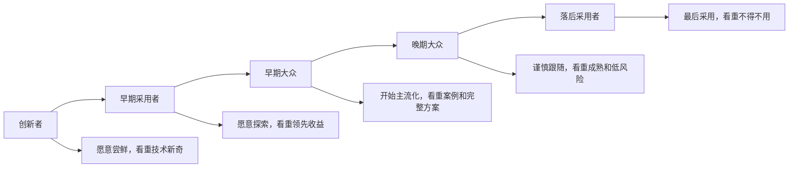
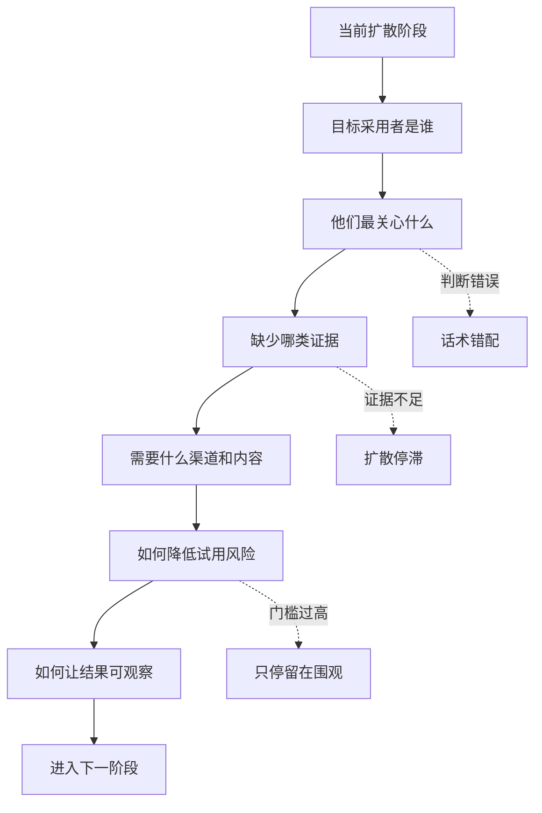

## 产品运营思维筑基课: 产品运营的上层定律: 创新扩散理论
  
### 作者  
digoal  
  
### 日期  
2026-05-13
  
### 标签  
创新扩散理论 , 技术采纳 , 产品运营 , 早期采用者 , 主流市场 , 传播路径 , 用户群体 , 品牌影响力 , 增长模型 , 上层定律
  
----  
  
## 背景 

> 面向对象: 高中生、大学生、产品运营新人、技术产品市场与运营同学  
> 核心问题: 为什么新产品一开始有人热情尝鲜，但很难进入主流市场？为什么技术产品不能对所有用户说同一套话？  
> 先说结论: 创新扩散理论说明，新技术不是一次性被所有人接受，而是沿着不同采用者群体逐步扩散。越早期的用户越能接受不确定性，越主流的用户越需要完整方案、社会证明和风险控制。产品运营要按扩散阶段设计内容、渠道、证据和转化路径。

## 一张图先看懂



可以用班级里的新学习工具来理解:

```text
最早尝试的人: 觉得新工具好玩，愿意折腾。
早期采用的人: 发现它确实能提高效率，愿意分享经验。
大多数同学: 等看到别人真的用得好，才愿意跟进。
最晚采用的人: 可能等老师要求统一使用才开始。
```

技术产品也是这样:

```text
开发者先试，技术先锋团队先用，标杆客户验证后，主流企业才会认真采购。
```

## 求真讲法

### 它到底说了什么

创新扩散理论由 Everett M. Rogers 系统提出，用来解释一个新观念、新技术或新产品如何在社会系统中传播和被采用。

它的核心不是“好产品自然会传播”，而是:

1. 不同人采用创新的时间不同。
2. 不同阶段的人关注点不同。
3. 创新能否扩散，取决于它被感知到的价值、兼容性、复杂度、可试用性和可观察性。
4. 社会网络、意见领袖和同类案例会影响扩散速度。

经典采用者分布常被分成五类:

| 采用者类型 | 大致特征 | 技术产品运营重点 |
|---|---|---|
| 创新者 | 愿意冒险尝试新技术 | API、开源、实验功能、技术原理 |
| 早期采用者 | 能看到新技术的战略价值 | 愿景、领先场景、深度案例、共创机会 |
| 早期大众 | 谨慎但愿意跟进成熟方案 | 标杆案例、最佳实践、完整方案 |
| 晚期大众 | 更保守，看重稳定和低风险 | 成熟度、服务体系、兼容性、成本 |
| 落后采用者 | 通常被外部压力推动 | 迁移支持、强制标准、低学习成本 |

对产品运营来说，这意味着:

```text
同一个产品，在不同扩散阶段，需要不同表达。
```

早期可以讲技术突破和可能性，进入主流市场时必须讲可靠性、完整方案、服务、案例和风险控制。

### 它是怎么来的

创新扩散理论来自对农业、医疗、教育、技术等领域创新传播现象的研究。Rogers 观察到，创新不是被所有人同时接受，而是通过社会系统逐步扩散。

一个新技术能否扩散，常常取决于五个被感知属性:

| 属性 | 问题 | 技术产品例子 |
|---|---|---|
| 相对优势 | 比旧方案好在哪里 | 更快、更便宜、更稳、更省人 |
| 兼容性 | 是否符合现有习惯和系统 | 是否兼容 SQL、API、权限体系 |
| 复杂性 | 是否难理解、难使用 | 文档、Demo、学习成本 |
| 可试用性 | 能否低风险先试 | 免费试用、沙箱、PoC |
| 可观察性 | 效果能否被看见 | 案例、指标、Dashboard、报告 |

这五个属性对技术产品尤其关键。因为技术产品通常复杂、风险高、迁移成本大，用户不会因为“新”就大规模采用。

### 它依赖哪些假设

创新扩散理论依赖几个前提:

1. 用户之间存在信息传播和社会影响。
2. 不同用户对风险、新颖性和证据的接受度不同。
3. 创新采用需要时间，不是所有人同时行动。
4. 用户会根据他人经验和可观察结果调整判断。
5. 创新的扩散速度受产品属性、渠道、社会系统和决策方式影响。

如果一个产品是强制推行的，扩散路径会被组织命令改变。但即便如此，真实使用和认同仍然会受到学习成本、兼容性、信任和社会关系影响。

### 常见误解

**误解一: 创新扩散就是拉新增长曲线。**

不够。它不是单纯增长模型，而是解释不同人为什么在不同时间采用。运营重点不只是“更多用户”，还包括“哪个阶段的用户、为什么现在采用、还缺什么证据”。

**误解二: 早期用户喜欢，主流用户也会喜欢。**

不一定。早期用户能忍受不稳定、文档不足和功能不完整；主流用户通常不能。他们需要更完整的方案和更低风险。

**误解三: 技术越先进，扩散越快。**

不一定。技术先进只是相对优势的一部分。如果不兼容、太复杂、难试用、效果不可见，扩散反而会慢。

**误解四: 找到意见领袖就够了。**

意见领袖有用，但不够。产品还要能被试用、验证、复制和落地，否则背书只能带来关注，不能带来采用。

## 求存讲法

### 它有什么用

创新扩散理论能帮助产品运营判断:

1. 现在产品处在哪个扩散阶段。
2. 当前用户真正缺少什么证据。
3. 哪些渠道和内容适合当前阶段。
4. 为什么早期热度没有转化为主流采用。

如果产品还在早期，运营重点可能是:

```text
找技术先锋用户、共同打磨场景、建立第一个可信案例。
```

如果产品准备进入主流市场，运营重点就要变成:

```text
标准化方案、行业案例、迁移指南、服务体系、风险控制、可复制打法。
```

技术产品的扩散路径常常像这样:

```text
技术文章吸引创新者
Demo 和开源样例吸引早期采用者
标杆案例说服早期大众
服务体系和生态伙伴推动晚期大众
行业标准或组织要求推动最后一批用户
```

### 它怎么迁移到熟悉领域

假设学校推出一种新的在线作业系统。

不同同学会有不同反应:

| 类型 | 反应 |
|---|---|
| 创新者 | 先点进去玩，研究隐藏功能 |
| 早期采用者 | 发现能自动整理错题，开始推荐 |
| 早期大众 | 看到几个成绩好的同学都在用，才试 |
| 晚期大众 | 等班里大部分人都用，才跟着用 |
| 落后采用者 | 等老师规定必须用，才开始 |

如果老师只对所有人说“这个系统很先进”，效果会有限。不同阶段的人需要不同理由:

```text
爱折腾的人: 这里有新功能。
想提分的人: 这里能整理错题。
谨慎的人: 已经有很多同学用得好。
怕麻烦的人: 这里有一步步教程。
不愿改变的人: 以后作业统一从这里交。
```

技术产品运营同理。

### 它的适用范围和边界

创新扩散理论特别适用于:

- 新技术产品推广
- 开源项目扩散
- 开发者工具增长
- 企业软件进入主流市场
- AI、数据库、云服务、安全、监控等技术产品
- 从早期先锋用户走向规模化客户的产品

它的边界是:

| 场景 | 适用程度 | 说明 |
|---|---:|---|
| 新技术产品 | 极高 | 扩散阶段差异明显 |
| 企业基础设施 | 高 | 风险、案例、社会证明很重要 |
| 低价消费品 | 中 | 仍有扩散，但冲动和渠道影响更大 |
| 强制行政推广 | 中 | 命令可改变采用节奏，但不等于真实认同 |
| 完全垄断产品 | 较低 | 用户选择少，扩散由控制权决定 |

还要注意: 采用者分类不是给人贴永久标签。同一个人面对不同产品会变成不同类型。一个数据库专家可能是数据库新技术的创新者，但面对财务软件可能是晚期大众。

### 正例: 怎么用它提升能力

假设你运营一个面向企业的 AI 数据库产品。

早期阶段，产品还没有大量客户案例。这时最合理的目标不是立刻说服所有企业采购，而是找到创新者和早期采用者:

1. 面向创新者: 发布技术原理、开源样例、API、实验功能。
2. 面向早期采用者: 共创 RAG、智能客服、代码检索等先锋场景。
3. 沉淀第一个案例: 说明问题、方案、指标、边界和经验。
4. 面向早期大众: 把案例产品化为标准方案、PoC 清单、部署文档。
5. 面向晚期大众: 建立服务体系、伙伴生态、迁移工具、风险控制材料。

这样扩散是逐层推进的:

```text
技术可信 -> 场景可信 -> 案例可信 -> 方案可信 -> 组织可信
```

如果一开始就用“所有企业都应该立刻拥抱 AI 数据库”的话术，反而会显得空泛。

### 反例: 前提不成立会怎样

反例一: 用早期话术打主流客户。

某开源项目对主流企业客户一直强调“前沿、灵活、可高度定制”。早期开发者很喜欢，但企业客户更关心稳定版本、服务响应、权限、安全和长期维护。结果热度很高，采购很少。

这里失败的前提是:

```text
不同采用阶段的用户关注点不同。
```

反例二: 有相对优势，但复杂性太高。

某数据平台性能明显优于旧方案，但部署复杂、文档混乱、排错困难。早期技术团队愿意折腾，普通团队却无法采用。

这里失败的前提是:

```text
创新扩散不只看相对优势，也看复杂性和可试用性。
```

反例三: 有曝光，没有可观察结果。

某 AI 产品在行业会议上获得大量关注，但没有公开案例、指标、Demo 和落地路径。用户觉得方向有趣，却无法判断效果是否真实，扩散停留在讨论层。

这里失败的前提是:

```text
创新需要可观察结果，才能从兴趣走向采用。
```

## 思考

创新扩散理论最重要的启发是: 产品运营不是把同一个信息推给所有人，而是识别扩散阶段，并为下一个阶段补齐采用条件。

可以用这张图检查一个技术产品的扩散策略:



对技术影响力来说，创新扩散理论意味着:

```text
技术影响力要先赢得先锋用户的认真试用，再把先锋经验转化成主流用户能相信的证据。
```

对品牌影响力来说，它意味着:

```text
品牌不是一夜进入所有人心智，而是在不同采用群体中逐步沉淀不同层次的信任。
```

可以进一步追问:

1. 我们现在真正打动的是创新者、早期采用者，还是主流客户？
2. 当前阶段最缺的是技术证据、场景案例、完整方案，还是服务体系？
3. 早期用户的成功经验能否被主流用户复制？
4. 产品是否足够可试用、可观察、可解释？
5. 我们是否错误地用同一套内容面对所有采用者？

## 最后记住

1. 创新不是同时被所有人采用，而是沿着不同采用者群体逐步扩散。
2. 早期用户看重可能性和领先收益，主流用户看重案例、完整方案和低风险。
3. 创新扩散取决于相对优势、兼容性、复杂性、可试用性和可观察性。
4. 技术产品运营要按扩散阶段设计内容、渠道、证据和转化路径。
5. 从技术影响力到品牌影响力，本质是把先锋用户的验证转化为主流用户的信任。

## 参考资料

- Everett M. Rogers, *Diffusion of Innovations*, 1962.
- Geoffrey A. Moore, *Crossing the Chasm*, 1991.
- Frank M. Bass, “A New Product Growth for Model Consumer Durables”, 1969.
- Robert B. Cialdini, *Influence: The Psychology of Persuasion*, 1984.
- Philip Kotler and Kevin Lane Keller, *Marketing Management*, multiple editions.
- 本文基于创新扩散理论、跨越鸿沟、技术产品运营、开发者关系和 B2B 产品营销中的通用经验整理；未使用实时联网资料。
  
#### [PostgreSQL 解决方案集合](../201706/20170601_02.md "40cff096e9ed7122c512b35d8561d9c8")
  
  
#### [德哥 / digoal's Github - 公益是一辈子的事.](https://github.com/digoal/blog/blob/master/README.md "22709685feb7cab07d30f30387f0a9ae")
  
  
#### [About 德哥](https://github.com/digoal/blog/blob/master/me/readme.md "a37735981e7704886ffd590565582dd0")
  
  

  
