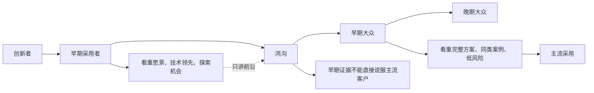
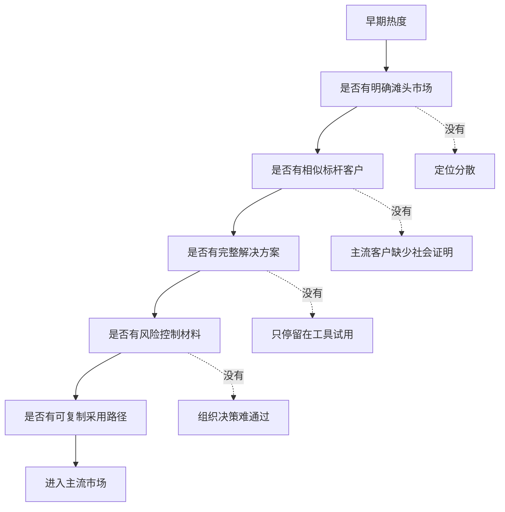

## 产品运营思维筑基课: 产品运营的上层定律: 跨越鸿沟
  
### 作者  
digoal  
  
### 日期  
2026-05-13
  
### 标签  
跨越鸿沟 , 技术产品 , 产品运营 , 主流市场 , 早期市场 , 场景聚焦 , 完整产品 , 品牌信任 , 增长策略 , 上层定律
  
----  
  
## 背景 

> 面向对象: 高中生、大学生、产品运营新人、技术产品市场与运营同学  
> 核心问题: 为什么一个技术产品在早期用户中很受欢迎，却很难进入主流客户？为什么“开发者喜欢”不等于“企业会采购”？  
> 先说结论: “跨越鸿沟”说的是，早期采用者和主流市场之间存在一条断裂带。早期用户愿意为新技术的可能性冒险，主流用户更关心完整方案、低风险、同类案例和可靠服务。技术产品运营要从“展示新技术”转向“证明可落地”。

## 一张图先看懂



可以用学校里的例子理解:

```text
几个爱折腾的同学愿意试一个新的学习工具，
不代表全班都会用。

全班要用时，大家会问:
老师认可吗？成绩好的同学真的用得好吗？
会不会很麻烦？出了问题怎么办？能不能和现有作业流程配合？
```

技术产品也是这样:

```text
技术先锋愿意试新框架；
主流企业要看完整方案、成功案例、服务支持和风险边界。
```

## 求真讲法

### 它到底说了什么

“跨越鸿沟”来自 Geoffrey A. Moore 的技术营销理论。它继承了创新扩散理论对采用者的分层，但特别强调:

早期采用者和早期大众之间，不是平滑过渡，而是存在一条“鸿沟”。

这条鸿沟的本质是:

```text
早期采用者买的是未来可能性；
主流客户买的是可复制的确定性。
```

两类用户的关注点不同:

| 用户类型 | 关注点 | 能接受什么 | 害怕什么 |
|---|---|---|---|
| 早期采用者 | 技术领先、战略机会、差异化收益 | 功能不完整、文档不完善、需要共创 | 错过趋势 |
| 早期大众 | 稳定落地、同类案例、完整方案、低风险 | 有成熟路径、有服务支持、有成功模板 | 采用失败、没人负责 |

所以，一个产品在早期用户中有热度，并不自动意味着它能进入主流市场。主流客户不会简单相信“早期用户喜欢”，他们更想知道:

```text
有没有和我相似的客户成功过？
这个方案是否完整？
能不能和现有系统兼容？
出了问题谁支持？
采购和安全审查怎么过？
迁移成本和回滚方案是什么？
```

### 它是怎么来的

Moore 观察到，很多高科技产品能吸引技术爱好者和先锋客户，却卡在规模化阶段。原因不是产品完全没有价值，而是早期市场和主流市场的采用逻辑不同。

早期市场常常由这类人组成:

```text
愿意尝试；
能忍受不完整；
愿意和厂商共创；
看重领先机会；
有较强技术能力。
```

主流市场则更像:

```text
希望别人先验证；
希望方案完整；
希望风险可控；
希望有供应商负责；
希望能复制同类客户经验。
```

因此，“跨越鸿沟”不是简单扩大宣传，而是要把产品从“创新工具”包装成某个细分市场里的“完整解决方案”。

一个常见策略是先选择一个滩头市场，也就是一个足够具体、足够痛、可复制、能形成标杆的细分市场。先在这里打透，再向相邻市场扩展。

### 它依赖哪些假设

“跨越鸿沟”依赖几个前提:

1. 产品属于新技术、新品类或新市场，用户采用存在不确定性。
2. 市场中存在不同采用者群体，他们的风险偏好不同。
3. 早期用户的成功经验不能自动说服主流用户。
4. 主流客户需要完整方案，而不只是核心产品。
5. 一个可复制的细分市场标杆，能帮助产品进入更大市场。

如果产品是成熟品类中的小改进，鸿沟可能不明显。如果产品由行政命令强制采用，鸿沟也会被外部力量部分覆盖。但只要用户需要主动承担技术、预算和组织风险，鸿沟就会存在。

### 常见误解

**误解一: 跨越鸿沟就是多做营销。**

不对。它不是简单加大声量，而是改变市场进入方式: 从泛泛宣传新技术，转向为一个具体细分客户提供完整、可信、可复制的解决方案。

**误解二: 早期用户越多，主流客户自然会来。**

不一定。如果早期用户分散在不同场景，没有形成可复制案例，主流客户仍然不知道自己能不能用。

**误解三: 主流客户不懂技术，所以只要讲业务价值。**

不对。主流客户不是不懂，而是更谨慎。他们既要业务价值，也要技术证据、服务保障、迁移路径和风险控制。

**误解四: 滩头市场太小，不值得聚焦。**

常常相反。太早追求大而全，会导致资源分散、案例不深、定位模糊。先打透一个小市场，反而更容易形成主流信任。

## 求存讲法

### 它有什么用

“跨越鸿沟”能帮助产品运营判断:

```text
我们现在是在获得早期热度，还是在进入主流采用？
我们缺的是曝光，还是完整方案？
我们有没有一个可复制的标杆细分市场？
我们的案例能不能说服相似客户？
```

对技术产品来说，鸿沟两侧的运营重点完全不同:

| 阶段 | 运营重点 | 常见资产 |
|---|---|---|
| 早期市场 | 激发探索、共创、技术信任 | 技术文章、Demo、开源样例、愿景演讲 |
| 鸿沟阶段 | 聚焦细分场景、形成完整方案 | 滩头市场选择、PoC 模板、标杆案例 |
| 主流市场 | 降低风险、证明可复制 | 行业方案、客户案例、迁移指南、SLA |

这条定律提醒运营者:

```text
早期市场讲“为什么新”；
主流市场讲“为什么现在可以放心用”。
```

### 它怎么迁移到熟悉领域

假设学校里有一个新的错题整理方法。

一开始，几个成绩好、爱研究学习方法的同学愿意试。他们能忍受麻烦，也愿意自己改模板。这个阶段就像早期采用者。

但如果想让全年级使用，就不能只说:

```text
这个方法很先进，几个高手都在用。
```

还要提供:

```text
适合哪一类学生；
每天花几分钟；
怎么记录；
怎么复习；
一周后如何检查效果；
老师如何批改；
普通学生真实提升案例。
```

也就是说，要从“高手愿意折腾”变成“普通同学也能按步骤得到结果”。

技术产品跨越鸿沟也是这个逻辑。

### 它的适用范围和边界

“跨越鸿沟”特别适用于:

- 新技术产品
- 开源项目商业化
- 开发者工具进入企业
- AI、数据库、云服务、安全、低代码等技术产品
- 从先锋客户走向主流客户的 B2B 产品
- 需要建立技术影响力和品牌影响力的新品牌

它的边界是:

| 场景 | 适用程度 | 说明 |
|---|---:|---|
| 新品类技术产品 | 极高 | 鸿沟通常明显 |
| 开源工具企业化 | 高 | 开发者喜欢不等于企业可采购 |
| 成熟品类小功能 | 中 | 用户认知成本较低 |
| 低价个人工具 | 中 | 个人可低风险尝试 |
| 强制采购/行政推广 | 较低到中 | 命令可推动采用，但真实使用仍受阻 |
| 垄断产品 | 较低 | 选择空间小，市场扩散机制不同 |

还要注意: “跨越鸿沟”不是让产品放弃早期用户。早期用户仍然重要，因为他们帮助验证技术、打磨场景、形成第一批证据。关键是不能误以为早期用户的语言能直接说服主流市场。

### 正例: 怎么用它提升能力

假设你运营一个面向企业的 AI 代码助手。

早期阶段，开发者喜欢它，因为它能生成代码、解释错误、写测试样例。运营内容可以讲:

```text
AI 如何改变编程体验；
如何用它提高个人开发效率；
插件如何安装；
提示词怎么写。
```

但要跨越鸿沟进入企业主流采用，就要补齐另一套东西:

1. 滩头市场: 先选择一个具体场景，比如“金融企业内部工具开发团队”。
2. 完整方案: 接入 IDE、权限管理、代码安全、日志审计、私有化部署。
3. 标杆案例: 说明某类团队如何从试点到规模化使用。
4. 风险控制: 代码泄露、许可证、错误代码、审计责任如何处理。
5. 组织材料: 给 CTO、安全团队、法务、采购和开发团队不同证据。
6. 可复制路径: 30 天试点计划、评估指标、推广模板。

这时产品从“开发者觉得酷”变成“企业可以评估和采用的完整方案”。

### 反例: 前提不成立会怎样

反例一: 用早期热度误判主流需求。

某开源数据库插件在开发者社区很火，Star 增长很快。团队以为企业市场已经成熟，开始大规模销售。但企业客户询问备份恢复、权限审计、长期支持、兼容版本和 SLA 时，团队无法回答。

这里失败的前提是:

```text
早期用户的兴趣不等于主流客户的采用条件已经满足。
```

反例二: 不选滩头市场，想一次打所有行业。

某 AI 数据平台同时面向金融、医疗、制造、教育、政企，每个行业都写一点案例，但没有一个行业讲深。主流客户看不到和自己足够相似的成功样板。

这里失败的前提是:

```text
跨越鸿沟需要先打透一个可复制细分市场。
```

反例三: 只讲产品，不做完整方案。

某监控工具功能不错，但主流客户需要告警治理、值班流程、故障复盘模板、权限体系和集成方案。厂商只卖工具，不提供落地方法，客户试用后很难推广到团队。

这里失败的前提是:

```text
主流市场购买的是完整方案，不只是核心产品。
```

## 思考

“跨越鸿沟”最重要的启发是: 产品从早期市场到主流市场，不是把同一句话说给更多人听，而是把产品、证据、场景和服务重新组织成主流客户能放心采用的方案。

可以用这张图检查一个技术产品是否准备好跨越鸿沟:



对技术影响力来说，“跨越鸿沟”意味着:

```text
技术影响力不能停在先锋用户的赞赏，
还要把先锋验证转化成主流客户能相信、能复制、能采购的证据。
```

对品牌影响力来说，它意味着:

```text
品牌影响力不是“很多人听过”，
而是某个细分市场的主流客户认为你是可信选择。
```

可以进一步追问:

1. 我们现在的成功，是早期用户热度，还是主流客户采用？
2. 我们有没有选择一个足够具体的滩头市场？
3. 早期案例是否和目标主流客户足够相似？
4. 我们卖的是核心产品，还是完整解决方案？
5. 主流客户担心的风险，我们有没有证据和流程来降低？

## 最后记住

1. 早期采用者和主流客户之间存在鸿沟，不能用同一套话术打所有人。
2. 早期用户买可能性，主流客户买可复制的确定性。
3. 跨越鸿沟的关键是聚焦滩头市场，形成完整方案和相似标杆案例。
4. 技术产品从“有人喜欢”到“组织采用”，必须补齐服务、风险、迁移和决策材料。
5. 技术影响力要跨过鸿沟，必须从先锋用户的验证沉淀为主流市场的信任。

## 参考资料

- Geoffrey A. Moore, *Crossing the Chasm*, 1991.
- Everett M. Rogers, *Diffusion of Innovations*, 1962.
- Clayton M. Christensen, *The Innovator's Solution*, 2003.
- Philip Kotler and Kevin Lane Keller, *Marketing Management*, multiple editions.
- David A. Aaker, *Managing Brand Equity*, 1991.
- 本文基于跨越鸿沟、创新扩散、技术产品运营、B2B 产品营销和企业级销售支持中的通用经验整理；未使用实时联网资料。
  
#### [PostgreSQL 解决方案集合](../201706/20170601_02.md "40cff096e9ed7122c512b35d8561d9c8")
  
  
#### [德哥 / digoal's Github - 公益是一辈子的事.](https://github.com/digoal/blog/blob/master/README.md "22709685feb7cab07d30f30387f0a9ae")
  
  
#### [About 德哥](https://github.com/digoal/blog/blob/master/me/readme.md "a37735981e7704886ffd590565582dd0")
  
  

  
