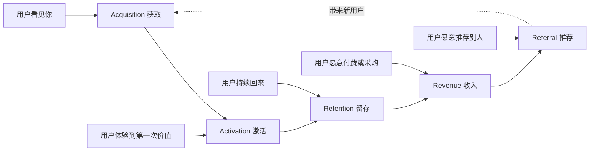
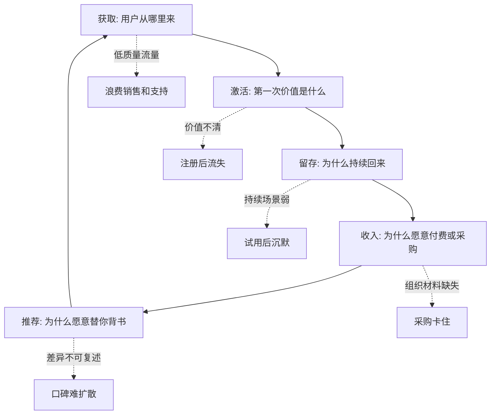

## 产品运营思维筑基课: 产品运营的上层定律: AARRR 模型
  
### 作者  
digoal  
  
### 日期  
2026-05-13
  
### 标签  
AARRR模型 , 增长模型 , 产品运营 , 获客 , 激活 , 留存 , 收入 , 推荐 , 技术产品 , 上层定律
  
----  
  
## 背景 

> 面向对象: 高中生、大学生、产品运营新人、技术产品市场与运营同学  
> 核心问题: 为什么产品有流量却没有增长？为什么技术产品不能只看访问量、注册量和线索量？  
> 先说结论: AARRR 模型把用户增长拆成获取、激活、留存、收入、推荐五个环节。它提醒产品运营不要只追求“更多人看见”，还要判断用户是否真正理解、上手、持续使用、愿意付费或采购，并愿意推荐给别人。

## 一张图先看懂



可以用一个学习软件来理解:

```text
获取: 你知道这个学习软件。
激活: 你第一次用它整理出一套错题。
留存: 你每周都回来复习。
收入: 你愿意购买高级功能。
推荐: 你告诉同学这个工具真的有用。
```

技术产品也是这样:

```text
访问官网不是增长终点；
跑通 Demo、接入项目、进入生产、续费扩容、被团队推荐，才是更深的增长。
```

## 求真讲法

### 它到底说了什么

AARRR 模型常被称为“海盗指标”，由 Dave McClure 推广。它把用户生命周期拆成五个阶段:

| 阶段 | 英文 | 核心问题 | 技术产品例子 |
|---|---|---|---|
| 获取 | Acquisition | 用户从哪里来 | 搜索、技术文章、GitHub、会议、广告 |
| 激活 | Activation | 用户是否体验到第一次价值 | 跑通 Demo、完成 API 调用、导入第一批数据 |
| 留存 | Retention | 用户是否持续回来 | 每周使用、持续调用、进入团队流程 |
| 收入 | Revenue | 用户是否愿意付费 | 订阅、采购、升级、扩容、购买服务 |
| 推荐 | Referral | 用户是否带来新用户 | 分享、内部推荐、客户案例、社区口碑 |

这个模型最重要的不是五个英文单词，而是一个判断:

```text
增长不是一个动作，而是一条链路。
链路中任何一环断掉，整体增长都会受限。
```

比如一个技术产品有很多访问量，但用户跑不通 Demo，问题在激活。用户能试用，但不上生产，问题可能在信任、稳定性或组织决策。用户能采购，但不续费，问题可能在留存和持续价值。

### 它是怎么来的

AARRR 模型来自互联网产品和创业增长实践。它把复杂增长问题拆成可诊断的阶段，让团队能定位瓶颈。

在没有这个模型时，团队容易只盯一个指标:

```text
流量不够，就买流量。
注册不够，就改按钮。
销售不够，就催线索。
```

但很多增长问题并不在入口。例如:

```text
用户来了，但看不懂产品。
用户注册了，但不知道下一步做什么。
用户试用了，但没有体验到价值。
用户体验到了价值，但组织不允许采用。
用户采购了，但长期使用效果不好。
```

AARRR 的价值，就是把“增长不好”拆成具体环节，再针对环节改进。

### 它依赖哪些假设

AARRR 模型依赖几个前提:

1. 用户会经历从认知到采用的阶段。
2. 每个阶段都有可观察行为或可衡量信号。
3. 不同阶段的瓶颈原因不同。
4. 提升某一环不一定提升整体增长，必须看链路转化。
5. 产品能持续提供价值，否则留存和推荐不会成立。

如果产品是一次性交易、强线下关系成交或长周期企业采购，AARRR 不能机械套用。但它仍然可以作为诊断框架，只是每个阶段的指标要重新定义。

### 常见误解

**误解一: AARRR 就是五个指标。**

不对。它不是固定指标表，而是用户状态变化模型。不同产品的“激活”“留存”“收入”定义可能完全不同。

**误解二: 获取越多，增长越好。**

不一定。如果激活和留存很差，更多获取只会放大浪费。技术产品尤其如此，低质量线索会消耗销售和技术支持。

**误解三: 推荐一定发生在收入之后。**

不一定。开源项目、开发者工具、技术内容可能在付费前就发生推荐。AARRR 是理解链路，不是死板顺序。

**误解四: B2B 技术产品不适合 AARRR。**

不对。B2B 的链路更长、更复杂，但仍然有获取、激活、留存、收入、推荐。只是行为从“个人点击”变成“团队试用、PoC、采购、续费和内部推荐”。

## 求存讲法

### 它有什么用

AARRR 能帮助产品运营定位增长瓶颈。

如果只看总结果，问题是:

```text
为什么增长不好？
```

如果用 AARRR 拆，问题会变成:

```text
是没人知道我们？
还是知道了但没有试？
是试了但没有体验到价值？
是体验到价值但没有持续使用？
是持续使用但没有付费？
是付费了但不愿推荐？
```

技术产品可以这样改写 AARRR:

| 阶段 | 普通互联网产品 | 技术产品更适合看的行为 |
|---|---|---|
| 获取 | 访问、下载、注册 | 搜索到文档、读技术文章、看 GitHub、参加 Webinar |
| 激活 | 完成首次核心动作 | 跑通 Demo、完成 API 调用、接入测试环境 |
| 留存 | 次日/周/月回来 | 持续调用、团队协作使用、进入开发或生产流程 |
| 收入 | 付费订阅 | 采购、升级、扩容、购买支持、续费 |
| 推荐 | 邀请好友 | 内部推荐、社区分享、客户案例、技术背书 |

这会让运营动作更具体:

```text
获取差: 优化内容、渠道、定位和搜索。
激活差: 优化文档、Demo、样例、上手路径。
留存差: 优化持续价值、集成、稳定性和使用场景。
收入差: 优化定价、采购材料、ROI、风险控制。
推荐差: 优化案例、社区、口碑和可转述差异。
```

### 它怎么迁移到熟悉领域

假设你组织一个学习小组。

你不能只看“有多少人听说过”。可以用 AARRR 拆:

| 阶段 | 学习小组例子 |
|---|---|
| 获取 | 有多少同学知道学习小组 |
| 激活 | 有多少同学第一次参加并解决一个问题 |
| 留存 | 有多少同学每周继续来 |
| 收入 | 如果是付费课程，有多少人愿意交费；如果不是，则是愿意投入时间 |
| 推荐 | 有多少同学主动拉别人来 |

如果很多人报名但第二次没人来，问题不是获取，而是激活或留存。也许第一次体验太差，或者没有让人看到实际帮助。

产品也是一样。访问量大但留存差，说明用户来过，却没有形成持续价值。

### 它的适用范围和边界

AARRR 特别适用于:

- SaaS 产品
- 开发者工具
- 开源项目增长
- 技术产品试用到采购链路
- 内容运营和社区运营诊断
- 产品生命周期分析

它的边界是:

| 场景 | 适用方式 | 注意点 |
|---|---|---|
| C 端 App | 高度适用 | 指标可较细，如日活、留存、付费 |
| B2B SaaS | 适用 | 阶段更长，要区分个人和组织 |
| 技术基础设施 | 适用 | 激活可能是 PoC，收入可能是采购和续费 |
| 开源项目 | 适用 | 收入不一定直接发生，要看商业化路径 |
| 一次性项目制服务 | 中等 | 留存和推荐要重新定义 |
| 强关系销售 | 中等 | 不能只看线上数据，要结合销售过程 |

还要注意: AARRR 容易让人过度迷信数据。如果只看数字，不理解用户任务和真实场景，团队可能优化了表面转化，却损害长期信任。

### 正例: 怎么用它提升能力

假设你运营一个面向开发者的 AI 数据库产品。

你发现官网访问量不错，但试用转化低。AARRR 可以这样诊断:

1. 获取: 技术文章和搜索带来大量访问，说明认知入口存在。
2. 激活: 用户点击试用后不知道如何准备数据，Demo 跑通率低。
3. 留存: 少数跑通 Demo 的用户没有继续接入项目，说明场景样例不足。
4. 收入: 企业用户想采购，但缺少安全、权限、成本和部署材料。
5. 推荐: 开发者觉得有意思，但无法向团队解释为什么比现有方案好。

对应运营动作:

| 瓶颈 | 改进动作 |
|---|---|
| 激活低 | 做 10 分钟可跑通 Demo、示例数据、错误排查 |
| 留存低 | 提供真实场景模板、集成教程、持续任务提醒 |
| 收入低 | 提供 PoC 清单、安全白皮书、ROI 和采购材料 |
| 推荐低 | 提炼可复述差异、对比图、内部推荐一页纸 |

这比单纯说“再买点流量”更接近问题本质。

### 反例: 前提不成立会怎样

反例一: 只优化获取，忽略激活。

某开发者工具在技术社区投放很多内容，访问和注册增长很快。但用户注册后文档混乱，示例跑不通，十分钟内无法完成第一次 API 调用。大量用户流失。

这里失败的前提是:

```text
获取不是增长终点，用户必须体验到第一次价值。
```

反例二: 激活定义错误。

某企业 SaaS 把“注册账号”定义为激活。但很多用户注册后没有导入数据、没有邀请团队、没有完成任何真实任务。团队以为激活率高，实际用户没有进入价值状态。

这里失败的前提是:

```text
激活应该代表用户体验到核心价值，而不是完成一个形式动作。
```

反例三: 推荐机制过早。

某技术产品用户还没跑通 Demo，就弹窗要求“邀请同事”。用户自己都没理解价值，自然不会推荐，还会觉得被打扰。

这里失败的前提是:

```text
推荐需要建立在用户价值感和信任之上。
```

## 思考

AARRR 最重要的启发是: 增长不是单点动作，而是用户状态逐步加深的链路。

可以用这张图检查技术产品的 AARRR:



对技术影响力来说，AARRR 意味着:

```text
技术影响力不能只看阅读量，
还要看读者是否跑通、复用、进入项目、愿意引用和推荐。
```

对品牌影响力来说，AARRR 意味着:

```text
品牌不是只带来认知入口，
还要在持续使用和推荐中被反复验证。
```

可以进一步追问:

1. 我们当前最大的瓶颈在 AARRR 哪一层？
2. 我们定义的“激活”是否真的代表用户体验到价值？
3. 用户留存是因为产品有持续价值，还是因为迁移成本高？
4. 收入卡点是价格、信任、采购流程，还是价值不清？
5. 用户是否愿意推荐？如果不愿意，是不满意、说不清，还是缺少证据？

## 最后记住

1. AARRR 把增长拆成获取、激活、留存、收入、推荐五个环节。
2. 获取只是入口，激活才是用户第一次体验到核心价值。
3. 技术产品要把 AARRR 改写为文档访问、Demo 跑通、持续接入、采购续费和内部推荐。
4. 链路中任何一环断掉，更多流量都可能只是放大浪费。
5. 好运营不是只做拉新，而是持续修复用户从认知到推荐的整条路径。

## 参考资料

- Dave McClure, Startup Metrics for Pirates: AARRR, 2007.
- Eric Ries, *The Lean Startup*, 2011.
- Sean Ellis and Morgan Brown, *Hacking Growth*, 2017.
- Andrew Chen, *The Cold Start Problem*, 2021.
- Philip Kotler and Kevin Lane Keller, *Marketing Management*, multiple editions.
- 本文基于 AARRR、增长模型、SaaS 运营、开发者关系、B2B 技术产品运营和企业级销售支持中的通用经验整理；未使用实时联网资料。
  
#### [PostgreSQL 解决方案集合](../201706/20170601_02.md "40cff096e9ed7122c512b35d8561d9c8")
  
  
#### [德哥 / digoal's Github - 公益是一辈子的事.](https://github.com/digoal/blog/blob/master/README.md "22709685feb7cab07d30f30387f0a9ae")
  
  
#### [About 德哥](https://github.com/digoal/blog/blob/master/me/readme.md "a37735981e7704886ffd590565582dd0")
  
  

  
