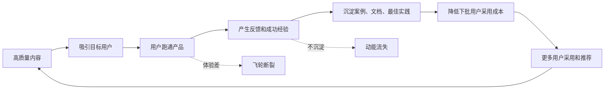
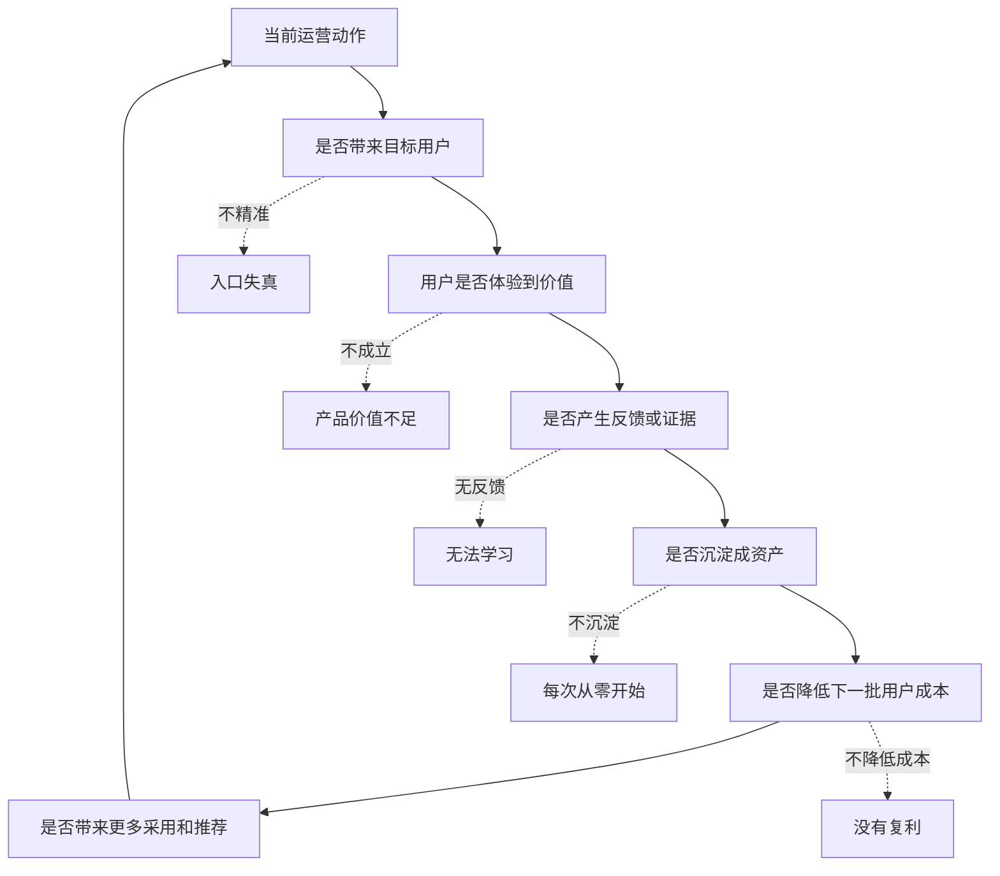

## 产品运营思维筑基课: 产品运营的上层定律: 飞轮效应
  
### 作者  
digoal  
  
### 日期  
2026-05-13
  
### 标签  
飞轮效应 , 产品运营 , 增长飞轮 , 内容复利 , 社区复利 , 生态建设 , 技术品牌 , 长期增长 , 系统思维 , 上层定律
  
----  
  
## 背景 

> 面向对象: 高中生、大学生、产品运营新人、技术产品市场与运营同学  
> 核心问题: 为什么有些产品越做越容易增长，而有些产品每次增长都像重新推一块石头上山？  
> 先说结论: 飞轮效应说的是，把多个能互相增强的环节连接成闭环，前期推动很费力，但一旦转起来，每一圈都会为下一圈积累动能。技术产品运营的飞轮，常常由内容、体验、社区、案例、生态和产品改进共同构成。

## 一张图先看懂



可以用一个生活类比理解:

```text
刚开始推一个很重的轮子，最费力。
但如果每次推动都让轮子多转一点，轮子会积累速度。
速度起来以后，下一次推动就更省力。
```

产品运营也是这样:

```text
一次活动只带来一次曝光；
一个飞轮会让内容带来用户，用户带来反馈，反馈改进产品，产品产生案例，案例再带来更多用户。
```

## 求真讲法

### 它到底说了什么

飞轮效应说的是:

增长不是只靠单点爆发，而是靠一组互相增强的动作形成正循环。每个环节的产出，都会成为下一个环节的输入。

一个简单的技术产品飞轮可以是:

| 环节 | 产出 | 如何推动下一环 |
|---|---|---|
| 内容 | 用户理解问题和方案 | 带来更精准试用 |
| 试用 | 用户真实体验价值 | 产生反馈和使用数据 |
| 反馈 | 暴露问题和高频场景 | 改进产品和文档 |
| 案例 | 证明产品可落地 | 降低新用户信任成本 |
| 社区 | 用户互助和口碑 | 降低支持成本，扩大传播 |
| 生态 | 插件、集成、伙伴 | 进入更多场景 |

飞轮和普通漏斗不同。漏斗强调从上到下的转化损耗:

```text
流量 -> 注册 -> 试用 -> 付费
```

飞轮强调闭环中的动能积累:

```text
用户使用 -> 产生价值 -> 带来反馈和口碑 -> 改进产品 -> 吸引更多用户
```

漏斗帮助你找损耗，飞轮帮助你找复利。

### 它是怎么来的

“飞轮效应”这个比喻常见于商业管理和增长讨论中。Jim Collins 在 *Good to Great* 中用飞轮描述长期积累: 一开始推动很难，但连续朝同一方向发力，最终会形成巨大动能。

后来，很多产品和增长团队也用飞轮解释平台、社区、内容、生态和用户增长之间的正循环。

对技术产品来说，飞轮特别重要，因为技术产品有几个特点:

1. 用户理解成本高。
2. 信任建立周期长。
3. 采用常常需要团队和组织决策。
4. 文档、案例、社区和生态可以长期复用。
5. 用户反馈能显著改进产品。

所以技术产品不能只追求短期曝光，而要设计能持续积累的闭环。

### 它依赖哪些假设

飞轮效应依赖几个前提:

1. 各环节之间真的存在因果关系。
2. 每一圈都会留下可复用资产，而不是消耗完就结束。
3. 产品本身能持续提供价值。
4. 用户反馈能进入产品、内容、服务或生态改进。
5. 团队能长期朝同一方向持续投入，而不是频繁换方向。

如果这些前提不成立，所谓飞轮就只是漂亮图。比如内容带来的用户不匹配产品，用户反馈无人处理，案例不能复用，社区没有治理，飞轮就转不起来。

### 常见误解

**误解一: 飞轮就是增长闭环图。**

不够。画成闭环不等于有飞轮。真正的飞轮必须有因果增强: 上一环的结果要能让下一环更容易发生。

**误解二: 飞轮转起来后就不用维护。**

不对。飞轮需要持续减少摩擦，比如改善文档、修复体验、治理社区、更新案例、维护生态兼容性。

**误解三: 飞轮越复杂越高级。**

通常相反。早期飞轮应该简单清楚。环节太多，团队不知道该推哪里，也难以判断哪个环节断了。

**误解四: 飞轮可以替代产品价值。**

不能。如果产品没有真实价值，飞轮只会更快放大失望。飞轮的核心燃料仍然是用户真实受益。

## 求存讲法

### 它有什么用

飞轮效应能帮助产品运营从“做活动”转向“建系统”。

如果没有飞轮思维，运营动作常常是:

```text
写一篇文章，发完结束。
办一场活动，结束归零。
做一次投放，停投断流。
处理一个客户问题，下次再处理一遍。
```

如果有飞轮思维，同样动作会被接入闭环:

```text
文章吸引用户 -> 用户试用 -> 发现共性问题 -> 沉淀 FAQ -> 改进 Demo -> 形成案例 -> 案例反过来提高文章转化。
```

技术产品常见飞轮可以这样设计:

| 飞轮类型 | 闭环 |
|---|---|
| 内容飞轮 | 问题文章 -> 搜索流量 -> 试用 -> 用户问题 -> 新文章 |
| 社区飞轮 | 用户提问 -> 官方/用户解答 -> 知识沉淀 -> 新用户自助解决 -> 社区更活跃 |
| 产品飞轮 | 使用数据 -> 发现瓶颈 -> 产品改进 -> 激活率提升 -> 更多数据 |
| 案例飞轮 | PoC -> 成功上线 -> 案例沉淀 -> 相似客户信任 -> 更多 PoC |
| 生态飞轮 | API/插件 -> 伙伴集成 -> 更多场景 -> 更多开发者参与 -> 生态更丰富 |

### 它怎么迁移到熟悉领域

假设你想提高写作能力。

低飞轮做法是:

```text
偶尔写一篇作文，交给老师，拿到分数后结束。
```

飞轮做法是:

```text
写文章 -> 收到批改 -> 总结常见问题 -> 建立素材库和句式库 -> 下一篇写得更好 -> 更愿意写 -> 获得更多反馈。
```

这时，每一次写作都不是孤立动作，而是在增强下一次写作。

产品运营也是一样。一次用户访谈如果只停在会议记录里，价值有限；如果它进入文档、内容、产品路线、销售话术和客户案例，就会推动飞轮。

### 它的适用范围和边界

飞轮效应特别适用于:

- 技术产品长期运营
- 开发者工具增长
- 开源项目运营
- SaaS 产品增长
- 内容、社区、生态协同
- 技术影响力和品牌影响力建设

它的边界是:

| 场景 | 飞轮空间 | 说明 |
|---|---:|---|
| 一次性项目 | 较低 | 复用机会少，飞轮弱 |
| 低价冲动消费 | 中 | 可以有口碑飞轮，但技术证据不一定关键 |
| SaaS 产品 | 高 | 使用、反馈、留存、推荐可形成闭环 |
| 开发者工具 | 极高 | 文档、社区、插件、案例互相增强 |
| 开源项目 | 极高 | 用户也是贡献者和传播者 |
| 企业基础设施 | 高 | 案例、最佳实践、伙伴生态能长期复用 |

飞轮还有一个重要边界: 不能忽视启动阻力。飞轮前期很慢，团队容易误以为没效果。这个阶段要找到最小闭环，而不是一开始就追求庞大生态。

### 正例: 怎么用它提升能力

假设你运营一个数据库产品，目标是提升技术影响力。

低水平做法是:

```text
每周追热点写文章，偶尔办直播，年底看阅读量。
```

飞轮做法是:

1. 内容: 写用户真实关心的问题，如迁移、性能、故障、AI 检索。
2. 试用: 每篇内容都连接到可跑通 Demo 或文档。
3. 反馈: 收集用户跑 Demo 时遇到的问题。
4. 文档: 把问题沉淀进 FAQ、教程、最佳实践。
5. 产品: 把高频卡点反馈给产品团队优化。
6. 案例: 把成功试用和上线沉淀成案例。
7. 社区: 让用户讨论、分享、贡献插件或经验。
8. 反哺内容: 用真实问题和案例继续写新内容。

这个飞轮的动能是:

```text
内容越贴近真实问题，试用越精准；
试用越多，反馈越多；
反馈越多，产品和文档越好；
产品和文档越好，案例越容易成功；
案例越多，信任越强；
信任越强，更多用户愿意试用。
```

### 反例: 前提不成立会怎样

反例一: 闭环没有因果关系。

某团队画了一个飞轮: “品牌曝光 -> 用户增长 -> 收入增长 -> 更多品牌曝光”。但没有解释品牌曝光为什么会带来合格用户，也没有说明收入如何反哺产品或内容。结果只是把愿望画成了圆。

这里失败的前提是:

```text
飞轮必须有真实因果增强，而不是把指标连成圈。
```

反例二: 用户反馈没有进入系统。

某开发者工具有很多用户试用，也收到大量问题。但问题只停留在客服聊天记录里，没有进入文档、产品优化和内容选题。下一批用户继续踩同样的坑。

这里失败的前提是:

```text
每一圈必须沉淀资产，否则飞轮没有动能积累。
```

反例三: 产品价值不足，飞轮放大负面口碑。

某 AI 平台大力做社区和推荐活动，但产品稳定性差、结果不可控。用户越多，抱怨越多，社区反而变成负面反馈聚集地。

这里失败的前提是:

```text
飞轮需要真实价值作为燃料，否则会变成负向飞轮。
```

## 思考

飞轮效应最重要的启发是: 产品运营不只是让一个指标变好，而是设计一个会自我增强的系统。

可以用这张图检查一个技术产品的飞轮是否成立:



对技术影响力来说，飞轮效应意味着:

```text
技术影响力不是偶尔一篇文章爆了，
而是文章、Demo、文档、案例、社区和产品改进不断互相增强。
```

对品牌影响力来说，飞轮效应意味着:

```text
品牌影响力不是一次声量峰值，
而是用户在多次接触中反复看到同一种价值被兑现。
```

可以进一步追问:

1. 我们现在做的运营动作，是否能推动下一次运营更容易？
2. 哪个环节是飞轮当前最大的摩擦？
3. 用户反馈有没有进入文档、产品、内容和销售材料？
4. 我们的案例是否能降低下一批用户的信任成本？
5. 如果停止投放，哪些资产还会继续推动飞轮转动？

## 最后记住

1. 飞轮效应不是画闭环，而是让环节之间形成真实因果增强。
2. 漏斗帮你找损耗，飞轮帮你找复利。
3. 技术产品的飞轮常由内容、试用、反馈、文档、案例、社区、生态和产品改进构成。
4. 飞轮前期推动很费力，关键是找到最小闭环并持续减少摩擦。
5. 技术影响力和品牌影响力，来自多个触点长期互相增强，而不是一次性声量。

## 参考资料

- Jim Collins, *Good to Great*, 2001.
- Brian Balfour, growth loops and growth model writings.
- Eric Ries, *The Lean Startup*, 2011.
- Andrew Chen, *The Cold Start Problem*, 2021.
- Geoffrey A. Moore, *Crossing the Chasm*, 1991.
- 本文基于飞轮效应、增长循环、SaaS 运营、开发者关系、社区运营和技术产品品牌建设中的通用经验整理；未使用实时联网资料。
  
#### [PostgreSQL 解决方案集合](../201706/20170601_02.md "40cff096e9ed7122c512b35d8561d9c8")
  
  
#### [德哥 / digoal's Github - 公益是一辈子的事.](https://github.com/digoal/blog/blob/master/README.md "22709685feb7cab07d30f30387f0a9ae")
  
  
#### [About 德哥](https://github.com/digoal/blog/blob/master/me/readme.md "a37735981e7704886ffd590565582dd0")
  
  

  
