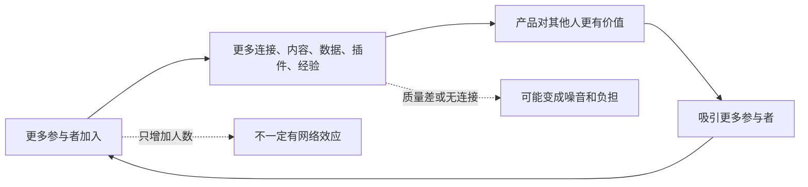
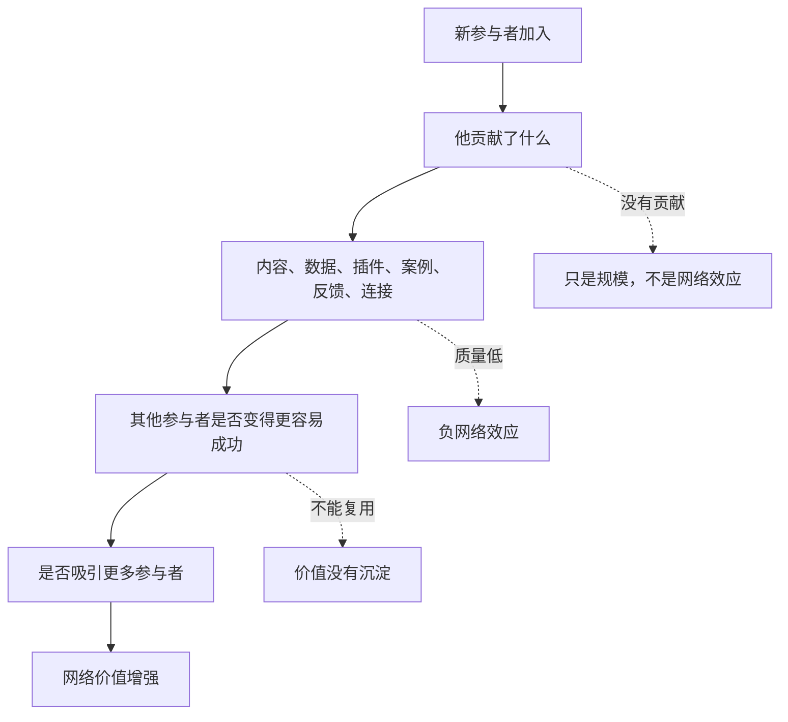

## 产品运营思维筑基课: 产品运营的上层定律: 网络效应
  
### 作者  
digoal  
  
### 日期  
2026-05-13
  
### 标签  
网络效应 , 产品运营 , 平台生态 , 用户增长 , 技术产品 , 生态价值 , 双边市场 , 规模效应 , 品牌影响力 , 上层定律
  
----  
  
## 背景 

> 面向对象: 高中生、大学生、产品运营新人、技术产品市场与运营同学  
> 核心问题: 为什么有些产品用户越多越有价值，而有些产品用户再多也只是流量变大，产品本身并没有变强？  
> 先说结论: 网络效应说的是，产品价值会因为更多参与者加入而提升。技术产品里的网络效应不只来自用户数量，还可能来自开发者、插件、数据、模板、集成、社区经验和生态伙伴。但“人多”不等于网络效应，关键是新参与者是否让其他参与者获得更多价值。

## 一张图先看懂



可以用一个班级学习资料库来理解:

```text
如果每多一个同学加入，都会上传高质量笔记、补充错题、回答问题，
资料库对所有人都更有用。

但如果只是人数变多，没有人贡献内容，或者内容很乱，
人数增加并不会让资料库更有价值。
```

技术产品也是这样:

```text
一个开发者平台越多人用，可能带来更多插件、教程、Bug 修复、集成和最佳实践。
这时用户越多，产品越有价值。
```

## 求真讲法

### 它到底说了什么

网络效应说的是:

当一个产品或平台的价值，会随着更多参与者加入而提升时，就出现了网络效应。

这里的重点不是“规模大”，而是“参与者之间产生了增益”。如果新用户加入后，只是多了一个独立使用者，其他人没有得到更多价值，那就不是强网络效应。

常见网络效应可以分成几类:

| 类型 | 机制 | 技术产品例子 |
|---|---|---|
| 直接网络效应 | 用户越多，用户彼此连接价值越大 | 协作工具、通讯工具、开发者社区 |
| 间接网络效应 | 一边用户多，吸引另一边供给 | 操作系统与应用、云市场与软件伙伴 |
| 数据网络效应 | 使用越多，数据越多，产品变好 | 推荐系统、风控模型、AI 辅助工具 |
| 社区网络效应 | 用户越多，经验、答疑、口碑越多 | 开源社区、技术论坛、用户群 |
| 生态网络效应 | 伙伴、插件、集成越多，产品场景越丰富 | 数据库插件、IDE 扩展、API 平台 |

对技术产品运营来说，网络效应意味着:

```text
不要只把用户看成消费者，
还要看他们能不能成为贡献者、传播者、集成者、案例提供者和生态建设者。
```

### 它是怎么来的

网络效应的思想常与通信网络和平台经济相关。一个电话网络里，如果只有一个人有电话，电话几乎没价值；有两个人，就能通话；有很多人，网络价值迅速增加。

后来，互联网平台、社交网络、操作系统、开源社区、开发者生态都表现出类似现象:

```text
用户越多，内容越多；
内容越多，用户越多。

开发者越多，插件越多；
插件越多，平台越有吸引力。

企业用户越多，案例越多；
案例越多，新企业越敢采用。
```

技术产品中的网络效应往往不是单纯用户关系，而是“知识、代码、数据、集成和信任”的网络。

### 它依赖哪些假设

网络效应依赖几个前提:

1. 参与者之间存在连接、共享、协作或互补关系。
2. 新参与者加入能让其他参与者获得更多价值。
3. 平台能沉淀和组织这些价值，而不是让它们散掉。
4. 质量控制足够好，规模扩大不会带来过多噪音。
5. 用户有理由留在同一个网络中，而不是随时无成本迁移。

如果一个产品只是单机工具，每个用户完全独立使用，没有内容、数据、社区、插件或伙伴关系，那么用户数量再多，也不一定形成网络效应。

### 常见误解

**误解一: 用户多就是网络效应。**

不对。用户多可能只是规模大。网络效应要求“用户越多，产品对每个用户越有价值”。如果新用户不贡献价值，只消耗资源，甚至可能是负效应。

**误解二: 网络效应一定天然发生。**

不一定。很多网络效应需要设计: 贡献机制、插件市场、社区治理、API 标准、内容沉淀、质量审核、激励体系。

**误解三: 有社区就有网络效应。**

不够。社区如果只有官方发广告，用户不互助、不贡献、不沉淀经验，就很难形成网络效应。

**误解四: 网络效应只属于平台公司。**

不对。技术产品也可以有局部网络效应。一个数据库的插件、教程、迁移案例、运维经验、生态工具越多，它对新用户就越有价值。

## 求存讲法

### 它有什么用

网络效应能帮助产品运营从“获客”升级到“造网”。

如果只看获客，运营会问:

```text
怎么让更多人来？
怎么提高注册？
怎么增加下载？
```

如果看网络效应，运营会问:

```text
新用户加入后，是否让老用户更有价值？
老用户的经验是否能帮助新用户？
开发者是否能贡献插件、模板、教程？
客户案例是否能降低其他客户信任成本？
伙伴集成是否能扩大产品适用场景？
```

技术产品运营可以围绕这些资产设计网络效应:

| 资产 | 如何形成网络效应 |
|---|---|
| 文档和 FAQ | 用户问题沉淀后，后来者更容易上手 |
| 插件和扩展 | 开发者贡献越多，平台可用场景越多 |
| 客户案例 | 同类客户越多，新客户越容易相信 |
| 模板和示例 | 使用者越多，最佳实践越丰富 |
| 社区问答 | 问题和答案越多，自助解决能力越强 |
| 伙伴集成 | 集成越多，产品进入更多工作流 |

### 它怎么迁移到熟悉领域

假设你们班建立一个“错题共享库”。

没有网络效应的情况:

```text
每个人只看自己的错题，不分享，不评论。
人数再多，别人也得不到额外价值。
```

有网络效应的情况:

```text
每个人上传错题；
同学补充不同解法；
老师标注高频错误；
大家按知识点分类；
后来的人能直接看到最常见坑点。
```

这时，每多一个认真参与的人，资料库对其他人都更有用。

技术产品里的开源社区也是类似逻辑。一个项目不仅因为用户多而强，而是因为用户提交 Issue、修复 Bug、写教程、做插件、分享生产经验，才让项目越来越有价值。

### 它的适用范围和边界

网络效应特别适用于:

- 平台型产品
- 开源项目
- 开发者工具
- API 平台
- 插件生态
- 技术社区
- 云市场、数据市场、模型市场
- 需要生态和社区影响力的技术产品

它的边界是:

| 场景 | 网络效应强度 | 说明 |
|---|---:|---|
| 单机个人工具 | 较弱 | 用户之间关联少 |
| 简单 SaaS 工具 | 中等 | 模板、协作和案例可能增强 |
| 开发者平台 | 高 | 插件、教程、社区、API 会增强 |
| 开源项目 | 高 | 贡献者和用户互相增强 |
| 操作系统/云平台 | 极高 | 应用、开发者、用户多边互补 |
| 企业基础设施 | 中到高 | 案例、伙伴、集成和最佳实践重要 |

网络效应也可能变成负网络效应。比如社区用户太多但问题质量下降、插件市场缺少审核、低质量内容淹没好内容，都会让更多参与者反而降低体验。

### 正例: 怎么用它提升能力

假设你运营一个数据库产品，希望增强技术影响力。

低水平做法是:

```text
只追求下载量、注册量和文章阅读量。
```

网络效应做法是:

1. 建立插件机制: 让开发者能扩展数据库能力。
2. 沉淀最佳实践: 把客户场景、迁移经验、性能调优写成文档。
3. 建设社区问答: 让用户问题被搜索和复用。
4. 鼓励案例分享: 让同类客户看到可参考路径。
5. 打通生态集成: 接入 ORM、BI、监控、备份、云市场和 AI 框架。
6. 维护贡献规则: 让外部贡献有清晰路径和质量标准。

这时，产品价值不只来自厂商自己写代码，还来自生态参与者共同增加的价值。

飞轮可以这样运转:


### 反例: 前提不成立会怎样

反例一: 用户多，但彼此没有增益。

某工具宣称自己有百万用户，但每个用户只是独立使用，没有模板共享、社区问答、数据改进、插件生态或协作关系。对新用户来说，百万用户并不会让产品更好用。

这里失败的前提是:

```text
网络效应要求新参与者能增加其他参与者的价值。
```

反例二: 插件多，但质量失控。

某开发者平台开放插件市场后，插件数量快速增长，但缺少审核、文档和兼容性测试。用户安装插件后频繁出错，反而降低对平台的信任。

这里失败的前提是:

```text
网络效应需要质量治理，否则规模会变成噪音。
```

反例三: 社区热闹，但不沉淀知识。

某技术产品的社群每天聊天很多，但问题和答案都散在群里，无法搜索，也没有整理进文档。新用户进来仍然重复提问，老用户逐渐疲惫。

这里失败的前提是:

```text
社区网络效应需要知识沉淀，不能只靠即时聊天。
```

## 思考

网络效应最重要的启发是: 产品运营不只是把更多用户拉进来，而是设计一种结构，让每个新参与者都可能增加整个系统的价值。

可以用这张图检查一个技术产品是否真的有网络效应:



对技术影响力来说，网络效应意味着:

```text
技术影响力不是只有官方发声，
而是用户、开发者、客户、伙伴和社区共同生成证据与经验。
```

对品牌影响力来说，网络效应意味着:

```text
品牌不是企业单向塑造，
而是在一个生态网络中被反复使用、讨论、集成和推荐。
```

可以进一步追问:

1. 我们的用户增长是否让老用户获得更多价值？
2. 用户能贡献什么: 内容、插件、案例、数据、反馈，还是连接？
3. 这些贡献是否能被搜索、复用和治理？
4. 我们是否有质量标准，避免负网络效应？
5. 我们的生态参与者为什么愿意持续贡献？

## 最后记住

1. 网络效应不是用户多，而是用户越多，产品对其他用户越有价值。
2. 技术产品的网络效应常来自插件、文档、案例、社区、数据、集成和伙伴生态。
3. 网络效应需要设计贡献机制、沉淀机制和质量治理。
4. 低质量参与会造成负网络效应，让规模变成噪音。
5. 技术影响力和品牌影响力的高阶形态，是让外部生态持续替产品创造价值。

## 参考资料

- Robert Metcalfe, Metcalfe's Law, commonly associated with network value effects.
- Carl Shapiro and Hal R. Varian, *Information Rules*, 1999.
- Geoffrey G. Parker, Marshall W. Van Alstyne, Sangeet Paul Choudary, *Platform Revolution*, 2016.
- Andrew Chen, *The Cold Start Problem*, 2021.
- Everett M. Rogers, *Diffusion of Innovations*, 1962.
- 本文基于网络效应、平台经济、开源社区、开发者生态、技术产品运营和 B2B 产品营销中的通用经验整理；未使用实时联网资料。
  
#### [PostgreSQL 解决方案集合](../201706/20170601_02.md "40cff096e9ed7122c512b35d8561d9c8")
  
  
#### [德哥 / digoal's Github - 公益是一辈子的事.](https://github.com/digoal/blog/blob/master/README.md "22709685feb7cab07d30f30387f0a9ae")
  
  
#### [About 德哥](https://github.com/digoal/blog/blob/master/me/readme.md "a37735981e7704886ffd590565582dd0")
  
  

  
