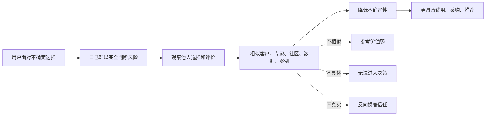
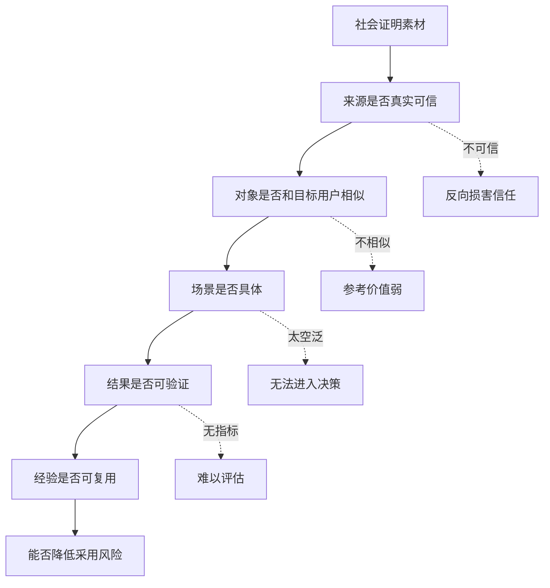

## 产品运营思维筑基课: 产品运营的上层定律: 社会证明原则
  
### 作者  
digoal  
  
### 日期  
2026-05-13
  
### 标签  
社会证明原则 , 产品运营 , 用户信任 , 口碑传播 , 技术采纳 , 品牌影响力 , 案例证据 , 社区影响 , 决策心理 , 上层定律
  
----  
  
## 背景 

> 面向对象: 高中生、大学生、产品运营新人、技术产品市场与运营同学  
> 核心问题: 为什么用户明明看懂了产品价值，仍然会问“有没有别人用过”“有没有类似案例”“社区怎么样”？  
> 先说结论: 社会证明原则说的是，人们在不确定时，会参考他人的选择和评价来判断什么更可信。技术产品越复杂、风险越高，用户越需要社会证明来降低采用风险。但真正有效的社会证明，不是空泛 Logo 墙，而是相似、具体、可信、可验证的使用证据。

## 一张图先看懂



可以用学校里的例子理解:

```text
如果你想参加一个学习小组，
你不只会看宣传海报。
你还会问: 成绩好的同学去了吗？和我水平差不多的人有没有进步？
老师是否认可？参加过的人怎么评价？
```

技术产品也是这样:

```text
用户不只听厂商说自己可靠。
他还会看: 同类公司有没有用、专家怎么评、社区是否活跃、案例是否真实、指标是否清楚。
```

## 求真讲法

### 它到底说了什么

社会证明原则，英文常称 Social Proof。它的核心意思是:

当人们面对不确定选择时，会参考其他人的行为、评价和选择，来判断某件事是否值得相信、尝试或采用。

这不是盲从那么简单。很多时候，参考他人经验是一种节省判断成本的合理策略。尤其是在技术产品里，用户很难从外部完全判断产品的稳定性、安全性、长期维护能力和真实效果，于是会借助社会证明。

技术产品里的社会证明常见形式包括:

| 社会证明类型 | 用户想判断什么 | 技术产品例子 |
|---|---|---|
| 客户案例 | 是否有人在类似场景成功用过 | 同行业、同规模、同架构客户案例 |
| 专家背书 | 专业人士是否认可 | 架构师评测、技术顾问推荐 |
| 社区口碑 | 真实用户是否持续讨论和支持 | GitHub Issue、论坛、用户群、问答 |
| 使用数据 | 是否有足够采用规模 | 下载量、Star、活跃用户、调用量 |
| 伙伴生态 | 是否被主流系统接纳 | 云市场、ORM、BI、监控、IDE 集成 |
| 第三方验证 | 厂商说法是否被独立验证 | Benchmark、测评报告、认证、奖项 |

所以，社会证明不是一句“很多客户都在用”，而是让用户看到:

```text
谁在用？
在什么场景用？
遇到什么问题？
怎么解决？
结果如何？
和我是否相似？
我能不能验证？
```

### 它是怎么来的

社会证明原则常见于社会心理学和说服研究中。Robert Cialdini 在 *Influence* 中把它作为影响人类决策的重要原则之一。

它背后的机制很朴素:

1. 人的信息有限，不可能亲自验证所有事。
2. 在不确定时，别人的行为可以提供线索。
3. 越相似的人，参考价值越高。
4. 越多可信的人做出同类选择，越容易形成信任。
5. 但如果证据虚假、夸大或不相似，社会证明会失效。

对技术产品来说，这个原则尤其重要，因为技术产品采用常常涉及:

```text
高学习成本；
高迁移成本；
高业务风险；
多人决策；
长期维护；
个人推荐声誉。
```

用户不是不相信产品团队，而是需要更多外部证据来降低风险。

### 它依赖哪些假设

社会证明原则依赖几个前提:

1. 用户面对选择时存在不确定性。
2. 用户相信他人的经验能提供参考价值。
3. 他人和自己越相似，证明力越强。
4. 社会证明能被用户看见、理解和验证。
5. 社会证明来源足够可信，不是明显包装或造假。

如果用户已经有绝对权威命令、完全掌握信息，或者产品风险极低，社会证明的作用会下降。但在技术产品和 B2B 决策中，它通常非常关键。

### 常见误解

**误解一: 社会证明就是客户 Logo 越多越好。**

不对。Logo 有帮助，但如果没有场景、问题、部署方式、结果和相似性，证明力很弱。用户不是只想知道“大公司用过”，还想知道“像我这样的公司能不能用”。

**误解二: 社会证明可以替代产品能力。**

不能。社会证明只能降低不确定性，不能弥补真实价值不足。如果用户试用后发现产品不行，社会证明会反噬信任。

**误解三: 越大的客户案例越有说服力。**

不一定。对中小企业来说，一个巨头案例可能太遥远。相似性有时比知名度更重要。

**误解四: 社会证明只用于营销页面。**

不够。它还应该进入销售材料、技术白皮书、PoC、社区、文档、选型指南、客户成功和品牌建设。

## 求存讲法

### 它有什么用

社会证明原则能帮助产品运营把“我说我好”变成“别人如何验证我好”。

如果没有社会证明，运营表达常常是:

```text
我们高性能、稳定可靠、企业级、安全可信。
```

如果有社会证明，表达会变成:

```text
某类企业在某个场景里遇到什么问题；
他们为什么选择这个方案；
上线过程如何；
指标有什么变化；
哪些经验可以复用；
哪些边界需要注意。
```

技术产品的社会证明可以按决策阶段设计:

| 决策阶段 | 用户问题 | 合适的社会证明 |
|---|---|---|
| 初步认知 | 有没有人关注这类问题 | 行业报告、社区讨论、趋势文章 |
| 技术评估 | 专业用户怎么看 | 技术测评、架构师文章、开源反馈 |
| 试用 PoC | 我能不能跑通 | Demo、教程、可复现实验、试点案例 |
| 采购决策 | 类似公司是否成功 | 同行业客户案例、ROI、部署方式 |
| 上线推广 | 团队是否能接受 | 内部推荐材料、培训、最佳实践 |
| 长期信任 | 你是否持续可靠 | 版本记录、故障复盘、社区响应 |

### 它怎么迁移到熟悉领域

假设你要选一个补习班。

你不会只看广告写“名师授课、提分快”。你会更关心:

```text
有没有和我基础差不多的学生提高了？
提高用了多久？
老师怎么教？
有没有真实作业和测试记录？
以前学生怎么评价？
如果我跟不上，有没有辅导？
```

这些就是社会证明。

技术产品也类似。一个数据库说自己“生产可靠”，用户会问:

```text
谁在生产用？
数据规模多大？
故障怎么处理？
升级怎么做？
有没有同类行业案例？
运维团队怎么评价？
```

真正有用的社会证明，是让用户能把别人的成功经验映射到自己的场景里。

### 它的适用范围和边界

社会证明原则特别适用于:

- B2B 产品
- 技术产品
- 开发者工具
- 开源项目商业化
- 数据库、云服务、AI 平台、安全、运维、监控产品
- 高风险、高价格、长周期决策产品

它的边界是:

| 场景 | 社会证明作用 | 说明 |
|---|---:|---|
| 低价冲动消费 | 中 | 评价和销量有用，但决策风险低 |
| 个人工具 | 中 | 用户评价和朋友推荐有效 |
| 开发者工具 | 高 | 社区口碑、GitHub、技术测评重要 |
| 企业 SaaS | 高 | 客户案例、ROI、行业相似性重要 |
| 基础设施产品 | 极高 | 生产案例、稳定性、支持体系关键 |
| 强制采购 | 中 | 命令推动采用，但社会证明影响接受度 |

需要注意: 社会证明必须真实、合规、可解释。虚假案例、夸大数据、未经授权的客户 Logo、选择性展示指标，短期可能有用，长期会破坏信任。

### 正例: 怎么用它提升能力

假设你运营一个企业级 AI 知识库产品。

低水平做法是:

```text
官网放一排大客户 Logo，并写“众多行业客户共同选择”。
```

更有效的社会证明应该这样设计:

1. 相似性: 选择一个和目标客户相似的行业案例，比如制造业售后知识库。
2. 原始问题: 说明旧知识库检索不准、专家被重复打扰、权限难管理。
3. 方案过程: 展示文档清洗、切分、向量检索、权限过滤、人工兜底。
4. 结果指标: 展示问题解决率、响应时间、专家工单减少比例。
5. 组织经验: 说明一线员工、知识管理员、IT 团队如何协作。
6. 边界说明: 说明哪些问题仍需人工处理，如何持续维护知识质量。

这类社会证明不只是“有人用过”，而是帮助新客户判断:

```text
这个案例和我像不像？
这个方法能不能复用？
风险和成本我能不能接受？
```

### 反例: 前提不成立会怎样

反例一: Logo 墙没有相似性。

某云服务官网展示很多大客户 Logo，但目标客户是中型企业。案例没有说明行业、规模、部署方式和实际效果。用户看完觉得“这些大公司有专门团队，我们不一定适合”。

这里失败的前提是:

```text
社会证明需要相似性，知名度不能替代场景匹配。
```

反例二: 社会证明不具体。

某数据库产品写“某金融客户性能提升显著”，但没有说明查询类型、数据规模、硬件环境、优化前后指标和业务影响。技术负责人无法把这个案例用于内部评估。

这里失败的前提是:

```text
技术产品的社会证明必须具体到可判断、可复用。
```

反例三: 证明来源不可信。

某产品在社区里大量发布“用户好评”，但账号看起来像营销号，内容高度相似，没有真实使用细节。用户反而怀疑产品口碑造假。

这里失败的前提是:

```text
社会证明必须可信，否则会反向损害信任。
```

## 思考

社会证明原则最重要的启发是: 用户不是只听你怎么说自己，也会看别人如何用你、评价你、推荐你。

可以用这张图检查一个技术产品的社会证明是否有效:



对技术影响力来说，社会证明意味着:

```text
技术影响力不是只有官方讲技术强，
而是专业用户、客户、社区和第三方愿意用证据证明你有价值。
```

对品牌影响力来说，社会证明意味着:

```text
品牌影响力不是自己反复喊可信，
而是目标用户不断看到可信的人在可信场景里选择你。
```

可以进一步追问:

1. 我们的社会证明是真实使用证据，还是空泛展示？
2. 案例是否和目标客户足够相似？
3. 用户能否从案例中学到可复用经验？
4. 社区口碑是否可搜索、可验证、可持续？
5. 我们有没有为了显得强大而使用不匹配或不完整的证明？

## 最后记住

1. 社会证明原则说明，人们在不确定时会参考他人的选择和评价。
2. 技术产品越复杂、风险越高，社会证明越重要。
3. 有效社会证明要真实、相似、具体、可信、可验证。
4. Logo 墙不是没有用，但不能替代场景、过程、指标和经验。
5. 技术影响力和品牌影响力，来自可信用户和可信场景对产品价值的持续证明。

## 参考资料

- Robert B. Cialdini, *Influence: The Psychology of Persuasion*, 1984.
- Everett M. Rogers, *Diffusion of Innovations*, 1962.
- Geoffrey A. Moore, *Crossing the Chasm*, 1991.
- Philip Kotler and Kevin Lane Keller, *Marketing Management*, multiple editions.
- David A. Aaker, *Managing Brand Equity*, 1991.
- 本文基于社会证明、创新扩散、技术产品运营、B2B 产品营销、开发者关系和企业级销售支持中的通用经验整理；未使用实时联网资料。
  
#### [PostgreSQL 解决方案集合](../201706/20170601_02.md "40cff096e9ed7122c512b35d8561d9c8")
  
  
#### [德哥 / digoal's Github - 公益是一辈子的事.](https://github.com/digoal/blog/blob/master/README.md "22709685feb7cab07d30f30387f0a9ae")
  
  
#### [About 德哥](https://github.com/digoal/blog/blob/master/me/readme.md "a37735981e7704886ffd590565582dd0")
  
  

  
