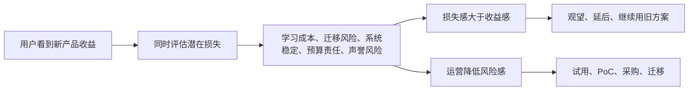
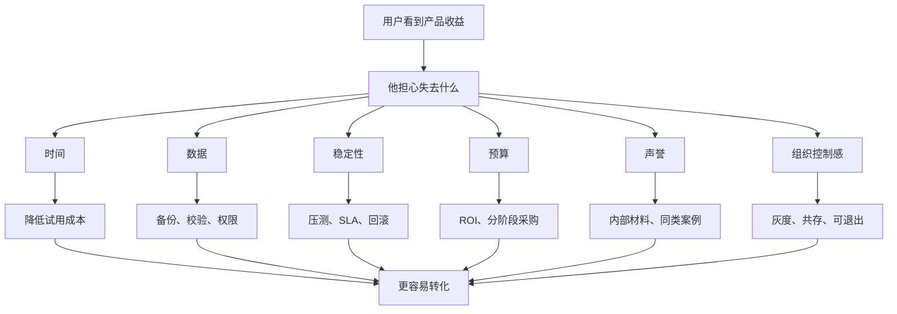

## 产品运营思维筑基课: 产品运营的上层定律: 损失厌恶
  
### 作者  
digoal  
  
### 日期  
2026-05-13
  
### 标签  
损失厌恶 , 行为经济学 , 产品运营 , 用户决策 , 风险感知 , 技术采纳 , 转化阻力 , 品牌信任 , 心理机制 , 上层定律
  
----  
  
## 背景 

> 面向对象: 高中生、大学生、产品运营新人、技术产品市场与运营同学  
> 核心问题: 为什么用户明明看到了产品收益，却仍然迟迟不试用、不迁移、不采购？  
> 先说结论: 损失厌恶说的是，人们对“可能失去”的痛感，常常强于对“可能得到”的期待。技术产品运营不能只讲收益，还必须降低用户对迁移失败、系统事故、预算浪费、数据风险和个人声誉受损的担忧。

## 一张图先看懂



可以用一个生活例子理解:

```text
一个新学习方法可能让你成绩提高 10 分。
但如果你担心它会打乱原来的复习节奏，导致考试反而退步，
你可能宁愿继续用旧方法。
```

技术产品也是这样:

```text
用户不是没看见新产品的好处，
而是更怕切换后出事故、没人负责、预算浪费、被同事质疑。
```

## 求真讲法

### 它到底说了什么

损失厌恶，英文常称 Loss Aversion，是行为经济学中的重要概念。它的核心意思是:

人在做决策时，对损失的敏感度往往高于同等规模的收益。

在产品运营里，这意味着用户不是只问:

```text
用了你以后我能得到什么？
```

还会问:

```text
用了你以后我可能失去什么？
如果失败了，谁承担后果？
旧系统还能不能回去？
我的团队会不会更麻烦？
我推荐错了会不会显得不专业？
```

技术产品里的损失厌恶尤其明显，因为采用成本和失败后果都比较高:

| 潜在损失 | 用户担心什么 | 技术产品例子 |
|---|---|---|
| 时间损失 | 学了半天不好用 | Demo 跑不通、文档混乱 |
| 迁移损失 | 旧系统切换失败 | 数据迁移、兼容性、回滚 |
| 稳定损失 | 生产系统出事故 | 数据库、云服务、监控、安全产品 |
| 预算损失 | 钱花了没效果 | SaaS 订阅、企业采购、服务合同 |
| 声誉损失 | 推荐失败被质疑 | 架构师、技术负责人、采购推动者 |
| 组织损失 | 团队协作变复杂 | 流程工具、低代码、AI 平台 |

所以，技术产品运营必须同时做两件事:

```text
证明收益值得追求；
证明损失风险可控。
```

### 它是怎么来的

损失厌恶与 Daniel Kahneman 和 Amos Tversky 的前景理论密切相关。前景理论指出，人们评估结果时，不只是看最终财富或收益，还会以某个参照点为基准，感受“得到”或“失去”。

对产品采用来说，用户的参照点通常是当前状态:

```text
现在虽然不完美，但还能用。
新产品也许更好，但可能带来新麻烦。
```

这就是为什么很多旧方案能长期存在。不是因为旧方案最好，而是因为它的风险已知；新方案的收益虽然诱人，但风险未知。

对技术产品来说，旧方案常常有一种“已知的不完美”优势:

```text
旧数据库慢，但团队会维护；
旧流程麻烦，但大家习惯了；
旧监控不够好，但出问题知道找谁；
旧工具落后，但采购和安全已经过审。
```

损失厌恶提醒运营者: 要推动用户改变，不能只说新方案更好，还要处理用户对“失去现有稳定状态”的担心。

### 它依赖哪些假设

损失厌恶依赖几个前提:

1. 用户存在一个当前参照点，比如旧系统、旧流程、旧工具。
2. 用户采用新产品需要付出切换成本。
3. 用户认为失败后果由自己或团队承担。
4. 用户对风险和不确定性敏感。
5. 用户不能完全提前验证新产品效果。

如果产品极低风险、低价格、可随时退出，损失厌恶的影响会弱一些。比如试一个免费小工具，用户不太担心。但技术产品一旦涉及生产系统、预算、数据、安全和团队协作，损失厌恶就会明显增强。

### 常见误解

**误解一: 用户不买，是因为没看到收益。**

不一定。用户可能已经看到了收益，但潜在损失更让他害怕。比如“性能提升 30%”很诱人，但“迁移失败导致业务中断”更吓人。

**误解二: 只要制造焦虑，就能利用损失厌恶。**

不对。恐吓式营销可能短期吸引注意，但会损害信任。技术产品更应该诚实揭示风险，并提供可验证的解决路径。

**误解三: 降价能解决损失厌恶。**

不一定。价格只是损失的一部分。对企业技术产品来说，时间、迁移、稳定性、安全和声誉损失往往比价格更重要。

**误解四: 免费试用就没有风险。**

不对。免费只降低金钱成本，但学习成本、接入成本、数据风险、组织沟通成本仍然存在。

## 求存讲法

### 它有什么用

损失厌恶能帮助产品运营理解为什么“收益很大”仍然转化困难。

如果只讲收益，运营会写:

```text
效率提升 50%，成本降低 30%，性能提升 10 倍。
```

如果考虑损失厌恶，还要回答:

```text
怎么低风险试用？
怎么不影响生产系统？
怎么迁移和回滚？
怎么验证效果？
出问题谁支持？
旧系统和新系统如何共存？
推荐人如何向团队解释风险？
```

技术产品运营可以用这些资产降低损失感:

| 用户担心 | 运营资产 |
|---|---|
| 学不会 | 快速上手、视频教程、示例数据 |
| 跑不通 | 一键 Demo、沙箱环境、错误排查 |
| 迁移失败 | 迁移指南、兼容清单、回滚方案 |
| 生产事故 | SLA、压测报告、备份恢复、故障复盘 |
| 安全风险 | 权限模型、安全白皮书、合规说明 |
| 采购风险 | ROI、同类案例、PoC 评估模板 |
| 推荐失败 | 内部汇报材料、对比表、风险边界 |

### 它怎么迁移到熟悉领域

假设你想换一种学习方法。

新方法说:

```text
每天用 30 分钟做错题复盘，一个月后成绩会提升。
```

你可能仍然担心:

```text
如果这 30 分钟占用了刷题时间怎么办？
如果我坚持不了怎么办？
如果考试前发现没效果怎么办？
```

更好的设计不是只说“效果很好”，而是降低损失:

```text
先试 7 天；
每天只用 10 分钟；
只选一个薄弱章节；
保留原来的复习节奏；
第 7 天用一次小测检验效果。
```

技术产品也是一样。用户更愿意从低风险试点开始，而不是一次性替换核心系统。

### 它的适用范围和边界

损失厌恶特别适用于:

- B2B 技术产品
- 数据库、云服务、安全、监控、运维产品
- 企业 SaaS
- 需要迁移、集成、采购或组织推动的产品
- 高客单价、高风险、长周期决策产品

它的边界是:

| 场景 | 损失厌恶强度 | 说明 |
|---|---:|---|
| 免费娱乐产品 | 较低 | 尝试成本低 |
| 个人效率工具 | 中 | 学习和迁移成本存在 |
| 企业 SaaS | 高 | 涉及流程、预算、团队习惯 |
| 数据库/云/安全 | 极高 | 涉及生产稳定、数据和责任 |
| 金融/医疗/政企系统 | 极高 | 合规和事故后果严重 |

还要注意: 降低损失感不等于隐藏风险。恰恰相反，技术产品要公开风险边界，并给出控制方法。用户真正需要的是“风险可见、可测、可控、可退出”。

### 正例: 怎么用它提升能力

假设你运营一个数据库迁移工具。

低水平表达是:

```text
迁移效率提升 80%，节省大量人工成本。
```

这只讲收益。用户仍然担心:

```text
数据会不会丢？
SQL 是否兼容？
停机多久？
失败能不能回滚？
迁移后性能是否稳定？
出问题谁负责？
```

更好的运营表达和资产设计是:

1. 风险识别: 提供迁移前兼容性扫描。
2. 低风险试点: 支持只迁移一张表或一个非核心业务。
3. 可验证结果: 给出数据一致性校验报告。
4. 可回退路径: 提供双写、灰度、回滚方案。
5. 生产保障: 提供监控、告警、备份和专家支持。
6. 同类案例: 展示相似规模客户如何完成迁移。

这时用户不是只看到“收益”，还看到“损失可控”。

### 反例: 前提不成立会怎样

反例一: 只讲收益，不讲迁移风险。

某云数据库产品反复宣传“成本降低 40%”，但没有解释从自建数据库迁移过来的兼容性、停机时间、回滚方案和运维变化。用户觉得收益不错，但不敢动生产系统。

这里失败的前提是:

```text
技术产品采用的主要阻力常常不是收益不足，而是潜在损失过高。
```

反例二: 免费试用仍然门槛很高。

某 AI 平台提供免费试用，但用户需要准备数据、配置环境、申请权限、学习复杂概念。虽然不花钱，但时间和学习成本很高，很多用户放弃。

这里失败的前提是:

```text
免费不能消除所有损失，时间和认知成本也是损失。
```

反例三: 用恐吓制造转化。

某安全产品长期用夸张事故标题吓唬用户，却不给出清楚评估方法、风险分级和解决路径。用户短期会焦虑，长期会觉得厂商不专业。

这里失败的前提是:

```text
损失厌恶要用来帮助用户控制风险，而不是制造不可信恐慌。
```

## 思考

损失厌恶最重要的启发是: 用户决策不是收益最大化那么简单，还要避免自己承担无法接受的损失。

可以用这张图检查技术产品的转化阻力:



对技术影响力来说，损失厌恶意味着:

```text
技术影响力不能只展示性能和先进性，
还要展示边界、风险控制、故障处理和可回退能力。
```

对品牌影响力来说，它意味着:

```text
品牌影响力不是让用户觉得你很强，
而是让用户觉得把重要任务交给你不会让自己陷入不可控损失。
```

可以进一步追问:

1. 用户采用我们之前，最怕失去什么？
2. 我们是否把收益讲得很多，却把风险控制讲得太少？
3. 试用是否真的低风险，还是只是不收费？
4. 有没有灰度、回滚、备份、校验和退出路径？
5. 用户推荐我们给团队时，如何保护自己的专业声誉？

## 最后记住

1. 损失厌恶说明，人们对潜在损失的敏感度常常高于同等收益。
2. 技术产品转化困难，很多时候不是收益不够，而是用户担心损失不可控。
3. 降低损失感要靠试点、验证、迁移、回滚、安全、支持和同类案例。
4. 免费试用不等于低风险，时间、学习、数据和组织成本也是损失。
5. 好运营不是恐吓用户，而是让用户看见风险并相信风险可控。

## 参考资料

- Daniel Kahneman and Amos Tversky, “Prospect Theory: An Analysis of Decision under Risk”, 1979.
- Daniel Kahneman, *Thinking, Fast and Slow*, 2011.
- Richard H. Thaler, *Misbehaving: The Making of Behavioral Economics*, 2015.
- Robert B. Cialdini, *Influence: The Psychology of Persuasion*, 1984.
- Geoffrey A. Moore, *Crossing the Chasm*, 1991.
- 本文基于行为经济学、损失厌恶、技术产品运营、B2B 产品营销和企业级采购实践中的通用经验整理；未使用实时联网资料。
  
#### [PostgreSQL 解决方案集合](../201706/20170601_02.md "40cff096e9ed7122c512b35d8561d9c8")
  
  
#### [德哥 / digoal's Github - 公益是一辈子的事.](https://github.com/digoal/blog/blob/master/README.md "22709685feb7cab07d30f30387f0a9ae")
  
  
#### [About 德哥](https://github.com/digoal/blog/blob/master/me/readme.md "a37735981e7704886ffd590565582dd0")
  
  

  
