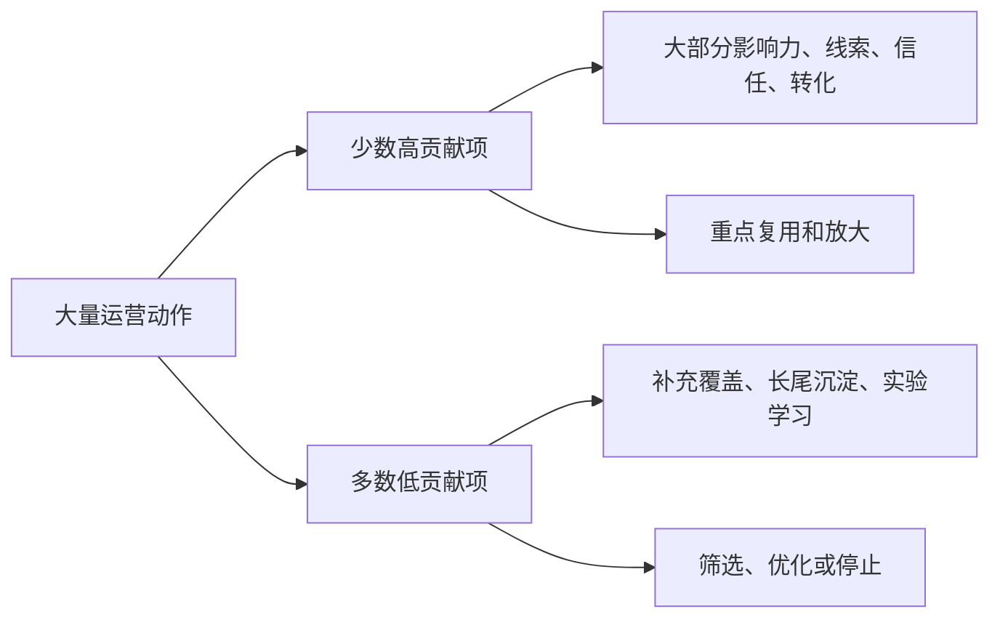
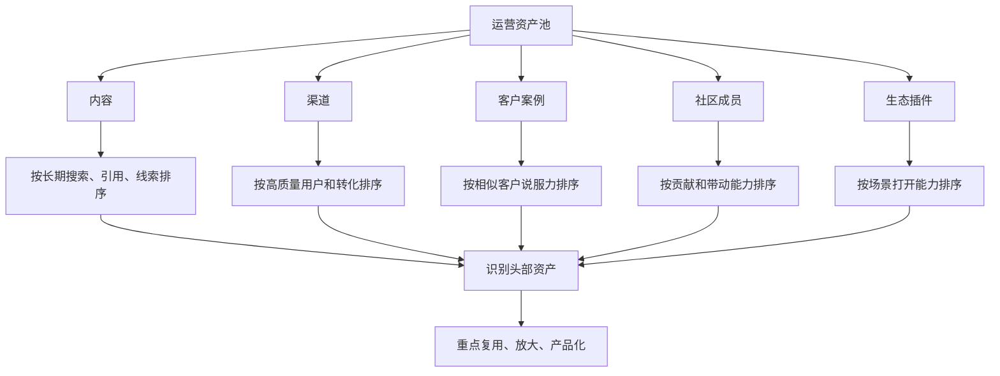

## 产品运营思维筑基课: 产品运营的上层定律: 幂律分布
  
### 作者  
digoal  
  
### 日期  
2026-05-13
  
### 标签  
幂律分布 , 产品运营 , 影响力分布 , 内容传播 , 社区运营 , 技术品牌 , 关键节点 , 长尾 , 资源配置 , 上层定律
  
----  
  
## 背景 

> 面向对象: 高中生、大学生、产品运营新人、技术产品市场与运营同学  
> 核心问题: 为什么很多运营动作看起来都在做，但真正带来影响力、线索和转化的，常常只是少数内容、少数渠道、少数客户和少数社区成员？  
> 先说结论: 幂律分布提醒我们，产品运营里的贡献往往极不均匀。少数高质量内容、关键渠道、标杆客户、核心开发者或头部案例，可能贡献大部分技术影响力和品牌影响力。运营不能平均用力，而要识别、放大和复用那些高杠杆资产。

## 一张图先看懂



可以用一个学习例子理解:

```text
一本错题本里，真正反复让你丢分的，可能只是少数几个知识点。
如果你平均复习所有内容，看起来很勤奋，但效率不一定高。
如果你找到高频失分点，集中突破，成绩提升会更明显。
```

产品运营也是这样:

```text
不是每篇文章、每场活动、每个渠道、每个客户案例都同等重要。
少数关键资产，往往决定了大部分影响力。
```

## 求真讲法

### 它到底说了什么

幂律分布，简单说，就是少数对象占据了非常大的份额，多数对象只占很小份额。

它和平均分布不同:

| 分布类型 | 直观理解 | 运营例子 |
|---|---|---|
| 平均分布 | 每一项贡献差不多 | 每篇文章都带来差不多阅读和线索 |
| 正态分布 | 大多数接近平均，极端值较少 | 大多数活动效果中等，少数特别好或特别差 |
| 幂律分布 | 少数头部贡献巨大，长尾很多 | 1 篇文章带来全年大部分搜索流量 |

在产品运营中，幂律现象很常见:

```text
少数文章带来大部分自然搜索流量；
少数客户案例带来大部分信任；
少数渠道带来大部分高质量线索；
少数社区成员回答大部分问题；
少数插件带来大部分生态价值；
少数标杆客户影响大量相似客户决策。
```

所以，幂律分布不是叫你只追爆款，而是提醒你:

```text
资源回报高度不均匀，要找到真正有杠杆的点。
```

### 它是怎么来的

幂律分布广泛出现在自然、社会、互联网和商业系统中。比如城市人口、网站链接、论文引用、图书销量、财富分布、社交网络影响力，都可能呈现少数头部占大份额的现象。

产品运营里出现幂律，通常有几个原因:

1. 注意力会集中。用户不可能看完所有内容，会集中看最有用、最权威或最容易传播的内容。
2. 信任会集中。一个标杆客户案例，比十个模糊案例更能降低风险。
3. 渠道质量不均。某些渠道更接近目标用户和决策场景。
4. 社会传播会放大。被引用、转发、推荐的内容会获得更多曝光。
5. 生态贡献不均。少数核心贡献者常常比大量旁观者创造更多价值。

对技术产品来说，幂律更明显，因为技术用户非常看重深度、证据和可信来源。浅层内容很多，但真正能被收藏、引用、转发、用于内部决策的内容很少。

### 它依赖哪些假设

幂律分布在运营中成立，通常依赖几个前提:

1. 用户注意力有限，会选择性关注。
2. 内容、渠道、客户和社区成员之间质量差异很大。
3. 好资产会被搜索、引用、转发和复用，获得二次放大。
4. 市场存在社会证明和头部效应。
5. 运营结果可以被跟踪和比较。

如果一个场景里所有动作完全同质、用户随机接触、没有传播和复用，幂律就不明显。但技术产品运营通常不是这种场景。

### 常见误解

**误解一: 幂律分布就是二八法则。**

二八法则是一个近似说法，意思是少数因素贡献多数结果。幂律更强调头部和长尾之间可能差距极大，不一定刚好是 20% 对 80%。

**误解二: 既然少数内容贡献最大，那就只做爆款。**

不对。头部内容往往来自大量探索、长期积累和持续复用。只赌爆款会变成运气游戏。更好的做法是建立发现高杠杆资产的机制。

**误解三: 长尾没有价值。**

不一定。长尾内容、长尾问题、长尾客户能提供覆盖、搜索入口、学习样本和未来头部机会。关键是不能把全部资源平均撒在长尾上。

**误解四: 头部贡献大，就可以忽略基础工作。**

不能。很多头部效果依赖基础设施，比如文档、产品体验、转化路径、销售跟进、社区治理。没有基础承接，头部流量也会浪费。

## 求存讲法

### 它有什么用

幂律分布能帮助产品运营做资源配置。

如果没有幂律意识，团队容易平均用力:

```text
每个渠道都做一点；
每篇文章投入差不多；
每个客户案例都写成同样模板；
每个活动都差不多预算；
每个社区成员都同等维护。
```

如果有幂律意识，团队会问:

```text
哪些内容长期带来搜索和线索？
哪些渠道带来真正高质量用户？
哪些客户案例能说服最多相似客户？
哪些社区成员最能带动讨论和贡献？
哪些插件或集成最能打开新场景？
```

技术产品运营中的高杠杆资产常见如下:

| 资产 | 高杠杆表现 |
|---|---|
| 深度技术文章 | 长期被搜索、引用、转发 |
| 标杆客户案例 | 反复被销售和客户成功用于说服 |
| 核心渠道 | 带来少量但高质量线索 |
| 开源仓库 | 持续吸引开发者试用和贡献 |
| 关键插件 | 打开一个重要生态场景 |
| 核心社区成员 | 回答问题、贡献代码、带动口碑 |
| 权威测评 | 一次证明长期被引用 |

### 它怎么迁移到熟悉领域

假设你经营一个班级公众号。

你发了 100 篇文章，最后发现:

```text
5 篇考试方法文章带来一半关注；
3 篇老师访谈被反复转发；
1 篇错题整理模板长期有人下载；
大多数日常记录阅读很低。
```

这不是说日常记录完全没用，而是说明真正带来增长的，是少数可复用、可转发、能解决真实问题的内容。

技术产品也是一样。一个数据库产品可能写了很多发布稿，但真正长期有效的是:

```text
一篇迁移指南；
一个性能排查手册；
一个标杆客户案例；
一个可复现 Benchmark；
一个被社区认可的插件。
```

这些资产会反复发挥作用。

### 它的适用范围和边界

幂律分布特别适用于:

- 内容运营
- 渠道投放
- 客户案例管理
- 社区运营
- 开源项目运营
- 开发者生态建设
- 技术影响力和品牌影响力建设

它的边界是:

| 场景 | 幂律明显程度 | 说明 |
|---|---:|---|
| 技术内容 | 高 | 少数深度内容长期贡献大 |
| 社区贡献 | 高 | 少数核心成员贡献大量价值 |
| 客户案例 | 高 | 标杆案例影响远大于普通案例 |
| 标准化客服 | 中 | 大量问题可能相对均匀 |
| 合规基础工作 | 低到中 | 不能只做头部，底线都要满足 |
| 安全和稳定性 | 不能只按幂律 | 小概率事故也可能造成巨大损失 |

重要边界是: 幂律适合指导资源重点，但不能用来忽略底线工作。比如安全、合规、数据保护、客户支持，不能因为“不是头部贡献”就不做。

### 正例: 怎么用它提升能力

假设你运营一个面向企业的 AI 数据平台。

你分析过去半年数据，发现:

1. 大量短新闻带来短期阅读，但几乎没有试用。
2. 两篇 RAG 架构深度文章持续带来自然搜索。
3. 一个制造业客户案例反复被销售用于推进 PoC。
4. 一个 GitHub Demo 项目带来大量开发者试用。
5. 一个社区核心用户回答了很多真实问题。

幂律思维下，你不应该继续平均投入，而应该:

```text
把 RAG 架构文章扩展成系列；
把制造业案例做成行业方案和 Webinar；
把 GitHub Demo 做成更完整的教程和模板；
邀请核心社区用户参与共创和分享；
减少低转化短新闻的资源占用。
```

这不是简单“砍掉长尾”，而是把资源向已经证明有杠杆的资产集中。

### 反例: 前提不成立会怎样

反例一: 平均用力，错过头部资产。

某技术产品每周固定发三篇文章，每篇投入差不多。数据明明显示“故障排查”和“迁移指南”长期带来高质量线索，但团队仍然平均产出发布稿、活动稿和泛科普。

这里失败的前提是:

```text
运营贡献高度不均匀，不能长期平均分配资源。
```

反例二: 只赌爆款，忽略长期积累。

某团队看到少数爆款文章带来大量流量，于是停止写文档、教程和案例，只追热点标题。短期阅读上升，但开发者找不到可靠资料，试用和转化下降。

这里失败的前提是:

```text
幂律不是只追爆款，头部资产需要基础内容和产品体验承接。
```

反例三: 误把虚假头部当作高价值。

某渠道带来大量线索，看似是头部渠道，但销售发现大多数线索无预算、无权限、无真实需求。团队只看数量，没有看质量，继续加大投入。

这里失败的前提是:

```text
幂律分析要看真实贡献，不只看表面流量。
```

## 思考

幂律分布最重要的启发是: 产品运营要尊重不均匀性。真正的增长和影响力，往往不是平均撒出来的，而是从少数高杠杆点放大出来的。

可以用这张图检查技术产品运营中的幂律机会:



对技术影响力来说，幂律分布意味着:

```text
技术影响力不是靠大量普通内容堆出来，
而是靠少数真正解决关键问题、被专业用户反复引用的资产建立。
```

对品牌影响力来说，它意味着:

```text
品牌影响力常常由少数标杆案例、关键渠道、核心社区成员和代表性内容放大。
```

可以进一步追问:

1. 哪 10% 的内容带来了最多高质量用户？
2. 哪些客户案例最常被销售、客户和媒体引用？
3. 哪些渠道带来的不是最多线索，而是最好的线索？
4. 哪些社区成员和生态伙伴贡献了最多真实价值？
5. 我们是否把资源平均分给了低贡献动作？

## 最后记住

1. 幂律分布说明，少数运营资产往往贡献大部分结果。
2. 技术产品里的头部资产可能是深度文章、标杆案例、核心渠道、开源项目、关键插件或社区贡献者。
3. 幂律思维不是只赌爆款，而是识别、复用和放大已证明有杠杆的资产。
4. 分析幂律要看真实贡献，不能只看阅读量、下载量、线索量等表面指标。
5. 技术影响力和品牌影响力，常常来自少数高可信、高复用、高传播的关键资产。

## 参考资料

- Vilfredo Pareto, Pareto principle, commonly associated with unequal distribution observations.
- Albert-Laszlo Barabasi, *Linked: The New Science of Networks*, 2002.
- Chris Anderson, *The Long Tail*, 2006.
- Nassim Nicholas Taleb, *The Black Swan*, 2007.
- Philip Kotler and Kevin Lane Keller, *Marketing Management*, multiple editions.
- 本文基于幂律分布、二八法则、长尾理论、技术产品运营、内容运营、开发者关系和 B2B 产品营销中的通用经验整理；未使用实时联网资料。
  
#### [PostgreSQL 解决方案集合](../201706/20170601_02.md "40cff096e9ed7122c512b35d8561d9c8")
  
  
#### [德哥 / digoal's Github - 公益是一辈子的事.](https://github.com/digoal/blog/blob/master/README.md "22709685feb7cab07d30f30387f0a9ae")
  
  
#### [About 德哥](https://github.com/digoal/blog/blob/master/me/readme.md "a37735981e7704886ffd590565582dd0")
  
  

  
