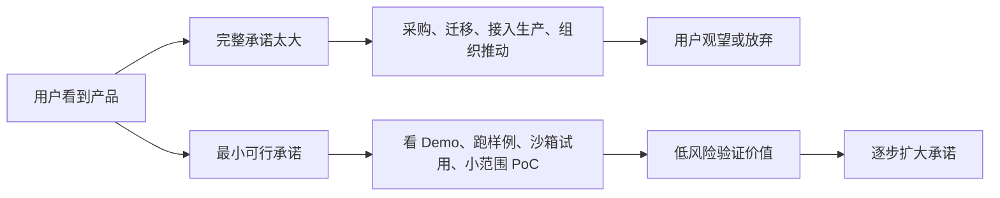
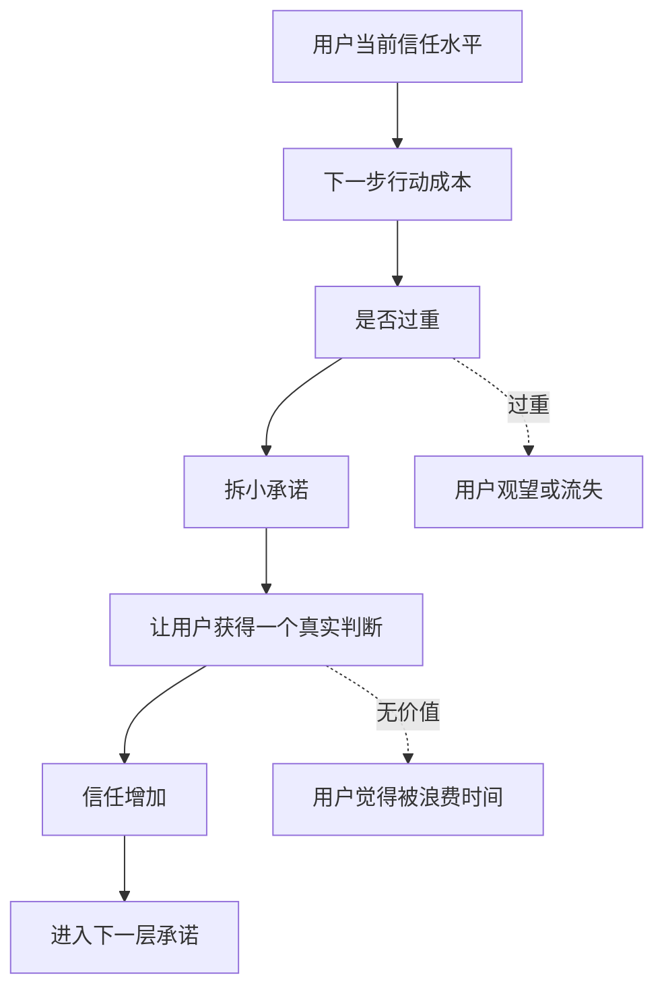

## 产品运营思维筑基课: 产品运营的上层定律: 最小可行承诺
  
### 作者  
digoal  
  
### 日期  
2026-05-13
  
### 标签  
最小可行承诺 , 产品运营 , 用户转化 , 试用路径 , 技术产品 , 降低门槛 , 用户采用 , 承诺设计 , 增长策略 , 上层定律
  
----  
  
## 背景 

> 面向对象: 高中生、大学生、产品运营新人、技术产品市场与运营同学  
> 核心问题: 为什么用户觉得产品不错，却不愿意立刻注册、试用、留资、采购或迁移？  
> 先说结论: 最小可行承诺说的是，不要一开始就要求用户承担完整风险，而要设计一个足够小、足够清楚、足够有价值的第一步。技术产品尤其需要把“大采用”拆成“小验证”，让用户先用低成本证明价值，再逐步增加承诺。

## 一张图先看懂



可以用学习类比理解:

```text
如果一个学习小组一开始就要求你报名一年、每周三次、缴一大笔钱，
你会犹豫。

如果它让你先旁听一次、带走一份错题模板、解决一个真实问题，
你更容易开始。
```

技术产品也是这样:

```text
不要一上来要求用户迁移生产系统。
先让他 10 分钟跑通 Demo，再让他用测试数据做 PoC，最后再谈正式采用。
```

## 求真讲法

### 它到底说了什么

“最小可行承诺”说的是:

用户从陌生到采用，不是一步跳到最终决策，而是逐步增加承诺。产品运营要设计每个阶段最小但有意义的行动，让用户以较低成本继续前进。

这里有三个关键词:

| 关键词 | 含义 | 技术产品例子 |
|---|---|---|
| 最小 | 行动成本足够低 | 不填复杂表单，先看在线 Demo |
| 可行 | 用户真的能完成 | 有示例数据、清楚步骤、可运行环境 |
| 承诺 | 用户投入了一点真实资源 | 时间、数据、同事讨论、测试环境、预算评估 |

它不是让用户随便点一下，而是让用户完成一个能推动关系加深的小动作。

技术产品常见承诺阶梯如下:

```text
阅读文章 -> 查看文档 -> 跑通 Demo -> 使用示例数据 -> 接入测试环境 -> 小范围 PoC -> 团队评估 -> 采购 -> 生产采用 -> 扩大使用
```

每一步都应该比前一步多一点承诺，也多一点价值。

### 它是怎么来的

这条定律来自一个现实: 用户行动有成本。尤其是技术产品，用户的第一步行动可能包含:

1. 时间成本。
2. 学习成本。
3. 环境配置成本。
4. 数据准备成本。
5. 安全和权限顾虑。
6. 被销售跟进的心理压力。
7. 推荐给团队后的声誉风险。

如果第一步太大，用户就会推迟。比如:

```text
“联系我们销售”对只是想了解产品的人太重。
“提交公司信息申请试用”对开发者太重。
“迁移到我们的平台”对企业客户太重。
```

最小可行承诺的思路是:

```text
先让用户用最小成本验证一个关键价值。
```

这和精益创业里的 MVP 有相似之处，但重点不同。MVP 关注“用最小产品验证假设”；最小可行承诺关注“让用户用最小行动继续前进”。

### 它依赖哪些假设

最小可行承诺依赖几个前提:

1. 用户对产品仍有不确定性。
2. 用户不愿一开始承担完整风险。
3. 产品价值可以被拆成可逐步验证的小价值。
4. 每个小承诺都能带来下一步判断依据。
5. 用户完成小承诺后，信任和理解会增加。

如果产品极其简单、低价、低风险，用户可能可以直接购买，不需要复杂承诺阶梯。但技术产品通常复杂、风险高、需要多角色决策，因此非常适合这种方法。

### 常见误解

**误解一: 最小可行承诺就是免费试用。**

不一定。免费试用如果配置复杂、要准备数据、要等销售开通，仍然不是最小承诺。真正的最小承诺要降低用户的总成本，不只是金钱成本。

**误解二: 承诺越小越好。**

不对。承诺太小可能没有意义。比如只点一个“了解更多”，用户没有体验到价值。最小可行承诺要小，但必须能让用户获得一个真实判断。

**误解三: 技术产品应该尽快让用户留资。**

不一定。过早留资会吓走还在认知阶段的用户。开发者往往更愿意先看文档、跑 Demo、试 API，再决定是否联系销售。

**误解四: PoC 就是最小承诺。**

不一定。对很多客户来说，PoC 已经很重，因为要投入团队、数据和时间。PoC 之前还需要更小的步骤，比如样例 Demo、沙箱、兼容性扫描。

## 求存讲法

### 它有什么用

最小可行承诺能帮助产品运营降低转化阻力。

如果没有这条定律，运营路径常常是:

```text
用户看完文章 -> 立即要求留资 -> 销售跟进 -> 推动采购
```

这对已经强意向的客户可以，但对多数技术用户太重。

更好的路径是:

| 用户阶段 | 最小可行承诺 | 用户获得什么 |
|---|---|---|
| 初步认知 | 阅读一篇问题拆解 | 知道问题和自己有关 |
| 方案理解 | 看架构图或对比表 | 知道方案为什么可行 |
| 技术兴趣 | 在线 Demo | 看见效果 |
| 开发试用 | 复制示例代码跑通 | 验证可接入 |
| 企业评估 | 沙箱或测试环境 | 用自己的数据验证 |
| 组织决策 | 小范围 PoC | 评估收益和风险 |
| 正式采用 | 灰度上线 | 控制迁移风险 |

这条路径把“大决策”拆成“小判断”，用户每走一步都更有信心。

### 它怎么迁移到熟悉领域

假设你想让同学加入跑步计划。

重承诺说法:

```text
从今天开始，每天早上 6 点跑 5 公里，坚持一年。
```

很多人会直接放弃。

最小可行承诺是:

```text
明天先一起走 10 分钟；
不用买装备；
结束后记录一下感觉；
如果能接受，再改成慢跑 15 分钟。
```

这个承诺足够小，但不是无意义，因为它让对方真实体验了开始行动的感觉。

技术产品同理。不要让用户第一步就是“签合同、迁移数据、接入生产”。先让他完成一个小而真实的验证。

### 它的适用范围和边界

最小可行承诺特别适用于:

- 技术产品试用
- 开发者工具转化
- B2B SaaS 线索培育
- 数据库、云服务、AI 平台、安全、监控、运维产品
- 需要迁移、集成、采购或组织决策的产品

它的边界是:

| 场景 | 适用程度 | 说明 |
|---|---:|---|
| 低价冲动消费 | 中 | 直接购买可能更简单 |
| 免费内容订阅 | 高 | 先关注、再阅读、再转化 |
| 开发者工具 | 极高 | 文档、Demo、API 是低承诺入口 |
| 企业 SaaS | 高 | 试点和 PoC 能降低组织风险 |
| 基础设施产品 | 极高 | 必须分阶段验证和灰度 |
| 强制采购 | 中 | 仍需降低使用和落地承诺 |

需要注意: 低承诺不是低质量。技术用户第一次接触就会形成判断。一个粗糙的 Demo、跑不通的样例、过期的文档，会让用户在最小承诺阶段就流失。

### 正例: 怎么用它提升能力

假设你运营一个面向企业的向量数据库产品。

低水平路径是:

```text
官网按钮: 联系销售，申请企业试用。
```

这对早期技术用户太重。更好的最小可行承诺路径是:

1. 30 秒: 看一个 RAG 检索效果动图或在线样例。
2. 3 分钟: 阅读“关键词检索和向量检索差别”的图解。
3. 10 分钟: 用浏览器沙箱上传一份示例文档并搜索。
4. 30 分钟: 复制代码在本地跑通最小 Demo。
5. 1 天: 用测试数据验证检索效果和延迟。
6. 1 周: 做小范围 PoC，评估权限、成本、稳定性。
7. 1 个月: 灰度接入一个非核心业务。

这条路径让用户逐步承诺:

```text
注意力 -> 时间 -> 测试数据 -> 团队讨论 -> 组织资源 -> 生产场景
```

每一步都比前一步重，但都有清楚价值。

### 反例: 前提不成立会怎样

反例一: 第一步承诺太重。

某开发者工具的官网没有文档预览，也没有 Demo。用户想试用必须填写公司、手机号、预算、采购计划，等待销售联系。大量开发者在第一步就离开。

这里失败的前提是:

```text
用户在低信任阶段不愿承担过重承诺。
```

反例二: 承诺很小，但没有价值。

某产品提供“立即体验”按钮，点进去只是播放宣传视频，用户无法操作、无法验证、无法带走任何判断。虽然承诺很小，但不是可行承诺。

这里失败的前提是:

```text
最小承诺必须让用户获得真实价值或判断依据。
```

反例三: 免费试用不是真正低风险。

某企业 SaaS 免费试用 14 天，但需要用户导入大量真实数据、邀请团队、配置权限。用户担心数据安全和团队打扰，最终没有开始。

这里失败的前提是:

```text
免费不等于低承诺，数据、时间、组织协调也是承诺。
```

## 思考

最小可行承诺最重要的启发是: 用户不是被一次性说服的，而是在一连串低风险验证中逐步建立信心。

可以用这张图检查技术产品的承诺阶梯:



对技术影响力来说，最小可行承诺意味着:

```text
技术影响力不能只靠深度文章，
还要给读者一条低风险上手路径，让他从理解走向验证。
```

对品牌影响力来说，它意味着:

```text
品牌信任不是一次要求用户相信，
而是通过一个个小承诺被兑现出来。
```

可以进一步追问:

1. 用户第一次接触我们时，被要求做的动作是否太重？
2. 我们的最小行动是否真的能让用户体验到价值？
3. 免费试用是否还隐藏了时间、数据、组织和心理成本？
4. 用户从阅读到 Demo、PoC、采购之间是否有清楚阶梯？
5. 每一步承诺完成后，是否自然引导到下一步？

## 最后记住

1. 最小可行承诺是让用户用最低可行成本完成一次真实价值验证。
2. 它不是免费试用，也不是无意义点击，而是低风险、有判断价值的小行动。
3. 技术产品要把采购、迁移、生产采用拆成 Demo、沙箱、测试、PoC、灰度等阶段。
4. 承诺太重会让用户观望，承诺太轻又无法建立信任。
5. 好运营要设计承诺阶梯，让用户从理解、验证、试点逐步走向采用和推荐。

## 参考资料

- Eric Ries, *The Lean Startup*, 2011.
- BJ Fogg, *Tiny Habits*, 2019.
- Robert B. Cialdini, *Influence: The Psychology of Persuasion*, 1984.
- Geoffrey A. Moore, *Crossing the Chasm*, 1991.
- Sean Ellis and Morgan Brown, *Hacking Growth*, 2017.
- 本文基于精益创业、行为设计、增长模型、技术产品运营、开发者关系和 B2B 销售支持中的通用经验整理；未使用实时联网资料。
  
#### [PostgreSQL 解决方案集合](../201706/20170601_02.md "40cff096e9ed7122c512b35d8561d9c8")
  
  
#### [德哥 / digoal's Github - 公益是一辈子的事.](https://github.com/digoal/blog/blob/master/README.md "22709685feb7cab07d30f30387f0a9ae")
  
  
#### [About 德哥](https://github.com/digoal/blog/blob/master/me/readme.md "a37735981e7704886ffd590565582dd0")
  
  

  
