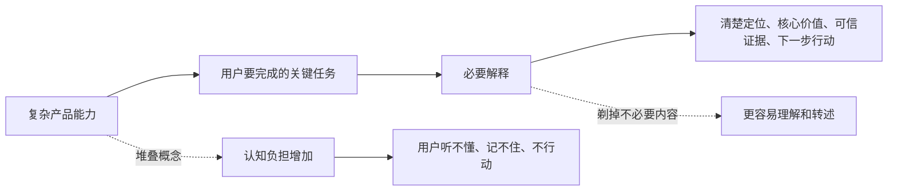
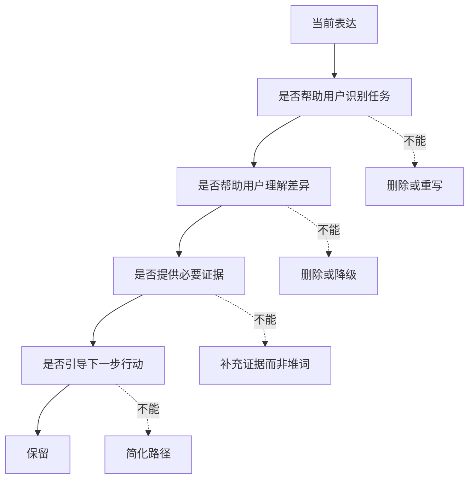

## 产品运营思维筑基课: 产品运营的上层定律: 奥卡姆剃刀
  
### 作者  
digoal  
  
### 日期  
2026-05-13
  
### 标签  
奥卡姆剃刀 , 产品运营 , 简化表达 , 技术产品 , 认知负担 , 产品叙事 , 决策效率 , 复杂性 , 运营原则 , 上层定律
  
----  
  
## 背景 

> 面向对象: 高中生、大学生、产品运营新人、技术产品市场与运营同学  
> 核心问题: 为什么有些产品明明能力很强，越解释用户越糊涂；为什么运营内容越完整，反而越难转化？  
> 先说结论: 奥卡姆剃刀提醒我们，在能解释清楚问题的前提下，不要增加不必要的概念、卖点、路径和假设。技术产品可以复杂，但对外表达要尽量简单、准确、可验证；简单不是简陋，而是把不必要的认知负担剃掉。

## 一张图先看懂



可以用学习例子理解:

```text
一道数学题可以有很多解法。
但给同学讲题时，最好的讲法不是把所有解法都讲一遍，
而是先用最少的关键步骤，让他明白为什么这样解。
```

技术产品运营也是这样:

```text
不是把所有架构、功能、场景、愿景都塞进一页里，
而是先讲清: 谁遇到什么问题，我们用什么关键方法解决，凭什么相信，下一步怎么验证。
```

## 求真讲法

### 它到底说了什么

奥卡姆剃刀常被概括为:

```text
如无必要，勿增实体。
```

放到产品运营里，可以翻译成:

```text
如无必要，勿增概念；
如无必要，勿增卖点；
如无必要，勿增路径；
如无必要，勿增用户理解成本。
```

它不是说简单的解释一定正确，也不是说复杂系统必须被说成简单系统。它真正强调的是:

在解释力足够的情况下，优先选择更少假设、更少概念、更少步骤的表达和方案。

技术产品运营中，奥卡姆剃刀常常用于这些地方:

| 场景 | 剃掉什么 | 保留什么 |
|---|---|---|
| 产品定位 | 空泛大词、过多目标用户 | 一个清楚心智位置 |
| 官网首页 | 所有功能清单 | 核心任务、主要差异、关键证据 |
| 技术文章 | 无关术语和炫技细节 | 问题、机制、边界、证据 |
| Demo 路径 | 多余配置和前置条件 | 最短可验证价值路径 |
| 销售材料 | 十几个平行卖点 | 客户最关心的三五个决策点 |
| 品牌叙事 | 频繁换概念 | 稳定、可复述的预期 |

### 它是怎么来的

奥卡姆剃刀通常与中世纪哲学家 William of Ockham 联系在一起。它原本是哲学和科学推理中的简约原则: 当多个解释都能说明现象时，优先选择假设更少的解释。

在科学中，它帮助人们避免为了一个现象引入太多不必要假设。

在产品运营中，它帮助团队避免为了展示“我们很强”而引入太多不必要信息。

技术产品团队最容易犯的错误是:

```text
因为产品内部很复杂，所以对外表达也很复杂；
因为我们做了很多能力，所以用户必须知道全部能力；
因为每个团队都觉得自己的功能重要，所以所有功能都要上首页。
```

但用户的注意力有限。用户不是来欣赏产品复杂性的，而是来判断:

```text
这和我有什么关系？
能不能解决我的任务？
为什么可信？
我下一步怎么验证？
```

奥卡姆剃刀让运营者不断问:

```text
这个概念是否真的帮助用户判断？
这个卖点是否真的影响选择？
这个步骤是否真的必要？
这个解释是否比更简单的说法更有用？
```

### 它依赖哪些假设

奥卡姆剃刀依赖几个前提:

1. 用户注意力和工作记忆有限。
2. 多余信息会增加理解成本和决策成本。
3. 简洁表达更容易记忆、转述和传播。
4. 产品运营的目标是帮助用户判断，而不是展示内部复杂度。
5. 必要复杂性不能被删除，只能被分层组织。

如果面对的是专家深度评审，过度简化可能会失真。这时仍然需要完整技术细节。但即使面对专家，也要先给出清晰主线，再逐层展开证据，而不是一开始就把所有细节铺满。

### 常见误解

**误解一: 奥卡姆剃刀就是越简单越好。**

不对。它不是“简单崇拜”。如果一个问题本来复杂，必要复杂性必须保留。要剃掉的是不增加解释力的复杂性。

**误解二: 技术产品不能简单表达。**

不对。技术产品可以分层表达: 第一层讲任务和价值，第二层讲机制，第三层讲证据和边界。简单的是入口，不是全部内容。

**误解三: 多讲几个卖点总没有坏处。**

有坏处。卖点太多会互相稀释，让用户不知道重点。用户记住一个清楚差异，比听过十个泛泛优点更有用。

**误解四: 删掉内容就是简洁。**

不一定。真正的简洁不是少字，而是结构清楚。一个短而空的口号，不如一个稍长但能说明用户、任务、差异和证据的句子。

## 求存讲法

### 它有什么用

奥卡姆剃刀能帮助产品运营降低认知摩擦。

如果没有这条原则，技术产品表达容易变成:

```text
新一代云原生 AI 驱动的一体化智能数据基础设施平台，
融合向量检索、湖仓一体、Serverless、HTAP、实时计算、多模态处理和企业级安全能力。
```

这句话可能包含真实能力，但用户很难立刻判断:

```text
我是谁？
我遇到什么问题时该用你？
你和替代方案有什么不同？
哪个能力最关键？
下一步怎么验证？
```

用奥卡姆剃刀处理后，可能变成:

```text
如果你的企业知识库接入大模型后答非所问，
我们把语义检索、权限过滤和结构化数据查询放在同一套数据库里，
让开发团队不用额外维护一套割裂的向量系统。
```

这并不浅，它只是把复杂能力先组织到一个清楚任务里。

### 它怎么迁移到熟悉领域

假设你要介绍一个同学:

复杂但低效的介绍是:

```text
他数学、物理、英语都不错，参加过社团，会做 PPT，也懂一点编程，性格外向，组织能力也还可以。
```

如果任务是“找人负责班级科技节项目”，更好的说法是:

```text
他最适合负责科技节项目，因为他能把技术展示做成普通同学看得懂的演示，而且以前组织过类似活动。
```

后者没有否认其他能力，只是针对当前任务保留了最有解释力的信息。

产品运营也是这样。不是能力越多越好，而是要根据用户任务组织信息优先级。

### 它的适用范围和边界

奥卡姆剃刀特别适用于:

- 产品定位
- 官网和落地页
- 技术产品介绍
- 销售材料
- 内容标题和结构
- Demo 和上手路径
- 品牌叙事
- 复杂产品的用户教育

它的边界是:

| 场景 | 使用方式 | 注意点 |
|---|---|---|
| 首页定位 | 强力简化 | 保留核心任务和差异 |
| 技术白皮书 | 分层简化 | 不能删除必要证据 |
| 专家评审 | 结构化而非浅化 | 细节必须完整可查 |
| 销售材料 | 按角色裁剪 | 不同角色保留不同重点 |
| Demo 路径 | 减少前置步骤 | 不能牺牲真实验证价值 |
| 品牌口号 | 易记但不空泛 | 不能只有漂亮词 |

奥卡姆剃刀最危险的误用，是把必要复杂性也删掉。比如技术产品只说“安全可靠”，却不讲权限、审计、加密、隔离和合规，用户反而不信。

### 正例: 怎么用它提升能力

假设你运营一个数据库产品，内部能力很多:

```text
PostgreSQL 兼容、云原生架构、分布式存储、自动扩缩容、HTAP、向量检索、备份恢复、安全审计、可观测性。
```

如果全部同时对外讲，用户会失焦。

奥卡姆剃刀的做法不是删掉能力，而是分层:

1. 第一层定位: 面向 PostgreSQL 用户的企业级云原生数据库。
2. 第二层任务: 少改应用，获得弹性、管控和企业级运维。
3. 第三层证据: 兼容性测试、迁移案例、性能报告、客户实践。
4. 第四层扩展: 向量检索、HTAP、安全审计等能力按场景展开。

这样，用户先建立清晰认知，再根据自己的任务进入不同细节。

一个可能的表达是:

```text
如果你的企业已经大量使用 PostgreSQL，
但自建运维、扩容和企业管控越来越重，
这个产品让你在保留熟悉生态的前提下，
获得云原生弹性和企业级服务能力。
```

### 反例: 前提不成立会怎样

反例一: 概念堆叠，用户无法复述。

某技术产品每次介绍都包含 AI 原生、云原生、湖仓一体、智能调度、实时数仓、统一元数据、多模态、安全可信。用户听完只记得“很复杂”，但说不出它解决什么关键任务。

这里失败的前提是:

```text
用户注意力有限，多余概念会增加认知成本。
```

反例二: 过度简化，丢掉必要证据。

某安全产品为了简单，只说“让企业数据更安全”。但用户需要知道权限模型、审计日志、加密方式、合规认证和部署边界。过度简化让产品显得不专业。

这里失败的前提是:

```text
奥卡姆剃刀剃掉的是不必要复杂性，不是必要证据。
```

反例三: 路径太复杂，用户无法开始。

某开发者工具的上手教程要求用户先安装多个依赖、申请账号、配置复杂环境、阅读长篇概念说明，才能看到第一个结果。很多用户在体验价值前就流失。

这里失败的前提是:

```text
上手路径中的多余步骤会阻断激活。
```

## 思考

奥卡姆剃刀最重要的启发是: 产品运营不是把所有信息都讲出来，而是帮助用户以最少必要信息完成判断。

可以用这张图检查一个技术产品表达是否过度复杂:



对技术影响力来说，奥卡姆剃刀意味着:

```text
技术影响力不是让别人觉得你很复杂，
而是让专业用户用最短路径理解你的关键技术判断。
```

对品牌影响力来说，它意味着:

```text
品牌影响力不是堆满所有能力，
而是让用户稳定记住一个清楚、可信、可复述的位置。
```

可以进一步追问:

1. 我们现在的表达中，哪些词只是显得高级，却没有帮助用户判断？
2. 用户能不能用一句话复述我们解决什么问题？
3. 哪些卖点应该放在第一层，哪些应该放到后续证据层？
4. 我们有没有为了简单而删掉必要边界和证据？
5. 用户从看到我们到完成第一次验证，有没有多余步骤？

## 最后记住

1. 奥卡姆剃刀不是越简单越好，而是在解释力足够时删除不必要复杂性。
2. 技术产品可以复杂，但对外表达要分层，先任务和差异，再机制和证据。
3. 多卖点不一定更有说服力，可能会稀释用户记忆。
4. 简洁不是少字，而是让用户用更少认知成本完成判断。
5. 技术影响力和品牌影响力，都需要把复杂能力压缩成清楚、可信、可复述的主线。

## 参考资料

- William of Ockham, commonly associated with Occam's Razor.
- Elliott Sober, *Ockham's Razors: A User's Manual*, 2015.
- Al Ries and Jack Trout, *Positioning: The Battle for Your Mind*, 1981.
- Chip Heath and Dan Heath, *Made to Stick*, 2007.
- Donald A. Norman, *The Design of Everyday Things*, revised edition, 2013.
- 本文基于奥卡姆剃刀、定位理论、技术传播、产品运营、开发者关系和 B2B 产品营销中的通用经验整理；未使用实时联网资料。
  
#### [PostgreSQL 解决方案集合](../201706/20170601_02.md "40cff096e9ed7122c512b35d8561d9c8")
  
  
#### [德哥 / digoal's Github - 公益是一辈子的事.](https://github.com/digoal/blog/blob/master/README.md "22709685feb7cab07d30f30387f0a9ae")
  
  
#### [About 德哥](https://github.com/digoal/blog/blob/master/me/readme.md "a37735981e7704886ffd590565582dd0")
  
  

  
