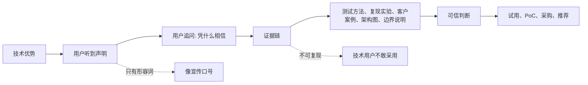
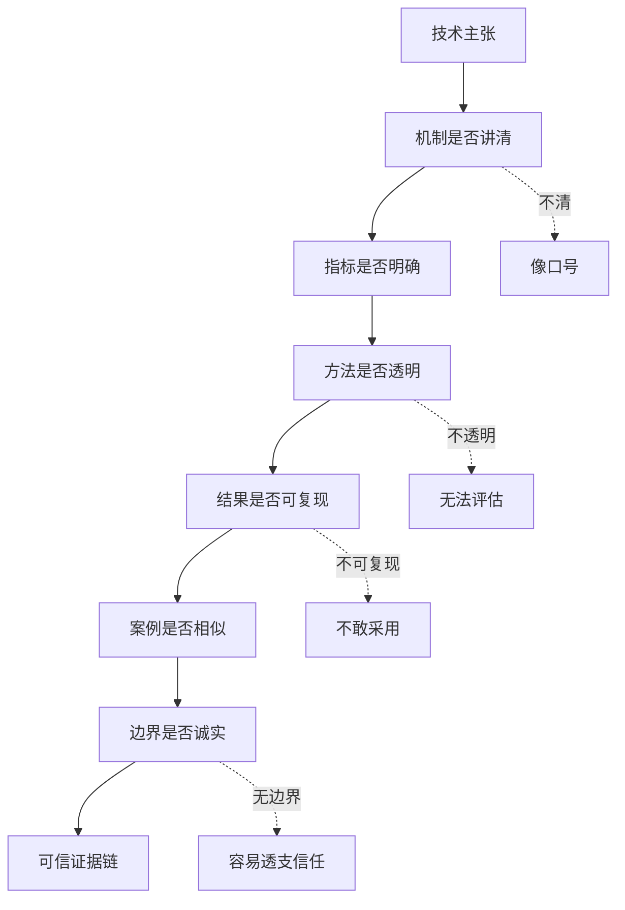

## 产品运营思维筑基课: 技术产品运营的特殊规律: 把技术优势变成可信证据
  
### 作者  
digoal  
  
### 日期  
2026-05-13
  
### 标签  
技术优势 , 可信证据 , 技术产品运营 , 品牌信任 , 证据链 , 性能指标 , 客户案例 , 技术传播 , 产品价值 , 特殊规律
  
----  
  
## 背景 

> 面向对象: 高中生、大学生、产品运营新人、技术产品市场与运营同学  
> 核心问题: 为什么技术产品说自己“性能强、架构先进、稳定可靠”，用户仍然不相信、不试用、不采购？  
> 先说结论: 技术优势只有被用户看见、理解、验证和比较，才会变成市场信任。技术产品运营不能只说“我们很强”，而要把技术优势转化为测试口径、复现实验、架构解释、客户案例、边界说明和第三方验证等可信证据。

## 一张图先看懂



可以用学习例子理解:

```text
一个同学说自己数学很强，这只是声明。
如果他能讲出解题过程，拿出考试记录，现场解一道题，
还说明自己不擅长哪类题，你才更容易相信。
```

技术产品也是这样:

```text
“性能提升 10 倍”不是证据。
测试环境、数据规模、查询类型、对比对象、复现脚本和适用边界，才构成证据。
```

## 求真讲法

### 它到底说了什么

“把技术优势变成可信证据”说的是:

技术产品的优势如果只停留在内部实现或宣传表达里，用户无法判断真假、强弱和适用范围。运营要把优势转化为外部可检查的证据。

技术优势和可信证据之间有明显区别:

| 技术优势声明 | 可信证据表达 |
|---|---|
| 性能很强 | 给出测试环境、数据规模、查询类型、对比版本和复现方法 |
| 架构先进 | 用架构图解释关键机制、取舍和适用边界 |
| 稳定可靠 | 给出 SLA、压测、故障恢复、备份恢复和生产案例 |
| 安全可信 | 给出权限模型、审计、加密、合规和威胁边界 |
| 开发者友好 | 给出 10 分钟 Demo、API 示例、错误排查和文档质量 |
| 生态完善 | 给出插件、集成、伙伴、社区贡献和真实使用路径 |

所以，技术产品运营要从形容词转向证据链:

```text
主张 -> 机制 -> 指标 -> 方法 -> 复现 -> 案例 -> 边界
```

### 它是怎么来的

这条规律来自技术产品的高不确定性。

普通消费品有时可以直接体验，比如一杯饮料好不好喝，一把椅子舒不舒服。但技术产品的很多价值是隐性的:

```text
高并发时是否稳定；
数据规模扩大后是否还能跑；
故障发生后能否恢复；
权限体系是否真的安全；
复杂场景下性能是否仍然好；
长期运维成本是否真的低。
```

用户无法只凭一句宣传语判断这些问题。他需要证据。

尤其是技术用户，他们通常会追问:

```text
怎么测的？
和谁比？
环境是什么？
数据量多大？
代码能不能看？
结果能不能复现？
哪些场景不适合？
真实客户怎么用？
```

如果运营不能回答这些问题，技术优势就很难变成信任。

### 它依赖哪些假设

这条规律依赖几个前提:

1. 技术产品的价值不完全可见，需要证据帮助判断。
2. 用户有采用风险，不会轻易相信自我声明。
3. 技术用户和企业客户会检查证据口径。
4. 不同场景下技术优势可能不同，不能泛化。
5. 可信证据能降低试用、采购和内部推荐风险。

如果产品是极低风险的小工具，用户可能不需要完整证据链。但只要产品进入生产系统、企业采购、数据安全、长期运维和组织决策，证据链就非常关键。

### 常见误解

**误解一: 技术优势越强，越不需要解释。**

不对。越强的技术主张，越需要解释和证据。用户不是因为你说得强就相信，而是因为证据经得起检查才相信。

**误解二: Benchmark 就是全部证据。**

不够。Benchmark 只是证据之一，还要看测试口径、业务场景、长期稳定性、边界条件、客户案例和可复现性。

**误解三: 只要客户案例够多，就能证明技术强。**

不一定。客户案例如果没有场景、规模、指标和过程，只能证明有人用过，不能证明技术优势在什么条件下成立。

**误解四: 说明边界会削弱销售力。**

相反，诚实边界会增强技术信任。技术用户知道任何系统都有边界。把边界讲清楚，反而说明团队专业、可信、可合作。

## 求存讲法

### 它有什么用

这条规律能帮助产品运营把“技术自信”转化为“市场信任”。

如果只讲技术优势，内容容易变成:

```text
新一代高性能云原生数据库，稳定可靠，安全可信，极致弹性。
```

如果讲可信证据，就要回答:

```text
高性能在哪些查询上体现？
云原生架构如何实现弹性？
稳定可靠如何被压测和生产验证？
安全可信有哪些权限和审计机制？
哪些场景适合，哪些场景不建议使用？
```

技术产品证据链可以分成六类:

| 证据类型 | 解决什么信任问题 |
|---|---|
| 原理证据 | 为什么这个技术优势可能成立 |
| 指标证据 | 结果到底好多少 |
| 方法证据 | 指标怎么测出来 |
| 复现证据 | 用户能不能自己验证 |
| 案例证据 | 是否在真实场景里成立 |
| 边界证据 | 哪些条件下不成立或不建议使用 |

### 它怎么迁移到熟悉领域

假设你想说服同学采用一种新的背单词方法。

低水平说法是:

```text
这个方法效率特别高。
```

可信证据说法是:

```text
我用它背四级词汇，每天 20 分钟，连续 14 天。
测试方式是每天复测前一天和三天前的单词。
原来 3 天后记住 40%，现在能记住 70%。
但它对短语和写作表达帮助有限，更适合先记单词意思。
```

这段话更可信，因为它有场景、方法、数据和边界。

技术产品也是一样。证据越具体，用户越容易判断是否适合自己。

### 它的适用范围和边界

这条规律特别适用于:

- 数据库、云服务、AI 平台、安全、监控、运维产品
- 开发者工具和开源项目
- 企业级 SaaS
- 需要技术影响力和品牌影响力的产品
- 高风险、高价格、长周期采购产品

它的边界是:

| 场景 | 证据要求 | 说明 |
|---|---:|---|
| 个人低风险工具 | 中 | Demo 和用户评价可能足够 |
| 开发者工具 | 高 | 文档、样例、代码、可复现很重要 |
| 企业 SaaS | 高 | 案例、ROI、安全、服务很重要 |
| 基础设施产品 | 极高 | 性能、稳定、恢复、边界都要证明 |
| 安全/金融/医疗产品 | 极高 | 合规、审计、责任边界必须清楚 |

需要注意: 证据不是越多越好，而是越贴近用户决策越好。证据堆得很厚但没有主线，也会增加认知负担。

### 正例: 怎么用它提升能力

假设你运营一个数据库产品，想证明“查询性能更强”。

低水平表达是:

```text
性能提升 10 倍，行业领先。
```

可信证据表达应包括:

1. 主张: 在高并发分析查询场景下，查询延迟明显降低。
2. 原理: 通过列式存储、向量化执行、并行调度减少扫描和计算开销。
3. 方法: 说明硬件配置、数据规模、查询类型、并发数、配置参数。
4. 对比: 对比同版本旧架构、开源基线或用户现有方案。
5. 结果: 给出 P50、P95、P99 延迟和资源消耗。
6. 复现: 提供测试脚本、数据生成方法和运行步骤。
7. 边界: 说明对短事务、强写入、高频小查询不一定有同等提升。
8. 案例: 展示一个真实客户如何在类似场景中获得收益。

这样，技术优势就从“口号”变成了可被评估的证据链。

### 反例: 前提不成立会怎样

反例一: 指标很强，但口径不清。

某产品宣传“性能提升 20 倍”，却没有说明测试环境、数据规模、查询类型、并发数和对比对象。技术用户无法判断这个数字是否适合自己的场景。

这里失败的前提是:

```text
技术指标必须有方法和口径，否则不能形成可信证据。
```

反例二: 只讲成功，不讲边界。

某 AI 平台展示了非常漂亮的问答 Demo，却没有说明文档质量、知识库规模、权限复杂度和人工兜底要求。客户上线复杂场景后效果下降，认为宣传夸大。

这里失败的前提是:

```text
可信证据必须包含适用条件和边界。
```

反例三: 案例真实，但不可复用。

某云产品展示了一个巨头客户案例，但该客户有专门团队、特殊定制和大量预算。目标中小客户无法判断自己是否也能获得类似效果。

这里失败的前提是:

```text
客户案例要有相似性和可复用路径，才是有效证据。
```

## 思考

“把技术优势变成可信证据”最重要的启发是: 技术产品运营不是把技术形容得更强，而是让用户能独立判断它为什么强、强在哪里、在什么条件下强。

可以用这张图检查一个技术主张是否足够可信:



对技术影响力来说，这条规律意味着:

```text
技术影响力不是官方说自己先进，
而是专业用户能看懂、能复现、能引用你的证据。
```

对品牌影响力来说，它意味着:

```text
品牌影响力不是长期重复“强”和“可靠”，
而是持续输出可被检验的证据，让用户形成稳定信任。
```

可以进一步追问:

1. 我们现在最常说的技术优势，有没有对应证据链？
2. 指标是否说明了测试口径和对比对象？
3. 用户能否自己复现或近似验证？
4. 客户案例是否足够相似、具体、可复用？
5. 我们是否诚实说明了不适合的场景？

## 最后记住

1. 技术优势不是市场信任，可信证据才是市场信任的入口。
2. 好证据链包括主张、机制、指标、方法、复现、案例和边界。
3. 技术产品越靠近生产系统，用户越需要可检查、可复现、可比较的证据。
4. 不讲边界的技术优势，容易变成夸大宣传并透支信任。
5. 技术影响力和品牌影响力，来自长期持续输出经得起专业用户检查的证据。

## 参考资料

- Geoffrey A. Moore, *Crossing the Chasm*, 1991.
- Robert B. Cialdini, *Influence: The Psychology of Persuasion*, 1984.
- Michael Spence, “Job Market Signaling”, 1973.
- Google SRE Book, *Site Reliability Engineering*, 2016.
- Philip Kotler and Kevin Lane Keller, *Marketing Management*, multiple editions.
- 本文基于技术产品运营、B2B 产品营销、开发者关系、SRE、性能测试和企业级采购支持中的通用经验整理；未使用实时联网资料。
  
#### [PostgreSQL 解决方案集合](../201706/20170601_02.md "40cff096e9ed7122c512b35d8561d9c8")
  
  
#### [德哥 / digoal's Github - 公益是一辈子的事.](https://github.com/digoal/blog/blob/master/README.md "22709685feb7cab07d30f30387f0a9ae")
  
  
#### [About 德哥](https://github.com/digoal/blog/blob/master/me/readme.md "a37735981e7704886ffd590565582dd0")
  
  

  
