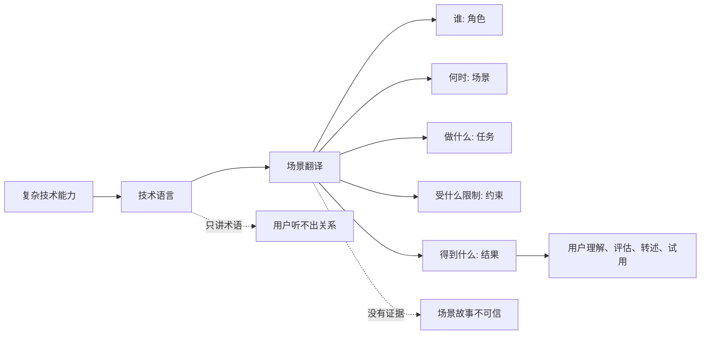
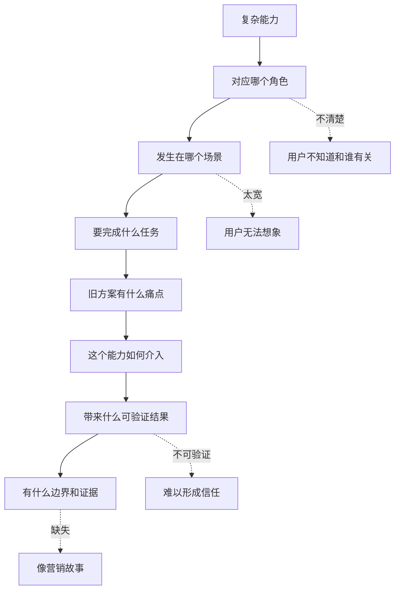

## 产品运营思维筑基课: 技术产品运营的特殊规律: 把复杂能力变成场景语言
  
### 作者  
digoal  
  
### 日期  
2026-05-13
  
### 标签  
复杂能力 , 场景语言 , 技术产品运营 , 用户理解 , 价值表达 , 产品翻译 , 场景化 , 技术传播 , 品牌影响力 , 特殊规律
  
----  
  
## 背景 

> 面向对象: 高中生、大学生、产品运营新人、技术产品市场与运营同学  
> 核心问题: 为什么技术产品功能很多、架构复杂、能力强大，但用户仍然听不懂、记不住、不会主动试用？  
> 先说结论: 复杂能力只有进入用户的具体场景，才会变成可理解的价值。技术产品运营要把“我们支持什么技术能力”，翻译成“谁在什么场景下，用它解决什么问题、降低什么成本、避免什么风险、得到什么结果”。

## 一张图先看懂



可以用一个学习例子理解:

```text
如果老师只说“这个方法运用了归纳、分类、迁移和反馈机制”，学生可能听不懂。
如果老师说“当你总在同一类题上错，用这个方法把错题按原因分组，每周复盘一次”，学生就知道怎么用。
```

技术产品也是这样:

```text
“支持多模态 RAG”是技术语言。
“客服可以同时检索产品手册、图片说明和历史工单，减少答非所问”才是场景语言。
```

## 求真讲法

### 它到底说了什么

“把复杂能力变成场景语言”说的是:

技术能力本身不是用户价值。用户价值发生在具体场景中: 某个角色遇到某个任务，在某些约束下，用产品获得了更好的结果。

复杂能力和场景语言之间的区别如下:

| 技术能力表达 | 场景语言表达 |
|---|---|
| 支持向量检索 | 员工不用记关键词，也能按语义找到内部文档 |
| 支持自动扩缩容 | 大促流量突然上来时，不用提前买大量闲置机器 |
| 支持可观测性 | 故障发生时，运维能从接口、服务、数据库链路快速定位问题 |
| 支持权限审计 | 安全团队能追踪谁在什么时候访问了哪些敏感数据 |
| 支持插件生态 | 开发团队可以接入现有 IDE、监控、BI 和工作流，不必重做工具链 |

场景语言通常包含六个要素:

```text
角色 -> 场景 -> 任务 -> 痛点 -> 产品能力 -> 可验证结果
```

例如:

```text
当企业客服团队处理售后问题时，
经常需要同时查产品手册、维修图片和历史工单。
如果知识库只能做关键词检索，客服容易找错资料。
多模态检索能把文字、图片和工单关联起来，
让客服更快找到相似问题和处理方案。
```

这段话没有回避技术，但先把技术放进了用户能理解的工作场景。

### 它是怎么来的

这条规律来自技术产品的理解鸿沟。

产品团队熟悉内部能力:

```text
向量索引、Serverless、HTAP、权限模型、多租户、可观测性、模型编排、冷热分层。
```

用户熟悉自己的工作场景:

```text
客服查不到正确答案；
大促前数据库扩容很焦虑；
故障定位要跨多个系统；
安全审查需要访问记录；
研发团队不想再维护一套额外系统。
```

如果运营只站在产品内部说话，用户要自己完成一次艰难翻译:

```text
这个技术词到底和我的工作有什么关系？
```

场景语言的作用，就是替用户完成这次翻译。

它和 Jobs To Be Done、定位理论、社会证明、损失厌恶都有关: 用户关心任务，心智需要清晰位置，决策需要证据，采用需要风险可控。场景语言把这些东西连接起来。

### 它依赖哪些假设

这条规律依赖几个前提:

1. 用户并不天然理解产品内部能力。
2. 用户更容易从熟悉场景理解价值。
3. 同一技术能力在不同角色和场景中价值不同。
4. 场景表达要有真实证据，否则会变成编故事。
5. 技术产品采用常常需要用户把价值转述给同事和组织。

如果产品极其简单，用户一看就知道用途，场景翻译的工作会少一些。但技术产品通常复杂、多角色、多约束，所以场景语言非常关键。

### 常见误解

**误解一: 场景语言就是讲故事。**

不够。场景语言不是编一个好听故事，而是把角色、任务、痛点、约束、能力和结果对应起来。没有证据的故事只是包装。

**误解二: 技术用户只想看参数，不需要场景。**

不对。技术用户也需要知道参数服务什么场景。开发者要知道 API 怎么解决任务，架构师要知道能力如何进入系统，CTO 要知道业务和风险结果。

**误解三: 一个能力只需要一个场景。**

不一定。同一能力可以服务多个场景，但运营要区分主场景和次场景，不能把所有场景平铺在一起。

**误解四: 场景表达会削弱技术专业性。**

不会。好的场景表达是专业性的入口。它先让用户理解问题，再引导用户查看机制、指标、架构和证据。

## 求存讲法

### 它有什么用

这条规律能帮助技术产品运营把“功能清单”变成“用户可判断的价值”。

如果只讲复杂能力，官网或文章可能长这样:

```text
支持向量检索、全文检索、结构化过滤、权限控制、多租户、实时同步、自动扩缩容和可观测性。
```

如果变成场景语言，可以写成:

```text
当企业把内部知识库接入大模型后，员工问一个问题，系统不仅要按语义找到相关文档，还要按部门权限过滤结果，并保证新文档能及时生效。
否则，大模型可能回答过期信息，甚至暴露不该看的内容。
```

这时，每个复杂能力都有了位置:

| 场景问题 | 对应能力 |
|---|---|
| 用户说法和文档关键词不一致 | 向量检索 |
| 专业词必须精确匹配 | 全文检索 |
| 只查某个产品线或时间范围 | 结构化过滤 |
| 不同部门权限不同 | 权限控制 |
| 文档经常更新 | 实时同步 |
| 查询量波动 | 自动扩缩容 |
| 出错要排查链路 | 可观测性 |

### 它怎么迁移到熟悉领域

假设你要推荐一个笔记软件。

技术式表达是:

```text
支持双链、标签、Markdown、云同步、模板、插件。
```

场景语言是:

```text
如果你复习时总是找不到以前写过的知识点，
可以用标签按科目归类，用双链把错题和知识点连起来，
考试前就能从一个题目跳到相关概念，而不是整本本子翻。
```

同样的功能，进入场景后才变得有意义。

技术产品运营也一样。不是少讲能力，而是先回答:

```text
这个能力在谁的哪件事里发挥作用？
```

### 它的适用范围和边界

这条规律特别适用于:

- 技术产品官网
- 产品发布文章
- 技术白皮书
- 客户案例
- 销售材料
- 开发者文档入口
- AI、数据库、云服务、安全、监控、运维产品

它的边界是:

| 场景 | 使用方式 | 注意点 |
|---|---|---|
| 专家技术评审 | 场景 + 深度证据 | 不能只讲场景，不给细节 |
| 官网首页 | 少数核心场景 | 不要列太多场景 |
| 客户案例 | 真实场景 | 必须有过程和结果 |
| 技术文档 | 操作场景 | 结合任务写示例 |
| 销售材料 | 角色场景 | CTO、开发者、采购关注不同 |
| 新品类教育 | 问题场景 | 先解释为什么这个场景需要新方法 |

场景语言也不能滥用。如果场景过于虚构、过宽、过理想化，用户会觉得不真实。好的场景必须来自真实用户问题。

### 正例: 怎么用它提升能力

假设你运营一个企业级可观测性平台。

低水平表达是:

```text
我们支持日志、指标、链路追踪、告警、拓扑分析和根因定位。
```

场景语言可以这样展开:

```text
当一次支付接口变慢时，业务同学只看到转化下降；
开发同学怀疑是代码问题；
运维同学看到 CPU 正常；
数据库同学发现某个查询 P99 延迟升高。

可观测性平台把接口链路、服务调用、数据库查询和告警放到同一张图里，
让团队从“互相猜”变成“沿着请求路径定位瓶颈”。
```

这个场景让复杂能力变得清楚:

| 能力 | 场景里的作用 |
|---|---|
| 日志 | 看具体错误和请求信息 |
| 指标 | 看延迟、吞吐、错误率变化 |
| 链路追踪 | 看请求经过哪些服务 |
| 拓扑分析 | 看系统依赖关系 |
| 告警 | 第一时间发现异常 |
| 根因定位 | 缩短排查路径 |

这类表达能同时服务技术影响力和销售转化，因为它让用户看见自己熟悉的问题。

### 反例: 前提不成立会怎样

反例一: 能力强，但场景缺失。

某数据平台宣传支持实时计算、离线数仓、湖仓一体、多引擎查询和统一元数据。用户看完觉得功能很多，但不知道应该从哪个业务问题开始试用。

这里失败的前提是:

```text
复杂能力如果没有场景入口，用户很难判断价值。
```

反例二: 场景太宽，无法行动。

某 AI 平台说自己适用于“企业数字化转型全场景”。这个说法太大，用户不知道具体是客服、销售、研发、财务、运营还是知识管理场景，也不知道第一步怎么做。

这里失败的前提是:

```text
场景必须具体到角色、任务和结果，不能只是大词。
```

反例三: 场景真实，但能力不匹配。

某产品用“降低客服压力”做场景，但实际只支持静态 FAQ 检索，不支持多轮对话、权限过滤、知识更新和人工兜底。客户试用后发现解决不了真实客服流程。

这里失败的前提是:

```text
场景语言必须由真实能力支撑，否则会透支信任。
```

## 思考

“把复杂能力变成场景语言”最重要的启发是: 产品运营不是把技术词换成通俗词，而是把能力放进真实任务结构里。

可以用这张图检查一个复杂能力是否完成了场景翻译:



对技术影响力来说，这条规律意味着:

```text
技术影响力不是展示一串高级能力，
而是让专业用户看到这些能力如何解决真实系统问题。
```

对品牌影响力来说，它意味着:

```text
品牌影响力不是用户记住你的技术词，
而是用户在某个具体场景中自然想起你。
```

可以进一步追问:

1. 我们最常说的复杂能力，对应哪个真实用户场景？
2. 这个场景里，用户角色、任务、约束和结果是否清楚？
3. 我们是否把多个场景混在一起，导致主线不清？
4. 场景表达是否有真实案例、数据或 Demo 支撑？
5. 用户能不能拿这段场景语言去说服同事？

## 最后记住

1. 复杂能力本身不是用户价值，进入场景后才变成可理解价值。
2. 场景语言要说明角色、场景、任务、痛点、能力和结果。
3. 技术用户也需要场景语言，只是还要继续看到机制、指标和证据。
4. 场景不能太大、太虚或脱离能力，否则会损害信任。
5. 技术影响力和品牌影响力，来自用户在具体场景中理解、验证并复述你的价值。

## 参考资料

- Clayton M. Christensen, Taddy Hall, Karen Dillon, David S. Duncan, “Know Your Customers' Jobs to Be Done”, Harvard Business Review, 2016.
- Al Ries and Jack Trout, *Positioning: The Battle for Your Mind*, 1981.
- Geoffrey A. Moore, *Crossing the Chasm*, 1991.
- Donald A. Norman, *The Design of Everyday Things*, revised edition, 2013.
- Chip Heath and Dan Heath, *Made to Stick*, 2007.
- 本文基于技术产品运营、Jobs To Be Done、产品定位、开发者关系、B2B 产品营销和企业级销售支持中的通用经验整理；未使用实时联网资料。
  
#### [PostgreSQL 解决方案集合](../201706/20170601_02.md "40cff096e9ed7122c512b35d8561d9c8")
  
  
#### [德哥 / digoal's Github - 公益是一辈子的事.](https://github.com/digoal/blog/blob/master/README.md "22709685feb7cab07d30f30387f0a9ae")
  
  
#### [About 德哥](https://github.com/digoal/blog/blob/master/me/readme.md "a37735981e7704886ffd590565582dd0")
  
  

  
