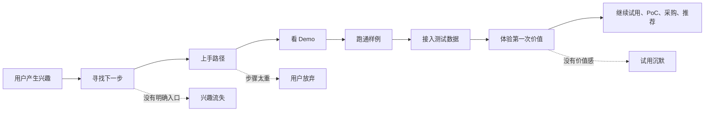
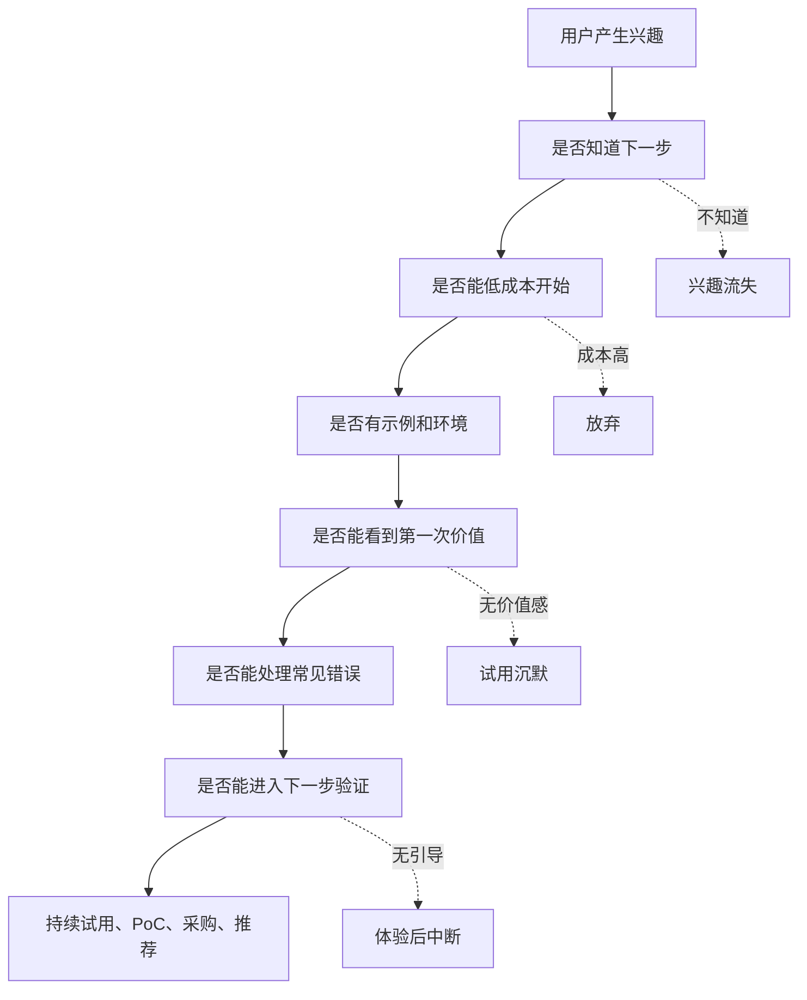

## 产品运营思维筑基课: 技术产品运营的特殊规律: 把用户兴趣变成上手路径
  
### 作者  
digoal  
  
### 日期  
2026-05-13
  
### 标签  
用户兴趣 , 上手路径 , 技术产品运营 , 试用转化 , 开发者体验 , 激活 , 产品引导 , 采用路径 , 用户教育 , 特殊规律
  
----  
  
## 背景 

> 面向对象: 高中生、大学生、产品运营新人、技术产品市场与运营同学  
> 核心问题: 为什么用户看完文章觉得产品不错，却没有注册、没有跑 Demo、没有试用，更没有进入采购？  
> 先说结论: 用户兴趣只是起点，不是转化。技术产品运营必须把“我觉得有点意思”接到一条清楚、低风险、可完成、能体验第一次价值的上手路径。否则兴趣会在文档、环境、数据、权限、组织沟通这些摩擦里流失。

## 一张图先看懂



可以用学习例子理解:

```text
你听说一种学习方法很有效，这只是兴趣。
如果没有模板、示例、第一天怎么做、做完怎么看效果，
你很可能收藏一下就结束。
```

技术产品也是这样:

```text
技术文章让用户感兴趣；
上手路径让用户真的开始。
```

## 求真讲法

### 它到底说了什么

“把用户兴趣变成上手路径”说的是:

技术产品运营不能停在吸引注意和制造兴趣，还要设计从兴趣到第一次价值的最短可行路径。

这里有两个关键概念:

| 概念 | 含义 | 技术产品例子 |
|---|---|---|
| 用户兴趣 | 用户觉得这个产品可能有用 | 收藏文章、点进官网、看 GitHub、参加直播 |
| 上手路径 | 用户从兴趣到体验价值的步骤 | 读文档、跑 Demo、调用 API、导入测试数据 |

技术产品的上手路径通常包括:

```text
入口清楚 -> 环境准备 -> 示例数据 -> 操作步骤 -> 成功反馈 -> 错误排查 -> 下一步引导
```

如果这条路径断掉，用户兴趣就会变成:

```text
看过、觉得不错、以后再说。
```

技术产品运营的任务，就是减少这个“以后再说”。

### 它是怎么来的

这条规律来自技术产品的上手摩擦。

普通产品有时可以立刻体验，比如点开一个视频、试穿一件衣服、喝一杯饮料。但技术产品常常需要用户跨过很多门槛:

1. 看懂概念。
2. 找到文档。
3. 注册账号。
4. 配置环境。
5. 申请权限。
6. 准备数据。
7. 跑通示例。
8. 处理报错。
9. 判断结果是否有价值。
10. 说服团队继续试。

每一步都可能让兴趣流失。

因此，技术产品运营不能只做“认知入口”，还要做“行动路径”。用户看到内容后，应该自然知道下一步:

```text
我应该看哪个 Demo？
用什么数据试？
10 分钟能看到什么结果？
如果报错怎么办？
试完后怎么进入 PoC？
```

### 它依赖哪些假设

这条规律依赖几个前提:

1. 用户兴趣会随着时间和摩擦快速衰减。
2. 技术产品的上手成本通常较高。
3. 用户需要在短时间内体验第一次价值。
4. 上手路径越清晰，用户越容易从兴趣进入试用。
5. 第一次价值体验会显著影响后续留存、推荐和采购。

如果产品非常简单，用户点开就能直接体验，上手路径可以很短。但对技术产品来说，即使产品能力很强，也需要认真设计上手路径。

### 常见误解

**误解一: 用户有兴趣就会自己研究。**

少数强动机用户会，但多数用户不会。用户还有其他工作、其他工具、其他选择。上手路径越不清楚，用户越容易离开。

**误解二: 文档存在就等于上手路径存在。**

不一定。文档可能很全，但不一定告诉新用户第一步做什么。上手路径强调“从零到第一次价值”的顺序。

**误解三: 上手路径只属于产品设计，不属于运营。**

不对。运营内容、官网入口、Demo、教程、社区答疑、活动后转化、销售材料，都影响上手路径。

**误解四: 只要免费试用，就能上手。**

不一定。免费试用如果没有示例、引导、成功反馈和排错说明，用户仍然可能不知道怎么开始。

## 求存讲法

### 它有什么用

这条规律能帮助技术产品运营把“内容兴趣”变成“产品行动”。

如果没有上手路径，一篇技术文章的结尾可能只是:

```text
欢迎了解我们的产品。
```

这太弱。用户不知道下一步做什么。

更好的上手路径应该是:

```text
如果你想验证这个能力:
1. 打开在线 Demo；
2. 使用示例数据跑一次；
3. 查看结果解释；
4. 复制代码到本地；
5. 遇到错误看排查表；
6. 想用真实数据时申请沙箱。
```

技术产品上手路径可以分层:

| 用户状态 | 合适路径 | 目标 |
|---|---|---|
| 刚感兴趣 | 动图、短视频、产品截图 | 看见效果 |
| 想理解 | 场景文章、架构图、FAQ | 理解原理和适用场景 |
| 想动手 | 在线 Demo、示例代码 | 体验第一次价值 |
| 想验证 | 沙箱、测试数据、Benchmark | 判断是否适合 |
| 想推动团队 | PoC 清单、汇报材料、案例 | 进入组织决策 |
| 想上线 | 迁移指南、监控、回滚、支持 | 降低生产风险 |

### 它怎么迁移到熟悉领域

假设你听说“错题复盘法”很有用。

只有兴趣时，你可能想:

```text
这个方法不错，周末有空再研究。
```

如果有人给你一条上手路径:

```text
今天只做三步:
1. 找出最近一次考试错的 5 道题；
2. 按“不会知识点、粗心、题意理解错”分三类；
3. 明天只复习其中最多的一类。
```

你就更容易开始。

技术产品也是这样。用户不是不想试，而是不知道如何用最小成本开始。

### 它的适用范围和边界

这条规律特别适用于:

- 开发者工具
- 开源项目
- API 平台
- 数据库、AI 平台、云服务、安全、监控、运维产品
- 技术内容转化
- 线上活动和 Webinar 后转化
- B2B 产品试用到 PoC 的路径设计

它的边界是:

| 场景 | 上手路径重点 | 注意点 |
|---|---|---|
| 开发者工具 | 代码样例、API、错误排查 | 要尽快跑通 |
| 企业 SaaS | 示例数据、团队协作、权限 | 不要一开始要求真实数据 |
| 基础设施产品 | 沙箱、测试环境、回滚 | 不能直接推生产迁移 |
| 开源项目 | README、Quickstart、Issue | 第一次体验决定社区印象 |
| 高风险产品 | PoC、灰度、支持 | 上手必须低风险 |

也要注意: 上手路径不能为了短而虚假。一个“5 分钟 Demo”如果只能展示玩具场景，不能帮助用户判断真实问题，后续仍然会断。

### 正例: 怎么用它提升能力

假设你运营一个面向开发者的 RAG 数据库产品。

低水平路径是:

```text
文章写完后放一个“联系我们”按钮。
```

这会浪费很多技术用户兴趣。

更好的路径是:

1. 文章结尾: “用 10 分钟验证混合检索效果”。
2. 在线 Demo: 已准备好示例文档和问题。
3. 成功反馈: 展示关键词检索、向量检索、混合检索的结果差异。
4. 本地样例: 提供 Docker Compose 和 20 行示例代码。
5. 排错指南: 常见环境、依赖、权限、Embedding 错误。
6. 真实验证: 引导用户上传自己的小样本数据。
7. PoC 下一步: 提供评估指标、权限检查和部署建议。

这条路径把兴趣转成行动:

```text
看懂问题 -> 看见效果 -> 跑通样例 -> 验证自己数据 -> 推动团队评估
```

### 反例: 前提不成立会怎样

反例一: 内容很好，但没有下一步。

某数据库团队写了一篇非常好的性能优化文章，阅读量高、收藏多。但文章没有链接到 Demo、测试脚本、文档或相关产品能力页。用户看完后觉得专业，却没有进入试用。

这里失败的前提是:

```text
用户兴趣如果没有行动入口，很容易停留在认知层。
```

反例二: 上手路径太重。

某 AI 平台要求用户注册、申请审批、创建组织、配置密钥、上传真实数据，才能看到第一个结果。很多用户在体验价值前就离开。

这里失败的前提是:

```text
技术产品上手路径必须尽量减少第一次价值前的摩擦。
```

反例三: Demo 跑通，但没有下一步。

某产品提供了很好的一键 Demo，用户跑通后觉得有趣，但不知道如何用自己的数据验证，也不知道如何进入 PoC 或联系技术支持。兴趣没有继续深化。

这里失败的前提是:

```text
上手路径不是只到第一次体验，还要引导下一步承诺。
```

## 思考

“把用户兴趣变成上手路径”最重要的启发是: 技术影响力不能停在“用户觉得你专业”，还要让用户顺手走向“我能试一下”。

可以用这张图检查一个技术产品的上手路径:



对技术影响力来说，这条规律意味着:

```text
技术影响力不是让用户看完说“厉害”，
而是让用户看完后能立刻用低风险方式验证你的价值。
```

对品牌影响力来说，它意味着:

```text
品牌影响力不是用户听过你，
而是用户第一次接触后能顺利完成一个可信的小成功。
```

可以进一步追问:

1. 用户看完我们的内容后，下一步是否明确？
2. 从兴趣到第一次价值，需要几步、多久、哪些前置条件？
3. 哪些环境、数据、权限、注册、销售流程正在阻断用户？
4. Demo 成功后，用户是否知道如何用自己的场景继续验证？
5. 我们有没有把活动、文章、文档、产品和销售路径接起来？

## 最后记住

1. 用户兴趣不是转化，只有进入行动路径才可能变成采用。
2. 技术产品上手路径要让用户尽快体验第一次价值。
3. 文档存在不等于路径清楚，路径必须从零开始按顺序引导。
4. 低风险上手包括 Demo、示例数据、沙箱、排错、PoC 下一步。
5. 技术影响力和品牌影响力，要通过一次顺畅的小成功被用户亲自验证。

## 参考资料

- Dave McClure, Startup Metrics for Pirates: AARRR, 2007.
- Eric Ries, *The Lean Startup*, 2011.
- BJ Fogg, *Tiny Habits*, 2019.
- Geoffrey A. Moore, *Crossing the Chasm*, 1991.
- Donald A. Norman, *The Design of Everyday Things*, revised edition, 2013.
- 本文基于 AARRR、用户激活、开发者体验、技术产品运营、B2B 产品营销和企业级 PoC 实践中的通用经验整理；未使用实时联网资料。
  
#### [PostgreSQL 解决方案集合](../201706/20170601_02.md "40cff096e9ed7122c512b35d8561d9c8")
  
  
#### [德哥 / digoal's Github - 公益是一辈子的事.](https://github.com/digoal/blog/blob/master/README.md "22709685feb7cab07d30f30387f0a9ae")
  
  
#### [About 德哥](https://github.com/digoal/blog/blob/master/me/readme.md "a37735981e7704886ffd590565582dd0")
  
  

  
