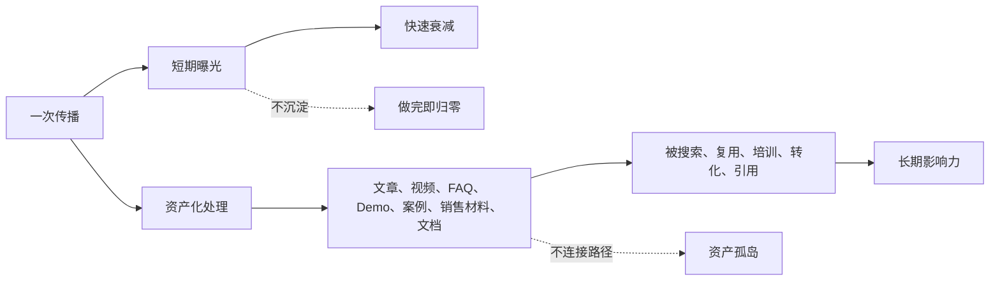
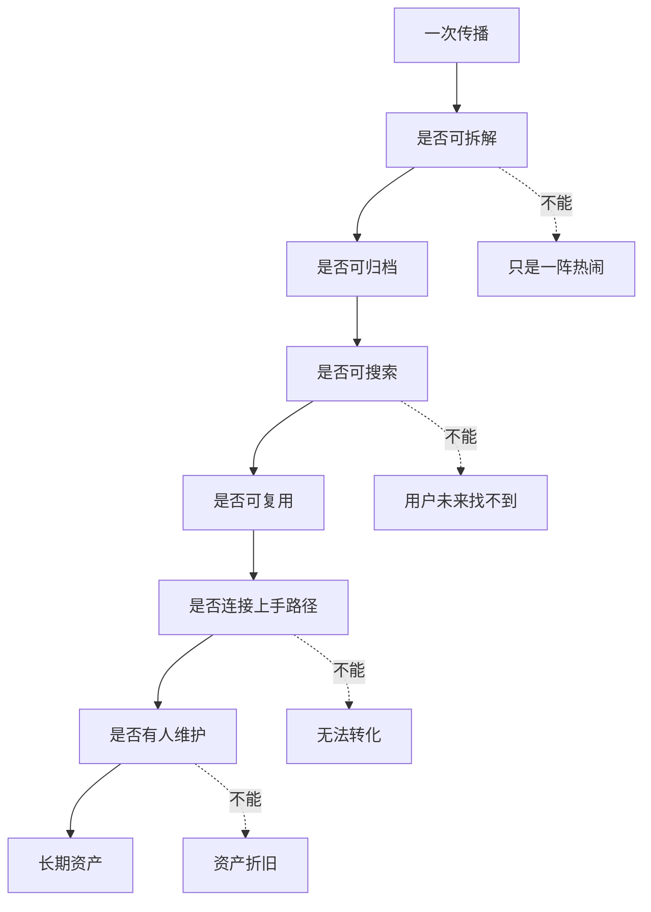

## 产品运营思维筑基课: 技术产品运营的特殊规律: 把一次传播变成长期资产
  
### 作者  
digoal  
  
### 日期  
2026-05-13
  
### 标签  
一次传播 , 长期资产 , 技术产品运营 , 内容资产 , 社区资产 , 品牌复利 , 知识沉淀 , 影响力增长 , 运营体系 , 特殊规律
  
----  
  
## 背景 

> 面向对象: 高中生、大学生、产品运营新人、技术产品市场与运营同学  
> 核心问题: 为什么很多产品运营动作当时很热闹，几天后却什么也没留下？  
> 先说结论: 一次传播如果只追求当下曝光，很快会衰减；如果被拆解、沉淀、复用和连接到用户路径，就能变成长期资产。技术产品运营要把文章、直播、发布会、客户答疑、PoC 和案例，转化为可搜索、可复用、可验证、可销售支持、可社区沉淀的资产。

## 一张图先看懂



可以用学习例子理解:

```text
听一场好课，如果听完就结束，几天后会忘掉很多。
如果你整理笔记、做错题、画思维导图、讲给同学听，
这场课就变成了以后还能反复使用的学习资产。
```

技术产品运营也是这样:

```text
一场发布会不是结束点。
它应该变成技术文章、演讲视频、FAQ、Demo、客户案例、销售话术和社区讨论。
```

## 求真讲法

### 它到底说了什么

“把一次传播变成长期资产”说的是:

产品运营的传播动作不应该只追求一次性流量，而应该尽量留下可以长期复用的资产。

一次传播和长期资产的区别如下:

| 一次传播 | 长期资产 |
|---|---|
| 当天热度高 | 半年后仍能被搜索 |
| 只服务一次活动 | 能被销售、客户成功、社区反复使用 |
| 内容散落 | 被整理进文档、知识库和案例库 |
| 看完即结束 | 能引导 Demo、试用、PoC 和采购 |
| 依赖当时流量 | 能持续降低理解、信任和上手成本 |

技术产品尤其需要资产化，因为用户决策周期长。一个用户今天看到文章，可能三个月后才试用，半年后才采购。如果传播内容没有沉淀，他就很难再次找到证据和路径。

### 它是怎么来的

这条规律来自技术产品运营的时间结构。

技术产品很少靠一次冲动完成采用。用户通常要经历:

```text
知道问题 -> 理解方案 -> 相信证据 -> 跑通 Demo -> 做 PoC -> 内部评估 -> 采购 -> 上线 -> 扩大使用
```

这条路径可能持续几周、几个月，甚至更久。

所以，一次传播如果只在当天产生阅读和转发，很难支撑完整决策。它必须被沉淀为长期资产，持续服务不同阶段的用户。

例如，一场技术直播可以被拆成:

```text
完整回放；
三篇技术文章；
一份 FAQ；
一个可运行 Demo；
一张架构图；
一份销售一页纸；
一组社群答疑；
一个文档章节；
一个后续 Webinar 选题。
```

这就是从“传播事件”变成“运营资产”。

### 它依赖哪些假设

这条规律依赖几个前提:

1. 用户决策不是即时完成，而是分阶段推进。
2. 传播内容可以被拆解、整理和复用。
3. 用户会在未来搜索、回看、转述或内部分享。
4. 销售、售前、客户成功、社区也需要可复用材料。
5. 技术产品的知识和证据具有长期价值。

如果产品是强热点、短生命周期、低风险冲动消费，长期资产价值会弱一些。但技术产品通常复杂、长周期、高风险，资产化价值很高。

### 常见误解

**误解一: 传播效果只看当天阅读量。**

不对。当天阅读量只是短期指标。技术产品更要看内容是否长期带来搜索、试用、客户提问、销售复用和社区引用。

**误解二: 把视频上传回放就算资产化。**

不够。很多用户不会看完整回放。还要拆成摘要、章节、图示、FAQ、代码样例、文档和下一步路径。

**误解三: 所有传播都值得资产化。**

不一定。低质量、低相关、临时热点内容不一定值得投入大量沉淀。资产化要优先选择能长期服务用户任务和决策的内容。

**误解四: 资产化只是内容团队的事。**

不对。资产化需要产品、技术、销售、售前、客户成功和社区一起参与。否则内容可能好看，却不能真正支持试用和采购。

## 求存讲法

### 它有什么用

这条规律能帮助技术产品运营从“活动驱动”转向“资产驱动”。

如果不资产化，一次传播的生命周期很短:

```text
发出 -> 阅读 -> 转发 -> 热度下降 -> 被遗忘
```

如果资产化，它会进入更长路径:

```text
发出 -> 拆解 -> 归档 -> 搜索 -> 引用 -> 复用 -> 转化 -> 反馈 -> 更新
```

常见传播动作可以这样资产化:

| 一次传播动作 | 可沉淀长期资产 |
|---|---|
| 技术文章 | 专题页、FAQ、销售材料、文档入口 |
| 直播/Webinar | 回放、图文稿、问答集、Demo、剪辑短片 |
| 产品发布会 | 发布说明、迁移指南、对比表、路线图说明 |
| 客户答疑 | FAQ、排错手册、最佳实践、文档补充 |
| PoC 项目 | 行业案例、检查清单、评估模板 |
| 社区讨论 | 知识库、Issue、路线图输入、内容选题 |
| Benchmark | 测试脚本、方法说明、可复现实验 |

### 它怎么迁移到熟悉领域

假设你参加一次数学竞赛讲座。

低资产化做法:

```text
听完讲座，觉得很有用，然后结束。
```

高资产化做法:

```text
整理讲义；
提炼三类题型；
把例题改成练习题；
记录老师回答的问题；
做成复习清单；
讲给同学听；
下次遇到类似题直接复用。
```

同一场讲座，结果完全不同。

技术产品运营也是一样。一场客户答疑如果只解决了当天问题，价值有限；如果沉淀成 FAQ、排错手册和产品改进建议，就能服务更多用户。

### 它的适用范围和边界

这条规律特别适用于:

- 技术内容运营
- 产品发布
- Webinar 和技术直播
- 开发者社区运营
- 客户案例和 PoC
- 文档、FAQ、Demo、知识库建设
- 技术影响力和品牌影响力建设

它的边界是:

| 场景 | 资产化价值 | 注意点 |
|---|---:|---|
| 技术深度内容 | 高 | 要可搜索、可引用、可更新 |
| 产品发布 | 高 | 要连接文档、Demo、销售材料 |
| 热点评论 | 中 | 只有长期相关才值得深度沉淀 |
| 客户答疑 | 高 | 要脱敏、归类、进入知识库 |
| 一次性促销 | 中到低 | 可能只需复盘，不必重资产化 |
| 合规/安全说明 | 高 | 要维护版本和准确性 |

还要注意: 资产会折旧。技术文档、案例、Benchmark、截图、价格、API 都可能过期。长期资产必须有人维护，否则会变成错误信息源。

### 正例: 怎么用它提升能力

假设你运营一个数据库产品，举办了一场主题为“从 PostgreSQL 迁移到云原生数据库”的直播。

低水平做法是:

```text
直播当天宣传，结束后上传回放。
```

资产化做法是:

1. 回放切片: 按“兼容性、数据迁移、性能验证、回滚方案”拆成短视频。
2. 图文文章: 把核心内容整理成迁移方法论。
3. FAQ: 把直播问题整理成迁移常见问题。
4. 检查清单: 做成迁移前评估表。
5. Demo: 提供一个小型迁移示例。
6. 销售材料: 做成售前可用的一页纸。
7. 文档补充: 把关键步骤更新到官方文档。
8. 案例线索: 邀请参与直播的用户做 PoC。
9. 后续选题: 根据高频问题安排下一场活动。

这样，一场直播不只是一次传播，而是一组长期资产。

### 反例: 前提不成立会怎样

反例一: 活动很热闹，但没有沉淀。

某技术产品办了一场发布会，现场观看人数很多。结束后没有整理文档、FAQ、Demo、产品页和销售材料。一个月后销售仍然要从零解释新功能。

这里失败的前提是:

```text
一次传播如果不沉淀，就无法持续降低理解和转化成本。
```

反例二: 资产沉淀了，但没有连接路径。

某团队整理了大量文章和视频，但没有放到官网、文档、产品页、试用路径和销售流程里。用户找不到，销售也不用。

这里失败的前提是:

```text
长期资产必须连接用户路径，否则会变成资料仓库。
```

反例三: 资产过期无人维护。

某产品的迁移指南长期排名很高，但内容对应旧版本，命令已经失效。新用户照着操作报错，反而降低信任。

这里失败的前提是:

```text
长期资产需要维护，否则会从信任资产变成风险资产。
```

## 思考

“把一次传播变成长期资产”最重要的启发是: 技术产品运营的每一次对外动作，都应该尽量留下能服务未来用户的东西。

可以用这张图检查一次传播是否完成资产化:



对技术影响力来说，这条规律意味着:

```text
技术影响力不是一次演讲或一篇文章的热度，
而是这些内容能长期被搜索、引用、复用和验证。
```

对品牌影响力来说，它意味着:

```text
品牌影响力不是一次刷屏，
而是用户在不同时间反复遇到一致、可信、可用的资产。
```

可以进一步追问:

1. 最近一次传播动作留下了什么可复用资产？
2. 用户三个月后还能找到这次传播的核心内容吗？
3. 销售、售前、客户成功和社区能否复用它？
4. 它是否连接到 Demo、文档、试用、PoC 或采购路径？
5. 谁负责维护这些资产不过期？

## 最后记住

1. 一次传播会衰减，长期资产会复用。
2. 技术产品运营要把文章、直播、发布会、答疑和 PoC 沉淀成文档、FAQ、Demo、案例和销售材料。
3. 资产化不是简单归档，而是拆解、连接路径、持续维护。
4. 不连接用户路径的资产只是资料仓库，不维护的资产会折旧。
5. 技术影响力和品牌影响力，来自长期可搜索、可引用、可验证、可转化的资产网络。

## 参考资料

- Joe Pulizzi, *Epic Content Marketing*, 2013.
- Geoffrey A. Moore, *Crossing the Chasm*, 1991.
- David A. Aaker, *Managing Brand Equity*, 1991.
- Eric Ries, *The Lean Startup*, 2011.
- Philip Kotler and Kevin Lane Keller, *Marketing Management*, multiple editions.
- 本文基于技术产品运营、内容资产化、开发者关系、B2B 产品营销、销售支持和社区知识库建设中的通用经验整理；未使用实时联网资料。
  
#### [PostgreSQL 解决方案集合](../201706/20170601_02.md "40cff096e9ed7122c512b35d8561d9c8")
  
  
#### [德哥 / digoal's Github - 公益是一辈子的事.](https://github.com/digoal/blog/blob/master/README.md "22709685feb7cab07d30f30387f0a9ae")
  
  
#### [About 德哥](https://github.com/digoal/blog/blob/master/me/readme.md "a37735981e7704886ffd590565582dd0")
  
  

  
