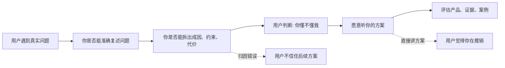
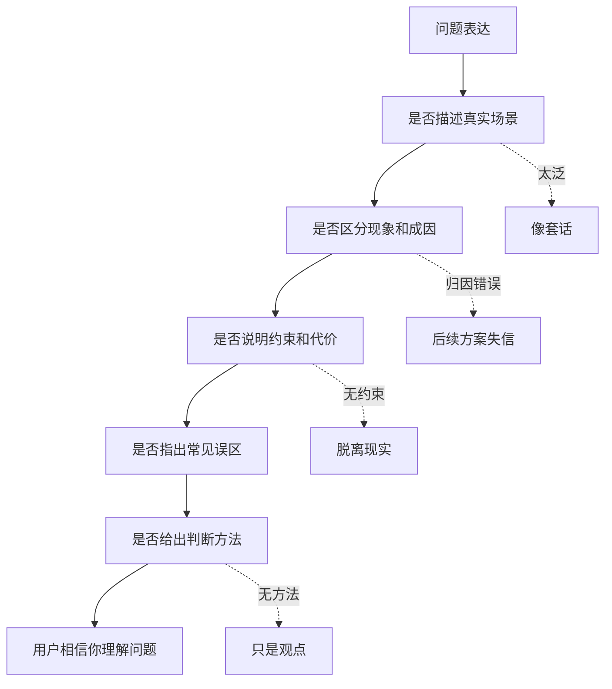

## 产品运营思维筑基课: 面向技术影响力的运营公理: 证明你懂问题
  
### 作者  
digoal  
  
### 日期  
2026-05-13
  
### 标签  
技术影响力 , 懂问题 , 产品运营 , 用户痛点 , 问题定义 , 技术传播 , 专业可信 , 场景洞察 , 品牌影响力 , 运营公理
  
----  
  
## 背景 

> 面向对象: 高中生、大学生、产品运营新人、技术产品市场与运营同学  
> 核心问题: 为什么技术产品一上来讲方案、讲架构、讲性能，用户却不一定愿意继续听？  
> 先说结论: 技术影响力的第一步，不是证明你产品强，而是证明你真的懂用户遇到的问题。用户只有先相信你理解问题的真实成因、复杂约束和失败边界，才会愿意继续相信你的技术方案。

## 一张图先看懂



可以用看医生来理解:

```text
一个医生还没问清症状、诱因、病史和禁忌，就直接推药，
病人很难放心。

一个技术产品也是这样:
如果你还没说清用户为什么痛、卡在哪里、旧办法为什么失效，
用户很难相信你的方案正好适合他。
```

## 求真讲法

### 它到底说了什么

“证明你懂问题”说的是:

技术产品要建立影响力，首先要让目标用户感到:

```text
你知道我在什么场景下遇到问题；
你知道这个问题为什么难；
你知道旧方案为什么不够；
你知道真实落地有哪些约束；
你知道我担心什么风险；
你不是只拿产品卖点往我身上套。
```

这一步是技术影响力的入口。因为技术用户通常不会只被口号打动，他们会先判断你的问题理解是否专业。

问题理解可以拆成几层:

| 层次 | 要回答什么 | 技术产品例子 |
|---|---|---|
| 现象层 | 用户看见了什么问题 | 查询变慢、告警太多、AI 回答不准 |
| 成因层 | 为什么会发生 | 索引失效、链路分散、检索质量低 |
| 约束层 | 为什么不能简单解决 | 不能停机、权限复杂、成本有限 |
| 代价层 | 不解决会怎样 | 故障时间长、客服效率低、数据风险 |
| 误区层 | 常见错误归因是什么 | 以为换模型就能解决 RAG 答非所问 |
| 判断层 | 什么证据说明问题被理解 | 架构图、案例、数据、复盘、检查清单 |

### 它是怎么来的

这条公理来自技术产品的信任结构。

用户评估技术产品时，通常不会直接跳到“买不买”。他会先判断:

```text
这个团队是不是懂我的问题？
这个团队是不是只会讲产品卖点？
这个团队有没有踩过真实场景里的坑？
这个团队说的方案是不是基于正确诊断？
```

如果问题诊断不准，后面的技术优势越多，用户越怀疑。

例如，一个企业知识库问答系统答非所问。低水平运营会直接说:

```text
我们有更强的大模型。
```

但懂问题的表达会说:

```text
企业知识库答非所问，常常不只是模型能力问题。
更常见的原因是文档切分不合理、关键词和语义检索没有结合、权限过滤和召回排序脱节、知识更新滞后。
```

用户会感到: 这个团队至少知道问题复杂在哪里。

### 它依赖哪些假设

这条公理依赖几个前提:

1. 用户面对的是复杂问题，不是简单购买需求。
2. 用户会根据问题诊断质量判断方案可信度。
3. 技术产品的价值必须和真实问题对应。
4. 目标用户能识别浅层解释和真实理解的差别。
5. 运营内容可以通过结构化分析证明问题理解。

如果产品非常简单，用户可能不需要深度问题诊断。但技术产品通常涉及系统、流程、数据、团队和风险，因此“懂问题”非常关键。

### 常见误解

**误解一: 证明你懂问题就是多写痛点。**

不够。痛点罗列很容易空泛。真正懂问题，要讲出现象、成因、约束、代价、误区和判断方法。

**误解二: 用户已经知道自己的问题，不需要你解释。**

不一定。用户知道现象，但未必知道根因。好的技术运营能帮助用户把模糊痛感变成清晰诊断。

**误解三: 讲问题会削弱产品宣传。**

相反，讲清问题会让产品价值更可信。用户先认同诊断，才更容易认真看方案。

**误解四: 懂问题就等于批评旧方案。**

不对。旧方案往往在过去条件下合理。专业表达要说明旧方案为什么曾经有效、为什么现在不够，而不是简单否定。

## 求存讲法

### 它有什么用

这条公理能帮助技术产品运营从“推产品”转向“建立专业信任”。

如果没有问题证明，内容容易这样写:

```text
我们发布新一代高性能智能数据库，支持向量检索、自动扩缩容和企业级安全。
```

如果先证明你懂问题，可以这样写:

```text
企业接入大模型后，知识库最先卡住的往往不是模型，而是检索链路。
文档切分、召回策略、权限过滤、实时更新和答案溯源，任何一环处理不好，都会让回答看起来像模型不聪明。
```

这时用户会更愿意继续读:

```text
那你们怎么解决？
```

技术产品运营可以用这些资产证明懂问题:

| 资产类型 | 证明什么 |
|---|---|
| 问题拆解文章 | 你能分清现象和根因 |
| 架构挑战图 | 你知道系统难点在哪里 |
| 故障复盘 | 你经历过真实复杂性 |
| 选型指南 | 你知道不同方案的取舍 |
| 检查清单 | 你能帮助用户自我诊断 |
| 反例分析 | 你知道常见误区和失败边界 |

### 它怎么迁移到熟悉领域

假设你数学总考不好。

一个同学直接说:

```text
你买我的刷题资料吧，很有效。
```

你不一定信。

另一个同学先说:

```text
你不是题刷得少，而是每次错题都混在一起。
有些是概念不会，有些是计算粗心，有些是题意没读懂。
如果不先分类，你刷再多题也会重复错。
```

你会更愿意听他后面的建议，因为他先证明了自己懂问题。

技术产品也是一样。先帮用户看清问题，再谈方案，可信度会高得多。

### 它的适用范围和边界

这条公理特别适用于:

- 技术影响力内容
- 产品白皮书
- 行业解决方案
- 技术博客
- 客户案例
- 开发者教育
- 数据库、AI、云服务、安全、监控、运维产品

它的边界是:

| 场景 | 使用方式 | 注意点 |
|---|---|---|
| 首页短文案 | 简洁指出关键问题 | 不要写成长论文 |
| 技术深度文章 | 深拆成因和约束 | 必须有证据 |
| 销售材料 | 对齐客户场景问题 | 避免泛化痛点 |
| 客户案例 | 从原始问题开始 | 不要只写结果 |
| 新品类教育 | 先解释为什么旧认知不够 | 避免制造伪问题 |

也要注意: 不要为了显示懂问题而夸大焦虑。技术产品运营应该帮助用户准确诊断，而不是制造恐慌。

### 正例: 怎么用它提升能力

假设你运营一个可观测性平台。

低水平表达是:

```text
我们提供日志、指标、链路追踪和智能告警。
```

证明你懂问题的表达是:

```text
微服务系统排障慢，通常不是因为没有数据，而是因为数据分散。
日志能看到错误细节，指标能看到趋势，链路能看到请求路径，但如果三者没有按同一次请求、同一个服务和同一个时间窗口关联起来，团队仍然只能靠猜。
```

然后再引出产品能力:

```text
所以，可观测性平台的关键不是多收集数据，而是把数据变成可追踪的因果链。
```

这类表达让用户先相信你理解真实排障难点，再继续评估你的产品。

### 反例: 前提不成立会怎样

反例一: 问题归因太浅。

某 RAG 产品宣传“企业知识库回答不准，是因为模型不够强”。但目标客户知道，很多问题来自文档质量、权限过滤、检索召回和更新机制。用户会觉得厂商不懂真实落地。

这里失败的前提是:

```text
技术用户会根据问题归因判断你是否专业。
```

反例二: 痛点太泛。

某云服务文章开头写“企业数字化转型面临效率低、成本高、安全难、创新慢”。这些话都对，但太泛，用户看不出作者是否懂自己的具体问题。

这里失败的前提是:

```text
证明你懂问题，需要具体到场景、角色、约束和成因。
```

反例三: 只批评旧方案，不讲历史合理性。

某产品说“传统数据库已经落后，必须全面替换”。但很多企业旧数据库稳定运行多年，替换风险很高。用户会觉得厂商不尊重现实约束。

这里失败的前提是:

```text
懂问题也包括懂旧方案为什么曾经合理，以及为什么现在出现边界。
```

## 思考

“证明你懂问题”最重要的启发是: 技术影响力不是从展示方案开始，而是从准确诊断开始。

可以用这张图检查一篇技术影响力内容是否证明你懂问题:



对技术影响力来说，这条公理意味着:

```text
技术影响力不是先让用户相信你有答案，
而是先让用户相信你问对了问题、拆对了原因、看见了约束。
```

对品牌影响力来说，它意味着:

```text
品牌不是反复说自己专业，
而是让用户在你的内容里反复感到“这个团队真的懂我们的问题”。
```

可以进一步追问:

1. 我们的内容是否先证明了懂问题，还是直接推产品？
2. 我们有没有把现象误当成根因？
3. 我们是否说清了旧方案为什么曾经有效、现在为什么不够？
4. 我们有没有提供用户可自查的问题诊断方法？
5. 目标用户看完后，会不会觉得“这说的就是我的情况”？

## 最后记住

1. 技术影响力的第一步，是证明你懂问题，而不是急着证明产品强。
2. 懂问题要讲清现象、成因、约束、代价、误区和判断方法。
3. 用户先相信你的诊断，才会认真听你的方案。
4. 泛泛痛点和错误归因会直接削弱技术信任。
5. 好运营要让用户感到: 这个团队不仅有产品，而且真的理解我的复杂处境。

## 参考资料

- Clayton M. Christensen, Taddy Hall, Karen Dillon, David S. Duncan, “Know Your Customers' Jobs to Be Done”, Harvard Business Review, 2016.
- Geoffrey A. Moore, *Crossing the Chasm*, 1991.
- Donald A. Norman, *The Design of Everyday Things*, revised edition, 2013.
- Robert B. Cialdini, *Influence: The Psychology of Persuasion*, 1984.
- Chip Heath and Dan Heath, *Made to Stick*, 2007.
- 本文基于技术产品运营、Jobs To Be Done、问题诊断、开发者关系、B2B 产品营销和企业级销售支持中的通用经验整理；未使用实时联网资料。
  
#### [PostgreSQL 解决方案集合](../201706/20170601_02.md "40cff096e9ed7122c512b35d8561d9c8")
  
  
#### [德哥 / digoal's Github - 公益是一辈子的事.](https://github.com/digoal/blog/blob/master/README.md "22709685feb7cab07d30f30387f0a9ae")
  
  
#### [About 德哥](https://github.com/digoal/blog/blob/master/me/readme.md "a37735981e7704886ffd590565582dd0")
  
  

  
