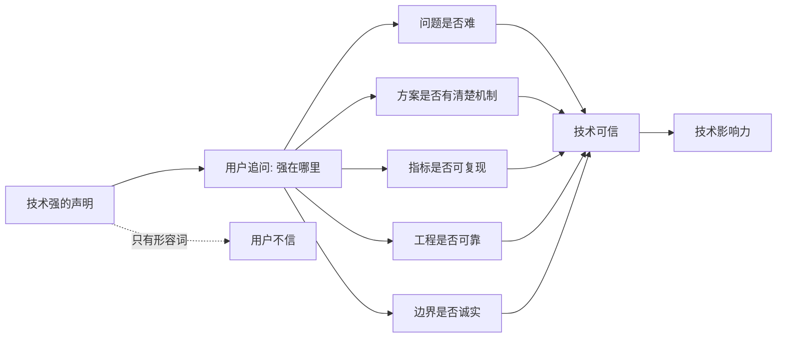
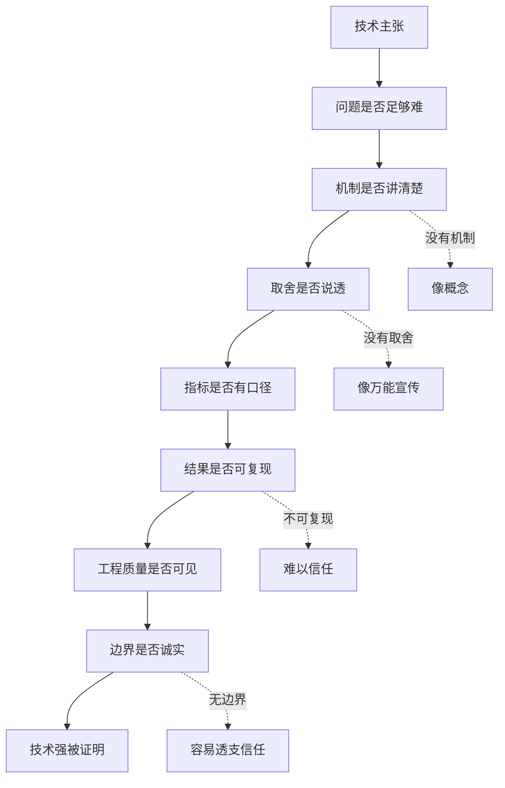

## 产品运营思维筑基课: 面向技术影响力的运营公理: 证明你技术强
  
### 作者  
digoal  
  
### 日期  
2026-05-13
  
### 标签  
技术影响力 , 技术强 , 产品运营 , 技术证据 , 架构能力 , 性能表现 , 专业认可 , 技术品牌 , 可信证明 , 运营公理
  
----  
  
## 背景 

> 面向对象: 高中生、大学生、产品运营新人、技术产品市场与运营同学  
> 核心问题: 为什么技术产品反复说自己“领先、先进、强大”，技术用户却不一定认可？  
> 先说结论: 技术强不是靠形容词证明的，而是靠问题难度、关键取舍、实现机制、可复现指标、工程质量和诚实边界证明的。面向技术影响力的运营，必须把“我们技术强”变成专业用户能检查、讨论、复现和引用的证据。

## 一张图先看懂



可以用考试类比理解:

```text
一个同学说自己数学强，不够。
他要能说明难题难在哪里、为什么这样解、步骤能不能复查、换一种题型是否还适用。
```

技术产品也是这样:

```text
“架构先进”不够。
要说明它解决了什么难题、做了什么取舍、指标如何测、什么场景下成立、什么场景下不成立。
```

## 求真讲法

### 它到底说了什么

“证明你技术强”说的是:

技术影响力不是让外行觉得你很厉害，而是让专业用户相信你的技术判断、工程能力和实现结果经得起检查。

技术强通常包含几层:

| 层次 | 用户在判断什么 | 常见证据 |
|---|---|---|
| 问题难度 | 你解决的问题是否真的难 | 场景复杂性、旧方案瓶颈、约束条件 |
| 技术机制 | 你为什么能解决 | 架构图、算法原理、工程设计 |
| 关键取舍 | 你知道牺牲和边界吗 | 性能/一致性/成本/易用性的取舍说明 |
| 结果指标 | 结果是否真的更好 | Benchmark、压测、延迟、吞吐、准确率 |
| 可复现性 | 用户能否验证 | 测试脚本、环境说明、示例数据 |
| 工程质量 | 能否长期稳定运行 | 监控、恢复、兼容、版本、测试体系 |
| 诚实边界 | 是否知道不适用场景 | 限制说明、失败案例、替代建议 |

所以，技术强不是一句:

```text
我们采用先进架构，性能行业领先。
```

而应该变成:

```text
在什么复杂场景下，旧方案为什么不够；
我们用了什么机制解决；
做了哪些取舍；
结果如何测量；
用户如何复现；
哪些场景不要这样用。
```

### 它是怎么来的

这条公理来自技术用户的判断习惯。

技术用户通常不会只问“你是不是强”，而会问:

```text
强在哪里？
为什么强？
和谁比？
怎么测？
能不能复现？
代价是什么？
边界在哪里？
出了问题怎么排查？
长期维护靠什么？
```

如果运营内容只能回答前两个问题，用户会觉得不够。如果能回答后面这些问题，技术影响力才会慢慢建立。

尤其是基础设施、数据库、云服务、AI 平台、安全和运维产品，用户不仅看“创新”，还看工程稳定性。一个原型很酷，不等于生产可用；一次 Demo 成功，不等于长期可靠。

### 它依赖哪些假设

这条公理依赖几个前提:

1. 目标用户有一定技术判断能力。
2. 技术产品采用存在风险，需要专业验证。
3. 技术优势可以被解释、测量、复现或间接验证。
4. 用户会区分宣传语言和工程证据。
5. 技术强必须和真实问题、真实场景、真实约束对应。

如果目标用户完全不关心技术细节，证明方式可以更偏结果和案例。但面向技术影响力，必须准备经得起专业用户追问的证据。

### 常见误解

**误解一: 技术强就是指标好。**

不够。指标好只是结果之一。没有测试口径、场景边界和工程解释，指标很难形成信任。

**误解二: 技术文章越深越能证明强。**

不一定。深度要服务问题。堆底层细节但不说明用户场景和关键取舍，也可能只是炫技。

**误解三: 开源代码就自动证明技术强。**

不一定。开源提高可检查性，但还要看代码质量、文档、测试、Issue 响应、架构清晰度和社区维护。

**误解四: 讲边界会显得不强。**

相反，专业用户知道任何技术都有边界。能讲清边界，反而证明团队理解问题和工程取舍。

## 求存讲法

### 它有什么用

这条公理能帮助技术产品运营从“技术包装”转向“技术证明”。

如果只是包装，内容会写:

```text
我们拥有业界领先的高性能架构，具备极致弹性和企业级可靠性。
```

如果是证明，内容会写:

```text
在高并发写入和复杂查询同时发生的场景下，传统单一执行路径会互相抢资源。
我们把写入、分析和向量检索的资源隔离，并通过调度策略控制尾延迟。
测试环境、数据规模、并发模型和复现脚本如下。
```

技术影响力内容可以按这个结构组织:

```text
难题 -> 旧方案瓶颈 -> 技术机制 -> 工程取舍 -> 指标结果 -> 复现方法 -> 适用边界
```

### 它怎么迁移到熟悉领域

假设你要证明自己会做实验。

低水平说法:

```text
我实验能力很强。
```

可信说法:

```text
我能说明实验假设、控制变量、测量方法、误差来源、数据记录和结论边界。
如果实验失败，我也能解释可能原因并改进设计。
```

技术产品也是一样。能证明技术强的团队，通常能讲清:

```text
假设是什么；
变量怎么控制；
结果怎么测；
误差在哪里；
边界是什么；
下一步如何改进。
```

### 它的适用范围和边界

这条公理特别适用于:

- 数据库、云服务、AI 平台、安全、监控、运维产品
- 开源项目和开发者工具
- 技术白皮书
- Benchmark 报告
- 架构文章
- 技术发布会
- 面向开发者、架构师、CTO 的内容

它的边界是:

| 场景 | 证明重点 | 注意点 |
|---|---|---|
| 开发者工具 | API、文档、示例、可复现 | 不要只讲愿景 |
| 数据库/云服务 | 性能、稳定、恢复、兼容 | 指标必须有口径 |
| AI 产品 | 准确率、评测集、失败样例、人工兜底 | 不能只放漂亮 Demo |
| 安全产品 | 威胁模型、权限、审计、合规 | 不能泄露敏感细节 |
| 高层决策 | 技术证据 + 业务结果 | 不能只讲底层细节 |

需要注意: 证明技术强不等于把所有细节公开。涉及安全、商业机密和客户隐私时，可以提供脱敏说明、方法框架、第三方验证或受控评估。

### 正例: 怎么用它提升能力

假设你运营一个向量数据库产品，想证明“检索性能强”。

低水平表达是:

```text
我们拥有行业领先的向量检索性能。
```

技术证明表达可以这样组织:

1. 问题难度: 企业 RAG 场景不是单纯 Top-K 向量检索，还要叠加权限过滤、元数据过滤、更新和低延迟。
2. 旧方案瓶颈: 向量服务和业务数据库分离，会增加数据同步、权限对齐和查询链路复杂度。
3. 技术机制: 说明索引结构、过滤下推、混合检索、缓存和并发调度。
4. 工程取舍: 说明召回率、延迟、写入更新和存储成本之间如何平衡。
5. 指标结果: 给出数据规模、向量维度、过滤条件、并发数、P95/P99 延迟。
6. 复现方法: 提供脚本、样例数据、环境配置和对比版本。
7. 边界说明: 说明极高频实时更新或超大规模冷数据场景下的限制。

这时用户看到的不是“强”，而是“强的证据结构”。

### 反例: 前提不成立会怎样

反例一: 只有大词，没有机制。

某产品反复说“AI 原生架构”，但没有解释 AI 在数据处理、调度、优化、检索或运维中到底做了什么。技术用户无法判断它是真能力还是营销词。

这里失败的前提是:

```text
技术强必须有机制解释，否则容易被视为概念包装。
```

反例二: 指标漂亮，但不可复现。

某数据库宣称查询快 100 倍，但没有公开数据规模、查询类型、硬件环境、参数配置和脚本。用户无法判断结果是否可迁移到自己的场景。

这里失败的前提是:

```text
不可复现的指标难以形成技术信任。
```

反例三: 展示能力，不讲取舍。

某系统宣称同时做到强一致、高可用、低延迟、低成本、无限扩展。专业用户会怀疑，因为这些目标通常存在取舍。没有解释取舍，反而显得不专业。

这里失败的前提是:

```text
技术强不是没有取舍，而是知道如何在约束中做正确取舍。
```

## 思考

“证明你技术强”最重要的启发是: 技术影响力不是把专业词说给用户听，而是把专业判断摊开给用户检查。

可以用这张图检查技术影响力内容是否真的证明了技术强:



对技术影响力来说，这条公理意味着:

```text
技术影响力不是让用户相信你很先进，
而是让用户相信你的技术判断、工程实现和边界意识都经得起推敲。
```

对品牌影响力来说，它意味着:

```text
技术品牌不是长期喊“领先”，
而是长期输出可检查、可复现、可讨论的专业证据。
```

可以进一步追问:

1. 我们说技术强，具体强在哪个问题上？
2. 我们是否说明了旧方案为什么不够？
3. 我们是否讲清关键机制和工程取舍？
4. 指标是否有测试口径和复现路径？
5. 我们是否敢说明不适合的场景？

## 最后记住

1. 技术强不是形容词，而是可检查的证据结构。
2. 证明技术强要讲清问题难度、技术机制、工程取舍、指标口径、复现方法和适用边界。
3. 指标好不等于技术强，指标必须和场景、方法、边界一起出现。
4. 专业用户会尊重诚实边界，反而不信“全都最好”的万能叙事。
5. 技术影响力和品牌影响力，来自长期输出经得起专业追问的技术证据。

## 参考资料

- Geoffrey A. Moore, *Crossing the Chasm*, 1991.
- Google SRE Book, *Site Reliability Engineering*, 2016.
- Brendan Gregg, *Systems Performance*, 2nd edition, 2020.
- Martin Kleppmann, *Designing Data-Intensive Applications*, 2017.
- Donald A. Norman, *The Design of Everyday Things*, revised edition, 2013.
- 本文基于技术产品运营、性能测试、系统设计、SRE、开发者关系和 B2B 技术营销中的通用经验整理；未使用实时联网资料。
  
#### [PostgreSQL 解决方案集合](../201706/20170601_02.md "40cff096e9ed7122c512b35d8561d9c8")
  
  
#### [德哥 / digoal's Github - 公益是一辈子的事.](https://github.com/digoal/blog/blob/master/README.md "22709685feb7cab07d30f30387f0a9ae")
  
  
#### [About 德哥](https://github.com/digoal/blog/blob/master/me/readme.md "a37735981e7704886ffd590565582dd0")
  
  

  
