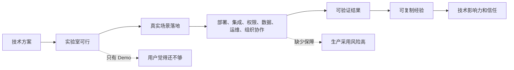
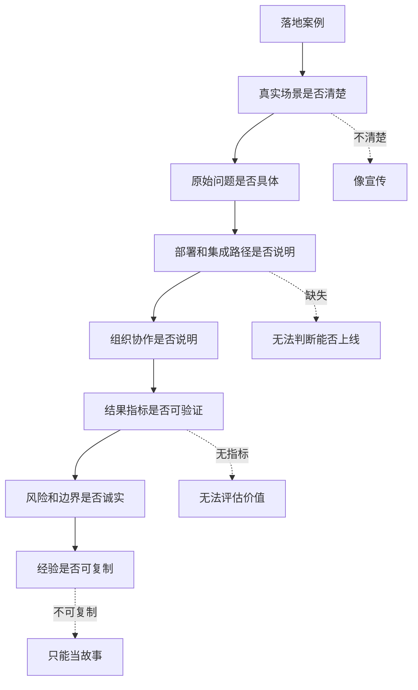

## 产品运营思维筑基课: 面向技术影响力的运营公理: 证明你能落地
  
### 作者  
digoal  
  
### 日期  
2026-05-13
  
### 标签  
技术影响力 , 落地能力 , 产品运营 , 真实场景 , 客户案例 , 工程交付 , 技术产品 , 可靠性 , 品牌信任 , 运营公理
  
----  
  
## 背景 

> 面向对象: 高中生、大学生、产品运营新人、技术产品市场与运营同学  
> 核心问题: 为什么技术产品 Demo 很漂亮、原理很先进、指标也不错，客户还是会问“有没有真实落地案例”？  
> 先说结论: 技术影响力不能停在“懂问题”和“技术强”，还必须证明你能在真实客户、真实系统、真实流程和真实约束中落地。能落地，意味着方案不仅可演示，还能部署、集成、运维、支持、复盘，并产生可验证结果。

## 一张图先看懂



可以用做实验来理解:

```text
一道菜在家里做成功，不等于能在学校食堂每天稳定供应。
食堂要考虑采购、卫生、排队、成本、口味稳定、人员分工和应急预案。
```

技术产品也是这样:

```text
Demo 跑通不等于企业能用。
企业落地还要处理数据、权限、集成、监控、迁移、培训、采购和责任边界。
```

## 求真讲法

### 它到底说了什么

“证明你能落地”说的是:

技术产品要建立影响力，必须证明方案能从理想环境进入真实环境。

真实环境和 Demo 环境不同:

| 维度 | Demo 环境 | 真实落地环境 |
|---|---|---|
| 数据 | 干净、少量、示例数据 | 脏数据、历史数据、权限复杂 |
| 系统 | 单一环境 | 多系统集成、旧系统共存 |
| 用户 | 一个演示者 | 多角色、多团队、多流程 |
| 风险 | 失败影响小 | 影响业务、预算和声誉 |
| 目标 | 展示能力 | 持续产生业务结果 |
| 支持 | 临时演示 | 长期运维、升级、故障处理 |

因此，落地证明通常要回答:

```text
谁在真实用？
在哪个场景用？
原来问题是什么？
怎么部署和集成？
遇到哪些阻力？
如何处理数据、权限、安全和运维？
上线后结果如何？
这套经验能不能复制到相似客户？
```

### 它是怎么来的

这条公理来自技术产品的采用风险。

用户看一个技术产品，通常会经历三层判断:

1. 你懂不懂问题。
2. 你的技术强不强。
3. 你能不能在我这样的真实环境里落地。

前两层解决“有没有道理”和“有没有能力”，第三层解决“我敢不敢用”。

很多技术产品卡在第三层。原因是:

```text
Demo 很顺，但真实数据很乱；
架构很美，但客户旧系统不能改；
性能很好，但运维团队接不住；
试点成功，但无法推广到组织流程；
产品可用，但采购、安全、合规卡住。
```

所以，落地能力不是技术之外的“服务细节”，而是技术产品价值的一部分。

### 它依赖哪些假设

这条公理依赖几个前提:

1. 技术产品最终要进入真实业务或真实工作流。
2. 真实环境比演示环境更复杂。
3. 用户采用产品要承担业务、组织和声誉风险。
4. 落地案例能显著降低新用户的不确定性。
5. 落地经验可以被整理、复用和迁移。

如果产品只是个人实验工具，落地证明要求会低一些。但只要产品面向企业、生产系统、团队协作或长期使用，落地证明就非常关键。

### 常见误解

**误解一: 有客户 Logo 就证明能落地。**

不够。Logo 只能说明可能有人用过。真正的落地证明要讲场景、部署、过程、结果、边界和可复制经验。

**误解二: PoC 成功就等于落地成功。**

不一定。PoC 是试点验证，落地还包括生产上线、团队使用、运维接管、长期效果和持续改进。

**误解三: 落地是交付团队的事，和运营无关。**

不对。运营要把落地经验转化为案例、方法论、检查清单、最佳实践和销售支持材料，让下一批客户更容易相信和采用。

**误解四: 落地案例只讲成功就好。**

不够。专业用户更关心过程中的阻力、取舍、风险处理和适用边界。只讲成功结果，反而不够可信。

## 求存讲法

### 它有什么用

这条公理能帮助技术产品运营从“展示能力”转向“证明可采用”。

如果只展示能力，内容会写:

```text
我们的平台支持企业级 AI 知识库、权限管理、多模态检索和实时更新。
```

如果证明能落地，内容会写:

```text
某制造企业售后团队有 3 万份维修文档和 12 年历史工单。
上线前，客服平均要查 4 个系统才能回答问题。
我们先从一个产品线试点，完成文档清洗、权限映射、检索评估和人工兜底流程。
上线后，常见问题响应时间下降，专家重复答疑减少。
```

落地证明常见资产包括:

| 资产类型 | 证明什么 |
|---|---|
| 客户案例 | 真实场景中有人用过 |
| 部署架构图 | 能进入实际系统 |
| PoC 清单 | 有可执行验证路径 |
| 迁移指南 | 能从旧方案过渡 |
| 运维手册 | 上线后能维护 |
| 风险复盘 | 出问题能处理 |
| 最佳实践 | 经验能复制 |

### 它怎么迁移到熟悉领域

假设一个同学说自己会组织活动。

低水平证明是:

```text
我很会策划，也做过活动方案。
```

更强的落地证明是:

```text
我组织过一次 200 人参加的社团招新。
提前两周排了宣传、报名、场地、物料和志愿者分工。
当天临时下雨，我们把室外签到改到教学楼大厅。
最后报名人数超过预期，复盘后留下了流程表和物料清单。
```

这说明他不仅会想，还能处理真实约束和突发情况。

技术产品也是一样。能落地，意味着能处理真实世界的复杂性。

### 它的适用范围和边界

这条公理特别适用于:

- 企业级技术产品
- 数据库、云服务、AI 平台、安全、监控、运维产品
- 需要 PoC、部署、迁移和采购的产品
- 客户案例、白皮书、解决方案和销售材料
- 面向 CTO、架构师、采购和业务负责人的内容

它的边界是:

| 场景 | 落地证明重点 | 注意点 |
|---|---|---|
| 开发者工具 | 从个人试用到团队接入 | 不要只讲安装 |
| 数据库/云服务 | 迁移、稳定、回滚、运维 | 必须讲风险控制 |
| AI 平台 | 数据、权限、评估、人工兜底 | 不要只讲 Demo 效果 |
| 安全产品 | 合规、审计、响应流程 | 不能泄露敏感细节 |
| 开源项目 | 生产用户、维护机制、版本策略 | Star 不等于落地 |

需要注意: 落地证明不一定都能公开客户名。可以用匿名案例、脱敏数据、场景拆解、方法论和第三方验证来保护客户隐私。

### 正例: 怎么用它提升能力

假设你运营一个企业级 RAG 平台。

低水平表达是:

```text
我们支持文档解析、向量检索、多轮问答和权限控制。
```

落地证明表达应包括:

1. 真实客户类型: 例如制造业售后、金融内控、政企知识库。
2. 原始问题: 文档分散、检索不准、专家被重复打扰、权限难管理。
3. 试点范围: 先选一个部门、一个产品线或一类知识。
4. 数据处理: 文档清洗、切分、去重、更新机制。
5. 权限处理: 部门、岗位、密级、审计。
6. 效果评估: 命中率、回答满意度、人工转接率、响应时间。
7. 运维机制: 知识更新、反馈闭环、错误答案处理。
8. 可复制经验: 哪些前提成立时适合复制，哪些场景不建议直接复制。

这类内容能让用户判断:

```text
这不是只会演示，而是真的知道如何上线和维护。
```

### 反例: 前提不成立会怎样

反例一: 只有 Demo，没有生产路径。

某 AI 产品 Demo 能回答几个示例问题，但没有说明如何接入真实知识库、如何处理权限、如何评估回答质量、如何处理错误答案。客户看完觉得有趣，但不敢推进。

这里失败的前提是:

```text
用户需要看到从演示到生产的路径，才会相信能落地。
```

反例二: 案例只讲结果，不讲过程。

某云产品案例写“帮助客户降本 40%”，但没有说明原始成本结构、迁移步骤、资源配置、时间周期和副作用。用户无法判断自己能否复用。

这里失败的前提是:

```text
落地证明必须包含过程和条件，不能只讲结果。
```

反例三: 试点成功，但组织无法推广。

某开发者工具在一个小团队试用效果很好，但没有权限管理、团队协作、审计和培训材料，无法推广到整个企业研发体系。

这里失败的前提是:

```text
技术落地不只是功能可用，还包括组织流程可接住。
```

## 思考

“证明你能落地”最重要的启发是: 技术影响力的终点不是让用户觉得你厉害，而是让用户相信你能帮他把事情做成。

可以用这张图检查一个落地证明是否完整:



对技术影响力来说，这条公理意味着:

```text
技术影响力不是只有原理、架构和指标，
还要证明这些东西在真实客户环境中能跑起来、用下去、产生结果。
```

对品牌影响力来说，它意味着:

```text
品牌不是“技术先进”的自我声明，
而是用户相信你能把复杂方案交付成真实结果。
```

可以进一步追问:

1. 我们有没有真实落地案例，而不只是 Demo 和 PoC？
2. 案例是否讲清部署、集成、组织协作和运维？
3. 结果指标是否能被目标客户理解和复用？
4. 我们有没有说明落地前提和不适合场景？
5. 每一次落地是否沉淀成下一次可复制的方法论？

## 最后记住

1. 技术影响力要证明三件事: 懂问题、技术强、能落地。
2. 能落地不是 Demo 成功，而是在真实场景、真实系统和真实组织中持续产生结果。
3. 落地证明要讲场景、过程、部署、组织、指标、风险和可复制经验。
4. 客户 Logo 不是完整落地证明，过程和边界才决定可信度。
5. 技术品牌的高阶信任，来自用户相信你不仅能讲清楚，还能把事情做成。

## 参考资料

- Geoffrey A. Moore, *Crossing the Chasm*, 1991.
- Everett M. Rogers, *Diffusion of Innovations*, 1962.
- Google SRE Book, *Site Reliability Engineering*, 2016.
- Martin Kleppmann, *Designing Data-Intensive Applications*, 2017.
- Philip Kotler and Kevin Lane Keller, *Marketing Management*, multiple editions.
- 本文基于技术产品运营、企业级交付、客户案例、SRE、B2B 产品营销和售前 PoC 实践中的通用经验整理；未使用实时联网资料。
  
#### [PostgreSQL 解决方案集合](../201706/20170601_02.md "40cff096e9ed7122c512b35d8561d9c8")
  
  
#### [德哥 / digoal's Github - 公益是一辈子的事.](https://github.com/digoal/blog/blob/master/README.md "22709685feb7cab07d30f30387f0a9ae")
  
  
#### [About 德哥](https://github.com/digoal/blog/blob/master/me/readme.md "a37735981e7704886ffd590565582dd0")
  
  

  
