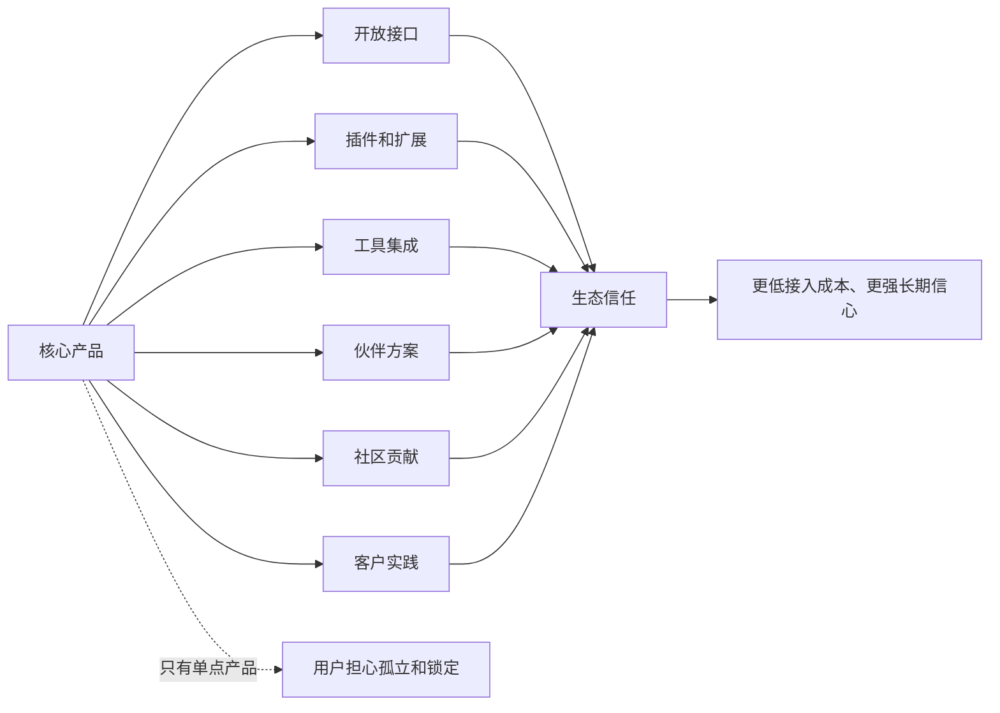
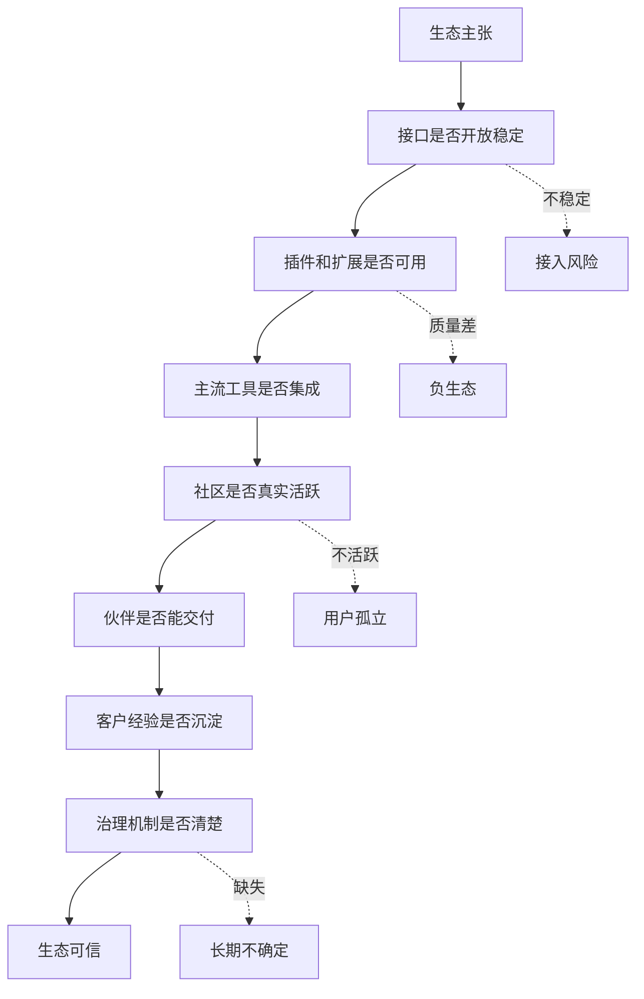

## 产品运营思维筑基课: 面向技术影响力的运营公理: 证明你有生态
  
### 作者  
digoal  
  
### 日期  
2026-05-13
  
### 标签  
技术影响力 , 生态能力 , 产品运营 , 开放生态 , 伙伴网络 , 社区建设 , 平台价值 , 技术品牌 , 外部采纳 , 运营公理
  
----  
  
## 背景 

> 面向对象: 高中生、大学生、产品运营新人、技术产品市场与运营同学  
> 核心问题: 为什么技术产品单点能力很强，用户仍然会问“能不能接入现有系统”“有没有插件”“社区活不活跃”“以后会不会被锁死”？  
> 先说结论: 技术影响力不只来自产品本身，还来自产品周围的生态。证明你有生态，就是证明用户采用你之后，不是孤立作战，而是能获得接口、插件、集成、伙伴、社区、案例和长期演进能力的支持。

## 一张图先看懂



可以用学校社团来理解:

```text
一个人很厉害，是个人能力。
一个社团有稳定成员、分工机制、资料库、合作老师、传承经验，
才说明它不是靠一个人硬撑。
```

技术产品也是这样:

```text
产品功能强只是第一层。
能接入现有工具链、有开发者贡献、有伙伴集成、有客户经验，才更像生态。
```

## 求真讲法

### 它到底说了什么

“证明你有生态”说的是:

技术产品要建立长期影响力，不能只证明核心产品可用，还要证明产品能进入用户已有系统，并被外部力量持续扩展、连接和验证。

生态不是一个大词，而是一组可观察的外部协作关系:

| 生态元素 | 用户关心什么 | 常见证据 |
|---|---|---|
| 开放接口 | 能不能接入我的系统 | API、SDK、协议、示例代码 |
| 插件扩展 | 能不能扩展能力 | 插件市场、扩展文档、贡献规范 |
| 工具集成 | 能不能接入现有工具链 | IDE、CI/CD、监控、BI、ORM、云平台 |
| 伙伴方案 | 有没有外部服务商支持 | SI、咨询伙伴、云市场、联合方案 |
| 社区贡献 | 是否有人共同建设 | Issue、PR、讨论、教程、用户组 |
| 客户实践 | 是否有真实经验沉淀 | 案例、最佳实践、迁移指南 |
| 治理机制 | 生态能否长期健康 | 版本策略、兼容承诺、审核规则 |

所以，证明生态不是说:

```text
我们生态完善。
```

而是让用户看到:

```text
你能和哪些系统连接；
谁在基于你开发；
谁在提供服务；
问题谁来回答；
插件质量谁来治理；
版本升级会不会破坏生态；
我采用后有没有退路和扩展空间。
```

### 它是怎么来的

这条公理来自技术产品的嵌入性。

技术产品很少独立存在。数据库要接入应用、ORM、BI、备份、监控、云平台；AI 平台要接入模型、数据源、权限、工作流、评估系统；开发者工具要接入 IDE、代码仓库、CI/CD、团队规范。

用户采用一个技术产品时，其实是在问:

```text
你能不能进入我已有的技术世界？
你会不会让我重建一切？
你周围有没有足够多人和工具支持？
我未来扩展时会不会被你限制？
```

因此，生态证明能显著降低采用风险。它告诉用户: 你不是买一个孤立产品，而是进入一个可连接、可扩展、可求助、可演进的网络。

### 它依赖哪些假设

这条公理依赖几个前提:

1. 用户已有系统和工具链，不会为新产品从零重建世界。
2. 技术产品价值会受到外部集成和伙伴支持影响。
3. 生态参与者能增加其他用户的价值。
4. 用户关心长期可维护性和被锁定风险。
5. 生态需要治理，否则规模会变成噪音。

如果产品是非常小的个人工具，生态要求可能较弱。但企业级技术产品、开源项目、平台型产品、基础设施产品，几乎都需要生态证明。

### 常见误解

**误解一: 生态就是合作伙伴 Logo 多。**

不够。Logo 只是入口。真正的生态要看集成是否可用、接口是否稳定、伙伴是否能交付、用户是否真的从中受益。

**误解二: 插件多就代表生态好。**

不一定。插件多但质量差、版本不兼容、没人维护，会形成负生态。生态需要质量治理。

**误解三: 开源就天然有生态。**

不一定。开源只是提供参与可能。有没有贡献者、文档、Issue 响应、版本治理和真实用户实践，才决定生态是否成立。

**误解四: 生态是成熟后才做的事。**

不完全。早期也可以设计生态接口、贡献规则、示例项目和伙伴路径。等产品封闭多年后再补生态，成本会更高。

## 求存讲法

### 它有什么用

这条公理能帮助技术产品运营从“证明产品好”升级到“证明采用你不孤单”。

如果没有生态证明，用户会担心:

```text
接入成本高；
未来扩展难；
缺少外部人才；
出了问题只能找厂商；
插件和工具不足；
迁移后被锁定；
内部团队学习成本太高。
```

生态证明可以用这些资产来呈现:

| 用户疑虑 | 生态证明资产 |
|---|---|
| 能不能接入 | 集成清单、API 文档、SDK |
| 有没有人会用 | 社区教程、认证、培训、用户组 |
| 能不能扩展 | 插件机制、扩展样例、开发指南 |
| 有没有伙伴支持 | 服务商列表、联合方案、云市场 |
| 长期是否稳定 | 版本路线图、兼容承诺、治理规则 |
| 出问题怎么办 | 社区问答、支持体系、故障知识库 |

### 它怎么迁移到熟悉领域

假设你想学一门新的编程语言。

你不会只问:

```text
这门语言本身设计好不好？
```

你还会问:

```text
有没有教程？
有没有编辑器支持？
有没有常用库？
有没有人遇到过类似问题？
有没有公司真的用？
出了错能不能搜到答案？
```

这些就是生态。

技术产品也是一样。一个产品能力强，但没有文档、集成、社区和经验沉淀，用户会担心自己采用后没人帮、没路走。

### 它的适用范围和边界

这条公理特别适用于:

- 开源项目
- 开发者平台
- 数据库、云服务、AI 平台、安全、监控、运维产品
- 插件型、平台型、API 型产品
- 企业级技术产品
- 需要技术影响力和品牌影响力的产品

它的边界是:

| 场景 | 生态证明重点 | 注意点 |
|---|---|---|
| 早期产品 | 最小生态路径 | 不要伪装成熟生态 |
| 开源项目 | 贡献机制和维护质量 | Star 不等于生态 |
| 企业基础设施 | 集成、伙伴、长期支持 | 生态要能服务生产 |
| 开发者工具 | SDK、插件、示例、社区 | 上手体验关键 |
| AI 平台 | 模型、数据源、评估、工作流集成 | 不要只讲模型能力 |

也要注意: 生态不是越开放越好。企业级产品要平衡开放、质量、安全、兼容和治理。无治理的开放会伤害用户信任。

### 正例: 怎么用它提升能力

假设你运营一个数据库产品。

低水平表达是:

```text
我们拥有完善生态，支持主流工具。
```

有说服力的生态证明应该包括:

1. 协议兼容: 是否兼容 PostgreSQL/MySQL 协议或标准 SQL。
2. 驱动支持: Java、Python、Go、Node.js 等驱动是否可用。
3. 工具集成: ORM、BI、备份、监控、迁移工具是否适配。
4. 云和部署: 是否支持 Kubernetes、主流云市场、Terraform。
5. 社区内容: 是否有教程、FAQ、Issue、最佳实践。
6. 伙伴服务: 是否有 SI、咨询、培训、迁移服务商。
7. 治理承诺: 版本兼容、插件审核、路线图和安全响应。

这样用户才能判断:

```text
采用这个数据库，不是从零开始，而是能接入现有技术世界。
```

### 反例: 前提不成立会怎样

反例一: 只有生态口号，没有可用集成。

某平台宣传“连接万物”，但集成文档很少，SDK 版本落后，示例代码跑不通。开发者试用后发现接入成本很高。

这里失败的前提是:

```text
生态证明必须可用、可验证，不能只是口号。
```

反例二: 插件很多，但没有治理。

某开发平台插件数量很多，但很多插件无人维护、权限过大、兼容性差。用户安装后频繁出错，对平台信任下降。

这里失败的前提是:

```text
生态需要质量治理，否则规模会变成风险。
```

反例三: 开源项目有热度，但企业生态不足。

某开源项目 GitHub Star 很高，但缺少企业级文档、长期版本支持、迁移案例、培训伙伴和安全响应机制。企业技术负责人喜欢项目，却不敢推动生产使用。

这里失败的前提是:

```text
社区热度不等于企业可采用生态。
```

## 思考

“证明你有生态”最重要的启发是: 技术产品的竞争，不只是单个产品能力的竞争，也是连接能力、协作能力和长期演进能力的竞争。

可以用这张图检查一个技术产品的生态证明是否完整:



对技术影响力来说，这条公理意味着:

```text
技术影响力不是只有官方证明自己强，
还要有外部开发者、伙伴、客户和社区不断围绕你创造价值。
```

对品牌影响力来说，它意味着:

```text
品牌影响力不是用户只相信你的产品，
而是相信围绕你的生态能长期支撑他的使用和扩展。
```

可以进一步追问:

1. 我们所谓生态，哪些是真实可用资产，哪些只是 Logo？
2. 用户采用我们后，能否接入现有工具链？
3. 是否有外部开发者、伙伴或客户在持续贡献？
4. 生态资产是否有质量标准和维护机制？
5. 我们的生态证明能否降低用户对锁定、维护和扩展的担忧？

## 最后记住

1. 技术生态不是口号，而是接口、插件、集成、伙伴、社区、案例和治理的组合。
2. 证明有生态，就是证明用户采用你之后不会孤立无援。
3. 插件多、Logo 多、Star 多都不等于生态强，关键看可用性、质量和长期维护。
4. 企业级生态要同时重视开放、兼容、安全、治理和服务。
5. 技术影响力和品牌影响力的高阶形态，是让外部力量持续围绕产品创造价值。

## 参考资料

- Geoffrey G. Parker, Marshall W. Van Alstyne, Sangeet Paul Choudary, *Platform Revolution*, 2016.
- Carl Shapiro and Hal R. Varian, *Information Rules*, 1999.
- Andrew Chen, *The Cold Start Problem*, 2021.
- Everett M. Rogers, *Diffusion of Innovations*, 1962.
- Geoffrey A. Moore, *Crossing the Chasm*, 1991.
- 本文基于平台经济、网络效应、开源社区、开发者生态、技术产品运营和 B2B 产品营销中的通用经验整理；未使用实时联网资料。
  
#### [PostgreSQL 解决方案集合](../201706/20170601_02.md "40cff096e9ed7122c512b35d8561d9c8")
  
  
#### [德哥 / digoal's Github - 公益是一辈子的事.](https://github.com/digoal/blog/blob/master/README.md "22709685feb7cab07d30f30387f0a9ae")
  
  
#### [About 德哥](https://github.com/digoal/blog/blob/master/me/readme.md "a37735981e7704886ffd590565582dd0")
  
  

  
