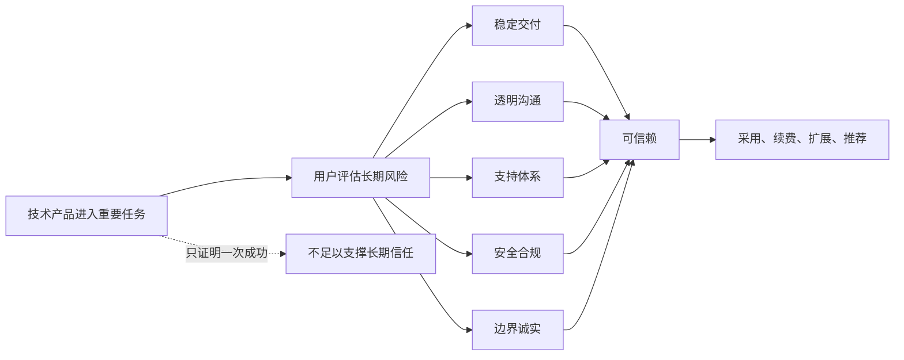
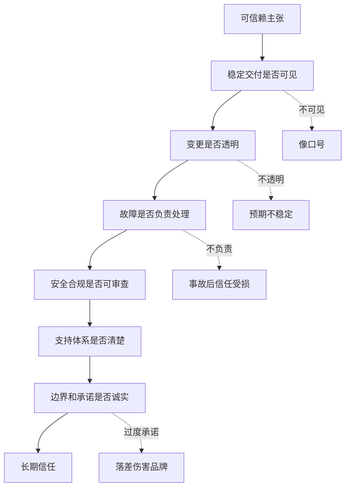

## 产品运营思维筑基课: 面向技术影响力的运营公理: 证明你可信赖
  
### 作者  
digoal  
  
### 日期  
2026-05-13
  
### 标签  
技术影响力 , 可信赖 , 产品运营 , 信任资产 , 可靠性 , 专业可信 , 透明沟通 , 风险控制 , 技术品牌 , 运营公理
  
----  
  
## 背景 

> 面向对象: 高中生、大学生、产品运营新人、技术产品市场与运营同学  
> 核心问题: 为什么技术产品已经证明了能力、案例和生态，用户仍然会担心“长期靠不靠谱”？  
> 先说结论: 技术影响力的高阶信任，是证明你可信赖。可信赖不是“看起来强”，而是用户相信你会长期稳定交付、透明沟通、负责处理问题、持续维护边界，并在关键时刻不让用户独自承担风险。

## 一张图先看懂



可以用同学合作来理解:

```text
一个同学能力强，不等于你愿意长期和他组队。
你还会看他是否守时、是否沟通清楚、出问题是否负责、能不能持续交付。
```

技术产品也是这样:

```text
一次 Demo 成功不等于可信赖。
用户要看版本、支持、安全、故障处理、路线图和长期维护能力。
```

## 求真讲法

### 它到底说了什么

“证明你可信赖”说的是:

技术产品要建立长期影响力，不能只证明“现在能用”，还要证明“未来可依赖”。

可信赖至少包含六层:

| 信任层次 | 用户关心什么 | 常见证据 |
|---|---|---|
| 稳定交付 | 版本是否持续、质量是否稳定 | 版本日志、发布节奏、测试体系 |
| 透明沟通 | 问题是否讲清楚 | 状态页、故障公告、路线图、变更说明 |
| 负责支持 | 出问题能否得到帮助 | 工单、SLA、客户成功、社区响应 |
| 安全合规 | 数据和权限是否可靠 | 安全白皮书、合规认证、审计能力 |
| 边界诚实 | 不适合场景是否说明 | 限制说明、最佳实践、替代建议 |
| 长期演进 | 产品是否会持续进步 | 路线图、兼容承诺、生态治理 |

所以，可信赖不是一句:

```text
我们值得信任。
```

而是一组长期可观察行为:

```text
你承诺什么；
你如何兑现；
你出问题时怎么处理；
你如何让用户提前知道风险；
你如何持续维护和改进。
```

### 它是怎么来的

这条公理来自技术产品的长期依赖关系。

用户采用技术产品后，往往不是一次性交易，而是把一部分业务流程、数据、系统稳定性和团队效率交给你。

例如:

```text
数据库要长期保存和处理关键数据；
云服务要长期支撑业务可用性；
安全产品要长期承担风险防护；
AI 平台要长期进入知识、流程和决策系统；
开发工具要长期影响研发工作流。
```

因此，用户会自然追问:

```text
你们会不会持续维护？
版本升级会不会破坏兼容？
故障发生时是否透明？
支持是否及时？
路线图是否稳定？
安全和合规是否可审计？
```

技术影响力如果只证明“强”，还不够。强而不稳、强而不透明、强而不负责，都难以成为可信赖品牌。

### 它依赖哪些假设

这条公理依赖几个前提:

1. 用户对技术产品存在长期依赖。
2. 技术产品失败会带来业务、数据、预算或声誉损失。
3. 用户无法一次性验证未来表现，只能根据长期信号判断。
4. 透明和负责能降低不确定性。
5. 可信赖需要持续行为，而不是一次宣传。

如果产品只是一次性小工具，可信赖要求会弱一些。但只要产品进入生产系统、企业流程、客户数据、团队协作和长期预算，可信赖就是核心门槛。

### 常见误解

**误解一: 技术强就等于可信赖。**

不对。技术强说明有能力，可信赖还要求稳定、透明、负责和长期维护。

**误解二: 不出故障才可信赖。**

不完全。复杂系统不可能永远不出故障。可信赖还体现在故障发生时是否快速响应、透明沟通、复盘改进。

**误解三: 可信赖主要靠客户成功团队。**

不够。可信赖来自产品、工程、文档、安全、销售、支持、社区和管理层的一致行为。

**误解四: 讲限制会降低信任。**

相反，清楚说明限制能增强信任。用户怕的不是产品有边界，而是不知道边界在哪里。

## 求存讲法

### 它有什么用

这条公理能帮助技术产品运营从“展示实力”升级到“建设长期信任”。

如果只展示实力，运营会写:

```text
我们性能领先、架构先进、客户众多、生态完善。
```

如果证明可信赖，还要回答:

```text
版本如何演进？
安全如何保障？
故障如何处理？
客户如何获得支持？
数据如何备份和恢复？
哪些场景不建议使用？
重大变更如何通知？
```

证明可信赖的运营资产包括:

| 资产类型 | 证明什么 |
|---|---|
| 版本日志 | 持续交付和透明变更 |
| 状态页 | 服务运行和故障透明 |
| 故障复盘 | 出问题后负责改进 |
| 安全白皮书 | 安全机制可审查 |
| SLA 和支持说明 | 责任边界清楚 |
| 兼容承诺 | 长期升级风险可控 |
| 路线图 | 产品方向稳定可预期 |
| 最佳实践 | 用户知道如何安全使用 |

### 它怎么迁移到熟悉领域

假设你要选一个同学长期管理班级账本。

你不会只看他数学好不好，还会看:

```text
记账是否清楚；
是否定期公布；
出错是否承认和更正；
票据是否保留；
规则是否透明；
别人能不能检查。
```

这就是可信赖。

技术产品也是一样。用户不是只看你一次展示得多好，而是看你能不能长期被检查、被依赖、被托付。

### 它的适用范围和边界

这条公理特别适用于:

- 数据库、云服务、安全、监控、运维产品
- AI 平台、企业 SaaS、开发者平台
- 进入生产系统和组织流程的产品
- 面向 CTO、架构师、安全、采购和客户成功的内容
- 技术品牌和企业级品牌建设

它的边界是:

| 场景 | 可信赖重点 | 注意点 |
|---|---|---|
| 开发者工具 | 文档、兼容、Issue 响应 | 不要只看功能新 |
| 数据库/云服务 | SLA、备份、恢复、状态透明 | 必须讲事故处理 |
| AI 平台 | 数据安全、输出质量、人工兜底 | 不能只讲模型能力 |
| 安全产品 | 合规、审计、响应机制 | 可信赖本身就是核心价值 |
| 开源项目 | 维护者稳定、版本治理、社区规则 | Star 不能替代维护能力 |

需要注意: 可信赖不能靠过度承诺建立。承诺过多但兑现不了，会更快破坏信任。

### 正例: 怎么用它提升能力

假设你运营一个企业级云数据库。

低水平表达是:

```text
我们是高可靠企业级云数据库。
```

可信赖证明应该包括:

1. 稳定性: 多可用区架构、备份恢复、故障切换机制。
2. 透明性: 状态页、故障公告、版本变更日志。
3. 支持: SLA、工单响应、专家服务、应急预案。
4. 安全: 权限、审计、加密、合规认证。
5. 兼容: 升级策略、弃用周期、迁移工具。
6. 边界: 不适合的负载类型、容量规划建议。
7. 复盘: 典型故障如何处理、后续如何避免。

这类内容不一定最容易刷屏，但会让企业客户更敢把关键业务交给你。

### 反例: 前提不成立会怎样

反例一: 产品强，但变更不透明。

某云服务性能很好，但版本升级经常改变接口行为，公告不及时。开发团队每次升级都担心踩坑。

这里失败的前提是:

```text
可信赖需要稳定预期，不能只靠能力强。
```

反例二: 故障处理不透明。

某平台发生长时间故障，只说“服务异常，正在处理中”，没有影响范围、恢复进度、原因分析和后续改进。客户即使恢复使用，也会降低长期信任。

这里失败的前提是:

```text
故障不可避免，但不透明会放大不信任。
```

反例三: 过度承诺。

某 AI 产品宣传“完全替代人工审核”，但实际复杂场景仍需人工兜底。用户试用后发现落差，认为厂商不诚实。

这里失败的前提是:

```text
可信赖来自可兑现承诺，而不是最大化承诺。
```

## 思考

“证明你可信赖”最重要的启发是: 技术影响力的终点不是让用户佩服你，而是让用户敢依赖你。

可以用这张图检查可信赖证明是否完整:



对技术影响力来说，这条公理意味着:

```text
技术影响力不是只证明你会做难题，
而是证明你能长期、稳定、透明、负责地支撑用户。
```

对品牌影响力来说，它意味着:

```text
品牌影响力不是用户觉得你厉害，
而是用户在关键任务上愿意默认把你列入可信候选。
```

可以进一步追问:

1. 我们有哪些证据证明长期稳定，而不只是一次成功？
2. 用户能否看到我们的版本、路线图和变更说明？
3. 出故障时，我们是否有透明沟通和复盘机制？
4. 我们是否清楚说明了责任边界和不适用场景？
5. 我们的承诺是否都能被长期兑现？

## 最后记住

1. 可信赖是技术影响力的高阶信任，不只是技术强。
2. 可信赖来自稳定交付、透明沟通、负责支持、安全合规、边界诚实和长期演进。
3. 复杂系统难免出问题，真正伤害信任的是隐瞒、拖延、甩锅和不复盘。
4. 过度承诺会损害可信赖，诚实边界反而能增强专业信任。
5. 技术品牌的最终价值，是用户愿意把重要任务长期交给你。

## 参考资料

- Niklas Luhmann, *Trust and Power*, 1979.
- Google SRE Book, *Site Reliability Engineering*, 2016.
- Rachel Botsman, *Who Can You Trust?*, 2017.
- Geoffrey A. Moore, *Crossing the Chasm*, 1991.
- David A. Aaker, *Managing Brand Equity*, 1991.
- 本文基于信任理论、SRE、技术产品运营、企业级服务、B2B 产品营销和品牌资产建设中的通用经验整理；未使用实时联网资料。
  
#### [PostgreSQL 解决方案集合](../201706/20170601_02.md "40cff096e9ed7122c512b35d8561d9c8")
  
  
#### [德哥 / digoal's Github - 公益是一辈子的事.](https://github.com/digoal/blog/blob/master/README.md "22709685feb7cab07d30f30387f0a9ae")
  
  
#### [About 德哥](https://github.com/digoal/blog/blob/master/me/readme.md "a37735981e7704886ffd590565582dd0")
  
  

  
