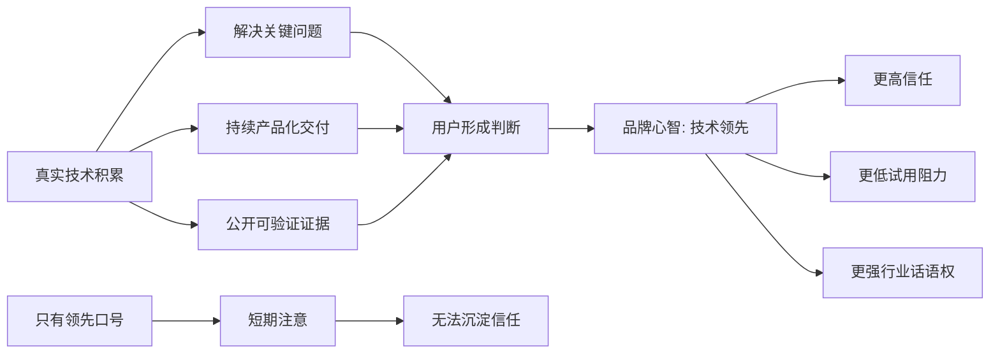
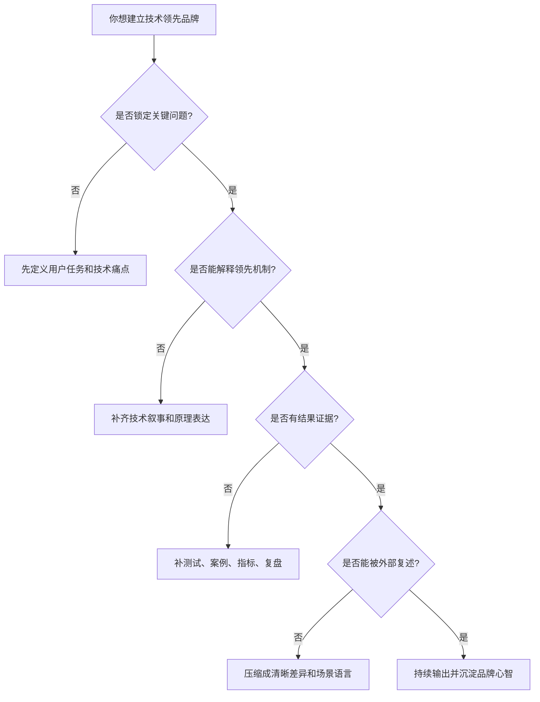

## 产品运营思维筑基课: 面向品牌影响力的运营公理: 技术领先
  
### 作者  
digoal  
  
### 日期  
2026-05-13
  
### 标签  
品牌影响力 , 技术领先 , 产品运营 , 技术品牌 , 可信证据 , 用户心智 , 专业能力 , 差异化 , 技术传播 , 运营公理
  
----  
  
## 背景 

> 一句话结论：技术领先不是“我们很先进”的口号，而是让用户形成一种稳定预期：在关键技术问题上，这个团队更早看见问题、更深理解机制、更快交付可靠能力，并且有持续证据可查。

很多技术产品都喜欢说自己“领先”“新一代”“业界首创”。但在品牌影响力里，真正起作用的不是形容词，而是用户脑子里能不能形成一个清晰判断：

“遇到这个高难度技术问题，我应该先看看它。”

这才叫技术领先。

---

## 一张图先看懂



技术领先的运营任务，不是把“领先”两个字说得更响，而是把“为什么领先、领先在哪里、能带来什么结果、别人如何验证”讲清楚。

---

## 求真讲法

### 1. 这个公理到底在说什么？

面向品牌影响力的“技术领先”，本质上是一个认知资产：

用户、开发者、客户、媒体、分析师、合作伙伴在反复接触你的产品之后，逐渐相信你在某些关键技术问题上具有领先能力。

这里有三个关键词：

| 关键词 | 含义 | 运营上的要求 |
|---|---|---|
| 关键技术问题 | 用户真正在意、会影响业务结果的问题 | 不能只讲内部觉得酷的技术 |
| 领先能力 | 比替代方案更早、更强、更稳或更省 | 要有比较对象和评价标准 |
| 稳定预期 | 用户多次接触后形成一致判断 | 要持续输出证据，而不是一次传播 |

所以，技术领先不是单点事件，而是长期累积的品牌判断。

### 2. 为什么技术领先能影响品牌？

因为技术产品的购买和采用，往往带着不确定性：

- 这个东西能不能跑稳？
- 未来会不会跟不上技术趋势？
- 团队是不是只会做营销，不懂底层问题？
- 出问题时能不能解释清楚并快速修复？
- 我投入迁移成本以后，会不会被锁进一个没有前途的方案？

当用户无法完全验证未来时，就会依赖品牌心智来降低判断成本。

技术领先，就是一种强信号。

它告诉用户：

“这个团队可能更懂问题，也更可能在未来继续解决问题。”

这就是技术领先对品牌的根本价值：它把复杂的技术判断，压缩成一个可被用户使用的信任捷径。

### 3. 技术领先必须被证明，而不是被宣称

“领先”如果只是自称，很容易变成噪音。真正有效的技术领先，需要证据链。

| 低质量表达 | 高质量表达 |
|---|---|
| 我们是领先平台 | 我们在什么场景、什么指标、什么约束下领先 |
| 我们采用最新架构 | 新架构解决了什么旧问题，代价是什么 |
| 我们性能极强 | 数据集、测试方法、复现实验、真实案例 |
| 我们有核心技术 | 技术机制、专利、论文、开源代码、工程实践 |
| 我们持续创新 | 版本节奏、路线图兑现、客户反馈、生态采纳 |

品牌影响力不相信形容词，它相信可复述、可验证、可迁移的证据。

### 4. 用学生能懂的例子来理解

一个学生说：“我数学很强。”

这只是自我评价。

另一个学生每次遇到难题，都能：

1. 先说清楚题目考什么。
2. 解释为什么常规方法会失败。
3. 给出更简洁的解法。
4. 说明这个解法适用于哪些题，不适用于哪些题。
5. 长期考试成绩稳定靠前。

久而久之，大家会形成判断：

“这个人数学确实强。”

技术产品的“技术领先”也是这样。不是你说强，而是你长期表现出“遇到关键问题时更能解决问题”。

### 5. 这个公理背后的基本假设

这个公理成立，依赖几个前提：

1. 用户面对的是有技术复杂度的产品，而不是纯感性消费品。
2. 技术能力会显著影响用户的业务结果。
3. 用户无法在短时间内完全验证所有技术细节。
4. 市场上存在多个可替代方案，用户需要比较。
5. 品牌影响力会影响试用、采购、推荐、生态合作和人才吸引。

如果一个产品没有技术复杂度，或者用户完全不关心技术能力，那么“技术领先”就不是最重要的品牌公理。

---

## 求存讲法

### 1. 在现实运营里，它解决什么问题？

技术产品运营经常遇到一个尴尬：

产品确实有技术优势，但市场不知道。

更糟的是，市场不知道的技术优势，等于没有被品牌化。

运营要做的，就是把技术优势变成品牌资产：

```text
技术事实
  ↓
用户问题
  ↓
可理解表达
  ↓
可验证证据
  ↓
可复述差异
  ↓
品牌心智
```

比如一个数据库产品有很强的并发控制能力。对工程团队来说，这可能是内核设计问题；对用户来说，它必须被翻译成：

- 高并发写入时更稳。
- 业务峰值不容易雪崩。
- 扩容成本更可控。
- 复杂交易场景下数据一致性更可靠。

这才是技术领先进入品牌心智的路径。

### 2. 技术领先不是“技术越多越好”

技术领先有一个常见误区：把技术堆叠当成领先。

但品牌影响力里的技术领先，关注的不是你用了多少新技术，而是你在用户关键任务上创造了什么确定性。

| 错误理解 | 正确理解 |
|---|---|
| 用了最新技术，所以领先 | 解决了关键问题，所以领先 |
| 参数更多，所以领先 | 在真实约束下效果更好，所以领先 |
| 架构更复杂，所以领先 | 复杂度被产品吸收，用户收益更高，所以领先 |
| 发布更频繁，所以领先 | 持续兑现技术路线，所以领先 |
| 声量更大，所以领先 | 证据更强，心智更稳定，所以领先 |

技术产品最危险的品牌错觉，是把“内部技术兴奋”误当成“外部品牌影响力”。

### 3. 技术领先的四类证据

面向品牌影响力，技术领先至少需要四类证据。

| 证据类型 | 说明 | 示例 |
|---|---|---|
| 机制证据 | 解释为什么能做到 | 架构文章、技术白皮书、论文、源码解析 |
| 结果证据 | 证明做到之后有什么效果 | 性能测试、稳定性数据、成本下降、案例复盘 |
| 采纳证据 | 证明不是自己说好 | 客户案例、社区采用、生态集成、第三方评测 |
| 持续证据 | 证明不是一次偶然 | 版本路线图、长期发布节奏、问题修复记录 |

没有机制证据，用户会怀疑你只是调参。

没有结果证据，用户不知道技术有什么用。

没有采纳证据，用户会怀疑你只是自说自话。

没有持续证据，用户会担心你只是偶然领先。

### 4. 正例：把技术领先做成品牌心智

假设一个 AI 数据平台希望建立“技术领先”的品牌影响力。它可以这样运营：

1. 明确一个关键技术问题：企业私有数据如何低成本、高可靠地进入大模型应用。
2. 解释旧方案的瓶颈：数据孤岛、向量检索效果不稳、权限难管理、成本不可控。
3. 展示自己的机制：统一数据访问、向量索引、权限继承、冷热分层、查询优化。
4. 给出结果证据：延迟、召回率、成本、上线周期、故障恢复时间。
5. 公开真实案例：某类客户如何从原方案迁移，业务指标如何变化。
6. 持续输出技术内容：版本发布、最佳实践、架构复盘、生态集成。

这样的运营不是简单宣传，而是在让市场逐步形成判断：

“这个产品在企业 AI 数据底座这个问题上，确实更懂、更稳、更能落地。”

这就是品牌影响力中的技术领先。

### 5. 反例：把技术领先做成空话

另一个团队也说自己技术领先，但它的表达是：

- 首页写满“下一代”“革命性”“全球领先”。
- 没有说明具体领先在哪个问题上。
- 没有测试方法，也没有复现条件。
- 只讲采用了热门技术，不讲用户收益。
- 案例只写“某头部客户”，没有场景、指标和过程。
- 一旦用户问边界条件，就转回销售话术。

这种运营短期可能制造声量，但很难形成品牌信任。因为用户无法把“领先”翻译成自己的判断。

更严重的是，一旦实际体验达不到口号，品牌会被反噬。

---

## 思考

### 1. 技术领先的运营推导



技术领先不是一个传播动作，而是一个证据系统。

### 2. 可以问自己的五个问题

1. 我们到底在哪个关键技术问题上领先？
2. 这个问题对用户的任务、成本、风险或增长有什么影响？
3. 我们的领先是机制领先、性能领先、工程领先、生态领先，还是落地领先？
4. 用户能不能用一句话复述我们的领先差异？
5. 如果竞品也说自己领先，我们有什么证据能让用户相信我们？

如果这些问题答不清楚，品牌里的“技术领先”就还没有真正建立。

### 3. 技术领先与技术影响力的区别

技术影响力更偏向专业圈层的认可，重点是“懂行的人是否认可你”。

品牌影响力更偏向市场心智的稳定，重点是“更广泛的目标用户是否把你和某种能力联系起来”。

两者关系如下：

| 维度 | 技术影响力 | 品牌影响力中的技术领先 |
|---|---|---|
| 核心受众 | 开发者、架构师、技术决策者 | 客户、合作伙伴、媒体、行业市场 |
| 关键问题 | 你是否真的懂技术 | 你是否代表某类技术能力 |
| 主要证据 | 源码、论文、架构、实践 | 案例、结果、心智、稳定预期 |
| 传播目标 | 专业认可 | 市场选择偏好 |
| 最好结果 | 被技术圈信服 | 被市场优先想到 |

好的技术产品运营，要把技术影响力转化成品牌影响力。

### 4. 适用边界

这个公理特别适用于：

- 数据库、云计算、AI 平台、开发者工具、安全产品、基础软件。
- 用户决策成本高、迁移成本高、技术风险高的产品。
- 需要长期建立专业信任的 B2B 技术品牌。
- 需要吸引开发者、生态伙伴、企业客户和技术人才的产品。

它不适用于所有场景。

如果产品主要靠价格、渠道、审美、娱乐性或即时消费驱动，那么“技术领先”可能只是辅助因素。此时更重要的可能是体验、情绪、便利性或性价比。

### 5. 最后记住

1. 技术领先不是口号，而是稳定预期。
2. 领先必须落到关键用户问题上。
3. 技术优势必须变成可验证证据。
4. 品牌不记住复杂技术，品牌记住可复述差异。
5. 面向品牌影响力，技术领先的终点不是“显得先进”，而是“被优先信任”。

---

## 参考资料

- Al Ries, Jack Trout, *Positioning: The Battle for Your Mind*：定位理论帮助理解品牌心智如何形成。
- David A. Aaker, *Managing Brand Equity*：品牌资产理论帮助理解稳定认知、信任和差异化的长期价值。
- Geoffrey A. Moore, *Crossing the Chasm*：技术产品从早期市场进入主流市场时，可信定位和场景证明非常关键。
- Michael Spence, “Job Market Signaling”：信号理论可用于理解为什么技术证据比自我宣称更能建立信任。
- Martin Kleppmann, *Designing Data-Intensive Applications*：复杂技术产品需要用机制、权衡和真实约束来解释价值。
  
#### [PostgreSQL 解决方案集合](../201706/20170601_02.md "40cff096e9ed7122c512b35d8561d9c8")
  
  
#### [德哥 / digoal's Github - 公益是一辈子的事.](https://github.com/digoal/blog/blob/master/README.md "22709685feb7cab07d30f30387f0a9ae")
  
  
#### [About 德哥](https://github.com/digoal/blog/blob/master/me/readme.md "a37735981e7704886ffd590565582dd0")
  
  

  
