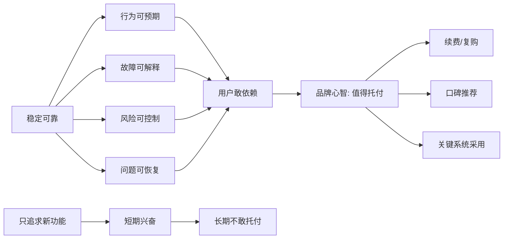
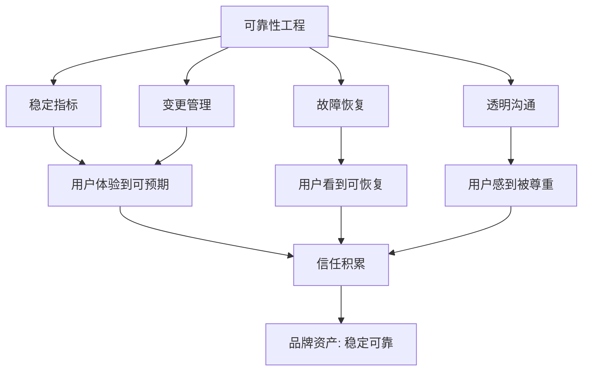

## 产品运营思维筑基课: 面向品牌影响力的运营公理: 稳定可靠
  
### 作者  
digoal  
  
### 日期  
2026-05-13
  
### 标签  
品牌影响力 , 稳定可靠 , 产品运营 , 技术产品 , 可靠性 , 用户信任 , 故障恢复 , SLA , 长期托付 , 运营公理
  
----  
  
## 背景 

> 面向对象: 中学生、高中生，以及刚接触技术产品运营的人  
> 核心问题: 为什么技术产品的品牌影响力，不能只靠“领先”和“创新”，还必须让用户相信它稳定可靠？  
> 先说结论: 稳定可靠不是“从不出错”的幻想，而是用户相信你在关键任务、异常情况和长期使用中，都能保持可预期的表现，并且出现问题时有清晰、负责、可恢复的处理机制。

技术产品的品牌，不只由高光时刻决定，也由低谷时刻决定。

一个产品平时功能很多、速度很快、宣传很响，但一到业务高峰就崩，一出故障就沉默，一升级就破坏兼容，用户很难真正信任它。

所以，面向品牌影响力，“稳定可靠”是一条底层公理：

用户愿意长期依赖的产品，必须让人相信它在关键时刻仍然可用、可控、可解释、可恢复。

---

## 一张图先看懂



稳定可靠的品牌价值，不是让用户觉得你“很保守”，而是让用户觉得你“可以托付”。

---

## 求真讲法

### 它到底说了什么

“稳定可靠”在品牌影响力里，不是一个技术指标本身，而是一种用户预期。

它包括四层意思：

| 层次 | 用户真正关心的问题 | 品牌上形成的判断 |
|---|---|---|
| 可用 | 我需要时它能不能工作？ | 这个产品不容易掉链子 |
| 可预期 | 它的表现会不会忽高忽低？ | 这个产品行为稳定 |
| 可解释 | 出问题时我能不能知道原因？ | 这个团队不遮掩问题 |
| 可恢复 | 出问题后能不能快速恢复？ | 这个产品和团队值得信赖 |

所以，稳定可靠不是简单说“我们 SLA 很高”。SLA 是服务等级协议，是一种量化承诺；品牌里的稳定可靠，是用户经过多次体验和观察后形成的信任判断。

### 它是怎么来的

技术产品常常承担用户的重要任务。

数据库承载交易数据，云服务承载业务系统，安全产品承载风险防线，开发者工具承载研发流程，AI 平台承载生产效率。

这些产品一旦不稳定，用户损失的可能不是一次体验，而是业务中断、数据风险、客户投诉、组织信任下降。

因此，用户会自然地把“能不能稳定依赖”放在很高的位置。

```text
产品不稳定
  ↓
用户任务受阻
  ↓
业务风险上升
  ↓
内部责任压力变大
  ↓
用户减少依赖
  ↓
品牌信任下降
```

这条链路说明：稳定可靠不是技术团队内部的自我要求，而是品牌影响力的基础条件。

### 它依赖哪些假设

这个公理成立，依赖以下假设：

1. 用户把产品用于相对重要的任务，而不是一次性娱乐或低风险尝试。
2. 产品故障、性能波动、兼容性变化会给用户带来真实损失。
3. 用户不能只根据宣传判断可靠性，必须观察长期表现和异常处理。
4. 市场中存在替代方案，用户可以选择更可信赖的产品。
5. 品牌影响力不仅来自吸引注意，也来自降低用户的心理风险。

如果产品本身只是低风险玩具，或者用户根本不在乎长期依赖，那么稳定可靠的品牌权重会下降。

### 常见误解

| 误解 | 为什么不对 |
|---|---|
| 稳定可靠等于永远不出故障 | 复杂系统不可能保证绝对无故障，关键是降低故障、隔离影响、快速恢复 |
| 稳定可靠等于少发版本 | 少变不一定可靠，可靠来自工程质量、验证机制和变更管理 |
| 稳定可靠只属于技术团队 | 运营要把可靠性的事实、证据、机制和态度传递给市场 |
| 只要指标好，用户就会信任 | 指标需要被解释、验证，并与用户真实场景连接 |
| 出故障不能公开 | 对关键技术产品来说，负责任的透明反而能增加长期信任 |

稳定可靠不是“没有问题”，而是“遇到问题时仍然有秩序”。

---

## 求存讲法

### 它有什么用

对技术产品运营来说，稳定可靠至少有四个作用：

1. 降低用户试用和采购时的心理风险。
2. 提高客户把产品放进关键系统的意愿。
3. 增强续费、复购和内部推荐。
4. 在市场波动或竞品宣传时，守住品牌信任底盘。

很多产品以创新吸引用户，但靠可靠留住用户。

如果说“技术领先”让用户产生兴趣，那么“稳定可靠”让用户敢于依赖。

### 它怎么迁移到熟悉领域

可以把一个技术产品想象成一个同学。

有的同学很聪明，偶尔能做出漂亮难题，但经常迟到、漏交作业、答应的事做不到。你会觉得他有天赋，但不一定敢把小组作业交给他负责。

另一个同学未必每次都最耀眼，但他说几点到就几点到，遇到困难会提前说明，分工出错会及时补救，长期表现稳定。你会愿意和他合作。

品牌里的稳定可靠，就是第二种信任。

它不一定最热闹，但在真正要托付任务时最有价值。

### 它的适用范围和边界

稳定可靠特别适用于：

- 数据库、存储、云计算、网络、安全、支付、企业协作等基础设施产品。
- 被嵌入用户业务流程、研发流程或生产流程的技术产品。
- 替换成本高、故障成本高、迁移成本高的 B2B 产品。
- 需要长期续费、长期生态合作和长期口碑积累的产品。

但它也有边界。

| 场景 | 稳定可靠的权重 |
|---|---|
| 关键业务系统 | 极高，通常是准入条件 |
| 企业生产工具 | 很高，影响组织协作和效率 |
| 开发者工具 | 高，影响研发节奏和故障风险 |
| 消费级娱乐产品 | 中等，取决于使用频率和替代成本 |
| 一次性活动页面 | 相对较低，但基本可用性仍然重要 |

如果一个早期产品还在探索市场，稳定可靠也不能被理解成“永远不变”。它应该理解为：在承诺范围内可靠，在实验范围内透明。

### 正例: 怎么用它提升能力

假设一个云数据库产品希望建立“稳定可靠”的品牌影响力，可以这样做：

1. 明确可靠性承诺：哪些版本、哪些规格、哪些场景有明确 SLA。
2. 展示可靠性机制：多副本、故障切换、备份恢复、限流隔离、变更灰度。
3. 输出真实案例：客户在大促、迁移、容灾、故障恢复中的表现。
4. 公开关键指标：可用性、恢复时间、数据保护能力、升级成功率。
5. 建立事故沟通机制：问题发生后有状态页、复盘、补救和改进计划。
6. 把可靠性写进内容体系：不只发布新功能，也发布稳定性工程实践。

这样做的重点不是炫耀技术，而是让用户形成判断：

“这个产品可以放进重要系统里。”

### 反例: 前提不成立会怎样

假设一个 AI 平台运营时只强调“模型最新、效果最好、能力最强”，但没有说明：

- 高峰期调用是否稳定。
- API 变更是否兼容。
- 数据是否会丢失。
- 故障时是否有状态通知。
- 重要客户是否有恢复预案。
- 输出质量波动如何被监控。

如果用户只是拿它做一次演示，可能觉得很酷。但一旦要放进企业生产流程，风险就会暴露。

这个反例失败的原因，不是“宣传做得不够漂亮”，而是前提不成立：用户要完成的是重要任务，而产品没有提供足够的稳定性证据。

---

## 思考

### 从可靠性到品牌资产



运营不能制造不存在的可靠性，但可以把真实可靠性变成用户能理解、能验证、能传播的品牌资产。

### 三个反事实问题

1. 如果你的产品明天出现一次重大故障，用户会觉得这是偶发事故，还是品牌本来就不可靠？
2. 如果竞品宣布一个更强的新功能，你的用户是否仍然愿意留下，因为他们相信你更稳？
3. 如果一个客户要把最重要的业务交给你，他能找到哪些证据证明你值得托付？

这些问题能检验“稳定可靠”是不是已经进入品牌心智。

### 和“技术领先”的关系

技术领先解决的是：“你是不是更强？”

稳定可靠解决的是：“我能不能长期依赖你？”

两者都重要，但顺序不能错。对关键技术产品来说，用户常常会先排除不可靠的产品，再比较谁更领先。

| 维度 | 技术领先 | 稳定可靠 |
|---|---|---|
| 主要作用 | 吸引注意，建立专业势能 | 降低风险，建立长期信任 |
| 用户问题 | 你强在哪里？ | 我能不能托付你？ |
| 运营证据 | 架构、性能、论文、创新案例 | SLA、故障恢复、客户案例、变更机制 |
| 品牌心智 | 先进、专业、有未来 | 稳、可信、能承担关键任务 |

真正强的技术品牌，通常不是只让人觉得“厉害”，还让人觉得“靠得住”。

---

## 最后记住

1. 稳定可靠不是永不出错，而是长期可预期、异常可恢复。
2. 技术产品越接近关键任务，稳定可靠越是品牌底盘。
3. 可靠性必须被证据化，不能只停留在服务承诺。
4. 出问题时的透明、负责和恢复能力，也是品牌的一部分。
5. 创新让用户看见你，稳定可靠让用户愿意托付你。

---

## 参考资料

- David A. Aaker, *Managing Brand Equity*：品牌资产理论可用于理解信任、稳定认知和长期品牌价值。
- Al Ries, Jack Trout, *Positioning: The Battle for Your Mind*：定位理论帮助理解用户如何把品牌与特定心智联想绑定。
- Google, *Site Reliability Engineering*：SRE 体系提供了可靠性、错误预算、事故复盘等工程实践框架。
- ITIL Foundation materials：服务管理中的可用性、变更、事件和问题管理有助于理解稳定可靠的组织机制。
- Geoffrey A. Moore, *Crossing the Chasm*：主流客户采用技术产品时，对可靠性、完整产品和风险降低有更高要求。
  
#### [PostgreSQL 解决方案集合](../201706/20170601_02.md "40cff096e9ed7122c512b35d8561d9c8")
  
  
#### [德哥 / digoal's Github - 公益是一辈子的事.](https://github.com/digoal/blog/blob/master/README.md "22709685feb7cab07d30f30387f0a9ae")
  
  
#### [About 德哥](https://github.com/digoal/blog/blob/master/me/readme.md "a37735981e7704886ffd590565582dd0")
  
  

  
