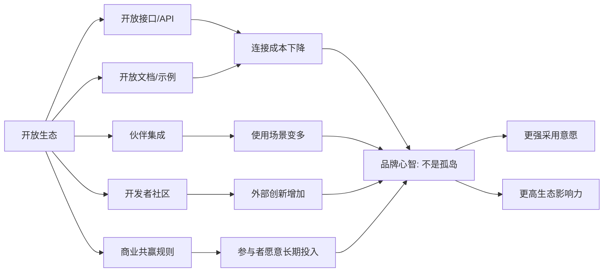
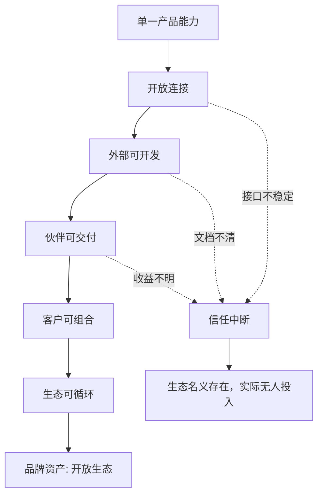

## 产品运营思维筑基课: 面向品牌影响力的运营公理: 开放生态
  
### 作者  
digoal  
  
### 日期  
2026-05-13
  
### 标签  
品牌影响力 , 开放生态 , 产品运营 , 技术平台 , 开发者社区 , 伙伴生态 , API , 生态建设 , 平台价值 , 运营公理
  
----  
  
## 背景 

> 面向对象: 中学生、高中生，以及刚接触技术产品运营的人  
> 核心问题: 为什么技术产品的品牌影响力，不只来自产品本身强，还来自它能不能形成开放生态？  
> 先说结论: 开放生态不是“我们有接口”这么简单，而是让用户、开发者、伙伴和第三方工具相信：围绕这个产品投入时间和资源，是可以连接、可以扩展、可以共赢、可以长期沉淀的。

一个技术产品再强，如果只能单独使用、难以集成、外部无法扩展、伙伴没有收益，它的品牌影响力就容易停留在“一个好工具”。

而开放生态能让品牌从“一个产品”变成“一个可参与的系统”。

这就是面向品牌影响力的运营公理：

技术产品越希望成为行业基础设施，越需要让外部参与者愿意围绕它建设、连接、学习、销售和创新。

---

## 一张图先看懂



开放生态的品牌价值，不只是让别人“能接入你”，而是让别人“愿意围绕你做事”。

---

## 求真讲法

### 它到底说了什么

“开放生态”在品牌影响力里，指的是一种外部预期：

用户和伙伴相信这个产品不是封闭孤岛，而是一个可以被连接、扩展、学习、共创和长期依赖的平台。

它至少包括五个层次：

| 层次 | 具体含义 | 用户或伙伴的判断 |
|---|---|---|
| 可连接 | 能通过 API、协议、插件、连接器接入其他系统 | 接入成本不高 |
| 可学习 | 文档、示例、教程、最佳实践清楚 | 学会它不难 |
| 可扩展 | 外部可以开发插件、模板、应用或解决方案 | 能做出自己的增量价值 |
| 可协作 | 有社区、伙伴计划、反馈机制和协作流程 | 不是单向控制 |
| 可获益 | 参与者能获得效率、收入、流量、能力或声誉 | 值得长期投入 |

所以，开放生态不是一个技术功能，而是一套降低外部参与成本、提高外部参与收益的系统。

### 它是怎么来的

技术产品往往不独立存在。

企业里有数据库、应用、权限系统、监控系统、数据管道、AI 模型、开发工具、报表平台。一个产品如果不能和这些系统协作，就会给用户制造额外成本。

用户会自然提出问题：

- 能不能接入我已有的系统？
- 能不能迁移我已有的数据和流程？
- 能不能和我熟悉的工具一起用？
- 如果我基于它开发东西，未来会不会被封死？
- 有没有其他人、其他公司也在围绕它建设？

这些问题背后，是对“生态风险”的判断。

```text
封闭产品
  ↓
连接成本高
  ↓
外部创新少
  ↓
用户迁移风险大
  ↓
伙伴投入意愿低
  ↓
品牌影响力受限
```

开放生态的动机，就是把一个产品从孤立能力，变成可连接、可扩展、可共同建设的能力网络。

### 它依赖哪些假设

这个公理成立，依赖以下假设：

1. 产品所在领域需要和外部系统、工具、数据、流程或伙伴协作。
2. 外部参与者有能力也有意愿围绕产品投入资源。
3. 产品方能提供相对稳定的接口、规则、文档和支持。
4. 生态参与者能获得可感知的收益，而不是只为产品方打工。
5. 开放不会让产品失去基本安全、质量和商业控制。

如果一个产品完全是一次性、封闭式、低连接需求的工具，开放生态就不是第一优先级。

### 常见误解

| 误解 | 为什么不对 |
|---|---|
| 有 API 就是开放生态 | API 只是入口，生态还需要文档、案例、伙伴、激励和治理 |
| 开放就是全部免费 | 开放强调可参与和可连接，不等于没有商业规则 |
| 生态越大越好 | 无规则扩张会带来质量、安全和体验问题 |
| 伙伴越多越好 | 没有真实集成和共同收益，伙伴名单只是装饰 |
| 开放会削弱品牌 | 有边界的开放能扩大品牌影响力，失控的开放才会伤害品牌 |

开放生态不是“完全放开”，而是“有规则地让外部参与者创造价值”。

---

## 求存讲法

### 它有什么用

对技术产品运营来说，开放生态至少有四个作用：

1. 降低用户采用成本：用户更容易把产品接进已有系统。
2. 扩大产品使用场景：外部伙伴能补足产品方做不到或来不及做的场景。
3. 增强品牌可信度：用户看到有更多工具、社区、伙伴和案例围绕它发展。
4. 形成长期壁垒：生态参与越多，产品越容易成为默认选择。

开放生态把品牌影响力从“我说我好”，变成“很多人围绕我创造价值”。

### 它怎么迁移到熟悉领域

可以把产品想象成一个学校社团。

封闭社团只允许少数人参加，规则不透明，资料不共享，别人想合作也不知道找谁。它可能内部很强，但影响力有限。

开放社团会公开招新规则、训练方法、活动流程、合作方式，还允许不同年级、不同班级的人一起做项目。时间久了，它不只是一个社团，而会变成学校里很多活动的连接中心。

技术产品也是这样。

开放生态让产品从“自己很强”，变成“能让更多人一起变强”。

### 它的适用范围和边界

开放生态特别适用于：

- 云计算、数据库、AI 平台、开发者工具、低代码平台、安全平台、数据平台。
- 有开发者、集成商、咨询伙伴、行业解决方案伙伴参与的 B2B 产品。
- 需要接入大量外部系统、数据源、模型、插件或业务流程的产品。
- 希望成为平台、基础设施或行业标准入口的产品。

但开放生态也有边界：

| 情况 | 风险 |
|---|---|
| 接口频繁变化 | 伙伴不敢投入，开发者失去信任 |
| 文档不清楚 | 开放变成形式，外部无法真正参与 |
| 没有质量治理 | 插件、集成和方案质量参差不齐 |
| 激励机制不合理 | 伙伴觉得只是替产品方免费获客 |
| 安全边界不清 | 开放引入数据、权限和合规风险 |

开放生态不是越开放越好，而是要让参与者在清晰规则下安全、稳定、有收益地协作。

### 正例: 怎么用它提升能力

假设一个企业 AI 平台希望建立“开放生态”的品牌影响力，可以这样运营：

1. 开放清晰 API：让客户能接入自己的数据、模型、权限系统和业务应用。
2. 建立连接器市场：支持数据库、文档系统、CRM、ERP、工单系统等常见工具。
3. 输出开发者文档：提供快速开始、示例代码、错误处理、最佳实践。
4. 建立伙伴计划：让集成商、咨询公司、行业软件商能基于平台交付方案。
5. 设计收益机制：让伙伴能获得销售线索、认证背书、联合营销或收入分成。
6. 维护治理规则：对插件、安全、版本兼容、数据权限有清晰要求。

这样做之后，用户不只看到一个 AI 产品，还会看到一个可连接企业现有系统、可扩展行业场景、可长期建设的生态。

这时品牌心智会从“它有某个功能”升级为：

“它是企业 AI 应用生态的重要入口。”

### 反例: 前提不成立会怎样

假设一个数据平台宣传自己“开放生态”，但实际情况是：

- API 不稳定，经常改字段。
- 文档过期，示例代码跑不通。
- 伙伴名单很多，但真实集成很少。
- 插件市场没有质量审核。
- 客户接入后遇到问题，产品方和伙伴互相推诿。
- 商业规则不透明，伙伴不知道长期收益在哪里。

这个反例失败的原因，不是“生态宣传不够响”，而是关键前提不成立：外部参与者没有稳定接口、清晰规则和可见收益。

结果是，开放生态变成了品牌负债。

---

## 思考

### 从产品到生态的迁移



开放生态的难点，不是宣布开放，而是让外部参与者真的敢投入。

### 三个反事实问题

1. 如果你停止主动销售，是否仍然有人愿意基于你的产品开发插件、教程、解决方案？
2. 如果一个客户已有复杂系统，你的产品是降低集成成本，还是增加集成负担？
3. 如果一个伙伴投入半年建设方案，它能否清楚知道收益、边界和规则？

这些问题能检验开放生态是不是已经成为品牌资产。

### 和“稳定可靠”的关系

开放生态必须建立在稳定可靠之上。

如果接口不稳定，开放会变成风险；如果文档不可靠，开放会变成负担；如果规则不稳定，伙伴会停止投入。

| 维度 | 稳定可靠 | 开放生态 |
|---|---|---|
| 核心问题 | 我能不能托付你？ | 我能不能围绕你建设？ |
| 主要受众 | 用户、客户、技术决策者 | 用户、开发者、伙伴、集成商 |
| 关键证据 | SLA、恢复机制、变更管理、案例 | API、文档、插件、伙伴、社区、规则 |
| 品牌心智 | 靠得住 | 不是孤岛，可共同成长 |

没有稳定可靠，开放生态会缺少信任底座；没有开放生态，稳定可靠可能只停留在单个产品范围内。

---

## 最后记住

1. 开放生态不是有 API，而是让外部参与者愿意长期投入。
2. 生态的核心是降低参与成本，提高参与收益。
3. 开放必须有规则，否则会带来质量、安全和信任风险。
4. 技术产品想成为平台，就必须从产品能力走向生态能力。
5. 品牌影响力越强的开放生态，越能让市场相信你不是孤岛，而是连接中心。

---

## 参考资料

- Geoffrey G. Parker, Marshall W. Van Alstyne, Sangeet Paul Choudary, *Platform Revolution*：平台和生态系统如何通过多边参与者创造价值。
- James F. Moore, “Predators and Prey: A New Ecology of Competition”：商业生态系统概念有助于理解企业如何围绕共同价值网络竞争与协作。
- David A. Aaker, *Managing Brand Equity*：品牌资产理论可用于理解生态信任和品牌联想的长期价值。
- Al Ries, Jack Trout, *Positioning: The Battle for Your Mind*：定位理论帮助理解“开放生态”如何成为用户心智中的品牌差异。
- Carl Shapiro, Hal R. Varian, *Information Rules*：网络效应、兼容性和锁定成本有助于解释开放生态为什么影响技术产品采用。
  
#### [PostgreSQL 解决方案集合](../201706/20170601_02.md "40cff096e9ed7122c512b35d8561d9c8")
  
  
#### [德哥 / digoal's Github - 公益是一辈子的事.](https://github.com/digoal/blog/blob/master/README.md "22709685feb7cab07d30f30387f0a9ae")
  
  
#### [About 德哥](https://github.com/digoal/blog/blob/master/me/readme.md "a37735981e7704886ffd590565582dd0")
  
  

  
