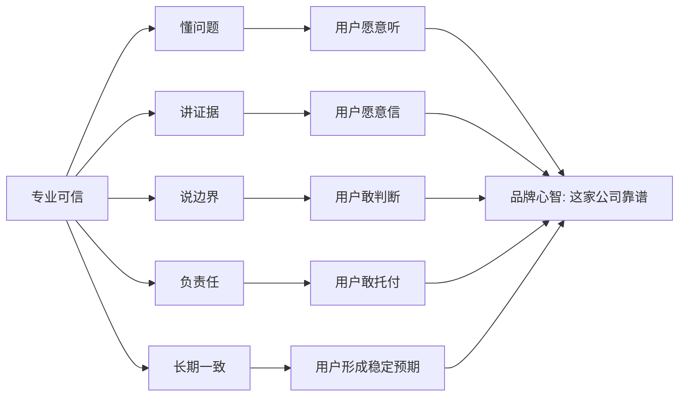
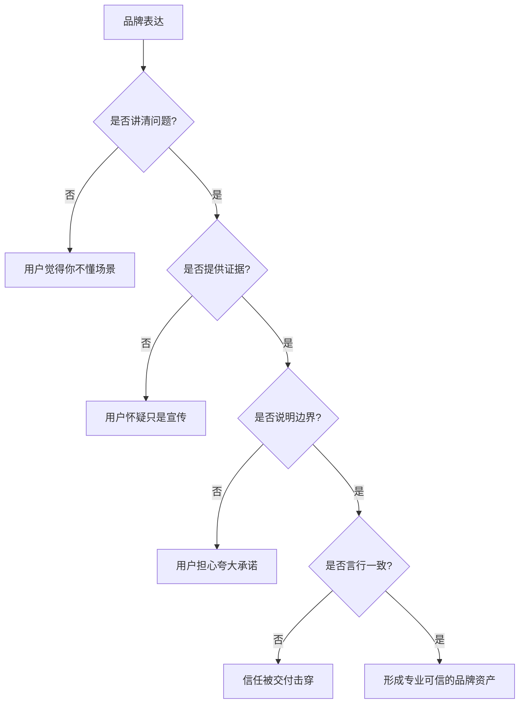

## 产品运营思维筑基课: 面向品牌影响力的运营公理: 专业可信
  
### 作者  
digoal  
  
### 日期  
2026-05-13
  
### 标签  
品牌影响力 , 专业可信 , 产品运营 , 技术品牌 , 证据表达 , 边界意识 , 用户信任 , 专业判断 , 内容运营 , 运营公理
  
----  
  
## 背景 

> 面向对象: 中学生、高中生，以及刚接触技术产品运营的人  
> 核心问题: 为什么技术产品的品牌影响力，不能只靠热闹传播，而必须让用户觉得专业可信？  
> 先说结论: 专业可信不是把话说得复杂，而是让用户相信你真的理解问题、尊重事实、知道边界、能负责任地给出判断，并且长期言行一致。

技术产品的用户，尤其是企业客户、开发者、架构师和技术决策者，不只听你说“我们很强”。

他们更关心：

“你真的懂我的问题吗？”

“你说的话有没有证据？”

“你知道自己做不到什么吗？”

“我能不能根据你的判断做决策？”

所以，面向品牌影响力，“专业可信”是一条基础公理：

技术品牌的影响力，首先来自目标用户相信你有资格谈这个问题。

---

## 一张图先看懂



专业可信的品牌价值，不是让用户觉得你“术语很多”，而是让用户觉得你“判断可靠”。

---

## 求真讲法

### 它到底说了什么

“专业可信”在品牌影响力里，是用户对一个产品、团队或品牌的认知判断：

这个品牌不是只会包装概念，而是真的理解专业问题，并且能用证据、逻辑和负责任的态度帮助用户做判断。

它由四个部分组成：

| 组成 | 用户看到什么 | 用户形成什么判断 |
|---|---|---|
| 专业理解 | 能讲清楚问题机制、因果链和场景差异 | 你懂我面对的问题 |
| 证据约束 | 有数据、案例、测试、文档、复盘支持 | 你不是随口承诺 |
| 边界意识 | 会说明适用条件、限制和代价 | 你没有故意夸大 |
| 责任一致 | 销售、文档、交付、支持说法一致 | 你值得长期信任 |

所以，专业可信不是“显得高级”，而是“让人可以依据你的话做决定”。

### 它是怎么来的

技术产品通常有三个特点：

1. 复杂：用户很难在短时间内完全理解所有细节。
2. 高风险：一旦选错，可能带来迁移成本、故障风险、机会成本。
3. 长周期：采购、集成、运维、升级和续费会持续很久。

在这种情况下，用户不仅购买功能，也购买判断。

如果一个品牌表现得专业可信，用户会降低认知成本：

```text
复杂问题
  ↓
用户难以完全验证
  ↓
需要可信判断来源
  ↓
品牌持续给出有证据、有边界的解释
  ↓
用户形成信任
  ↓
品牌影响力提升
```

这就是专业可信的来源：它帮助用户在复杂技术选择中减少不确定性。

### 它依赖哪些假设

这个公理成立，依赖以下假设：

1. 用户面对的问题有一定专业门槛，不是完全凭直觉就能判断。
2. 用户的选择会带来成本、风险或长期影响。
3. 用户会比较不同品牌的解释质量、证据质量和责任态度。
4. 品牌的内容、销售、产品和交付行为会被用户综合观察。
5. 长期信任比短期注意更重要。

如果一个产品是一次性低风险消费品，专业可信仍然有价值，但它未必是最强的品牌驱动因素。

### 常见误解

| 误解 | 为什么不对 |
|---|---|
| 专业可信就是多用术语 | 术语多不代表理解深，反而可能增加用户负担 |
| 专业可信就是永远肯定自己 | 真正专业的人会说明条件、代价和不适用场景 |
| 专业可信只靠专家背书 | 背书有用，但长期可信还要靠产品、文档、交付和支持一致 |
| 专业可信不能做传播 | 专业内容也需要清楚表达，否则用户无法理解和复述 |
| 承认限制会削弱品牌 | 对技术产品来说，清楚边界常常会增强信任 |

专业可信不是“把自己包装成权威”，而是“持续做出符合专业伦理和用户利益的表达”。

---

## 求存讲法

### 它有什么用

对技术产品运营来说，专业可信至少有五个作用：

1. 提高内容和品牌表达的说服力。
2. 降低用户对技术承诺的怀疑。
3. 帮助销售、解决方案和客户成功建立统一话术。
4. 在复杂采购中成为决策参考来源。
5. 当市场出现噪音、热点和夸大宣传时，保持品牌稳态。

专业可信让品牌从“会说话”升级为“值得听”。

### 它怎么迁移到熟悉领域

可以把它想象成两个学习资料账号。

第一个账号标题很夸张：“三分钟学会所有数学难题”。内容里全是技巧口号，但不讲条件、不讲证明、不讲错误用法。

第二个账号标题普通，但它会先说明题型，再解释为什么这样想，给出例题、变式、常见陷阱，还告诉你这个方法在哪些题里不能用。

你可能会被第一个账号吸引一下，但真正复习考试时，更愿意依赖第二个账号。

品牌里的专业可信也是这样。

短期注意可以靠夸张表达获得，长期信任必须靠专业质量获得。

### 它的适用范围和边界

专业可信特别适用于：

- 数据库、云服务、安全、AI、开发者工具、企业软件等技术产品。
- 面向 CTO、架构师、开发者、DBA、运维、安全负责人等专业用户的产品。
- 采购周期长、决策链复杂、切换成本高的 B2B 产品。
- 需要通过内容、社区、案例和技术活动建立影响力的品牌。

它的边界也很清楚：

| 情况 | 风险 |
|---|---|
| 只讲专业，不讲用户任务 | 用户觉得你自说自话 |
| 只讲证据，不讲结论 | 用户难以做决策 |
| 只讲边界，不讲价值 | 品牌显得没有立场 |
| 只讲专家语言，不做翻译 | 非专家决策者无法理解 |
| 内容可信，交付不可信 | 品牌信任会被现实体验击穿 |

专业可信不是把内容写成论文，而是把复杂判断变成用户能使用的判断。

### 正例: 怎么用它提升能力

假设一个数据库产品希望建立“专业可信”的品牌影响力，可以这样运营：

1. 先讲问题：为什么高并发、长事务、索引膨胀、冷热数据会影响业务稳定性。
2. 再讲机制：产品如何通过事务、索引、存储、优化器、复制机制解决问题。
3. 给出证据：测试方法、真实案例、版本差异、故障复盘、性能边界。
4. 说明限制：哪些场景适合，哪些场景需要额外设计，哪些承诺不能乱给。
5. 保持一致：官网、文档、销售、技术支持、社区文章说法一致。
6. 长期更新：随着版本变化及时修订内容，不让旧内容误导用户。

这样形成的品牌心智不是“这家公司声音大”，而是：

“这家公司懂数据库，也愿意负责任地说清楚。”

### 反例: 前提不成立会怎样

假设一个 AI 产品宣传自己“专业可信”，但实际运营中：

- 用很多专业词，但解释不了用户场景。
- 宣称效果领先，但不给测试条件。
- 遇到模型幻觉、数据安全、权限边界时含糊其辞。
- 销售承诺和技术文档不一致。
- 客户上线后发现很多限制从未提前说明。

这个反例失败的原因，不是表达不够华丽，而是关键假设不成立：用户面对的是高风险专业选择，需要证据、边界和责任一致。

一旦用户发现品牌说法经不起验证，专业感会迅速变成不可信。

---

## 思考

### 从表达到信任的路径



专业可信不是文案技巧，而是内容、产品、销售、交付、支持共同形成的信任结果。

### 三个反事实问题

1. 如果用户把你的文章发给内部技术评审，你的说法能不能经得起追问？
2. 如果销售不在场，用户能不能凭你的公开资料做出初步判断？
3. 如果产品有明显边界，你是提前说明，还是等用户踩坑后再解释？

这些问题能检验专业可信是否真实存在。

### 和“开放生态”的关系

开放生态解决的是：“别人能不能围绕你建设？”

专业可信解决的是：“别人为什么敢围绕你建设？”

如果一个品牌看起来开放，但文档混乱、承诺夸大、边界不清，开发者和伙伴不会长期投入。

| 维度 | 开放生态 | 专业可信 |
|---|---|---|
| 核心问题 | 能不能连接和共建 | 能不能相信你的判断 |
| 主要证据 | API、文档、插件、伙伴、社区 | 问题理解、证据、边界、责任一致 |
| 影响对象 | 用户、开发者、伙伴 | 专业用户、决策者、评审者 |
| 品牌心智 | 不是孤岛 | 这家公司靠谱 |

开放生态扩大影响范围，专业可信提高影响质量。

---

## 最后记住

1. 专业可信不是术语堆砌，而是用户相信你的判断可靠。
2. 技术产品越复杂，越需要用证据和边界建立信任。
3. 承认适用范围和限制，不会削弱可信度，反而能增强可信度。
4. 专业可信必须贯穿内容、销售、产品、交付和支持。
5. 品牌影响力的底层不是“让人注意你”，而是“让人愿意依据你做决定”。

---

## 参考资料

- David A. Aaker, *Managing Brand Equity*：品牌资产理论可用于理解信任、品牌联想和长期认知积累。
- Al Ries, Jack Trout, *Positioning: The Battle for Your Mind*：定位理论帮助理解专业可信如何进入用户心智。
- Robert B. Cialdini, *Influence: The Psychology of Persuasion*：权威、社会证明和一致性原则有助于解释可信感如何形成。
- Philip Kotler, Kevin Lane Keller, *Marketing Management*：B2B 品牌、信任和价值主张的表达可作为运营参考。
- Michael Spence, “Job Market Signaling”：信号理论可用于理解为什么证据、边界和一致行为比口号更能建立信任。
  
#### [PostgreSQL 解决方案集合](../201706/20170601_02.md "40cff096e9ed7122c512b35d8561d9c8")
  
  
#### [德哥 / digoal's Github - 公益是一辈子的事.](https://github.com/digoal/blog/blob/master/README.md "22709685feb7cab07d30f30387f0a9ae")
  
  
#### [About 德哥](https://github.com/digoal/blog/blob/master/me/readme.md "a37735981e7704886ffd590565582dd0")
  
  

  
