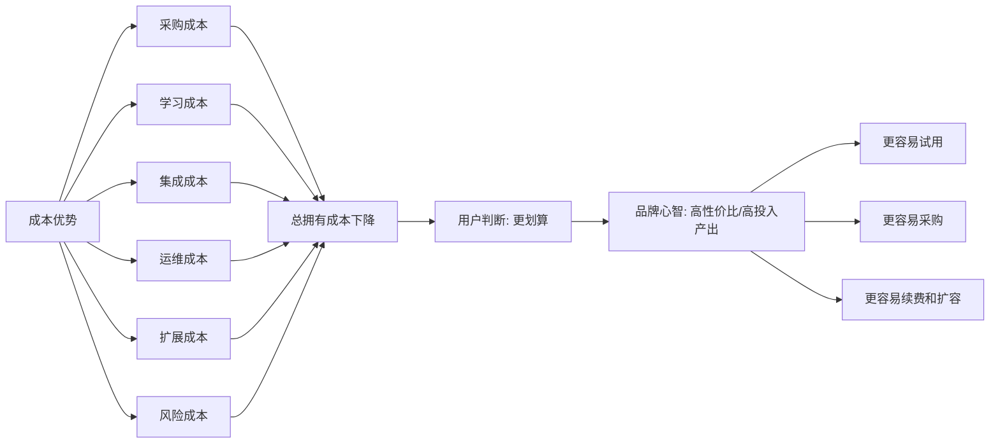
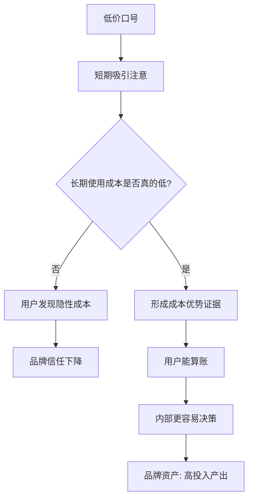

## 产品运营思维筑基课: 面向品牌影响力的运营公理: 成本优势
  
### 作者  
digoal  
  
### 日期  
2026-05-13
  
### 标签  
品牌影响力 , 成本优势 , 产品运营 , 总拥有成本 , TCO , ROI , 技术产品 , 经济性 , 投入产出 , 运营公理
  
----  
  
## 背景 

> 面向对象: 中学生、高中生，以及刚接触技术产品运营的人  
> 核心问题: 为什么技术产品的品牌影响力，不只来自技术强、品牌响，还来自用户相信它能带来真实成本优势？  
> 先说结论: 成本优势不是“价格更低”，而是让用户相信：在购买、使用、迁移、运维、扩展和风险控制的全过程里，选择这个产品的总成本更低、投入产出更高。

很多产品运营一提“成本优势”，就容易讲成“我们更便宜”。

但技术产品尤其不能只看标价。

一个产品买起来便宜，但部署复杂、学习困难、故障频繁、扩展昂贵、迁移痛苦，最后可能反而更贵。

所以，面向品牌影响力，“成本优势”的真正含义是：

用户相信你能帮助他用更少的综合代价，完成更重要的任务。

---

## 一张图先看懂



成本优势的品牌价值，不是让用户觉得你“便宜”，而是让用户相信你“综合算下来更值得”。

---

## 求真讲法

### 它到底说了什么

“成本优势”在品牌影响力里，是用户对一个产品的经济性判断：

这个产品能不能用更低的总成本，帮助我完成同样或更好的任务？

这里的总成本，不只是价格，而是总拥有成本。总拥有成本，英文常叫 TCO，意思是一个产品从购买到长期使用所需要付出的全部代价。

| 成本类型 | 用户实际付出的代价 | 技术产品里的例子 |
|---|---|---|
| 采购成本 | 买产品或订阅服务的钱 | license、云资源、套餐费用 |
| 学习成本 | 学会使用需要的时间 | 文档、培训、上手难度 |
| 集成成本 | 接入现有系统的成本 | API、连接器、数据迁移 |
| 运维成本 | 长期维护和排障成本 | 监控、备份、升级、故障处理 |
| 扩展成本 | 业务增长后的追加成本 | 扩容、性能优化、容量规划 |
| 风险成本 | 出错带来的损失 | 停机、数据丢失、安全事故 |

所以，成本优势不是一个价格标签，而是一套综合账本。

### 它是怎么来的

技术产品的采用，通常不是“一手交钱一手交货”这么简单。

用户买来以后，还要学习、部署、集成、迁移、排障、升级、扩容、培训团队，并承担系统失败的风险。

因此，用户真正关心的是：

```text
表面价格
  + 学习成本
  + 集成成本
  + 运维成本
  + 扩展成本
  + 风险成本
  - 效率收益
  - 增长收益
  = 真实经济性
```

如果一个产品能显著降低这些隐性成本，即使标价不是最低，也可能形成强成本优势。

品牌运营要做的，就是把这种优势解释清楚、证据化、场景化，让用户能算账。

### 它依赖哪些假设

这个公理成立，依赖以下假设：

1. 用户会把产品用于真实任务，而不是只看演示效果。
2. 用户需要承担长期使用、维护、扩展和风险成本。
3. 用户有预算约束，需要比较不同方案的投入产出。
4. 产品的效率、稳定性、自动化、兼容性会影响总体成本。
5. 用户愿意相信可验证的成本证据，而不是只听价格口号。

如果一个产品只是一次性低价消费品，或者用户只关心即时体验，那么总成本模型的重要性会下降。

### 常见误解

| 误解 | 为什么不对 |
|---|---|
| 成本优势就是最低价 | 低价可能带来更高学习、运维、故障和迁移成本 |
| 价格高就没有成本优势 | 如果效率更高、风险更低、扩展更省，总成本可能更低 |
| 免费产品一定成本最低 | 免费不等于无成本，时间、维护、安全和机会成本仍然存在 |
| 成本优势只属于销售话术 | 技术架构、产品设计、运维机制都会影响真实成本 |
| 只要做一个 ROI 表就够了 | ROI 必须基于真实场景、真实假设和可验证数据 |

成本优势不是“便宜感”，而是“算得清、算得过、算得久”。

---

## 求存讲法

### 它有什么用

对技术产品运营来说，成本优势至少有五个作用：

1. 降低用户试用和采购的心理门槛。
2. 帮助用户向内部解释为什么要选择你。
3. 在预算收紧时增强产品韧性。
4. 支持续费、扩容和迁移替换决策。
5. 让品牌从“功能供应商”升级为“效率改善者”。

很多企业客户不是不愿意买好产品，而是需要证明这笔投入值得。

成本优势能给用户一个内部沟通语言：

“这不是多花钱，而是在降低总成本。”

### 它怎么迁移到熟悉领域

可以想象买一支笔。

第一支笔 1 元，但经常断墨，写作业时卡住，还要反复换。

第二支笔 5 元，但书写稳定、耐用、不漏墨，考试时不容易出问题。

如果只看标价，第一支便宜；如果看完成任务的总成本，第二支可能更划算。

技术产品也是这样。

用户不是在买一个标价，而是在买“完成任务的确定性和效率”。

### 它的适用范围和边界

成本优势特别适用于：

- 云计算、数据库、存储、AI 平台、数据平台、安全产品、研发工具。
- 使用规模大、运行时间长、运维投入高的技术产品。
- 需要企业内部预算审批、ROI 说明和采购比较的 B2B 产品。
- 能通过自动化、资源效率、稳定性、弹性扩展降低用户总成本的产品。

但它也有边界：

| 情况 | 成本优势表达的风险 |
|---|---|
| 只讲省钱，不讲能力 | 品牌容易被看成低端替代品 |
| 成本计算假设不透明 | 用户会怀疑是营销包装 |
| 忽略迁移成本 | 用户上线后发现真实成本更高 |
| 忽略风险成本 | 低价方案可能带来高故障代价 |
| 不同客户场景差异大 | 一套成本模型无法适配所有人 |

成本优势必须和价值、风险、边界一起讲。否则它会从品牌资产变成价格战入口。

### 正例: 怎么用它提升能力

假设一个云数据库产品希望建立“成本优势”的品牌影响力，可以这样运营：

1. 明确用户场景：高并发交易、海量日志分析、冷热数据存储、业务高峰弹性扩容。
2. 拆开成本结构：计算资源、存储资源、运维人力、故障损失、扩容成本、迁移成本。
3. 给出机制解释：为什么架构设计能减少资源浪费、人工运维和故障恢复时间。
4. 提供可复算案例：某类客户在相同负载下节省多少资源或人力。
5. 说明适用边界：哪些规模、负载、数据模型下更有优势，哪些场景不一定省。
6. 给用户工具：成本测算器、迁移评估表、容量规划模板、ROI 说明材料。

这样的运营不是简单降价，而是帮助用户把账算清楚。

用户最终形成的品牌心智是：

“这个产品不仅能用，而且长期用下来更经济。”

### 反例: 前提不成立会怎样

假设一个 AI 平台宣传“成本最低”，但实际情况是：

- 单次调用价格低，但输出质量不稳定，需要大量人工复核。
- 接入很快，但权限、数据治理和监控要客户自己补。
- 初期套餐便宜，但规模扩大后费用快速上升。
- 没有说明模型效果、延迟、稳定性和成本之间的取舍。
- 客户上线后发现省下的是采购钱，多出来的是运维和风险成本。

这个反例失败的原因，不是价格不够低，而是关键前提不成立：用户关心的是完成任务的总成本，不是孤立的单价。

如果品牌把成本优势讲成低价口号，就容易吸引错误预期，最后损害信任。

---

## 思考

### 从低价到成本优势



成本优势的关键，是把“便宜”升级成“经济性可证明”。

### 三个反事实问题

1. 如果你的产品不是最低价，用户还能不能解释为什么它更划算？
2. 如果客户使用规模扩大 10 倍，你的成本优势会增强，还是会消失？
3. 如果把故障、运维、学习和迁移都算进去，你的方案还是否有优势？

这些问题能检验成本优势是不是已经成为真实品牌资产。

### 和“专业可信”的关系

成本优势必须建立在专业可信之上。

如果品牌不可信，用户会认为你的成本测算只是销售包装；如果品牌专业可信，用户才愿意认真看你的假设、方法和数据。

| 维度 | 专业可信 | 成本优势 |
|---|---|---|
| 核心问题 | 我能不能相信你的判断？ | 选择你是不是更划算？ |
| 主要证据 | 问题理解、数据、边界、责任一致 | TCO、ROI、资源效率、运维节省、风险降低 |
| 用户收益 | 降低判断风险 | 降低经济成本 |
| 品牌心智 | 这家公司靠谱 | 这家公司帮我省总成本 |

专业可信让用户愿意听你算账，成本优势让用户有理由推动决策。

---

## 最后记住

1. 成本优势不是低价，而是总成本更低、投入产出更高。
2. 技术产品的真实成本包括学习、集成、运维、扩展和风险。
3. 成本优势必须可解释、可测算、可复核，不能只靠销售口号。
4. 只讲省钱容易变成价格战，讲清总成本才会变成品牌资产。
5. 好的成本优势表达，是帮助用户把复杂账算清楚。

---

## 参考资料

- Michael E. Porter, *Competitive Advantage*：成本领先和差异化是竞争优势的重要来源，但成本优势需要建立在价值链能力上。
- Clayton M. Christensen, *The Innovator's Dilemma*：新技术产品常通过不同成本结构进入市场，但必须匹配真实用户任务。
- Geoffrey A. Moore, *Crossing the Chasm*：主流客户采用技术产品时，需要完整产品、低风险和可解释的经济价值。
- Thomas H. Davenport, *Process Innovation*：流程效率、自动化和组织成本改善有助于理解技术产品的经济性。
- David A. Aaker, *Managing Brand Equity*：品牌资产理论可用于理解“高投入产出”如何形成长期品牌联想。
  
#### [PostgreSQL 解决方案集合](../201706/20170601_02.md "40cff096e9ed7122c512b35d8561d9c8")
  
  
#### [德哥 / digoal's Github - 公益是一辈子的事.](https://github.com/digoal/blog/blob/master/README.md "22709685feb7cab07d30f30387f0a9ae")
  
  
#### [About 德哥](https://github.com/digoal/blog/blob/master/me/readme.md "a37735981e7704886ffd590565582dd0")
  
  

  
