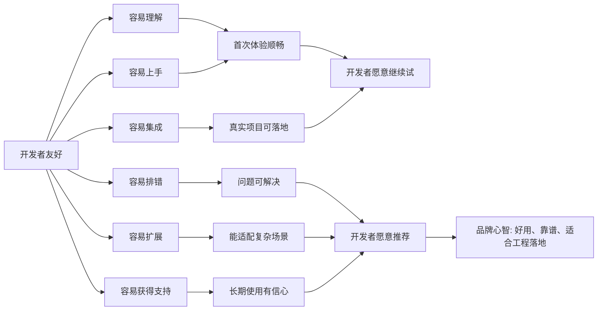
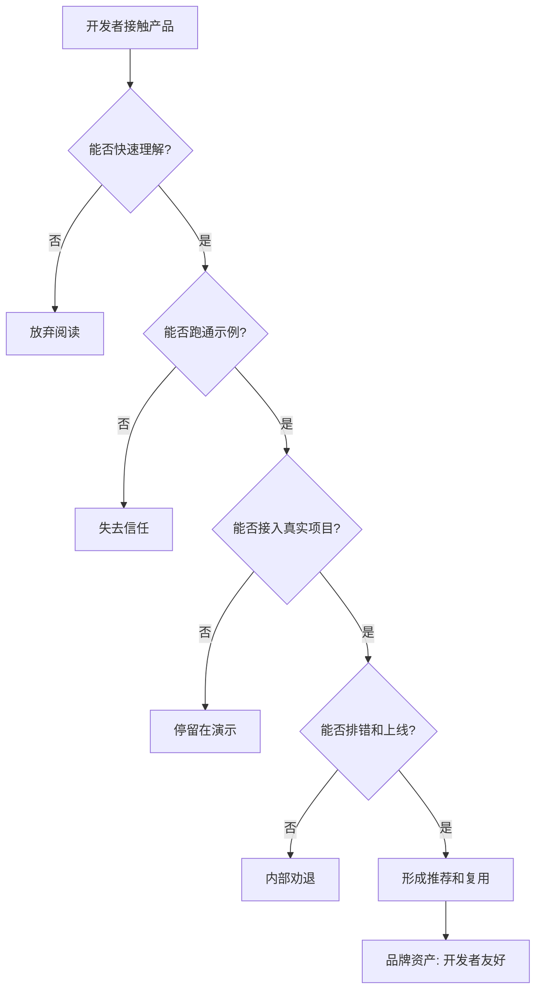

## 产品运营思维筑基课: 面向品牌影响力的运营公理: 开发者友好
  
### 作者  
digoal  
  
### 日期  
2026-05-13
  
### 标签  
品牌影响力 , 开发者友好 , 产品运营 , 开发者体验 , 文档 , API , SDK , 工程落地 , 技术品牌 , 运营公理
  
----  
  
## 背景 

> 面向对象: 中学生、高中生，以及刚接触技术产品运营的人  
> 核心问题: 为什么技术产品的品牌影响力，常常取决于开发者觉得它好不好用、好不好接、好不好排错？  
> 先说结论: 开发者友好不是“我们重视开发者”的口号，而是让开发者从第一次接触到生产落地的每一步，都能更快理解、更快上手、更少踩坑、更容易获得帮助。

技术产品如果面向开发者、工程团队或企业技术系统，就不能只让老板觉得不错，也要让真正动手的人觉得顺手。

很多产品败在一个细节上：

演示很好看，官网很漂亮，但开发者一接入就发现文档混乱、示例跑不通、错误信息看不懂、版本兼容不稳定。

这时品牌影响力会迅速受损。

所以，面向品牌影响力，“开发者友好”是一条基础公理：

能被开发者快速理解、低摩擦接入、稳定使用并愿意推荐的产品，更容易成为技术品牌。

---

## 一张图先看懂



开发者友好的品牌价值，不是让开发者觉得你“态度好”，而是让开发者觉得你“不会浪费我的时间”。

---

## 求真讲法

### 它到底说了什么

“开发者友好”在品牌影响力里，是开发者对产品工程体验的综合判断：

这个产品是否尊重开发者的时间、认知负担、调试成本和生产风险？

它至少包含六个方面：

| 方面 | 开发者关心什么 | 品牌上形成的判断 |
|---|---|---|
| 文档清楚 | 能不能快速知道怎么用 | 这家公司懂开发者 |
| 示例可跑 | 代码能不能直接验证 | 不是只会写概念 |
| API 稳定 | 接口会不会频繁破坏兼容 | 可以长期接入 |
| 错误可诊断 | 出错时能不能定位原因 | 排错不折磨人 |
| 工具完善 | SDK、CLI、测试环境是否好用 | 工程接入成本低 |
| 支持有效 | issue、社区、工单是否有回应 | 遇到问题有人管 |

所以，开发者友好不是某一个页面或活动，而是完整的开发者体验。

### 它是怎么来的

开发者使用技术产品时，通常不是为了“体验一下”，而是为了完成一个工程任务。

他们会经历一条路径：

```text
看见产品
  ↓
理解它解决什么问题
  ↓
跑通第一个示例
  ↓
接入真实项目
  ↓
处理错误和边界
  ↓
上线生产环境
  ↓
长期维护和升级
```

每一步都有摩擦。

如果摩擦太大，开发者可能不会抱怨，只会离开，或者在团队内部说一句：

“别用这个，太难接。”

这句话对品牌的杀伤力很大。

开发者友好的动机，就是降低这条路径上的摩擦，让技术能力真正进入开发者工作流。

### 它依赖哪些假设

这个公理成立，依赖以下假设：

1. 产品需要开发者、架构师、运维或技术团队参与采用和落地。
2. 开发者的体验会影响产品试用、采购、集成、续费和口碑。
3. 产品价值必须通过真实接入和工程实践才能被验证。
4. 开发者有替代选择，遇到高摩擦产品会转向其他方案。
5. 品牌影响力不仅来自宣传，也来自开发者社区里的真实评价。

如果一个产品完全不需要技术人员参与，开发者友好就不是主要品牌公理。

### 常见误解

| 误解 | 为什么不对 |
|---|---|
| 开发者友好就是写几篇教程 | 教程只是入口，真正友好还包括 API、工具、错误处理、支持和兼容性 |
| 开发者只关心技术强不强 | 技术强但难用、难接、难排错，仍然会被放弃 |
| 文档可以等产品成熟后再补 | 对开发者产品来说，文档本身就是产品体验的一部分 |
| 错误信息不重要 | 错误信息决定排错成本，会直接影响开发者口碑 |
| 开发者友好等于免费 | 开发者愿意为稳定、清晰、高效、可维护的产品付费 |

开发者友好不是“讨好开发者”，而是尊重工程落地的真实成本。

---

## 求存讲法

### 它有什么用

对技术产品运营来说，开发者友好至少有五个作用：

1. 提高试用转化：开发者能快速跑通第一个结果。
2. 降低接入成本：真实项目集成更顺畅。
3. 增强技术口碑：开发者愿意在团队、社区和文章里推荐。
4. 推动自传播：好文档、好示例、好工具会被反复引用。
5. 支持生态建设：插件、SDK、模板和第三方集成更容易出现。

开发者友好让品牌从“我说我能做”，变成“开发者自己能跑通、能验证、能扩展”。

### 它怎么迁移到熟悉领域

可以把开发者友好想象成一本数学辅导书。

一本书封面很好看，宣传说“覆盖全部考点”，但里面概念跳跃、例题没有步骤、答案没有解析，学生遇到错误不知道为什么错。

另一本书不夸张，但它先讲问题，再给例题，再给练习，再给易错点，还告诉你遇到卡住时怎么检查。

第二本书更“学习者友好”。

技术产品里的开发者友好也是这样：

不是把知识摆出来，而是帮使用者顺利完成任务。

### 它的适用范围和边界

开发者友好特别适用于：

- API 服务、云平台、数据库、AI 平台、开发框架、开源项目、SDK、CLI 工具。
- 需要开发者试用、集成、二次开发或运维的技术产品。
- 以开发者社区、技术内容和生态扩展作为增长路径的产品。
- 需要进入企业研发流程、生产系统或技术选型清单的产品。

它也有边界：

| 情况 | 风险 |
|---|---|
| 只优化入门，不优化生产 | 开发者试用顺利，上线困难 |
| 文档漂亮但代码不可跑 | 信任会迅速下降 |
| API 易用但不稳定 | 长期维护成本变高 |
| 支持响应快但没有根因解决 | 问题反复出现，开发者疲惫 |
| 只面向高手 | 新开发者难进入，生态扩张受限 |

开发者友好不能只看“第一次上手”，还要看“长期维护是否省心”。

### 正例: 怎么用它提升能力

假设一个向量数据库产品希望建立“开发者友好”的品牌影响力，可以这样运营：

1. 首页清楚说明适用场景：相似搜索、RAG、推荐、图像检索、多模态检索。
2. 提供 5 分钟快速开始：本地安装、云端试用、样例数据、第一条查询。
3. 保证示例可运行：每个 SDK 示例都有版本、依赖和测试说明。
4. 设计清晰错误信息：维度不匹配、索引未构建、权限不足等错误能指向解决办法。
5. 提供生产指南：容量规划、备份恢复、监控指标、性能调优、安全权限。
6. 建立反馈通道：GitHub issue、社区问答、工单、版本变更说明。

这样形成的品牌心智是：

“这个产品不仅技术能打，而且开发者真的能用起来。”

### 反例: 前提不成立会怎样

假设一个云 API 产品宣传“开发者友好”，但实际情况是：

- 快速开始文档已经过期。
- 示例代码缺少依赖版本，复制后跑不通。
- API 返回错误只有 `invalid request`，没有字段、原因和修复建议。
- 版本升级破坏兼容，却没有迁移指南。
- 社区问题长期没人回应。
- 官网只讲能力，不讲配额、限制、重试、限流和安全边界。

这个反例失败的原因，不是品牌声音不够大，而是关键前提不成立：开发者需要低摩擦完成真实工程任务。

当开发者觉得产品浪费时间，品牌影响力会从技术圈内部被削弱。

---

## 思考

### 从开发者体验到品牌影响力



开发者友好不是运营包装，而是产品、文档、工具、社区和支持共同形成的工程体验。

### 三个反事实问题

1. 如果一个开发者没有销售陪同，只看公开资料，能否在半小时内跑通第一个结果？
2. 如果一个项目上线后出错，开发者能否根据错误信息、日志和文档定位问题？
3. 如果一个团队使用半年后升级版本，迁移成本是可控的，还是充满惊吓？

这些问题能检验“开发者友好”是不是已经进入品牌心智。

### 和“开放生态”的关系

开放生态解决的是：“外部能不能围绕你建设？”

开发者友好解决的是：“外部建设者能不能顺利开始并持续建设？”

没有开发者友好，开放生态会停留在口号；没有开放生态，开发者友好可能只服务于单一产品。

| 维度 | 开放生态 | 开发者友好 |
|---|---|---|
| 核心问题 | 能不能共建 | 能不能顺利动手 |
| 主要证据 | API、伙伴、插件、社区、商业规则 | 文档、示例、SDK、错误信息、支持、兼容性 |
| 影响对象 | 开发者、伙伴、客户系统 | 真正写代码、集成和运维的人 |
| 品牌心智 | 不是孤岛 | 好接、好用、好排错 |

开放生态决定外部参与空间，开发者友好决定外部参与摩擦。

---

## 最后记住

1. 开发者友好不是口号，而是开发者完成任务时的低摩擦体验。
2. 文档、示例、API、错误信息、SDK、支持，都是品牌的一部分。
3. 技术强但难用，仍然会失去开发者口碑。
4. 开发者友好既看首次上手，也看生产落地和长期维护。
5. 真正的技术品牌，必须让动手的人愿意继续用、愿意推荐。

---

## 参考资料

- Steve Krug, *Don't Make Me Think*：可用性原则有助于理解为什么低认知负担会影响采用。
- Donald A. Norman, *The Design of Everyday Things*：可理解性、反馈和错误处理是良好体验的重要基础。
- Martin Fowler, “Public APIs”：公开 API 需要重视稳定性、演进和开发者体验。
- Stripe API documentation and developer experience practices：业界常用作开发者友好文档、示例和 API 体验的参考案例。
- Geoffrey G. Parker, Marshall W. Van Alstyne, Sangeet Paul Choudary, *Platform Revolution*：平台生态依赖外部参与者，开发者体验会影响生态扩张。
  
#### [PostgreSQL 解决方案集合](../201706/20170601_02.md "40cff096e9ed7122c512b35d8561d9c8")
  
  
#### [德哥 / digoal's Github - 公益是一辈子的事.](https://github.com/digoal/blog/blob/master/README.md "22709685feb7cab07d30f30387f0a9ae")
  
  
#### [About 德哥](https://github.com/digoal/blog/blob/master/me/readme.md "a37735981e7704886ffd590565582dd0")
  
  

  
