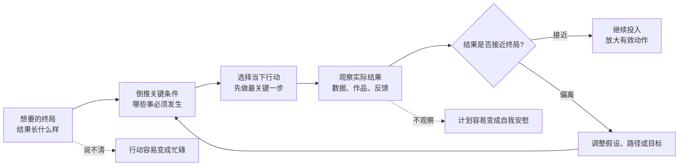

## 思维筑基课: 以终为始, 以果决行
  
### 作者  
digoal  
  
### 日期  
2026-05-16  
  
### 标签  
目标导向 , 结果导向 , 用户导向 , 以终为始 , 以果决行 
  
----  
  
## 背景

  
> 面向对象: 高中生及以上  
> 核心问题: 为什么很多人很努力, 但越忙越偏? 怎样让行动真正服务于结果?  
> 先说结论: "以终为始"是先想清楚最后要到达的状态, 再倒推今天该做什么; "以果决行"是用已经出现的结果校正行动, 而不是只凭热情、计划或自我感觉继续前进。  

## 一张图先看懂



这句话可以拆成两个动作:

```text
以终为始: 先定义终点 -> 再安排起点
以果决行: 先观察结果 -> 再决定下一步

只以始为始: 今天想做什么就做什么
只以愿决行: 我希望它有用, 所以继续做
```

## 求真讲法

### 它到底说了什么

"以终为始"不是让人幻想成功, 而是让人先定义"什么叫成功"。如果你说"我要学好英语", 这还不是终局; 如果你说"三个月后能听懂 80% 的英文课程视频, 并能用 3 分钟讲清主要观点", 这才比较像可判断的终局。

"以果决行"也不是只看分数或短期结果, 而是用结果来检验行动是否有效。结果可以是考试成绩、用户反馈、作品质量、训练记录、身体指标, 也可以是老师或同伴给出的具体评价。关键是: 结果必须能帮助你判断下一步该坚持、修正还是停止。

### 它是怎么来的

这个原则来自一个很朴素的行动逻辑: 人的时间和精力有限, 所以行动必须服务于目标; 但计划又常常会错, 所以目标不能只停在脑子里, 还要接受结果反馈。

它背后有几条常见的思想来源:

- 管理学里的"目标管理": 先定义目标, 再让行动和资源围绕目标组织。
- 学习科学里的"反馈": 没有反馈, 练习很容易重复错误。
- 工程里的"闭环控制": 设定目标, 执行动作, 测量偏差, 再修正动作。
- 史蒂芬·柯维在《高效能人士的七个习惯》中提出的"Begin with the End in Mind", 中文常译作"以终为始"。

所以, 它不是玄学口号, 而是一种"目标定义 + 反馈修正"的闭环方法。

### 它依赖哪些假设

| 假设 | 如果成立 | 如果不成立 |
|---|---|---|
| 终局可以被描述 | 能倒推出关键行动 | 容易把愿望误认为目标 |
| 结果可以被观察 | 能判断行动有效性 | 只能靠感觉判断 |
| 行动和结果有因果关系 | 改行动会改变结果 | 再努力也可能只是碰运气 |
| 环境允许试错和调整 | 可以小步迭代 | 一次失败代价过高 |
| 时间尺度足够合理 | 能看见趋势 | 太短会误判, 太长会拖延 |

这些假设很重要。比如"想成为一个更好的人"太模糊, 很难倒推行动; "希望中彩票"虽然有终局, 但行动和结果之间因果关系很弱, 不适合用这个原则来规划人生。

### 常见误解

误解一: 以终为始就是功利。

不是。它要求你先问"我真正重视什么", 而不是只问"什么能让我赢"。一个学生把终局定义为"考高分", 和定义为"掌握能长期使用的学习能力", 会得到不同的行动路径。

误解二: 以果决行就是只看结果。

不是。结果要看, 但不能只看一次短期结果。一次考试失利可能来自发挥问题, 也可能来自方法问题; 要看趋势、样本和具体错误类型。

误解三: 目标定好了就不能变。

不是。目标可以修正, 但不能因为今天不舒服就随意改。真正的修正来自新证据: 你发现原来的终局不值得、不可行, 或者有更高价值的终局。

## 求存讲法

### 它有什么用

它最大的作用是减少三种浪费:

1. 忙碌浪费: 每天做很多事, 但没有一件指向关键结果。
2. 坚持浪费: 方法已经无效, 还用"我很努力"安慰自己。
3. 选择浪费: 面对很多机会时, 不知道该拒绝什么。

当你有终局, 你就知道什么是主线; 当你看结果, 你就知道主线有没有走偏。

### 它怎么迁移到熟悉领域

学习中, 它可以这样用:

```text
终局: 期末能独立解出函数综合题
倒推: 需要掌握定义、图像、变换、分类讨论
行动: 每天练 3 道不同类型题, 写出错因
结果: 每周统计错题类型和独立完成率
修正: 若分类讨论总错, 暂停刷题, 先补方法
```

项目中, 它可以这样用:

```text
终局: 做出一个同学愿意连续使用一周的小工具
倒推: 必须解决真实痛点, 操作足够简单
行动: 先做最小可用版本, 给 5 个同学试用
结果: 看他们是否主动第二次打开
修正: 如果没人复用, 先改问题定义, 不急着加功能
```

### 它的适用范围和边界

适用的情况:

- 目标可以被描述, 例如考试、作品、项目、习惯、训练。
- 能获得反馈, 例如成绩、数据、评价、复盘记录。
- 允许调整路径, 例如学习方法、产品功能、训练计划。
- 行动和结果之间存在较强关系, 例如刻意练习通常会改善技能。

不适用或要谨慎的情况:

- 价值探索阶段: 你还不知道自己真正想要什么, 需要先扩大经验, 不能过早锁死终局。
- 强不确定环境: 结果受运气、政策、市场剧烈影响, 不能把短期结果误认为能力。
- 道德边界问题: 不能为了结果牺牲底线。终局必须先接受价值约束。
- 创造性工作早期: 太早用单一指标判断, 可能杀死好想法。

### 正例: 怎么用它提升能力

假设你想提高写作能力。

模糊做法是: "每天写 1000 字。"这看起来很努力, 但不一定有效。

以终为始的做法是: "两个月后, 我能写出一篇让同学读完后复述出 3 个核心观点的文章。"这个终局更清楚。

以果决行的做法是: 每周找 3 个读者, 让他们读完后不看原文复述。若他们复述不出来, 不先怪读者不认真, 而是检查标题、结构、例子和结论是否清楚。这样, 结果会逼着行动变具体。

### 反例: 前提不成立会怎样

反例一: 终局说不清。

一个人说"我要变厉害", 然后今天学剪辑, 明天学编程, 后天学投资。每件事都有价值, 但没有共同终局。这里失败的不是努力, 而是"终局可以被描述"这个假设不成立。

反例二: 结果不可观察。

一个团队说"我们要做有影响力的产品", 但从不看用户是否复用、是否推荐、是否愿意付费。大家只看会议气氛和功能数量。这里失败的是"结果可以被观察"这个假设。

反例三: 行动和结果因果关系弱。

一个人把"一个月赚大钱"当终局, 然后跟风买入热门资产。短期涨了就觉得自己方法正确, 跌了就觉得运气不好。这里失败的是"行动和结果有稳定因果关系"这个假设。

## 思考

真正难的不是"努力行动", 而是敢不敢让行动接受终局和结果的审问。

你可以问自己三个问题:

1. 如果三个月后说这件事成功了, 必须发生什么可观察的变化?
2. 我今天做的事情, 哪一件和那个变化有直接关系?
3. 如果结果连续两周没有改善, 我准备修正目标、假设、方法, 还是只增加努力?

还可以进一步想: 人生是否所有事情都该"以终为始"? 友情、阅读、艺术、探索, 有些价值可能在过程里才出现。如果终局太早固定, 人会变得狭窄; 如果完全没有终局, 人又容易漂流。成熟的做法不是二选一, 而是区分两类任务:

| 任务类型 | 更适合的方式 | 例子 |
|---|---|---|
| 执行型任务 | 以终为始, 以果决行 | 备考、训练、项目交付 |
| 探索型任务 | 小步尝试, 延迟定义终局 | 选择专业、寻找兴趣、早期创作 |

## 最后记住

- "以终为始"不是空想成功, 而是把终局描述到可以倒推行动。
- "以果决行"不是迷信短期结果, 而是用结果反馈修正行动。
- 这个原则成立, 依赖目标可描述、结果可观察、行动和结果有因果关系。
- 当前提不成立时, 继续努力可能只是把错误放大。
- 最强的行动闭环是: 定义终局, 倒推关键条件, 执行最小动作, 观察结果, 修正路径。

## 参考资料

- Stephen R. Covey, *The 7 Habits of Highly Effective People*. 其中第二个习惯通常被概括为 "Begin with the End in Mind"。
- Peter F. Drucker, *The Practice of Management*. 目标管理思想强调用目标组织管理活动。
- Edwin A. Locke and Gary P. Latham, "Building a Practically Useful Theory of Goal Setting and Task Motivation", *American Psychologist*, 2002. 目标设定理论讨论了具体目标、反馈与表现之间的关系。
- Norbert Wiener, *Cybernetics: Or Control and Communication in the Animal and the Machine*. 控制论中的反馈思想可帮助理解"目标-行动-结果-修正"闭环。
- 本文未联网检索, 对上述资料仅采用通用教材与经典著作层面的概念, 不展开具体页码或版本差异。

    
  
#### [PostgreSQL 解决方案集合](../201706/20170601_02.md "40cff096e9ed7122c512b35d8561d9c8")
  
  
#### [德哥 / digoal's Github - 公益是一辈子的事.](https://github.com/digoal/blog/blob/master/README.md "22709685feb7cab07d30f30387f0a9ae")
  
  
#### [About 德哥](https://github.com/digoal/blog/blob/master/me/readme.md "a37735981e7704886ffd590565582dd0")
  
  

  
