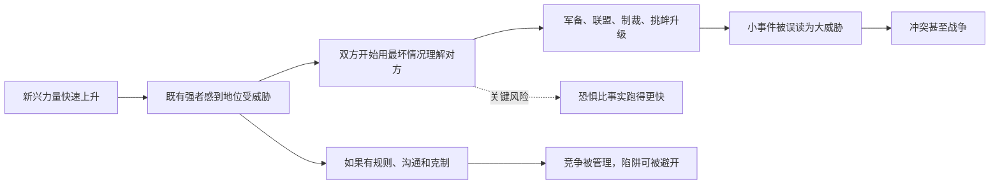

## 思维筑基课: 修昔底德陷阱
  
### 作者  
digoal  
  
### 日期  
2026-05-16  
  
### 标签  
竞争 , 后来强者 , 原来强者 , 冲突 , 风险  
  
----  
  
## 背景

  

> 面向对象: 高中生  
> 核心问题: 为什么“后来者变强”有时会让“原来的强者”变得紧张，甚至引发冲突？  
> 先说结论: 修昔底德陷阱不是说战争必然发生，而是提醒我们：当一个新兴力量快速接近既有强者时，实力变化会放大恐惧、误判和面子压力；如果没有沟通、规则和自我约束，竞争就可能从可管理变成危险冲突。

## 一张图先看懂



## 求真讲法

### 它到底说了什么

“修昔底德陷阱”说的是一种权力转移中的危险结构。

想象一个班级。原来长期第一名的同学 A，很习惯自己被老师信任、同学认可。后来同学 B 进步很快，成绩、竞赛、组织能力都逼近 A。B 可能只是想证明自己，但 A 可能会想：“他是不是要取代我？”于是 A 开始防备，B 又觉得 A 在压制自己。双方越解释越不信，越防备越像敌人。

国际政治中的版本更严重：一个崛起大国接近或挑战一个守成大国时，守成者的恐惧、崛起者的不满、盟友的拉扯、国内舆论的压力，可能让双方进入“谁先退让谁就吃亏”的局面。

这里的“陷阱”不是命运，而是一种容易掉进去的心理和制度结构。

### 它是怎么来的

这个说法来自两层来源。

第一层是古希腊历史。修昔底德在《伯罗奔尼撒战争史》中解释雅典和斯巴达冲突时，强调雅典实力增长，以及这种增长给斯巴达带来的恐惧，是战争的重要深层原因。伯罗奔尼撒战争发生在公元前 431 年到公元前 404 年，最终严重消耗了希腊城邦世界。

第二层是现代概括。哈佛大学学者 Graham Allison 用“Thucydides's Trap”这个词，把它概括成一个现代国际关系框架：当新兴大国威胁要取代既有大国时，双方容易被恐惧和误判推向冲突。哈佛贝尔弗中心的“修昔底德陷阱案例库”整理了过去五百年中 16 个类似案例，并认为其中 12 个走向战争。这个数字本身有争议，但它的价值在于提醒人们研究“权力变化如何制造危险”。

用一句更准确的话说：

> 修昔底德陷阱不是“崛起必然导致战争”，而是“崛起加恐惧加误判，会显著提高冲突风险”。

### 它依赖哪些假设

| 假设 | 含义 | 如果不成立会怎样 |
|---|---|---|
| 实力差距正在快速变化 | 后来者真的在接近原强者 | 只是普通竞争，不一定触发结构性恐惧 |
| 双方都重视地位和安全 | 不只争利益，还争尊严、话语权和规则制定权 | 若双方目标有限，冲突更容易谈判解决 |
| 信息不透明 | 双方看不清对方真实意图 | 如果沟通可信，误判会减少 |
| 国内压力会放大强硬姿态 | 领导者害怕被看成软弱 | 如果社会能接受妥协，升级压力会降低 |
| 缺少有效规则或仲裁机制 | 没有大家都信的“裁判” | 如果规则强，冲突更容易被制度吸收 |

这些假设很重要。少了它们，“修昔底德陷阱”就可能只是一个吓人的比喻，而不是有解释力的分析工具。

### 常见误解

第一，误解成“强者和后来者一定会打起来”。不对。Allison 的案例本身也包括没有战争的案例，所以它不是自然定律。

第二，误解成“后来者有错”。也不对。后来者变强本身不等于侵略，守成者的恐惧也不必然合理。真正的问题是双方如何理解和管理这种变化。

第三，误解成“只要忍让就能避开陷阱”。也不完整。如果一方把克制理解成软弱，单方面退让可能反而诱发更多压力。避开陷阱靠的是清晰底线、可信沟通、稳定规则和危机管理。

第四，误解成“古希腊故事可以直接套到今天”。不能直接套。今天有核武器、全球贸易、国际组织、媒体舆论、金融体系和供应链，现代国家之间的约束比古希腊城邦复杂得多。

## 求存讲法

### 它有什么用

它的原生用途是帮助人们理解大国竞争中的危险机制。

它不是预测水晶球，而是一个提问框架：

```text
实力变化了吗？
    |
    v
既有强者害怕失去什么？
    |
    v
新兴力量觉得自己被压制了吗？
    |
    v
双方有没有可信沟通和规则？
    |
    v
小事件会不会被放大成大危机？
```

这个框架的价值在于，它让我们不要只看某一次冲突的导火索，而要看导火索背后的结构性紧张。

### 它怎么迁移到熟悉领域

这个观点可以迁移到学校、团队、公司和技术竞争中。

在学校里，老社团干部遇到能力很强的新成员，可能担心自己被边缘化；新成员又可能觉得老人压机会。若双方没有明确分工，普通意见分歧就容易变成派系斗争。

在公司里，老产品线遇到新产品线，资源分配、用户入口、预算和话语权都会变敏感。新业务增长越快，老业务越容易把它看成威胁。管理层如果只喊“大家合作”，却不设计规则，冲突就会暗中升级。

在技术领域，旧平台遇到新技术，也会出现类似张力。旧平台担心被替代，新技术团队担心被封锁。真正成熟的组织会提前安排兼容、迁移、责任边界和收益分配。

### 它的适用范围和边界

适用时，通常会看到这些信号：

- 后来者的增长速度快到改变原有秩序。
- 原强者拥有明显既得利益。
- 双方对彼此意图缺乏信任。
- 小事件很容易被解释成“对方在试探底线”。
- 双方身边都有推动强硬的支持者。

不适用或要谨慎使用时，通常是这些情况：

- 双方实力没有接近，只是普通摩擦。
- 双方目标可以同时满足，不是零和竞争。
- 有强而可信的规则、合同或第三方仲裁。
- 竞争者之间高度互相依赖，冲突成本极高且清晰可见。
- 冲突主要来自内部治理失败，而不是权力转移。

### 正例: 怎么用它提升能力

假设你在学习小组里进步很快，开始承担更多讲题和组织任务。原来的组长有点防备你。你可以用修昔底德陷阱的思路处理：

1. 先识别结构变化：不是谁坏了，而是“能力和影响力分布变了”。
2. 主动降低误判：告诉组长你想负责哪部分，不想抢什么。
3. 建立规则：比如讲题轮换、资料共建、任务公开。
4. 保留对方面子：让原组长在擅长领域继续发挥作用。
5. 设定底线：如果对方确实压制，也要用事实和规则沟通，而不是私下对抗。

这个例子成立，是因为它满足了几个前提：影响力正在变化，原有角色受到冲击，沟通能降低误判，规则能吸收竞争。

### 反例: 前提不成立会怎样

假设两个同学都想参加学校演讲比赛。一个人经验丰富，一个人刚开始练。新人把老手的建议都理解成“打压我”，于是拒绝合作，还在班里说对方害怕被超越。

这个判断可能错，因为“实力快速接近”这个前提不成立。老手的建议也许只是技术反馈，不是地位恐惧。把所有竞争都套进修昔底德陷阱，会让人过度猜疑，把本来可以学习的关系变成敌对关系。

所以这个框架最危险的误用是：它本来用来提醒人们避免误判，却被人拿来制造新的误判。

## 思考

如果一个陷阱可以被看见，它还算不算陷阱？

这正是修昔底德陷阱最值得思考的地方。它不像地心引力那样自动发生，而像一条危险道路：看不见的人容易冲进去，看见的人也可能因为傲慢、恐惧、面子和短期利益而继续往前开。

还可以问三个问题：

1. 崛起者怎样证明“我变强不是为了毁掉你”？
2. 守成者怎样接受“别人变强不等于自己失败”？
3. 当双方都觉得自己是防守方时，谁来打破误判循环？

把这个问题放到个人成长里，也很有启发：一个人变强时，真正的成熟不是让所有人害怕你，而是让别人知道你的强大有边界、有规则、有合作空间。

## 最后记住

- 修昔底德陷阱是一种“权力转移风险”框架，不是战争必然律。
- 它的核心机制是：实力变化引发恐惧，恐惧制造误判，误判推动升级。
- 它成立依赖若干前提：快速崛起、地位焦虑、信息不透明、规则不足、国内强硬压力。
- 它的现实价值不是预测战争，而是提醒人们设计沟通、规则和危机管理。
- 它不能乱套到所有竞争，否则会把普通竞争误读成敌意。

## 参考资料

- Thucydides, *History of the Peloponnesian War*, especially Book 1.23.6, where he links Athens' rise and Sparta's fear to the war's deep cause.
- Graham Allison, *Destined for War: Can America and China Escape Thucydides's Trap?*, Houghton Mifflin Harcourt, 2017.
- Harvard Kennedy School, “Destined for War: Can America and China Escape Thucydides's Trap?” https://www.hks.harvard.edu/publications/destined-war-can-america-and-china-escape-thucydidess-trap
- Harvard Belfer Center, “Thucydides's Trap Case File.” https://www.belfercenter.org/programs/thucydidess-trap/thucydidess-trap-case-file
- Encyclopaedia Britannica, “Thucydides.” https://www.britannica.com/biography/Thucydides-Greek-historian

  
  
#### [PostgreSQL 解决方案集合](../201706/20170601_02.md "40cff096e9ed7122c512b35d8561d9c8")
  
  
#### [德哥 / digoal's Github - 公益是一辈子的事.](https://github.com/digoal/blog/blob/master/README.md "22709685feb7cab07d30f30387f0a9ae")
  
  
#### [About 德哥](https://github.com/digoal/blog/blob/master/me/readme.md "a37735981e7704886ffd590565582dd0")
  
  

  
