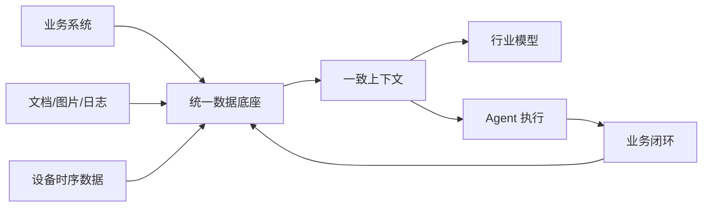

## 未来数据库的竞争将转向“可信上下文”  
  
### 作者  
digoal  
  
### 日期  
2026-05-16  
  
### 标签  
AI , 可信上下文 , DBOS  
  
----  
  
## 背景  
[《图灵奖得主 Stonebraker 炮轰半个行业, 但他只说对了一半》](../202604/20260430_06.md)  
  
AI 时代，真正先进的企业，不是把 AI 接到每个系统上，而是把每个系统重构到 AI 可以安全执行。AI原生数据库是 **面向智能体执行的可信状态基础设施** .  
  
**数据库要从数据管理系统，升级为智能体时代的状态管理系统。**  
  
未来 AI 原生数据库至少要回答五个问题：  
  
1. **上下文怎么管？**  
   不只是存文档和向量，而是管理多版本、多来源、多权限、多粒度、多模态上下文。  
  
2. **执行状态怎么管？**  
   Agent 的计划、步骤、工具调用、中间结果、失败恢复、重试、补偿、回放，都应成为数据库原生能力或强绑定能力。  
  
3. **权限怎么管？**  
   权限不能只停留在表、行、列，还要进入语义、任务、工具、动作、上下文组合层面。  
  
4. **验证怎么管？**  
   AI 输出不能直接等于事实。数据库需要参与约束生成、执行校验、结果比对、异常检测和证据链维护。  
  
5. **责任怎么管？**  
   谁授权，谁审批，模型依据什么上下文，执行了什么动作，造成了什么状态变化，都必须可追溯。  
  
所以，真正的 AI 原生数据库，不是“带 AI 功能的数据库”。  
  
更准确地说，它应该是：  
  
**面向智能体执行的可信状态基础设施。**  
  
它既要服务 AI 读数据，也要约束 AI 改状态。  
既要支持语义检索，也要支持事务恢复。  
既要让模型找到上下文，也要让企业查清责任链。  
既要提高自动化效率，也要限制自动化破坏力。  
  
# 数据库：AI 时代抢的不是“存储”，是可信上下文  
  
仔细看最近一个月数据库行业的新闻，你就会认同我的观点. 政策在推“数据-模型-场景应用”的循环，厂商在把 TP、AP、向量、全文、多模态往一个底座里收，资本也开始把钱投向 HTAP、多模态时序、主数据可信这类更底层的能力。  
  
这说明数据库行业的竞争口径正在变。过去讲的是替换、性能、兼容、成本；现在更关键的问题变成：Agent 要调用企业数据时，谁能提供实时、一致、可追溯、可治理的上下文。  
  
## 从数据集到智能体，中间缺一个“可信底座”  
  
4 月 28 日，工信部和国家数据局联合启动 2026 年“模数共振”行动，目标到 2026 年底形成“数据-模型-场景应用”的良性互促循环。文件里要求分行业梳理数据资源、建设通识和专识高质量数据集，并打造行业模型、专用模型或特色智能体。  
  
我把它放到数据库产业链里看，这不是简单的数据工程任务。行业数据越走向模型训练、智能体执行和跨主体协同，底层就越怕三件事：数据口径不一致、更新不实时、权限和责任边界说不清。模型可以越来越强，但一旦上下文是脏的、旧的、碎的，Agent 越自动化，错误放大得越快。  
  
所以数据库厂商最近强调的“一体化”，本质不是把更多功能塞进一个产品介绍里，而是在争夺企业 AI 的数据控制点。  
  
## 真正的变化：从管表，走向管上下文  
  
OceanBase 在数字中国建设峰会上发布面向数字政府的 AI 一体化数据库方案，核心说法是一个数据库同时承载交易处理、数据分析与模型训练，并把向量、全文、结构化数据统一存储。几天后，OceanBase CEO 杨冰又把问题说得更直接：AI 时代数据库需要同时承载核心关键业务与 AI 创新业务，解决多模态异构数据整合、Agent 调用多异构数据库带来的幻觉、数据不一致和效率低下。  
  
海量数据的定增预案也很典型。公司拟募资不超过 7.02 亿元，投向新一代高性能 HTAP 数据库和多模态时序数据库。无论这家公司后续执行效果如何，资金投向本身反映了同一个方向：工业互联网、能源调度、RAG、多模态联合查询这类场景，不再满足于“先写入一个库、再同步到另一个系统分析、最后再喂给 AI”。  
  
海外信号也类似。Pinecone 在 4 月 15 日宣布 Dedicated Read Nodes 已用于 ZoomInfo 的实时 AI 推荐场景，并称客户用户参与度提升 50%；LakeFusion 在 5 月 3 日完成 750 万美元种子轮，主打在 Databricks 内部做 AI 驱动的主数据管理，解决 CRM、ERP、运营系统里的重复记录和层级断裂问题。  
  
这些新闻放在一起，核心不是“向量数据库火”或“HTAP 又回来了”，而是企业开始为 AI 应用补数据地基。  
  

  
## 接下来盯什么  
  
我会继续看四个指标。  
  
第一，看“一体化”是不是停留在口号。真正有价值的是少搬数、少同步、少口径转换，而不是把多个引擎包装成一个控制台。  
  
第二，看政务、金融、工业这些强一致场景里，AI 负载是否真的进入核心流程。只有进入在线业务，数据库的 AI 化才不是外围检索工具。  
  
第三，看主数据、权限、审计、血缘这些老问题是否重新被定价。Agent 时代，数据治理不再是后台合规成本，而是模型能不能可靠行动的前提。  
  
第四，看资本投向是否从“讲 AI 应用故事”转向“补数据基础设施”。如果更多钱流向 HTAP、多模态、实时主数据、向量检索和可信协同，说明行业已经意识到：AI 的瓶颈不只在模型，也在数据库。  
  
---  
  
参考来源：  
- 工业和信息化部、国家数据局，2026-04-28，《关于联合实施2026年“模数共振”行动的通知》，https://www.nda.gov.cn/sjj/zwgk/tzgg/0428/20260428215540161552208_pc.html  
- IT之家，2026-05-01，《从“一网通办”到“AI 智能办”：OceanBase 推出数字政府 AI 一体化数据库方案》，https://www.ithome.com/0/945/910.htm  
- 新华财经/东方财富，2026-05-10，《OceanBase CEO杨冰：非结构化数据在线实时处理，是AI时代对数据库的最大刚需》，https://finance.eastmoney.com/a/202605103732342584.html  
- 每日经济新闻，2026-05-12，《海量数据拟定增募资7亿元，押注新一代数据库技术》，https://www.nbd.com.cn/articles/2026-05-12/4388237.html  
- Pinecone/PRNewswire，2026-04-15，《ZoomInfo and Pinecone Bring Real-Time, AI-Powered Contact Recommendations to Go-to-Market Teams》，https://www.prnewswire.com/news-releases/zoominfo-and-pinecone-bring-real-time-ai-powered-contact-recommendations-to-go-to-market-teams-302741895.html  
- LakeFusion/GlobeNewswire，2026-05-03，《LakeFusion Raises $7.5M Seed Financing to Redefine Master Data Management (MDM) Natively on Databricks》，https://www.globenewswire.com/news-release/2026/05/04/3286394/0/en/LakeFusion-Raises-7-5M-Seed-Financing-to-Redefine-Master-Data-Management-MDM-Natively-on-Databricks.html  
  
  
  
#### [PostgreSQL 解决方案集合](../201706/20170601_02.md "40cff096e9ed7122c512b35d8561d9c8")
  
  
#### [德哥 / digoal's Github - 公益是一辈子的事.](https://github.com/digoal/blog/blob/master/README.md "22709685feb7cab07d30f30387f0a9ae")
  
  
#### [About 德哥](https://github.com/digoal/blog/blob/master/me/readme.md "a37735981e7704886ffd590565582dd0")
  
  

  
