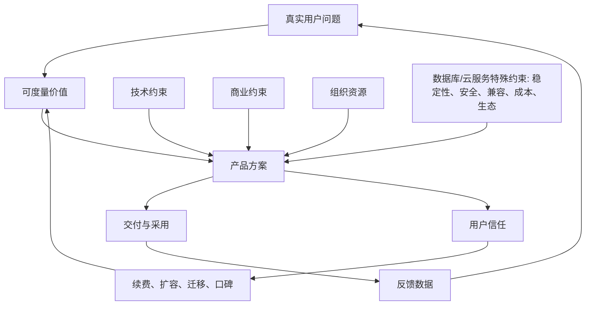

## 产品经理思维筑基课: 产品经理底层公理与上层定律: 数据库软件与云服务产品经理版

### 作者
digoal

### 日期
2026-05-17

### 标签
产品经理 , 底层公理 , 上层定律 , 数据库产品 , 云服务 , 技术产品 , 用户价值 , 产品决策 , 信任 , 复杂系统

----

## 背景

> 面向对象: 想进入或提升为技术型产品经理的人  
> 核心问题: 产品经理到底靠什么底层判断做取舍？数据库软件、云服务这类技术产品为什么不能照搬普通互联网产品方法？  
> 先说结论: 产品经理不是“写需求的人”，而是把用户问题、技术约束、商业收益和组织资源压缩成可执行取舍的人。技术型产品经理的核心难度在于: 你面对的不是单次体验，而是长期信任、复杂系统和高迁移成本。

## 一张图先看懂



## 求真讲法

### 它到底说了什么

产品经理的底层公理可以压缩为一句话:

> 用户不会为功能本身付费，而是为“在约束下更好地完成任务”付费。

所以产品经理的工作不是堆功能，而是持续回答四个问题:

| 问题 | 产品经理要判断什么 | 技术型产品里的典型表现 |
|---|---|---|
| 谁的问题 | 用户、购买者、使用者、运维者是否一致 | DBA、开发、架构师、CIO、采购常常不是同一人 |
| 有多痛 | 问题是否高频、高损失、高风险 | 故障、性能抖动、备份失败、账单失控 |
| 凭什么赢 | 为什么用户选择你而不是开源、自研或竞品 | 性能、可靠性、生态兼容、迁移成本、服务能力 |
| 如何持续 | 产品是否能形成复用、规模化和商业闭环 | 标准化控制台、自动化运维、按量计费、企业支持 |

### 底层公理

**公理 1: 问题优先于方案。**  
如果问题不真实，再漂亮的功能也是库存。数据库产品里尤其明显: “支持某语法”“新增某参数”未必有价值，除非它解决了迁移、性能、稳定性或治理问题。

**公理 2: 用户价值必须能被某种行为验证。**  
技术用户嘴上说“需要更强性能”，但真实验证可能是压测通过、工单减少、迁移完成、续费扩容、生产负载上线。不能被行为验证的需求，优先级天然可疑。

**公理 3: 产品是约束下的最优解，不是理想解。**  
产品经理必须同时面对技术债、研发资源、商业目标、合规要求、渠道能力和发布时间。成熟 PM 不问“最好能不能做”，而问“在当前约束下，哪一个选择收益最大、风险最小”。

**公理 4: 采用成本是产品价值的一部分。**  
数据库和云服务不是用户点一下就结束。学习、迁移、改代码、改权限、改监控、改备份、改采购流程，都是成本。价值再大，采用成本过高也会失败。

**公理 5: 信任是技术型产品的第一资产。**  
普通工具出错，用户可能刷新重试；数据库和云服务出错，用户可能丢数据、停业务、被审计追责。因此稳定性、安全性、兼容性、可观测性不是“高级功能”，而是信任基础。

**公理 6: 产品决策本质上是排序。**  
资源永远不够。PM 的价值不在于收集更多需求，而在于解释为什么现在做 A、不做 B，并让销售、研发、客户成功和管理层都能接受这个排序逻辑。

**公理 7: 技术产品必须把复杂性藏在正确的地方。**  
不是所有复杂性都要消灭。数据库参数、执行计划、隔离级别、备份策略本来就复杂。好产品不是把它们假装简单，而是让新手有安全默认值，让专家有可控旋钮。

### 经典上层定律

**1. Jobs To Be Done: 用户雇佣产品完成任务。**  
用户不是“想买数据库”，而是想让订单系统稳定运行、让分析查询更快、让运维团队少背锅。需求访谈应围绕任务、场景、障碍和替代方案展开。

**2. Kano 模型: 功能分为基本型、期望型、魅力型。**  
数据库里的“数据不丢、连接稳定、备份可恢复”是基本型；“性能更好、成本更低”是期望型；“自动诊断 SQL 风险、自动生成迁移报告”可能是魅力型。基本型没做好，魅力型会变成噪音。

**3. 80/20 法则: 少数场景贡献多数价值。**  
云数据库的多数收入可能来自少数核心负载、核心行业、核心规格。PM 应该优先识别高价值负载，而不是平均满足所有边缘场景。

**4. 奥卡姆剃刀: 不增加不必要的实体。**  
一个新产品形态、一个新控制台入口、一个新参数，都会增加用户理解成本和研发维护成本。能用已有概念解释，就不要创造新概念。

**5. 帕金森琐碎定律: 组织容易在小事上花过多时间。**  
团队可能争论按钮文案一周，却没有验证备份恢复链路是否可靠。PM 要把会议注意力拉回高风险、高价值问题。

**6. 康威定律: 系统设计会映射组织结构。**  
云服务如果计算、存储、网络、安全、计费团队各自为政，用户看到的就是割裂体验。PM 要设计跨团队接口和责任边界。

**7. 布鲁克斯法则: 延误项目加人可能更慢。**  
技术产品复杂度高，临时加人会增加沟通和学习成本。PM 不能用“再加几个人”掩盖范围失控，要主动砍范围。

**8. 古德哈特定律: 指标一旦成为目标，就会失真。**  
如果只考核工单关闭时长，团队可能快速关闭但不解决根因；如果只考核功能发布数，团队会堆小功能。PM 要用指标组合，而不是单一数字替代判断。

**9. 创新扩散曲线: 不同用户采用新产品的理由不同。**  
早期用户愿意试新架构，主流企业更关心稳定、案例、迁移工具、SLA 和支持。数据库/云服务 PM 不能用早期开发者反馈直接推断大企业采购逻辑。

**10. 体验峰终定律: 用户记住峰值和结尾。**  
对技术产品来说，峰值常常是故障、迁移、扩容、账单异常、恢复演练。关键时刻的体验，比日常页面美观更影响长期信任。

## 求存讲法

### 数据库软件产品经理的特殊性

数据库软件的产品对象不是一个页面，而是一个长期运行的系统。它的产品经理要理解:

| 维度 | 普通互联网产品 | 数据库软件产品 |
|---|---|---|
| 用户容错 | 可快速试错 | 生产环境容错低 |
| 价值证明 | 点击、留存、转化 | 性能、稳定、兼容、成本、恢复能力 |
| 迁移成本 | 通常较低 | 极高，涉及代码、数据、运维、权限 |
| 购买决策 | 用户体验影响大 | 技术评估、PoC、采购、安全合规共同决定 |
| 失败后果 | 流失或投诉 | 数据损坏、业务中断、赔偿、信誉损失 |

数据库 PM 的需求优先级通常应先看这几类:

1. **可靠性需求**: 备份恢复、主备切换、容灾、事务一致性、数据校验。
2. **性能需求**: 查询优化、写入吞吐、延迟稳定性、热点处理、资源隔离。
3. **兼容需求**: SQL 语法、驱动、协议、生态工具、迁移评估。
4. **运维需求**: 监控、告警、审计、权限、容量规划、慢 SQL 诊断。
5. **成本需求**: 存储压缩、弹性伸缩、冷热分层、计费透明。
6. **开发者体验**: 文档、示例、SDK、错误提示、本地开发与测试。

### 云服务型产品经理的特殊性

云服务产品的本质是“软件 + 资源 + 运维 + 计费 + 合约”的组合。它不只是功能产品，也是运营产品。

云服务 PM 必须额外掌握:

| 产品问题 | 云服务里的真实含义 |
|---|---|
| 可用性 | SLA、故障域、降级策略、恢复时间 |
| 弹性 | 扩缩容速度、资源池容量、冷启动成本 |
| 成本 | 用户账单、平台毛利、资源利用率三者平衡 |
| 安全 | 身份权限、网络隔离、审计、密钥、合规 |
| 多租户 | 隔离、限流、公平调度、噪声邻居问题 |
| 生命周期 | 开通、试用、升级、续费、欠费、释放、数据保留 |

### 正例: 如何用这些公理做一个产品判断

假设客户要求“云数据库支持一键大版本升级”。

一个技术型 PM 不应直接写需求，而要拆解:

| 判断项 | 要问的问题 |
|---|---|
| 真实问题 | 客户是为了安全补丁、性能、新语法，还是合规要求？ |
| 风险 | 升级是否可能导致 SQL 不兼容、执行计划变化、插件不可用？ |
| 采用成本 | 是否需要预检查、灰度、回滚、演练环境、变更窗口？ |
| 成功指标 | 升级成功率、回滚率、升级后故障率、工单量是否下降？ |
| 最小可行方案 | 先做兼容性评估报告，还是直接做自动升级？ |

更成熟的方案可能不是“一键升级”四个字，而是:

```text
升级前评估 -> 风险分级 -> 影子验证 -> 灰度升级 -> 自动回滚 -> 升级报告
```

这体现了公理 4 和公理 5: 采用成本和信任本身就是产品价值。

### 反例: 前提不成立会怎样

如果 PM 只听到“客户要 Serverless 数据库”，就直接推动研发做 Serverless，很可能失败。

失败原因不是 Serverless 不好，而是前提没有验证:

| 被忽略的前提 | 可能后果 |
|---|---|
| 用户负载是否适合弹性 | 长连接、稳定高负载场景反而不省钱 |
| 冷启动是否可接受 | 交易系统延迟抖动不可接受 |
| 成本是否可预测 | 用户觉得账单不可控 |
| 运维边界是否清楚 | 出问题时不知道是应用、数据库还是平台 |
| 销售是否能解释 | 市场教育成本高，成交周期变长 |

所以技术型 PM 不能只追概念热度。新架构必须回到任务、约束、指标和信任。

## 思考

### 技术型 PM 的能力金字塔

```text
              商业判断
          市场/竞争/定价/生态
        ------------------------
              产品判断
        场景/优先级/体验/指标
        ------------------------
              技术理解
      架构/性能/稳定/安全/成本
        ------------------------
              用户现场
   访谈/工单/PoC/迁移/生产故障
```

越是数据库、云服务、基础软件产品，越不能只停留在“用户体验”和“需求管理”。PM 不一定要写数据库内核代码，但必须能理解研发在担心什么、客户在害怕什么、销售为什么卖不动、运维为什么不敢上线。

### 数据库/云服务 PM 的五个关键判断题

1. 这个需求是“购买者觉得好”，还是“使用者真的会每天用”？
2. 这个功能会提升信任，还是增加系统不确定性？
3. 这个能力是少数大客户定制，还是可以产品化复用？
4. 这个指标变好，会不会让另一个更重要的指标变坏？
5. 用户不用我们的产品时，真实替代方案是什么？

### 一个更实用的需求优先级公式

可以用下面的简化公式做初筛:

```text
优先级 = 用户损失 × 发生频率 × 可复用性 × 战略价值
        ----------------------------------------
        研发成本 × 运维成本 × 采用成本 × 风险
```

这个公式不是数学真理，而是帮助团队把争论从“我觉得重要”转向“哪一项假设不同”。

## 最后记住

1. 产品经理的底层工作是取舍，不是传话。
2. 技术型产品的第一资产是信任，信任来自稳定、安全、兼容、可解释和可恢复。
3. 数据库和云服务的价值不只在功能，还在迁移成本、运维成本、风险成本和账单成本。
4. 经典产品定律可以用，但必须经过技术产品场景校准。
5. 好的数据库/云服务 PM 要同时听懂用户现场、技术约束、商业目标和组织能力。

## 参考资料

- Clayton Christensen, *Competing Against Luck*: Jobs To Be Done 理论。
- Noriaki Kano 等关于 Kano 模型的质量属性分类研究。
- Melvin Conway, “How Do Committees Invent?”, 1968: 康威定律来源。
- Frederick P. Brooks, *The Mythical Man-Month*: 布鲁克斯法则。
- Charles Goodhart 关于货币政策指标失真的论述，后被概括为古德哈特定律。
- Everett Rogers, *Diffusion of Innovations*: 创新扩散理论。
- Daniel Kahneman 等关于峰终定律的行为经济学研究。
- 本文对数据库软件、云服务场景的部分解释基于通用产品管理、企业软件、基础软件和云计算实践经验归纳。
  
#### [PostgreSQL 解决方案集合](../201706/20170601_02.md "40cff096e9ed7122c512b35d8561d9c8")
  
  
#### [德哥 / digoal's Github - 公益是一辈子的事.](https://github.com/digoal/blog/blob/master/README.md "22709685feb7cab07d30f30387f0a9ae")
  
  
#### [About 德哥](https://github.com/digoal/blog/blob/master/me/readme.md "a37735981e7704886ffd590565582dd0")
  
  

  
