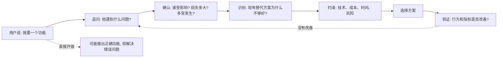

## 产品经理思维筑基课: 问题优先于方案: 产品经理的第一公理

### 作者
digoal

### 日期
2026-05-17

### 标签
产品经理 , 问题优先 , 方案设计 , 需求分析 , 用户场景 , 数据库产品 , 云服务 , 产品发现 , 真实问题 , 技术产品

----

## 背景

> 面向对象: 高中生、大学生、产品经理新人、技术型产品经理  
> 核心问题: 为什么产品经理不能一听到“做个功能”就开始写需求？  
> 先说结论: “问题优先于方案”不是说方案不重要，而是说在没搞清楚真实问题、受影响的人、损失大小和约束条件之前，任何方案都只是猜测。产品经理的第一责任，是先确认“要解决什么”，再决定“怎么解决”。

## 一张图先看懂



## 求真讲法

### 它到底说了什么

“问题优先于方案”可以拆成三句话:

1. 需求不是用户说出的功能，而是用户在某个场景里遇到的阻碍。
2. 方案只是解决问题的一种手段，通常不止一种。
3. 如果问题判断错了，方案越精致，浪费越大。

举个简单例子:

```text
同学说: 我想买一支更贵的笔。

方案思维: 推荐一支名牌笔。
问题思维: 先问为什么。

可能的问题 A: 现在的笔经常断墨。
可能的问题 B: 字写得不好看，以为换笔能改善。
可能的问题 C: 考试时手累，需要更舒服的握感。
可能的问题 D: 想送礼，需要看起来体面。
```

同一句“我要一支更贵的笔”，背后可能有四个不同问题。对应的好方案完全不同。

产品经理面对客户说“我们要一个报表”“我们要一个按钮”“我们要支持某个数据库语法”时，也是同理。先做方案，常常只是把用户的猜测交给研发实现。

### 它是怎么来的

这个公理不是数学定理，不能在产品管理体系内部被“证明”。它更像一条工程和商业实践中被反复选择出来的工作原则。

人们选择它，主要因为四个现实:

| 现实 | 如果忽略它会怎样 |
|---|---|
| 用户常用方案描述问题 | 用户说“要导出 Excel”，真实问题可能是“需要给老板汇报” |
| 同一问题有多种方案 | 可以做功能、改流程、写文档、培训、开放 API |
| 资源永远有限 | 做错一个大功能，会挤掉更重要的问题 |
| 复杂系统有副作用 | 一个新功能可能带来性能、安全、运维和兼容风险 |

所以“问题优先于方案”的动机很朴素: 在花钱、花人、花时间之前，先减少误判。

### 它依赖哪些假设

这条公理成立，依赖几个前提:

**假设 1: 用户说出的方案不一定等于真实问题。**  
如果用户已经完成了严谨的问题分析和方案比较，那么他的方案可能很可靠。但大多数场景下，用户说的是自己能想到的局部解法。

**假设 2: 产品团队有选择空间。**  
如果是法律强制、合同承诺、紧急安全漏洞，可能没有太多方案比较空间。但即便如此，也要明确要解决的问题边界。

**假设 3: 错误方案的成本足够高。**  
如果只是一次 5 分钟的小实验，直接试也可以。如果是数据库内核能力、云服务计费系统、生产环境迁移工具，错误成本就很高，必须先搞清问题。

**假设 4: 问题可以被观察或验证。**  
产品经理不能只停留在“感觉用户很痛”。至少要找到一些证据: 工单、访谈、日志、流失、转化、压测、PoC 失败、销售反馈、运维成本等。

### 常见误解

**误解 1: 问题优先就是一直调研，不做方案。**  
不是。它要求先把关键问题说清楚，再尽快用最小方案验证。优秀 PM 不拖延决策，而是减少盲目决策。

**误解 2: 用户提的方案都不可信。**  
不是。专家用户、关键客户、内部运维团队常常能提出高质量方案。PM 要做的是理解方案背后的问题，而不是傲慢地否定用户。

**误解 3: 只要找到问题，方案自然就出来。**  
不是。清楚的问题只是提高方案命中率。真正落地还要考虑技术可行性、成本、风险、组织协同和商业收益。

**误解 4: 问题越大越值得做。**  
不一定。问题大但很少发生、不可复用、研发代价极高，优先级可能仍然低。产品判断不是只看痛点，还要看频率、范围和可解决性。

## 求存讲法

### 它有什么用

对产品经理来说，这条公理至少有五个用途:

1. 避免把用户的话直接翻译成需求文档。
2. 避免团队在错误方向上高效率执行。
3. 帮助研发理解“为什么做”，而不只是“做什么”。
4. 帮助销售、客户成功、运营形成统一口径。
5. 帮助产品负责人在多个需求之间排序。

在技术型产品里，它尤其重要。因为数据库软件、云服务、基础设施产品的方案成本高，错误后果重，用户迁移慢，信任修复难。

### 它怎么迁移到数据库软件和云服务产品

数据库/云服务 PM 常听到的“方案式需求”包括:

| 用户说出的方案 | 可能的真实问题 | 更合理的产品追问 |
|---|---|---|
| 支持某个 SQL 语法 | 从 MySQL/PostgreSQL/Oracle 迁移受阻 | 哪些业务 SQL 被卡住？占迁移阻塞的比例是多少？ |
| 做一个一键扩容按钮 | 高峰期容量不够或扩容流程太慢 | 是容量预测问题、审批问题、资源池问题，还是扩容风险问题？ |
| 控制台加一个慢 SQL 排名 | 性能问题定位慢 | DBA 需要的是发现、解释、建议，还是自动治理？ |
| 价格再便宜一点 | 成本不可预测或性价比不清楚 | 是单价高、账单波动、资源浪费，还是竞品锚定问题？ |
| 做 Serverless | 希望少运维、按量付费、自动弹性 | 负载是否适合弹性？冷启动和账单波动能否接受？ |
| 支持跨地域容灾 | 害怕机房故障或合规要求 | 需要多大的 RPO/RTO？愿意承担多少延迟和成本？ |

这里的关键是: 客户说出口的通常是“他想象中的解法”，PM 要还原成“他正在承受的任务失败”。

### 它的适用范围和边界

这条公理适用于:

- 新功能立项。
- 大客户定制需求评估。
- 版本规划和路线图排序。
- 复杂故障后的产品改进。
- 销售输单复盘。
- 用户增长、留存和续费分析。

它不适合被机械使用在所有微小决策上:

| 场景 | 是否需要完整问题分析 |
|---|---|
| 修复明显错别字 | 不需要 |
| 修复确定的安全漏洞 | 需要明确边界，但不应拖延 |
| 合同明确承诺的交付 | 仍要理解问题，但选择空间较小 |
| 低成本 A/B 实验 | 可以快速试，但要知道验证什么 |
| 数据库内核重大能力 | 必须先做问题、风险和验证分析 |

### 正例: 怎么用它提升能力

假设你是云数据库产品经理，客户说:

> 我们要一个“自动索引优化”功能。

直接写需求可能是:

```text
系统自动识别慢 SQL，并自动创建索引。
```

但问题优先的做法是:

```text
1. 哪些 SQL 慢？慢在哪里？
2. 是没有索引，还是统计信息过期、执行计划错误、锁等待、资源不足？
3. DBA 为什么没有手动建索引？是不知道、没权限、怕风险，还是没有验证环境？
4. 自动建索引会不会拖慢写入、增加存储、影响计划稳定性？
5. 用户真正想要的是自动执行，还是风险评估和建议？
```

最后得到的第一版方案，可能不是“自动建索引”，而是:

```text
慢 SQL 发现
  -> 根因分类
  -> 索引建议
  -> 影响评估
  -> 一键生成变更单
  -> 灰度执行与回滚
```

这个方案看起来比“自动建索引”慢一步，但更适合数据库产品，因为它把稳定性和信任放进了方案。

### 反例: 前提不成立会怎样

反例一: 把大客户的话当成市场需求。

某大客户要求“支持一个内部特有的审计字段格式”。产品团队直接做进标准产品。结果:

- 其他客户不用。
- 文档和测试增加复杂度。
- 后续版本兼容成本上升。
- 研发资源挤占了更通用的审计能力。

失败的前提是: “单个大客户的问题可以代表广泛用户问题”。这个前提并没有被验证。

反例二: 把技术热词当成用户问题。

团队决定做“AI DBA 助手”，因为市场上都在讲 AI。上线后使用率很低。复盘发现:

- 用户不敢让 AI 直接执行数据库变更。
- 真实痛点是故障时缺少可解释的诊断链路。
- 企业客户更需要审计、权限、回滚和责任边界。
- AI 对话入口很新，但没有接进工单、监控和变更流程。

失败的前提是: “用户想要 AI 功能”。真实问题其实是“如何更快、更可信地定位和处理数据库风险”。

## 思考

### 一个判断框架

当你听到一个方案式需求，可以用下面五问把它还原成问题:

```text
1. 谁在什么场景下遇到了阻碍？
2. 这个阻碍造成了什么损失？
3. 现在他们怎么绕过去？为什么不够好？
4. 如果解决了，哪个行为或指标会改变？
5. 有没有更小、更稳、更便宜的方案？
```

### 一个反事实问题

如果今天团队禁止你说“我们要做某功能”，只允许你说“我们要降低某类用户在某场景下的某种损失”，你的需求池会发生什么变化？

很多需求会从:

```text
做报表、做按钮、做配置项、做 AI、做大屏
```

变成:

```text
降低排障时间、减少误操作、提高迁移成功率、降低账单不确定性、提升恢复可信度
```

后一种表达，才更接近产品经理应该管理的对象。

### 与学习和生活的迁移

这个公理也适合个人决策。

| 你想要的方案 | 可能的真实问题 |
|---|---|
| 买新电脑 | 旧电脑慢、软件不会用、注意力分散、任务太重 |
| 报一个课程 | 缺知识、缺练习、缺反馈、缺监督 |
| 换工作 | 薪资低、成长慢、关系差、行业下行 |
| 学一门新技术 | 项目需要、职业焦虑、跟风、真正感兴趣 |

先问问题，不是为了否定行动，而是为了让行动更准。

## 最后记住

1. 用户说出的常常是方案，不一定是真实问题。
2. 产品经理的第一步不是写需求，而是还原场景、损失、替代方案和约束。
3. 技术型产品里，错误方案会带来稳定性、安全、兼容、成本和信任风险。
4. 好方案不是最酷的方案，而是在约束下最能降低用户损失的方案。
5. “问题优先于方案”不是拖慢执行，而是防止团队高速冲向错误方向。

## 参考资料

- Clayton Christensen, *Competing Against Luck*: Jobs To Be Done 理论强调用户“雇佣”产品完成任务。
- Marty Cagan, *Inspired*: 产品团队需要先发现有价值、可用、可行、可商业化的问题与方案。
- Teresa Torres, *Continuous Discovery Habits*: 持续发现强调机会、假设、实验和用户证据。
- Eric Ries, *The Lean Startup*: 最小可行产品和验证式学习强调先验证关键假设。
- Frederick P. Brooks, *The Mythical Man-Month*: 复杂软件项目中错误方向和范围失控会放大成本。
- 本文对数据库软件、云服务场景的解释基于通用产品管理、企业软件、基础设施产品和数据库运维实践归纳。
  
#### [PostgreSQL 解决方案集合](../201706/20170601_02.md "40cff096e9ed7122c512b35d8561d9c8")
  
  
#### [德哥 / digoal's Github - 公益是一辈子的事.](https://github.com/digoal/blog/blob/master/README.md "22709685feb7cab07d30f30387f0a9ae")
  
  
#### [About 德哥](https://github.com/digoal/blog/blob/master/me/readme.md "a37735981e7704886ffd590565582dd0")
  
  

  
