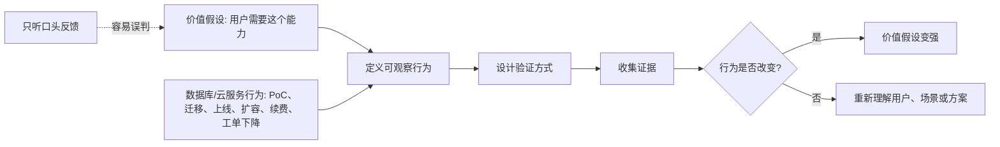

## 产品经理思维筑基课: 用户价值必须能被某种行为验证: 产品经理的证据公理

### 作者
digoal

### 日期
2026-05-17

### 标签
产品经理 , 用户价值 , 行为验证 , 产品指标 , 企业软件 , 数据库产品 , 云服务 , 价值证据 , 用户行为 , 产品发现

----

## 背景

> 面向对象: 高中生、大学生、产品经理新人、技术型产品经理  
> 核心问题: 为什么“用户说喜欢”“客户说需要”“老板觉得重要”都不等于真实价值？  
> 先说结论: 用户价值不能只靠语言判断，必须能在某种行为里留下证据。真正有价值的产品，会让用户愿意点击、试用、迁移、付费、续费、推荐、减少绕路，或在关键场景中持续依赖它。

## 一张图先看懂



## 求真讲法

### 它到底说了什么

“用户价值必须能被某种行为验证”可以拆成三句话:

1. 用户说“喜欢”不等于他会使用。
2. 用户说“需要”不等于他愿意付出成本。
3. 只有当用户行为发生变化时，产品价值才获得了更强证据。

这里的“行为”不只指点击按钮。对不同产品，行为证据不同:

| 产品类型 | 弱证据 | 强证据 |
|---|---|---|
| 内容产品 | 点赞、收藏 | 持续阅读、转发、付费订阅 |
| 工具产品 | 试用一次 | 高频使用、替代旧工具 |
| 企业软件 | 客户说想要 | 进入 PoC、采购、续费、扩容 |
| 数据库产品 | 下载、咨询 | 迁移测试通过、生产上线、故障率下降 |
| 云服务产品 | 开通实例 | 持续消耗资源、账单增长、工单减少 |

这条公理不是说“语言反馈没用”。访谈、问卷、销售反馈都很有用，但它们更适合发现线索，不足以单独证明价值。

### 它是怎么来的

这条公理来自产品实践中的一个常见矛盾:

```text
用户访谈时说: 这个功能很好，我肯定会用。
产品上线后: 使用率很低。
```

为什么会这样？

因为说话成本低，行动成本高。

| 用户表达 | 用户行动 |
|---|---|
| 不需要学习成本 | 需要花时间理解 |
| 不需要承担风险 | 可能影响业务和责任 |
| 不需要预算 | 可能要采购、审批、付费 |
| 不需要替换旧习惯 | 需要改变流程和协作方式 |
| 常受礼貌和想象影响 | 更接近真实取舍 |

产品经理选择这条公理，是为了把“想象中的价值”转化为“可观察的证据”。它不能保证判断永远正确，但能显著降低自嗨式产品决策。

### 它依赖哪些假设

**假设 1: 真正的价值会改变用户行为。**  
如果产品确实降低了成本、减少了风险、提高了效率、带来收益，用户通常会在某些行为上表现出来。

**假设 2: 行为可以被合理观察。**  
不是所有价值都能立刻用一个数字衡量。有些行为需要通过日志、访谈、工单、续费、试点结果、迁移进度等组合证据观察。

**假设 3: 行为背后的原因可以被解释。**  
使用率上升不一定代表价值更高，可能只是强制使用或默认打开。行为证据必须结合场景解释。

**假设 4: 验证成本不能超过决策价值。**  
小功能可以用轻量数据验证，大型数据库能力则需要更严谨的 PoC、灰度、压测、可靠性评估。

### 常见误解

**误解 1: 只有数据指标才算行为验证。**  
不是。企业软件和数据库产品里，定性行为也很关键，比如客户愿意安排 PoC、让 DBA 参与评审、把测试库迁过去、提出上线窗口。

**误解 2: 用户没用就是没有价值。**  
不一定。可能是入口太深、文档太差、迁移成本太高、销售不会讲、权限没打通。行为没发生，说明价值链路某处断了，不一定说明问题不存在。

**误解 3: 指标变好就证明产品成功。**  
不一定。指标可能被活动、默认设置、考核压力、短期补贴影响。行为证据要防止古德哈特定律: 当指标变成目标，它就可能失真。

**误解 4: B 端产品不适合行为验证。**  
不对。B 端行为只是更长、更慢、更分散。采购、试点、集成、培训、权限申请、工单减少、续费扩容，都是行为。

## 求存讲法

### 它有什么用

这条公理能帮产品经理从“观点争论”进入“证据争论”。

没有行为验证时，团队容易这样争:

```text
销售: 客户一定要这个。
研发: 这个实现代价太高。
老板: 市场上别人都有。
产品: 我觉得用户会喜欢。
```

引入行为验证后，讨论会变成:

```text
哪些客户会用?
他们愿意为此付出什么成本?
上线后哪个行为会改变?
我们如何用最小成本验证?
如果行为没变，说明哪个假设错了?
```

这会让需求排序更接近事实，而不是接近音量。

### 它怎么迁移到数据库软件和云服务产品

数据库和云服务产品的价值验证，不应只看“功能点击率”。很多关键价值发生在生产系统、运维流程和采购决策里。

| 价值主张 | 可验证行为 |
|---|---|
| 性能更好 | 用户拿真实负载压测；查询延迟下降；更少扩容 |
| 迁移更容易 | 客户上传 schema；跑兼容评估；完成测试库迁移 |
| 更可靠 | 故障切换演练通过；恢复时间下降；故障工单减少 |
| 更省钱 | 用户开启成本建议；调整规格；账单下降且性能不恶化 |
| 更安全 | 客户配置审计、最小权限、密钥轮换；安全工单减少 |
| 更好运维 | DBA 使用诊断报告；平均排障时间下降 |
| 更适合企业 | 进入采购清单；通过安全评审；续费或扩容 |

技术型 PM 要特别注意: 数据库产品的强行为往往很慢，但很重。

```text
弱行为: 点开功能页
中等行为: 跑测试、读文档、咨询架构
强行为: 生产上线、迁移核心业务、签合同、续费扩容
```

### 它的适用范围和边界

适用范围:

- 新功能是否值得做。
- 已上线功能是否成功。
- 销售反馈是否代表普遍需求。
- 用户价值主张是否站得住。
- 技术能力是否应该产品化。
- 数据库/云服务版本路线图排序。

边界:

| 边界情况 | 应该怎么处理 |
|---|---|
| 长周期价值难以短期验证 | 找领先指标，如 PoC、迁移测试、配置完成率 |
| 用户行为被组织流程限制 | 同时观察采购、审批、评审、培训等行为 |
| 价值是风险降低 | 看故障减少、恢复演练、审计通过、保险式采购 |
| 样本很少但客户很大 | 不只看数量，还要看收入、战略、可复用性 |
| 指标容易被操纵 | 用多指标交叉验证，避免单一 KPI |

### 正例: 怎么用它提升能力

假设你负责云数据库的“智能成本优化”功能。团队认为用户很需要省钱。

口头价值假设:

```text
用户希望降低云数据库账单。
```

行为验证设计:

| 阶段 | 要验证的行为 | 说明 |
|---|---|---|
| 发现 | 用户是否查看成本分析页 | 证明用户关注这个问题 |
| 理解 | 用户是否点开优化建议 | 证明建议被看见 |
| 信任 | 用户是否查看影响评估 | 证明用户在判断风险 |
| 行动 | 用户是否调整规格、购买包年包月、开启冷热分层 | 证明用户愿意改变配置 |
| 结果 | 账单下降且性能告警不增加 | 证明优化没有牺牲核心体验 |
| 留存 | 用户是否持续使用建议 | 证明价值不是一次性的 |

更成熟的 PM 不会只说“点击率 20%”。他会继续问:

```text
点击的人有没有执行建议?
执行后有没有回滚?
账单下降是否以性能变差为代价?
大客户和小客户行为是否不同?
销售是否能用这套报告推动续费?
```

这就是从“有功能”走向“有价值证据”。

### 反例: 前提不成立会怎样

反例一: 把“功能开通数”当成价值。

某云服务上线“自动备份增强版”，因为默认勾选，开通率很高。团队宣布成功。但几个月后发现:

- 很多用户不知道自己开通了。
- 恢复演练使用率很低。
- 真正故障时用户不会操作恢复流程。
- 备份存储账单上升，引发投诉。

失败原因是: 团队把“开通行为”误判成“价值行为”。对备份功能来说，更强证据应该是恢复演练、恢复成功率、RPO/RTO 达标、故障时可用。

反例二: 把“客户说需要”当成价值。

客户在销售阶段说“必须支持某兼容语法，否则无法迁移”。产品团队紧急投入两个月开发。上线后只有一个客户使用，而且该客户最终没有迁移核心系统。

失败原因可能是:

| 未验证假设 | 实际风险 |
|---|---|
| 该语法是迁移的主要阻碍 | 真正阻碍可能是性能、审批、组织风险 |
| 该客户代表一类客户 | 可能只是单点定制 |
| 支持语法就会迁移 | 迁移还需要工具、评估、回滚、服务保障 |
| 使用一次就有价值 | 可能只是 PoC 中的边缘 SQL |

这不是说客户反馈无用，而是说“客户说需要”只能开启验证，不能替代验证。

## 思考

### 价值证据阶梯

```text
最弱  听说: 用户说喜欢、销售说客户要
  |   注意: 用户点击、收藏、咨询、下载
  |   试用: 用户配置、压测、PoC、导入数据
  |   采用: 用户上线、迁移、接入流程、培训团队
  |   付费: 用户采购、续费、扩容、升级套餐
最强  依赖: 用户把关键业务、关键流程、关键责任交给产品
```

越往上，证据越强，但成本和周期也越高。产品经理要根据决策风险选择合适的证据层级。

### 一个反事实问题

如果某个功能上线后，所有用户都说“挺好”，但没有人愿意:

- 多用一次；
- 少用旧方案；
- 多付一分钱；
- 迁移一个真实工作流；
- 在关键时刻依赖它；
- 向同事推荐它；

那它到底创造了什么价值？

这个问题不是为了否定功能，而是逼产品经理把“价值”落到行为上。

### 与学习和生活的迁移

这条公理也适合个人成长。

| 你声称的价值 | 行为验证 |
|---|---|
| 我想学英语 | 每天听说读写的时间是否增加 |
| 我重视健康 | 是否规律睡眠、运动、体检 |
| 我想成为产品经理 | 是否持续拆产品、访谈用户、写 PRD、复盘指标 |
| 我想懂数据库 | 是否读文档、做实验、看执行计划、排查真实问题 |

人真正重视什么，通常会在时间、金钱、注意力、风险承担和习惯改变上留下痕迹。

## 最后记住

1. 用户价值不能只听用户怎么说，要看用户愿意怎么做。
2. 行为验证不等于单一数据指标，企业软件和技术产品要看组合证据。
3. 数据库/云服务的强证据通常是 PoC、迁移、生产上线、故障减少、续费扩容。
4. 指标必须结合场景解释，否则容易把噪音当价值。
5. 产品经理的成熟度，体现在能把模糊价值主张翻译成可验证行为。

## 参考资料

- Eric Ries, *The Lean Startup*: 验证式学习和最小可行产品强调用实验检验关键假设。
- Teresa Torres, *Continuous Discovery Habits*: 持续发现强调机会、假设、实验和用户证据。
- Marty Cagan, *Inspired*: 产品发现需要同时验证价值、可用性、可行性和商业可行性。
- Clayton Christensen, *Competing Against Luck*: Jobs To Be Done 理论强调从用户任务和真实进展理解价值。
- Charles Goodhart 关于指标失真的论述，常被概括为古德哈特定律。
- 本文对数据库软件、云服务场景的解释基于通用产品管理、企业软件、基础设施产品和数据库运维实践归纳。
  
#### [PostgreSQL 解决方案集合](../201706/20170601_02.md "40cff096e9ed7122c512b35d8561d9c8")
  
  
#### [德哥 / digoal's Github - 公益是一辈子的事.](https://github.com/digoal/blog/blob/master/README.md "22709685feb7cab07d30f30387f0a9ae")
  
  
#### [About 德哥](https://github.com/digoal/blog/blob/master/me/readme.md "a37735981e7704886ffd590565582dd0")
  
  

  
