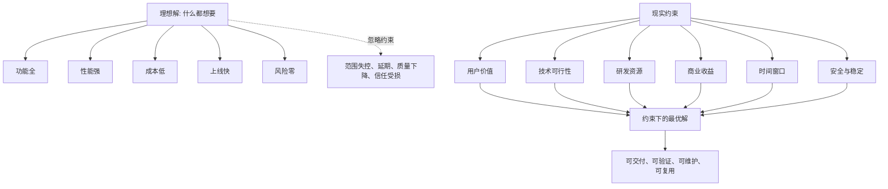

## 产品经理思维筑基课: 产品是约束下的最优解，不是理想解: 产品经理的取舍公理

### 作者
digoal

### 日期
2026-05-17

### 标签
产品经理 , 约束优化 , 产品取舍 , 技术约束 , 商业约束 , 数据库产品 , 云服务 , 资源配置 , 风险控制 , 最优解

----

## 背景

> 面向对象: 高中生、大学生、产品经理新人、技术型产品经理  
> 核心问题: 为什么产品经理不能只追求“功能更全、体验更好、成本更低、上线更快”？  
> 先说结论: 产品不是在真空里设计出来的完美作品，而是在用户价值、技术能力、资源成本、时间窗口、商业目标和风险边界之间做出的可执行选择。产品经理的成熟度，体现在能把“理想愿望”转化为“约束下的最优取舍”。

## 一张图先看懂



## 求真讲法

### 它到底说了什么

“产品是约束下的最优解，不是理想解”可以拆成三句话:

1. 产品决策永远受到约束，不存在无限资源、无限时间、零风险的环境。
2. 好产品不是满足所有愿望，而是在关键目标上做出最合理的取舍。
3. 产品经理要能解释为什么选择 A、放弃 B、延后 C，并承担这个排序。

一个简单例子:

```text
理想午餐:
好吃、便宜、健康、不排队、离教室近、分量足、马上能吃。

现实午餐:
你只有 20 分钟、30 元预算、下午还要考试。
这时“最优解”可能不是最想吃的火锅，
而是离得近、稳定、不会吃坏肚子的套餐。
```

产品也是一样。理想解通常好听，但不可交付。现实产品要在约束中选择。

### 它是怎么来的

这条公理来自工程、商业和组织协作中的共同事实: 资源有限，目标冲突，系统有副作用。

| 目标 | 可能冲突的目标 |
|---|---|
| 功能更多 | 研发周期更长，测试面更大 |
| 上线更快 | 质量风险更高，方案可能更粗糙 |
| 成本更低 | 性能、稳定性或服务能力可能下降 |
| 架构更先进 | 学习成本、迁移成本和不确定性更高 |
| 个性化更强 | 标准化、规模化和维护性更差 |
| 安全更严格 | 使用便利性和集成效率可能降低 |

产品经理选择这条公理，是为了把团队从“想要什么”拉回“在当前条件下应该先做什么”。

它不是鼓励平庸，而是反对脱离约束的空想。没有约束的“最好”，无法指导行动；有约束的“更好”，才可以进入开发、销售、交付和运营。

### 它依赖哪些假设

**假设 1: 约束是真实存在的。**  
时间、人力、资金、技术债、法规、客户承诺、竞争窗口、平台能力都会限制产品选择。

**假设 2: 多个目标之间存在冲突。**  
如果所有目标都能同时最大化，就不需要产品取舍。现实中，性能、成本、稳定、易用、灵活性常常相互拉扯。

**假设 3: 决策必须可执行。**  
产品方案不能只在 PPT 里成立，还要能被研发实现、测试验证、销售解释、客户使用、运维支撑。

**假设 4: 最优是相对当前目标和条件而言。**  
今天的最优解，半年后可能不是。约束变化后，产品决策也要更新。

### 常见误解

**误解 1: 约束下最优就是降低标准。**  
不是。它要求明确哪些标准不能降，哪些可以分阶段。数据库产品里，数据正确性和可恢复性通常不能牺牲，但页面美观可能可以后补。

**误解 2: 只要技术上能做，就应该做。**  
不是。技术可行只是必要条件之一，还要看用户价值、商业收益、运维成本、长期维护和机会成本。

**误解 3: 用户要什么就做什么，才是最优。**  
不是。用户提出的是局部愿望，产品经理要判断这个愿望是否可复用、是否伤害其他用户、是否符合产品定位。

**误解 4: 最优解可以一次算出来。**  
不是。产品决策更接近动态优化。随着用户反馈、竞争变化、技术成熟、资源变化，最优解会移动。

## 求存讲法

### 它有什么用

这条公理能帮助产品经理处理四类常见冲突:

| 冲突 | 产品经理要做的事 |
|---|---|
| 用户想要很多 | 判断哪些是真问题、哪些是边缘诉求 |
| 研发觉得太难 | 拆阶段、降范围、换实现路径 |
| 销售要求马上交付 | 明确最小可交付边界和风险 |
| 老板要求战略突破 | 把战略目标转成可验证里程碑 |

它让产品经理不再停留在“沟通协调”，而是进入真正的产品判断: 目标是什么，约束是什么，代价是什么，先后顺序是什么。

### 它怎么迁移到数据库软件和云服务产品

数据库和云服务产品是这条公理的高强度场景，因为它们同时受技术、商业、运维和信任约束。

| 理想愿望 | 现实约束 |
|---|---|
| 支持所有数据库语法 | 兼容成本、测试矩阵、长期维护 |
| 自动优化所有 SQL | 错误建议风险、执行计划变化、业务差异 |
| 无限弹性扩缩容 | 资源池容量、冷启动、状态迁移、成本 |
| 成本最低 | 性能、可靠性、毛利、服务质量 |
| 永不故障 | 物理故障、软件 bug、人为误操作、灾备成本 |
| 一键迁移所有业务 | 兼容性、数据量、停机窗口、回滚方案 |
| 安全策略最严格 | 易用性、集成效率、排障便利性 |

技术型 PM 要承认一个事实: 基础软件产品的“好”，不是单点最强，而是整体可控。

```text
数据库产品的好 = 正确性 + 稳定性 + 性能 + 兼容 + 可观测 + 可恢复 + 成本可接受
```

如果某个方案让性能提升 20%，但显著增加数据一致性风险，它可能不是好方案。

### 它的适用范围和边界

适用范围:

- 版本规划。
- 需求优先级排序。
- 大客户定制取舍。
- 技术方案产品化。
- 云服务定价和规格设计。
- 数据库能力分阶段交付。
- 安全、稳定、体验之间的权衡。

边界:

| 情况 | 处理方式 |
|---|---|
| 法规和安全红线 | 不能拿来随意权衡 |
| 数据正确性 | 数据库产品中通常是硬约束 |
| 用户生命财产安全 | 不能用商业收益覆盖风险 |
| 短期实验 | 可以降低完备性，但要控制影响范围 |
| 内部工具 | 可以更粗糙，但仍要满足真实使用场景 |

这条公理不是说所有东西都可以交易。成熟的取舍，第一步是区分“硬约束”和“软约束”。

### 正例: 怎么用它提升能力

假设你是云数据库 PM，团队要做“跨地域容灾”。

理想方案:

```text
零数据丢失、零停机、低延迟、低成本、自动切换、支持所有实例规格、所有地域都可用。
```

这听起来很好，但很可能不可交付。约束分析应先展开:

| 约束 | 要问的问题 |
|---|---|
| 一致性 | 是否要求 RPO=0？可以接受多少数据丢失？ |
| 恢复速度 | RTO 要几秒、几分钟还是几小时？ |
| 成本 | 用户愿意为灾备多付多少？ |
| 延迟 | 跨地域同步会不会影响写入性能？ |
| 场景 | 是金融核心系统，还是普通后台管理系统？ |
| 运维 | 切换后 DNS、应用连接、权限、监控如何处理？ |
| 覆盖范围 | 第一版支持哪些地域、规格和引擎版本？ |

第一版约束下的最优解可能是:

```text
先支持核心地域 + 指定版本 + 异步复制 + 手动确认切换 + 演练报告
```

这不是“退而求其次”，而是把不可交付的理想解拆成可交付、可验证、可运营的阶段。

### 反例: 前提不成立会怎样

反例一: 追求全功能，导致核心能力失守。

一个数据库管理平台决定同时做监控、告警、备份、审计、SQL 优化、权限、报表、大屏和 AI 助手。半年后:

- 每个模块都有一点，但都不够深。
- 告警误报太多，用户不信任。
- 备份恢复流程没有打磨好。
- 研发团队长期疲于补洞。

失败的前提是: “功能越多，产品越强”。对数据库产品来说，备份恢复、告警准确、权限安全这些基础能力不扎实，功能数量反而会放大风险。

反例二: 追求最低成本，牺牲长期信任。

某云服务为了降低成本，减少冗余资源和压测预算，短期毛利改善。但高峰期资源不足，扩容失败，客户核心业务受影响。结果:

- 客户减少使用量。
- 销售后续谈判更困难。
- 运维和赔付成本上升。
- 品牌信任受损。

失败的前提是: “成本越低越优”。在云服务里，成本只是一个目标，不能压倒可靠性和用户信任。

## 思考

### 一个取舍框架

面对任何产品方案，可以先填这张表:

| 问题 | 示例 |
|---|---|
| 核心目标是什么 | 降低迁移失败率，而不是做更多迁移页面 |
| 硬约束是什么 | 数据正确性、安全合规、已承诺 SLA |
| 软约束是什么 | 页面美观、覆盖全部地域、自动化程度 |
| 最大风险是什么 | 执行计划变化导致生产故障 |
| 最小可交付是什么 | 先做评估报告和灰度工具 |
| 如何验证 | PoC 通过率、回滚率、工单量、上线率 |

### 一个反事实问题

如果你拥有无限研发、无限时间、无限预算，很多产品决策会变得简单。但现实世界里，这些都不存在。

产品经理真正要回答的不是:

```text
这个功能好不好？
```

而是:

```text
在当前目标、资源、风险和时间窗口下，
这个功能是不是比其他选择更值得做？
```

这两个问题的难度完全不同。

### 与学习和生活的迁移

个人选择也一样。比如准备考试:

```text
理想解: 所有科目都学透，所有题型都会，作息完美，心态稳定。
现实约束: 只剩两周，数学最薄弱，英语已经稳定，睡眠不能再压缩。
约束下最优解: 主攻数学高频题型，英语保持手感，保证睡眠，放弃低频难题。
```

这不是不追求优秀，而是承认约束后更接近优秀。

## 最后记住

1. 产品不是理想愿望清单，而是约束下的可执行选择。
2. 好产品经理要能区分硬约束和软约束。
3. 数据库和云服务产品不能牺牲正确性、稳定性、安全和可恢复性来换表面功能。
4. 最优解会随目标、资源、用户和技术条件变化而变化。
5. 成熟的产品判断，不是“都要”，而是“现在最该要什么，为什么”。

## 参考资料

- Herbert A. Simon, *The Sciences of the Artificial*: 有限理性和满意解思想，有助于理解现实决策不是无限优化。
- Frederick P. Brooks, *The Mythical Man-Month*: 软件项目中的范围、人员、时间和复杂度约束。
- Marty Cagan, *Inspired*: 产品方案需要同时满足价值、可用性、可行性和商业可行性。
- Eric Ries, *The Lean Startup*: 通过最小可行产品和验证式学习，在约束下减少浪费。
- Eliyahu M. Goldratt, *The Goal*: 约束理论强调系统产出受关键约束限制。
- 本文对数据库软件、云服务场景的解释基于通用产品管理、企业软件、基础设施产品和数据库运维实践归纳。
  
#### [PostgreSQL 解决方案集合](../201706/20170601_02.md "40cff096e9ed7122c512b35d8561d9c8")
  
  
#### [德哥 / digoal's Github - 公益是一辈子的事.](https://github.com/digoal/blog/blob/master/README.md "22709685feb7cab07d30f30387f0a9ae")
  
  
#### [About 德哥](https://github.com/digoal/blog/blob/master/me/readme.md "a37735981e7704886ffd590565582dd0")
  
  

  
