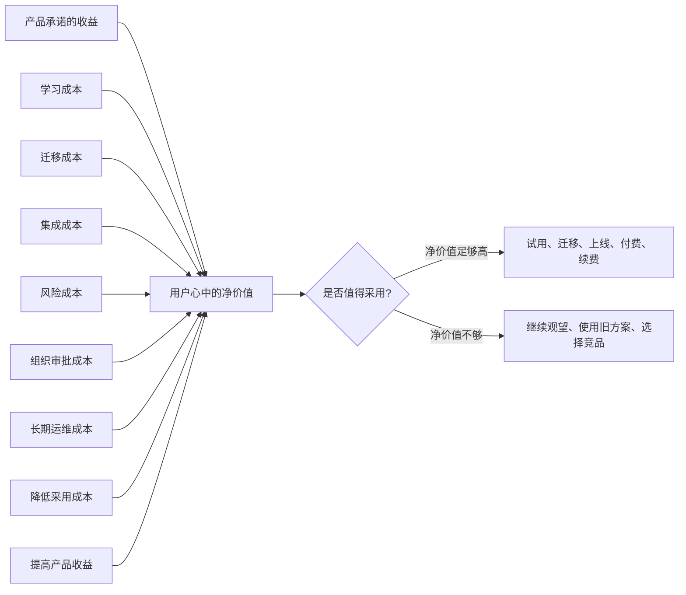

## 产品经理思维筑基课: 采用成本是产品价值的一部分: 产品经理的落地公理

### 作者
digoal

### 日期
2026-05-17

### 标签
产品经理 , 采用成本 , 产品价值 , 用户迁移 , 学习成本 , 数据库产品 , 云服务 , 企业软件 , 采用路径 , 技术产品

----

## 背景

> 面向对象: 高中生、大学生、产品经理新人、技术型产品经理  
> 核心问题: 为什么一个功能明明有价值，用户却不愿意用、不敢迁移、不肯采购？  
> 先说结论: 用户不会只计算产品带来的收益，也会计算采用它要付出的学习、迁移、集成、审批、风险和运维成本。产品价值不是“收益”本身，而是“收益减去采用成本之后还值得”。

## 一张图先看懂



## 求真讲法

### 它到底说了什么

“采用成本是产品价值的一部分”可以拆成三句话:

1. 用户使用产品前，不只问“它有什么好处”，还会问“我要付出什么代价”。
2. 同样的功能收益，如果采用成本不同，用户感受到的价值完全不同。
3. 产品经理不能只设计功能，还要设计用户从“不用”到“用起来”的路径。

可以用一个简单公式理解:

```text
用户感知价值 = 产品收益 - 采用成本 - 风险成本
```

例如一个学习软件号称能提升成绩，但需要每天配置复杂计划、手动录入大量数据、看很长教程。即使它真的有用，很多学生也会放弃。不是因为收益不存在，而是采用成本太高。

技术产品更明显。一个数据库能力可能性能很好，但如果迁移要改大量 SQL、重新培训 DBA、重做监控、承担停机风险，客户可能宁愿继续用旧系统。

### 它是怎么来的

这条公理来自一个常见现象:

```text
产品团队认为: 我们比旧方案强很多。
用户实际选择: 继续用旧方案。
```

原因往往不是用户“不懂价值”，而是产品团队低估了采用成本。

| 产品团队看到的 | 用户实际承担的 |
|---|---|
| 功能更强 | 学习新概念 |
| 性能更好 | 迁移数据和代码 |
| 架构更先进 | 承担新风险 |
| 价格更低 | 重新采购和审批 |
| 控制台更漂亮 | 改变原有流程 |
| 自动化更高 | 重新建立信任边界 |

产品经理选择这条公理，是为了避免只在功能清单上竞争，而忽视用户真实采用路径。

### 它依赖哪些假设

**假设 1: 用户有旧方案或替代方案。**  
只要用户已经在用某种方法完成任务，新产品就必须跨过替换门槛。旧方案哪怕不完美，也有熟悉、稳定、低风险的优势。

**假设 2: 采用行为需要付出成本。**  
成本不一定是钱，也可能是时间、注意力、组织协调、系统改造、风险承担和责任压力。

**假设 3: 用户会比较净收益，而不是绝对收益。**  
一个产品收益很大，但采用成本更大，用户仍可能不采用。一个产品收益中等，但上手极快，也可能增长很快。

**假设 4: 采用成本可以被产品设计影响。**  
文档、默认值、迁移工具、兼容层、试用环境、回滚机制、模板、培训、销售材料、SLA 都能改变采用成本。

### 常见误解

**误解 1: 降低采用成本就是把产品做简单。**  
不是。复杂产品可以保留专业能力，但要给不同用户提供不同进入路径。新手需要安全默认值，专家需要可控参数。

**误解 2: 产品足够好，用户自然会迁移。**  
不一定。数据库、云服务、企业软件都有路径依赖。用户可能知道你更好，但仍然因为迁移风险和组织成本而不动。

**误解 3: 采用成本只是用户培训问题。**  
不是。培训只能解决认知问题，解决不了兼容性、数据迁移、权限审批、回滚、计费、监控和责任边界。

**误解 4: 免费就没有采用成本。**  
错误。免费软件也有学习成本、集成成本、安全评估成本和运维成本。企业客户尤其不会因为免费就随便引入关键系统。

## 求存讲法

### 它有什么用

这条公理让产品经理从“做出能力”转向“让能力被采用”。

产品经理要问的不是:

```text
我们有没有这个功能?
```

而是:

```text
用户能不能低风险地发现、理解、试用、接入、迁移、上线、持续使用这个功能?
```

采用成本视角能帮助 PM 改进:

| 环节 | 产品经理要降低什么成本 |
|---|---|
| 发现 | 用户不知道有这个能力 |
| 理解 | 用户看不懂适用场景和收益 |
| 试用 | 用户搭环境太麻烦 |
| 接入 | API、权限、网络、SDK 不顺 |
| 迁移 | 数据、配置、代码、流程改造成本高 |
| 上线 | 风险不可控，缺少灰度和回滚 |
| 运营 | 监控、告警、计费、审计不清楚 |
| 扩大使用 | 缺少案例、模板、组织信任 |

### 它怎么迁移到数据库软件和云服务产品

数据库和云服务是采用成本极高的产品类型。因为用户采用的不只是一个功能，而是一套生产系统能力。

| 采用成本类型 | 数据库/云服务中的表现 |
|---|---|
| 学习成本 | 新 SQL 语法、新控制台、新参数、新故障处理方式 |
| 迁移成本 | schema 转换、数据同步、停机窗口、双写校验 |
| 兼容成本 | 驱动、ORM、存储过程、插件、权限模型不一致 |
| 集成成本 | 网络、VPC、IAM、监控、告警、CI/CD、审计系统 |
| 风险成本 | 数据丢失、性能抖动、不可回滚、责任不清 |
| 组织成本 | DBA、开发、安全、采购、财务、管理层共同评审 |
| 运维成本 | 备份恢复、容量规划、慢 SQL、故障切换、账单治理 |

技术型 PM 要特别警惕一种错觉:

```text
我们已经做完功能 = 用户可以采用
```

对数据库/云服务来说，真正的采用路径通常更像:

```text
看懂场景
  -> 建立测试环境
  -> 兼容性评估
  -> 迁移演练
  -> 性能压测
  -> 安全评审
  -> 灰度上线
  -> 监控接入
  -> 回滚预案
  -> 正式生产
```

其中任何一步太难，产品价值都会被折损。

### 它的适用范围和边界

适用范围:

- 新用户激活。
- 企业软件采购转化。
- 数据库迁移工具设计。
- 云服务控制台体验。
- API、SDK、文档和示例设计。
- 大客户 PoC 和生产上线。
- 版本升级、架构切换和新功能推广。

边界:

| 场景 | 应该怎么处理 |
|---|---|
| 高风险能力 | 不能为了降低采用成本而隐藏风险 |
| 专家工具 | 不必过度简化，但要提供清晰模型和安全边界 |
| 合规要求 | 不能为了省步骤绕开审批和审计 |
| 早期探索产品 | 可以接受较高采用成本，但要明确目标用户是早期采用者 |
| 低频关键功能 | 不能只看日常使用率，要看关键时刻是否可用 |

降低采用成本不是降低专业性，也不是诱导用户草率使用。成熟的做法是降低不必要成本，同时保留必要的风险控制。

### 正例: 怎么用它提升能力

假设你负责“从自建 PostgreSQL 迁移到云数据库”的产品能力。

只从功能看，团队可能会说:

```text
我们提供数据迁移工具，支持全量同步和增量同步。
```

从采用成本看，用户真正需要的是一条可控迁移路径:

| 迁移阶段 | 用户担心 | 产品应降低的成本 |
|---|---|---|
| 评估 | 不知道能不能迁 | 自动扫描版本、插件、SQL、对象兼容性 |
| 计划 | 不知道改哪些 | 输出风险清单和改造建议 |
| 演练 | 怕影响生产 | 提供沙箱环境和演练报告 |
| 同步 | 怕数据不一致 | 提供校验、断点续传、延迟监控 |
| 切换 | 怕停机太久 | 支持灰度、双写、切换窗口评估 |
| 回滚 | 怕失败不可逆 | 提供回滚方案和数据保护策略 |
| 上线后 | 怕没人兜底 | 接入监控、告警、工单和专家支持 |

这时，迁移工具不只是“搬数据”，而是在降低用户采用云数据库的总成本。

### 反例: 前提不成立会怎样

反例一: 功能强，但入口太重。

某云数据库上线了“高级慢 SQL 诊断”。算法不错，可以识别执行计划变化、锁等待和索引缺失。但用户很少使用。复盘发现:

- 需要手动开启多个采集开关。
- 权限配置复杂。
- 报告术语太多，开发看不懂。
- 没有和告警、工单、变更记录打通。

失败的前提是: “只要诊断能力强，用户就会用”。真实情况是，采用路径太重，价值无法到达用户。

反例二: 降低采用成本过度，制造风险。

某产品为了让数据库升级更简单，做了“一键自动升级”，默认跳过兼容性检查和回滚演练。短期升级率上升，但部分客户升级后出现 SQL 执行计划变化和插件不兼容。

失败的前提是: “采用成本越低越好”。对高风险技术产品来说，必要的检查、确认、灰度和回滚不是多余成本，而是保护用户价值的一部分。

## 思考

### 采用成本地图

```text
认知成本: 我知道它是什么吗?
理解成本: 我知道它适合我吗?
试用成本: 我能快速试一下吗?
接入成本: 它能接进我的系统吗?
迁移成本: 我能从旧方案搬过来吗?
风险成本: 出事能发现、控制、回滚吗?
组织成本: 安全、采购、运维、财务能通过吗?
长期成本: 用久了是否可维护、可观测、可治理?
```

产品经理可以用这张地图检查任何新功能: 不是只看有没有收益，而是看收益在哪一步被成本拦住。

### 一个反事实问题

如果一个产品能让用户每月节省 10 万元，但采用它需要:

- 改造三个月；
- 停机一次；
- 通过安全和采购评审；
- 重写监控体系；
- 承担失败后无人兜底的风险；

用户不采用，是“不识货”，还是产品没有把采用成本纳入价值设计？

### 与学习和生活的迁移

这条公理也适合个人决策。

| 目标 | 表面收益 | 采用成本 |
|---|---|---|
| 学英语 | 能看资料、能交流 | 每天练习、纠音、背单词、输出 |
| 健身 | 体力变好、体型改善 | 时间、场地、动作学习、坚持 |
| 换工作 | 薪资更高、机会更好 | 面试准备、试错风险、适应新环境 |
| 学数据库 | 能解决复杂问题 | 搭环境、读文档、做实验、分析故障 |

如果只看收益，很容易立目标；如果同时看采用成本，才知道怎样设计可持续路径。

## 最后记住

1. 产品价值不是收益本身，而是收益扣除采用成本后的净价值。
2. 用户不采用，不一定是不懂价值，可能是采用路径太贵、太慢、太险。
3. 数据库和云服务的采用成本包括学习、迁移、兼容、集成、风险、组织和运维成本。
4. 降低采用成本不等于省掉必要检查，高风险产品必须保留安全边界。
5. 产品经理不仅要设计功能，还要设计用户从知道到信任、从试用到生产的路径。

## 参考资料

- Everett Rogers, *Diffusion of Innovations*: 创新扩散理论解释不同用户群体采用新事物的差异。
- Geoffrey A. Moore, *Crossing the Chasm*: 技术产品从早期采用者跨越到主流市场时，需要降低采用风险。
- Clayton Christensen, *Competing Against Luck*: Jobs To Be Done 理论强调用户为取得进展而选择产品。
- Marty Cagan, *Inspired*: 产品发现需要同时验证价值、可用性、可行性和商业可行性。
- Don Norman, *The Design of Everyday Things*: 可理解性、可见性和反馈会影响用户是否能顺利使用产品。
- 本文对数据库软件、云服务场景的解释基于通用产品管理、企业软件、基础设施产品和数据库运维实践归纳。
  
#### [PostgreSQL 解决方案集合](../201706/20170601_02.md "40cff096e9ed7122c512b35d8561d9c8")
  
  
#### [德哥 / digoal's Github - 公益是一辈子的事.](https://github.com/digoal/blog/blob/master/README.md "22709685feb7cab07d30f30387f0a9ae")
  
  
#### [About 德哥](https://github.com/digoal/blog/blob/master/me/readme.md "a37735981e7704886ffd590565582dd0")
  
  

  
