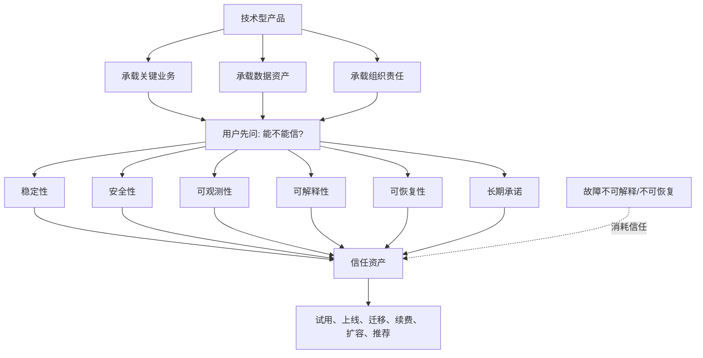

## 产品经理思维筑基课: 信任是技术型产品的第一资产: 产品经理的可靠性公理

### 作者
digoal

### 日期
2026-05-17

### 标签
产品经理 , 信任资产 , 技术产品 , 数据库产品 , 云服务 , 可靠性 , 安全性 , 可恢复性 , 可观测性 , 用户信任

----

## 背景

> 面向对象: 高中生、大学生、产品经理新人、技术型产品经理  
> 核心问题: 为什么数据库、云服务、安全、基础设施这类技术产品，不能只靠功能多、性能强、价格低取胜？  
> 先说结论: 技术型产品承载的是用户的业务、数据、流程和责任。用户采用它之前，首先要相信它不会轻易出错；出错时能被发现、解释、控制和恢复。因此，信任不是品牌口号，而是技术型产品最底层的资产。

## 一张图先看懂



## 求真讲法

### 它到底说了什么

“信任是技术型产品的第一资产”可以拆成三句话:

1. 技术型产品越接近用户核心业务，用户越先关心可信度，而不是新奇功能。
2. 信任来自长期可验证的稳定、安全、透明、可恢复和负责任。
3. 一次严重失信，可能抵消很多次功能迭代带来的好感。

普通工具出错，用户可能刷新重试。数据库、云服务、支付、安全、监控、备份系统出错，用户可能面对的是业务中断、数据损坏、审计风险、客户投诉和管理责任。

所以技术型产品的价值公式不能只写成:

```text
产品价值 = 功能收益 + 性能收益 + 成本收益
```

更接近现实的表达是:

```text
产品价值 = 功能收益 + 性能收益 + 成本收益 + 信任收益 - 风险成本
```

如果信任不足，其他收益很难被用户真正采用。

### 它是怎么来的

这条公理不是数学定理，而是基础软件、企业软件和云服务实践中反复出现的选择原则。

用户选择技术产品时，通常不是在买一个“功能集合”，而是在把一部分责任转移给产品和供应商:

| 用户交出的东西 | 对产品的隐含要求 |
|---|---|
| 生产数据 | 不能丢、不能乱、不能泄露 |
| 核心业务流量 | 稳定、可扩展、可降级 |
| 运维责任 | 出问题要能定位、解释、恢复 |
| 安全边界 | 权限、审计、隔离、合规要可靠 |
| 长期架构 | 版本演进、兼容、支持周期要可信 |
| 采购预算 | 账单、合同、SLA、服务承诺要清楚 |

技术型产品经理选择这条公理，是为了避免被“功能竞赛”误导。功能可以吸引注意，信任才决定关键系统是否敢上线。

### 它依赖哪些假设

**假设 1: 用户承担采用后果。**  
如果产品只是玩具或一次性工具，信任仍重要，但不是第一资产。越接近生产、资金、数据、合规和声誉，信任越重要。

**假设 2: 用户无法完全验证内部实现。**  
数据库内核、云平台调度、安全隔离、备份恢复都不是用户一眼能看透的东西。用户需要通过证据、承诺、历史表现和可观察机制建立信任。

**假设 3: 技术系统必然会出错。**  
成熟产品不是假装永不故障，而是能减少故障、限制影响、快速发现、清晰解释、可靠恢复。

**假设 4: 信任会累积，也会被消耗。**  
稳定运行、透明沟通、可靠支持会积累信任；隐瞒风险、夸大承诺、恢复失败、账单不清会消耗信任。

### 常见误解

**误解 1: 信任就是品牌知名度。**  
不是。品牌可以带来初始信任，但生产系统的持续信任来自真实表现: SLA、故障处理、文档、支持、兼容、恢复演练和客户案例。

**误解 2: 信任就是系统不出故障。**  
不是。任何复杂系统都可能故障。真正的信任包括故障前能预警，故障中能控制，故障后能解释和复盘。

**误解 3: 功能强就自然可信。**  
不是。功能越强，可能风险越大。自动化运维、智能诊断、自动扩缩容、自动索引，如果缺少解释、权限、审计和回滚，反而会降低信任。

**误解 4: 信任是运维和客服的事。**  
不是。信任必须从产品设计开始: 默认值、权限模型、错误提示、变更流程、回滚机制、可观测性、文档和生命周期策略都属于产品责任。

## 求存讲法

### 它有什么用

这条公理能帮助产品经理在功能、速度、成本和风险之间做更稳的判断。

没有信任视角时，团队容易这样决策:

```text
竞品有这个功能，我们也要做。
客户催得急，先上线再说。
自动化程度越高越好。
报错信息少一点，用户看着不烦。
故障细节别暴露，免得用户担心。
```

有信任视角后，问题会变成:

```text
这个功能会不会扩大故障半径?
用户能否理解系统做了什么?
出错时能不能回滚?
权限、审计、告警是否完整?
承诺是否可兑现?
用户是否敢把生产业务交给它?
```

技术型 PM 的一个核心能力，就是把“用户敢不敢用”设计进产品。

### 它怎么迁移到数据库软件和云服务产品

数据库和云服务的信任，通常由六类能力共同支撑:

| 信任维度 | 数据库/云服务中的表现 |
|---|---|
| 稳定性 | SLA、故障隔离、限流、降级、容量水位 |
| 数据正确性 | 事务、复制一致性、校验、备份可靠性 |
| 安全性 | 身份权限、网络隔离、加密、审计、密钥管理 |
| 可观测性 | 指标、日志、链路、慢 SQL、资源画像、告警 |
| 可解释性 | 变更原因、执行计划、诊断结论、账单明细 |
| 可恢复性 | 备份恢复、回滚、容灾切换、演练报告 |

对技术型产品来说，“信任功能”常常不是用户最先点名要的功能，却是用户真正上线前必须确认的能力。

例如用户说“我们想要更快的数据库”，PM 不能只推动性能优化，还要问:

```text
性能提升是否稳定?
是否影响事务一致性?
是否会改变执行计划?
是否有监控和回滚?
是否能解释为什么变快或变慢?
高峰期是否仍然可控?
```

否则性能收益可能换来信任损失。

### 它的适用范围和边界

适用范围:

- 数据库、缓存、消息队列、云服务、监控、安全、支付、DevOps 平台。
- 企业级产品的生产上线、续费扩容、迁移替换。
- 高风险自动化能力，如自动扩缩容、自动修复、自动索引、自动升级。
- 版本发布、故障复盘、SLA 设计、客户承诺和服务分层。

边界:

| 场景 | 应该怎么处理 |
|---|---|
| 低风险娱乐产品 | 信任仍重要，但可能不是第一购买因素 |
| 早期原型 | 可以先验证价值，但要明确不能用于生产 |
| 内部实验功能 | 可以降低承诺，但必须标明风险和边界 |
| 专家工具 | 可以暴露复杂性，但必须可解释、可审计、可回滚 |
| 紧急修复 | 速度重要，但不能跳过最小安全验证 |

信任不是让产品变慢、变保守，而是让用户知道哪些地方可靠，哪些地方有风险，风险发生时如何控制。

### 正例: 怎么用它提升能力

假设你负责云数据库的“自动小版本升级”功能。

从功能视角看，需求可能写成:

```text
用户可以开启自动小版本升级，系统在维护窗口内自动完成升级。
```

从信任视角看，这个功能必须补全一条可信链路:

| 环节 | 用户担心 | 产品设计 |
|---|---|---|
| 升级前 | 会不会不兼容 | 版本差异说明、风险检查、影响评估 |
| 升级中 | 会不会中断业务 | 维护窗口、连接切换策略、进度可见 |
| 升级后 | 性能会不会变差 | 指标对比、慢 SQL 变化、异常告警 |
| 出问题 | 能不能恢复 | 回滚策略、备份点、人工兜底 |
| 责任 | 谁做了什么 | 操作审计、通知记录、升级报告 |

这时，“自动升级”不只是自动执行脚本，而是让用户敢把升级交给平台。

### 反例: 前提不成立会怎样

反例一: 自动化功能破坏信任。

某数据库平台上线“自动索引优化”，会自动为慢 SQL 创建索引。上线初期效果不错，但后来部分业务写入延迟上升，存储成本增加，执行计划出现波动。用户发现:

- 不清楚系统为什么创建索引。
- 无法预估影响范围。
- 没有灰度和回滚机制。
- 审计记录不完整。

失败的前提是: “自动化越强，价值越大”。对数据库产品来说，自动化必须建立在解释、权限、评估、审计和回滚之上。否则自动化会从价值变成风险。

反例二: 故障沟通消耗信任。

某云服务发生区域性故障。平台恢复速度尚可，但状态页更新很慢，故障原因描述含糊，事后报告没有说明影响范围、恢复措施和预防动作。结果:

- 客户技术团队无法向管理层交代。
- 销售续费谈判变难。
- 用户开始准备多云或自建备选方案。

失败的前提是: “只要故障修好了就行”。技术型产品的信任不仅取决于恢复结果，也取决于透明度、解释能力和改进承诺。

## 思考

### 信任资产表

```text
初始信任: 品牌、案例、开源声誉、专家推荐
验证信任: PoC、压测、迁移演练、安全评审
运行信任: 稳定性、监控、告警、工单响应
危机信任: 故障隔离、恢复速度、透明沟通
长期信任: 兼容承诺、路线图、支持周期、生态稳定
```

产品经理要管理的不是一个抽象的“用户信任”，而是这些具体环节的证据。

### 一个反事实问题

如果一个云数据库性能比竞品快 30%，价格低 20%，但用户不知道:

- 数据是否一定不会丢；
- 故障时多久能恢复；
- 升级是否会改变执行计划；
- 账单为什么突然变化；
- 谁能解释一次异常；
- 出问题能不能回滚；

那么这个产品真的更有价值吗？

技术产品的竞争，常常不是“谁更强”，而是“谁更值得托付”。

### 与学习和生活的迁移

信任也适合理解人与人之间的合作。

| 场景 | 信任来自什么 |
|---|---|
| 同学组队 | 按时完成、遇到问题提前说、结果可检查 |
| 工作协作 | 承诺清楚、进度透明、风险不隐瞒 |
| 借钱还钱 | 记录清楚、按时履约、异常及时沟通 |
| 学习计划 | 不是喊口号，而是长期稳定行动 |

信任不是一次表态，而是可观察、可解释、可重复的行为记录。

## 最后记住

1. 技术型产品越靠近生产、数据、资金和合规，信任越是第一资产。
2. 信任不等于不出故障，而是稳定、安全、可观测、可解释、可恢复。
3. 功能、性能、低价如果破坏信任，长期看会反噬产品价值。
4. 数据库和云服务的信任必须设计进权限、审计、变更、告警、备份、回滚和沟通机制。
5. 好的技术型 PM 不只问“用户想不想要”，还要问“用户敢不敢把关键责任交给它”。

## 参考资料

- Site Reliability Engineering, Google: SLO、错误预算、可靠性工程等思想有助于理解技术系统中的信任建设。
- Frederick P. Brooks, *The Mythical Man-Month*: 复杂软件系统的可靠性交付与复杂度管理。
- Marty Cagan, *Inspired*: 技术产品需要同时验证价值、可用性、可行性和商业可行性。
- Gene Kim, Jez Humble, Patrick Debois, John Willis, *The DevOps Handbook*: 可观测、自动化、反馈和可靠交付实践。
- ISO/IEC 25010 软件质量模型: 可靠性、安全性、可维护性等质量属性可作为技术产品信任的参考框架。
- 本文对数据库软件、云服务场景的解释基于通用产品管理、基础设施产品、云计算和数据库运维实践归纳。
  
#### [PostgreSQL 解决方案集合](../201706/20170601_02.md "40cff096e9ed7122c512b35d8561d9c8")
  
  
#### [德哥 / digoal's Github - 公益是一辈子的事.](https://github.com/digoal/blog/blob/master/README.md "22709685feb7cab07d30f30387f0a9ae")
  
  
#### [About 德哥](https://github.com/digoal/blog/blob/master/me/readme.md "a37735981e7704886ffd590565582dd0")
  
  

  
