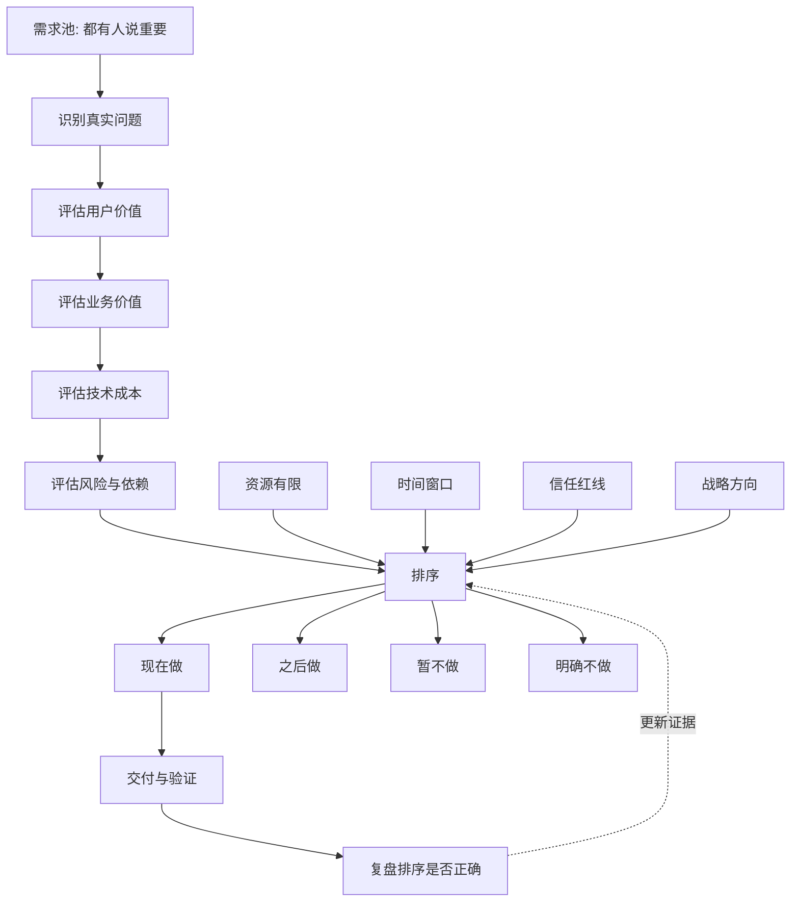

## 产品经理思维筑基课: 产品决策本质上是排序: 产品经理的优先级公理

### 作者
digoal

### 日期
2026-05-17

### 标签
产品经理 , 产品决策 , 优先级 , 需求排序 , 路线图 , 数据库产品 , 云服务 , 资源有限 , 产品取舍 , 技术产品

----

## 背景

> 面向对象: 高中生、大学生、产品经理新人、技术型产品经理  
> 核心问题: 为什么产品经理不能只说“这个需求也重要”，而必须说清楚“先做什么、后做什么、不做什么”？  
> 先说结论: 产品决策不是把所有正确的事都做完，而是在资源有限、目标冲突、风险不同的情况下，决定此刻最值得做的事。产品经理的核心能力，不是收集需求，而是建立可解释、可执行、可复盘的排序逻辑。

## 一张图先看懂



## 求真讲法

### 它到底说了什么

“产品决策本质上是排序”可以拆成三句话:

1. 需求是否重要，不是一个二选一问题，而是一个相对顺序问题。
2. 只要资源有限，选择做 A 就意味着暂时不做 B。
3. 产品经理必须能解释排序依据，而不是用声音大小、职位高低或个人偏好决定先后。

一个简单例子:

```text
你周末有 4 小时:
要复习数学、写作文、运动、陪家人、看电影、整理房间。

这些事可能都好。
但你不可能同时做完。
真正的决策不是“它们重不重要”，
而是“此刻哪件事最该排在前面”。
```

产品团队也是如此。需求池里几乎没有人会提交“完全没价值”的需求。难点在于: 多个都有道理的需求，谁排第一，谁排第二，谁必须放弃。

### 它是怎么来的

这条公理来自三个现实:

| 现实 | 对产品决策的影响 |
|---|---|
| 资源有限 | 研发、测试、设计、销售、运维时间都不够 |
| 机会有窗口 | 有些需求晚做就失去市场、客户或合规机会 |
| 目标会冲突 | 功能、稳定、成本、增长、收入、安全不能同时最大化 |

如果没有排序，团队会进入几种常见混乱:

```text
谁催得急就先做。
谁职位高就先做。
谁客户金额大就先做。
哪个功能看起来酷就先做。
哪个研发顺手就先做。
所有需求都排 P0。
```

产品经理选择这条公理，是为了把“混乱的愿望列表”转成“有限资源下的行动顺序”。

### 它依赖哪些假设

**假设 1: 资源不是无限的。**  
如果研发、测试、运维、预算和时间无限，就不需要排序。但现实项目永远有瓶颈。

**假设 2: 需求之间存在机会成本。**  
做一个需求会占用人力、发布窗口、测试资源和用户注意力。机会成本就是: 因为做了 A，而失去做 B 的机会。

**假设 3: 排序依据可以被讨论。**  
排序不是玄学。它至少应基于用户损失、发生频率、收入影响、战略价值、研发成本、风险、依赖和时机。

**假设 4: 排序会随着证据变化而变化。**  
今天排第一的需求，可能因为客户流失、故障、竞品变化、法规变化而下调或上调。成熟 PM 会维护排序，而不是一次排完永远不动。

### 常见误解

**误解 1: 排序就是给需求打分。**  
不是。打分只是工具。真正的排序需要解释为什么某个需求比另一个更值得现在做。

**误解 2: 客户金额最大，需求就一定最高优。**  
不一定。大客户需求可能是单点定制，长期维护成本很高；小客户需求也可能代表更大的市场模式。

**误解 3: 所有 P0 都是真的 P0。**  
如果一张需求表里有十个 P0，通常说明团队没有排序。真正的 P0 应该少、急、硬，且不做会产生明显损失。

**误解 4: 排序是产品经理一个人说了算。**  
不是。PM 负责提出排序逻辑和推动决策，但必须吸收研发、销售、客户成功、运维、安全、财务等信息。

## 求存讲法

### 它有什么用

这条公理能让团队避免三类浪费:

| 浪费 | 表现 |
|---|---|
| 做错 | 做了低价值需求，错过高价值需求 |
| 做散 | 多条线同时开工，每条都做不深 |
| 做乱 | 缺少依赖顺序，后做的基础能力反而卡住前面的功能 |

产品经理的排序工作，至少要回答:

```text
为什么现在做这个?
为什么不是另一个?
如果只能做一半，先保哪一半?
不做会损失什么?
做了如何验证?
哪些需求必须先做，哪些可以后做?
```

一个能回答这些问题的 PM，才真正承担了产品决策责任。

### 它怎么迁移到数据库软件和云服务产品

数据库和云服务产品的排序更难，因为需求不仅来自用户，还来自稳定性、安全、运维、成本、销售、合规和平台演进。

| 需求来源 | 常见诉求 | 排序时要看什么 |
|---|---|---|
| 客户 | 兼容语法、迁移工具、专属功能 | 是否可复用、是否阻塞成交或上线 |
| 研发 | 架构重构、技术债治理 | 是否影响长期交付和稳定性 |
| 运维 | 告警、限流、故障诊断 | 是否降低故障概率和恢复时间 |
| 安全 | 权限、审计、加密、合规 | 是否属于红线或准入条件 |
| 销售 | 竞品对标、标书能力 | 是否影响关键市场和收入 |
| 财务 | 成本优化、资源利用率 | 是否改善毛利且不伤害体验 |
| 战略 | 新引擎、新形态、新市场 | 是否打开长期增长空间 |

技术型 PM 的排序不能只看“用户可见功能”。很多最高优先级的事情，用户平时看不见，但生产上线前一定需要。

例如数据库产品里，下面两个需求同时出现:

```text
A. 控制台增加漂亮的数据大屏。
B. 修复备份恢复链路中的一致性校验缺口。
```

如果产品处在生产客户增长阶段，B 很可能优先级更高。因为它影响信任底座。A 更可见，但 B 更关键。

### 它的适用范围和边界

适用范围:

- 版本路线图。
- Sprint 计划。
- 大客户需求评审。
- 技术债治理。
- 云服务规格和地域规划。
- 数据库兼容性、可靠性、安全能力排序。
- 事故后改进项排序。

边界:

| 场景 | 应该怎么处理 |
|---|---|
| 安全漏洞和数据损坏风险 | 通常不进入普通排序，直接按红线处理 |
| 法规或合同硬承诺 | 先确认边界，再排资源 |
| 极低成本小修 | 可以快速处理，但不要让碎片需求吞掉主线 |
| 早期探索 | 排序依据可以更轻，但必须明确验证目标 |
| 多团队依赖 | 先排依赖链，不只排单个功能价值 |

排序不是把所有事情都放进一个简单公式。成熟排序会先区分红线、主线、机会、维护和实验。

### 正例: 怎么用它提升能力

假设你负责云数据库下一季度路线图，候选需求如下:

```text
1. 支持更多 SQL 兼容语法。
2. 优化慢 SQL 诊断。
3. 修复备份恢复演练流程。
4. 增加账单成本分析。
5. 做 AI DBA 助手。
6. 支持某大客户的专属审计格式。
```

可以先建立排序表:

| 需求 | 用户损失 | 可复用性 | 战略价值 | 研发成本 | 风险 | 初步排序 |
|---|---:|---:|---:|---:|---:|---|
| 备份恢复演练 | 高 | 高 | 高 | 中 | 低 | 1 |
| 慢 SQL 诊断 | 高 | 高 | 中 | 中 | 中 | 2 |
| SQL 兼容语法 | 中 | 高 | 高 | 高 | 中 | 3 |
| 账单成本分析 | 中 | 中 | 中 | 低 | 低 | 4 |
| 专属审计格式 | 高 | 低 | 低 | 中 | 中 | 5 |
| AI DBA 助手 | 不确定 | 不确定 | 中 | 高 | 高 | 6 |

这个排序不是绝对真理，但它把争论变清楚了。团队可以继续讨论:

```text
AI DBA 是否有更强战略证据?
专属审计格式是否能抽象成通用审计能力?
SQL 兼容语法是否阻塞多个客户迁移?
备份恢复是否存在生产风险红线?
```

排序的价值，不是让大家闭嘴，而是让争论围绕证据展开。

### 反例: 前提不成立会怎样

反例一: 所有客户需求都插队。

某云服务团队每周都被销售推动插入大客户需求。半年后:

- 路线图不断变化。
- 研发上下文频繁切换。
- 通用能力没有沉淀。
- 小客户体验变差。
- 大客户定制越来越难维护。

失败的前提是: “客户催得急，就应该排最前”。真实情况是，客户紧急程度只是排序因素之一，还要看可复用性、长期成本和战略匹配。

反例二: 只排新功能，不排信任债。

某数据库产品持续发布可见功能: 大屏、报表、AI 问答、快捷配置。但备份恢复、告警准确性、权限审计一直延期。一次生产故障后，客户发现恢复演练不可靠，开始流失。

失败的前提是: “用户看得见的功能更值得优先做”。对技术型产品来说，信任底座往往比展示型功能更优先。

## 思考

### 排序不是一列数字，而是一套解释系统

一个成熟的优先级说明，至少应该包含:

```text
目标: 这次排序服务于什么目标?
证据: 哪些用户、数据、工单、收入、风险支持它?
取舍: 因为做它，哪些事被延后?
边界: 什么条件变化后排序会调整?
验证: 做完后如何判断排序是对的?
沟通: 谁需要理解并接受这个排序?
```

如果只有“P0/P1/P2”标签，没有这些解释，排序很容易变成形式。

### 一个反事实问题

如果你的需求池里所有事项都标成“高优”，那等于没有优先级。

真正的产品问题不是:

```text
这个需求有没有价值?
```

而是:

```text
在当前目标和约束下，
它是否比其他需求更值得现在做?
```

这句话，是产品经理从“需求管理员”走向“产品负责人”的分界线。

### 与学习和生活的迁移

学习计划也一样。

| 想做的事 | 排序要看什么 |
|---|---|
| 刷更多题 | 是否命中薄弱点 |
| 看更多课程 | 是否比练习更有效 |
| 学新技能 | 是否服务当前目标 |
| 整理笔记 | 是否帮助复盘和迁移 |
| 休息 | 是否影响长期效率 |

优秀不是把所有好事都做完，而是在正确时间做最关键的事。

## 最后记住

1. 产品决策的本质是排序: 先做、后做、暂不做、明确不做。
2. 需求重要性是相对概念，必须放在目标、资源、风险和时间窗口里判断。
3. 数据库和云服务产品排序时，信任底座常常比可见功能更重要。
4. 好排序不是简单打分，而是能解释证据、取舍、边界和验证方式。
5. 产品经理的价值，不是让所有人都满意，而是让团队把有限资源用在最值得的地方。

## 参考资料

- Donald G. Reinertsen, *The Principles of Product Development Flow*: 队列、批量、延迟成本等思想有助于理解产品排序。
- Marty Cagan, *Inspired*: 产品团队需要围绕价值、可用性、可行性和商业可行性做取舍。
- RICE、MoSCoW、Kano 等常见优先级框架: 可作为排序工具，但不能替代具体判断。
- Frederick P. Brooks, *The Mythical Man-Month*: 软件项目中范围、时间和复杂度的约束会影响优先级。
- Eliyahu M. Goldratt, *The Goal*: 约束理论提醒团队关注系统瓶颈，而不是局部忙碌。
- 本文对数据库软件、云服务场景的解释基于通用产品管理、企业软件、基础设施产品和数据库运维实践归纳。
  
#### [PostgreSQL 解决方案集合](../201706/20170601_02.md "40cff096e9ed7122c512b35d8561d9c8")
  
  
#### [德哥 / digoal's Github - 公益是一辈子的事.](https://github.com/digoal/blog/blob/master/README.md "22709685feb7cab07d30f30387f0a9ae")
  
  
#### [About 德哥](https://github.com/digoal/blog/blob/master/me/readme.md "a37735981e7704886ffd590565582dd0")
  
  

  
