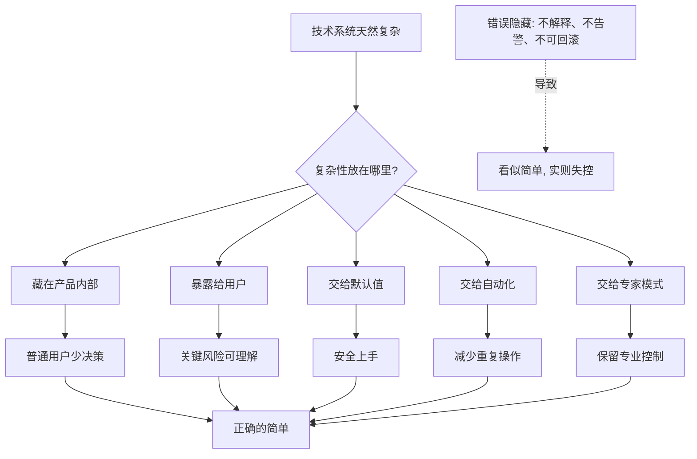

## 产品经理思维筑基课: 技术产品必须把复杂性藏在正确的地方: 产品经理的复杂性公理

### 作者
digoal

### 日期
2026-05-17

### 标签
产品经理 , 复杂性管理 , 技术产品 , 默认值 , 专家模式 , 数据库产品 , 云服务 , 可解释性 , 自动化 , 产品设计

----

## 背景

> 面向对象: 高中生、大学生、产品经理新人、技术型产品经理  
> 核心问题: 为什么技术产品不能简单地追求“越简单越好”？  
> 先说结论: 好的技术产品不是消灭所有复杂性，而是把复杂性放到合适的位置: 对新手隐藏不必要细节，对专家暴露关键控制，对高风险操作保留确认、解释和回滚。错误地隐藏复杂性，会让产品看起来简单，却变得不可理解、不可控制、不可恢复。

## 一张图先看懂



## 求真讲法

### 它到底说了什么

“技术产品必须把复杂性藏在正确的地方”可以拆成三句话:

1. 技术产品的复杂性不可能凭空消失，只能被分配、封装、转移或管理。
2. 好产品会隐藏用户当前不需要理解的复杂性，但暴露用户必须承担责任的复杂性。
3. 产品经理要决定哪些复杂性由系统承担，哪些由用户选择，哪些必须被解释、审计和回滚。

一个简单例子:

```text
电梯对乘客很简单: 按楼层。
但电梯没有消灭复杂性:
电机、刹车、传感器、限速器、控制系统都还在。

乘客不需要理解电机原理，
但必须能看到楼层、开关门、报警按钮和超载提示。
```

这就是“把复杂性藏在正确的地方”。隐藏内部机械细节是好设计；隐藏报警和超载风险是坏设计。

技术产品也是一样。数据库可以提供安全默认参数，但不能让用户完全看不见备份状态、复制延迟、慢 SQL、权限风险和升级影响。

### 它是怎么来的

这条公理来自一个现实: 技术产品通常由复杂系统构成，而用户只想完成任务。

如果完全暴露复杂性，用户会被参数、术语、流程和风险淹没；如果过度隐藏复杂性，用户会失去判断和控制能力。

| 处理方式 | 好处 | 风险 |
|---|---|---|
| 全部暴露 | 专家可控 | 新手难以上手，误操作多 |
| 全部隐藏 | 上手轻松 | 风险不可见，出事难解释 |
| 分层暴露 | 新手安全，专家可控 | 需要更好的产品设计 |

产品经理选择这条公理，是为了避免两种极端:

```text
极端一: 把技术产品做成参数迷宫。
极端二: 把技术产品做成黑盒按钮。
```

真正成熟的技术产品，会把复杂性分层、命名、默认化、自动化、可视化，而不是简单粗暴地删掉。

### 它依赖哪些假设

**假设 1: 技术系统本身确实复杂。**  
数据库、云平台、网络、安全、分布式系统都有真实复杂度。事务、复制、隔离、调度、权限、计费、容灾都不是一句“自动化”就能消失。

**假设 2: 用户能力和场景不同。**  
新手需要安全默认值，专家需要可控参数；开发者关心调试效率，DBA 关心稳定和风险，管理者关心成本和责任。

**假设 3: 有些复杂性和风险必须被用户知道。**  
涉及数据删除、权限放开、版本升级、跨地域复制、账单变化、自动变更时，用户必须理解后果。

**假设 4: 产品可以通过设计改变复杂性的呈现方式。**  
默认值、模板、向导、分层设置、风险提示、解释报告、专家模式、审计日志、回滚按钮，都能重新分配复杂性。

### 常见误解

**误解 1: 好产品就是越简单越好。**  
不是。好产品是“该简单的简单，该清楚的清楚，该可控的可控”。高风险技术产品过度简单，会让用户在不知情的情况下承担风险。

**误解 2: 专业用户喜欢复杂界面。**  
不是。专家也讨厌无意义复杂。专家需要的是关键控制权、准确反馈、可解释模型和高效率入口。

**误解 3: 自动化可以替代用户理解。**  
不是。自动化可以减少重复操作，但不能替代责任边界。自动化越强，越需要解释、审计、权限和回滚。

**误解 4: 隐藏参数就是降低复杂性。**  
不一定。隐藏参数如果保留了安全默认值，是好事；如果让用户无法排查性能、成本和故障，就是把复杂性转移到了故障现场。

## 求存讲法

### 它有什么用

这条公理能帮助产品经理设计技术产品的体验层次。

产品经理要问的不是:

```text
这个功能要不要做得简单?
```

而是:

```text
谁在什么场景下需要看到多少复杂性?
哪些复杂性可以默认化?
哪些复杂性必须解释?
哪些复杂性必须可控?
哪些复杂性应该留给专家模式?
```

它特别适合处理三类产品矛盾:

| 矛盾 | 产品经理要做的事 |
|---|---|
| 新手想简单 | 提供安全默认值、向导、模板 |
| 专家要控制 | 提供高级配置、API、审计、可观测 |
| 系统有风险 | 提供解释、确认、灰度、回滚、报警 |

### 它怎么迁移到数据库软件和云服务产品

数据库和云服务里，复杂性随处可见。成熟产品不是把它们全部塞给用户，而是分层处理。

| 复杂性 | 可以怎么藏 | 必须怎么暴露 |
|---|---|---|
| 数据库参数 | 推荐配置、场景模板 | 参数影响、风险提示、修改历史 |
| SQL 优化 | 自动分析、索引建议 | 执行计划、影响评估、回滚建议 |
| 备份恢复 | 默认备份策略 | 备份状态、恢复点、演练结果 |
| 高可用 | 自动主备切换 | 复制延迟、切换记录、故障影响 |
| 权限安全 | 角色模板、最小权限推荐 | 权限差异、审计日志、越权风险 |
| 云资源 | 自动扩缩容 | 账单影响、容量水位、限额 |
| 版本升级 | 升级向导 | 兼容风险、变更内容、回滚策略 |

技术型 PM 要特别注意: 用户不想管理复杂性，但用户需要管理风险。

```text
复杂性可以被系统承担。
风险必须被用户理解。
责任必须有记录。
```

### 它的适用范围和边界

适用范围:

- 数据库控制台。
- 云服务开通和配置。
- 自动化运维。
- 权限和安全设置。
- 备份恢复、容灾、升级、迁移。
- SQL 诊断、性能优化、成本优化。
- API、SDK、CLI 和专家工具设计。

边界:

| 场景 | 应该怎么处理 |
|---|---|
| 低风险高频操作 | 尽量简化和自动化 |
| 高风险低频操作 | 分步解释、确认、审计、回滚 |
| 专家用户场景 | 保留高级入口和精确控制 |
| 新手用户场景 | 默认值安全，避免一开始暴露参数海 |
| 不确定性很高的建议 | 不要伪装成确定结论，要标明置信度和影响 |

这条公理不是要求产品“复杂”，而是要求复杂性被诚实地处理。

### 正例: 怎么用它提升能力

假设你负责云数据库的“创建实例”流程。

糟糕的设计可能有两个极端:

```text
极端一: 第一屏让用户选择几十个参数。
极端二: 只有一个“立即创建”按钮，完全不解释性能、成本和可靠性差异。
```

更好的设计是分层:

| 用户层级 | 产品设计 |
|---|---|
| 新手 | 选择业务场景: 测试、生产、分析、高并发 |
| 普通用户 | 显示推荐规格、预计费用、默认备份和高可用 |
| 高级用户 | 可展开 CPU、内存、IOPS、存储、参数组、网络配置 |
| 风险操作 | 单独确认公网访问、删除保护、备份保留、跨地域复制 |
| 上线前 | 生成配置摘要、成本预估、安全检查和后续建议 |

这样，复杂性没有消失，而是被放进了合适的层级。

### 反例: 前提不成立会怎样

反例一: 把数据库做成参数迷宫。

某数据库产品为了满足专家用户，把所有参数都平铺在控制台首页。结果:

- 新用户不知道如何选择。
- 错误配置导致性能抖动。
- 销售演示时讲不清价值。
- 运维工单大量增加。

失败的前提是: “暴露更多参数等于更专业”。真实情况是，专业不等于让用户承担所有复杂性。

反例二: 把自动化做成黑盒。

某云服务上线自动扩缩容，用户只需要打开开关。短期很受欢迎，但后来出现账单暴涨和性能抖动。用户发现:

- 不知道触发扩容的规则。
- 看不到扩缩容历史。
- 不能设置预算上限。
- 无法解释为什么某天费用突然升高。

失败的前提是: “越少配置越简单”。对云服务来说，成本和容量是用户必须理解的风险。隐藏规则不是降低复杂性，而是降低可控性。

## 思考

### 复杂性分层表

```text
第一层: 默认值
让用户不懂也能安全开始。

第二层: 向导和模板
让用户按场景做选择，而不是按参数做选择。

第三层: 可视化和解释
让用户知道系统正在发生什么。

第四层: 高级配置
让专家能控制关键变量。

第五层: 审计和回滚
让高风险操作有记录、有退路。
```

产品经理可以用这五层检查任何技术功能: 哪些复杂性该在哪一层出现？

### 一个反事实问题

如果一个技术产品“非常简单”，但用户无法知道:

- 系统为什么做出某个自动决策；
- 这个决策会不会影响成本；
- 出错时谁能发现；
- 是否能回滚；
- 哪些参数被系统替他选择了；
- 专家如何接管；

那么它是真的简单，还是只是把复杂性藏到了用户看不见、但迟早会爆发的地方？

### 与学习和生活的迁移

学习也是复杂性管理。

| 场景 | 错误处理 | 正确处理 |
|---|---|---|
| 学数学 | 一上来堆公式 | 先理解问题，再逐步引入符号 |
| 学编程 | 复制代码不理解 | 先用模板跑通，再解释关键概念 |
| 做计划 | 把每分钟都排满 | 先定目标和优先级，再细化动作 |
| 管理时间 | 只用复杂工具 | 用简单规则处理多数情况，特殊情况再细分 |

好老师和好产品一样，不是把复杂世界假装简单，而是安排一条可以进入复杂世界的路径。

## 最后记住

1. 技术产品的复杂性不会消失，只会被分配、封装、转移或管理。
2. 好产品隐藏不必要细节，但暴露关键风险、责任和控制点。
3. 新手需要安全默认值，专家需要高级控制，高风险操作需要解释和回滚。
4. 数据库和云服务不能把备份、权限、成本、升级、扩缩容做成不可解释的黑盒。
5. 技术型 PM 的成熟度，体现在知道复杂性该由系统承担、由用户选择，还是必须被双方共同看见。

## 参考资料

- Don Norman, *The Design of Everyday Things*: 可见性、反馈、映射和约束有助于理解复杂系统的可用性设计。
- John Maeda, *The Laws of Simplicity*: 简化不是粗暴减少，而是组织、隐藏和赋予意义。
- Ben Shneiderman, “Direct Manipulation”: 交互系统需要可见对象、快速反馈和可逆操作。
- Martin Fowler 关于抽象、封装和软件设计复杂性的文章: 技术复杂性需要被合理封装，而不是掩盖。
- Site Reliability Engineering, Google: 可靠系统需要可观测、可解释、可恢复，而不是只追求表面简单。
- 本文对数据库软件、云服务场景的解释基于通用产品管理、基础设施产品、云计算和数据库运维实践归纳。
  
#### [PostgreSQL 解决方案集合](../201706/20170601_02.md "40cff096e9ed7122c512b35d8561d9c8")
  
  
#### [德哥 / digoal's Github - 公益是一辈子的事.](https://github.com/digoal/blog/blob/master/README.md "22709685feb7cab07d30f30387f0a9ae")
  
  
#### [About 德哥](https://github.com/digoal/blog/blob/master/me/readme.md "a37735981e7704886ffd590565582dd0")
  
  

  
