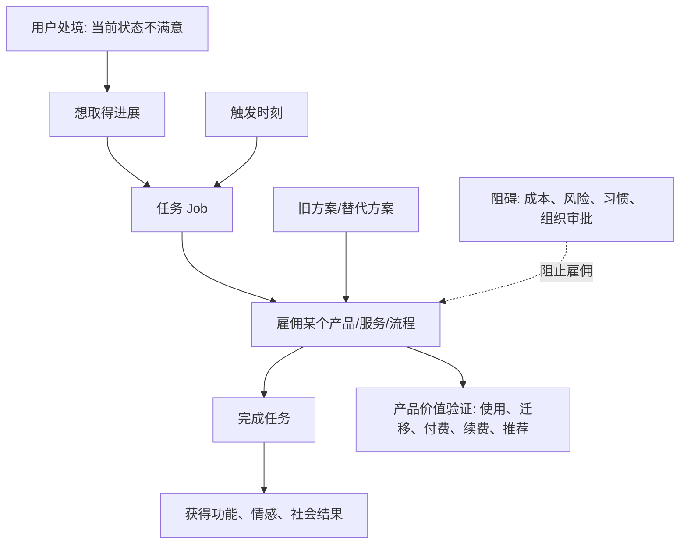

## 产品经理思维筑基课: Jobs To Be Done: 用户雇佣产品完成任务

### 作者
digoal

### 日期
2026-05-17

### 标签
产品经理 , Jobs To Be Done , 用户任务 , 产品发现 , 替代方案 , 数据库产品 , 云服务 , 用户进展 , 需求分析 , 技术产品

----

## 背景

> 面向对象: 高中生、大学生、产品经理新人、技术型产品经理  
> 核心问题: 为什么产品经理不能只问“用户是谁、想要什么功能”，还要问“用户想完成什么进展”？  
> 先说结论: Jobs To Be Done 认为，用户不是为了拥有产品而使用产品，而是为了在某个具体情境中完成一项任务、取得一种进展。产品经理要理解的不是“用户喜欢什么功能”，而是“用户为什么在那个时刻雇佣这个产品，替代了什么，又想摆脱什么阻碍”。

## 一张图先看懂



## 求真讲法

### 它到底说了什么

Jobs To Be Done，常简称 JTBD，可以翻译成“待完成的任务”。它的核心句式是:

```text
当我处在某个情境中，
我想完成某种进展，
这样我就能得到某种结果。
```

它把产品理解成“被用户雇佣来完成任务的工具”。

比如用户不是单纯“买一杯咖啡”，而可能是在不同场景里雇佣咖啡完成不同任务:

| 场景 | 用户真正雇佣咖啡做什么 |
|---|---|
| 早上赶路 | 让我清醒，并给通勤路上一个固定动作 |
| 下午开会前 | 帮我恢复注意力 |
| 朋友聊天 | 提供一个轻松见面的理由 |
| 加班时 | 支撑我多工作一段时间 |

同一个产品，可能被雇佣来完成不同任务。不同产品，也可能竞争同一个任务。下午犯困时，咖啡、茶、散步、午睡、能量饮料都可能是竞争方案。

对产品经理来说，JTBD 的提醒是: 不要只看产品品类和功能，要看用户想完成的进展。

### 它是怎么来的

JTBD 不是数学定理，而是一套创新和产品发现方法。它被 Clayton Christensen 等人推广，用来解释为什么用户会选择、替换或放弃某个产品。

传统分析常从这些问题开始:

```text
用户画像是什么?
用户年龄多大?
用户想要什么功能?
竞品有哪些功能?
```

JTBD 会追问:

```text
用户在什么时刻开始寻找新方案?
他原来怎么解决?
原方案哪里不够好?
他想取得什么进展?
他为什么现在才改变?
他担心什么，所以还没采用?
```

人们选择 JTBD，是因为很多失败产品不是没有功能，而是没有抓住用户真正要完成的任务。

| 只看功能 | 看任务 |
|---|---|
| 用户要报表 | 用户要向老板解释业务变化 |
| 用户要导出 Excel | 用户要进入现有协作流程 |
| 用户要 AI 助手 | 用户要更快定位故障并承担责任 |
| 用户要低价 | 用户要降低账单不确定性 |
| 用户要兼容语法 | 用户要降低迁移风险 |

### 它依赖哪些假设

**假设 1: 用户选择产品是为了取得进展。**  
这个进展可能是功能性的，比如更快完成工作；也可能是情感性的，比如更安心；还可能是社会性的，比如让上级相信方案可靠。

**假设 2: 任务比用户标签更稳定。**  
“30 岁程序员”和“45 岁 DBA”是人群标签；“在生产故障时快速定位根因”是任务。不同人群可能共享同一个任务。

**假设 3: 用户总有替代方案。**  
替代方案不一定是竞品，也可能是 Excel、脚本、人工流程、自建系统、继续忍受、不做改变。

**假设 4: 采用新产品需要跨过阻力。**  
用户不会因为一个方案看起来更好就马上切换。他还要考虑学习成本、迁移成本、风险、预算、组织审批和责任边界。

### 常见误解

**误解 1: JTBD 就是不做用户画像。**  
不是。用户画像仍有价值，但画像不能替代任务。JTBD 只是提醒 PM: 不要把年龄、职位、行业标签误当成需求本身。

**误解 2: Job 就是用户要的功能。**  
不是。功能是方案，Job 是用户要取得的进展。用户说“我要告警”，背后的 Job 可能是“在故障影响客户前发现问题”。

**误解 3: 一个产品只有一个 Job。**  
不是。一个产品可能被不同用户在不同场景中雇佣完成多个任务。关键是识别主要任务和高价值任务。

**误解 4: JTBD 可以替代数据分析。**  
不是。JTBD 帮你提出更好的问题，理解选择动机；数据分析帮你验证行为、规模和结果。两者应结合。

## 求存讲法

### 它有什么用

JTBD 对产品经理最大的价值，是把需求从“功能清单”还原成“任务链路”。

它能帮助 PM:

1. 找到真正的竞争对手。
2. 解释用户为什么换产品，或为什么不换。
3. 把需求访谈从“你想要什么”改成“你上次怎么做”。
4. 设计更完整的采用路径，而不是只做单点功能。
5. 发现功能价值、情感价值和组织价值之间的关系。

### 它怎么迁移到数据库软件和云服务产品

数据库/云服务用户很少是为了“拥有云数据库”而来。他们通常在雇佣产品完成更底层的任务。

| 用户说法 | 可能的 Job | 真实竞争方案 |
|---|---|---|
| 我要云数据库 | 让业务稳定运行，减少自运维负担 | 自建数据库、托管服务、外包运维 |
| 我要迁移工具 | 低风险把旧系统迁到新平台 | 手写脚本、第三方工具、继续不迁 |
| 我要慢 SQL 诊断 | 快速定位性能问题并减少背锅 | DBA 人工分析、日志脚本、APM |
| 我要 Serverless | 在不确定流量下少操心、少浪费钱 | 固定规格实例、自建弹性、人工扩容 |
| 我要备份恢复 | 出事故时能向业务和管理层交代 | 自建备份、存储快照、人工导出 |
| 我要成本分析 | 解释账单并找到可控优化动作 | 财务报表、Excel、人工估算 |

技术型 PM 要特别关注“功能任务、情感任务、组织任务”三层:

| 层级 | 数据库/云服务例子 |
|---|---|
| 功能任务 | 查询更快、迁移成功、故障恢复 |
| 情感任务 | DBA 更安心，开发少焦虑 |
| 组织任务 | 通过安全评审、向老板解释成本、满足合规 |

很多 B 端产品失败，不是功能任务没做，而是情感任务和组织任务没完成。比如迁移工具能搬数据，但没有风险报告、回滚方案和审计记录，客户仍然不敢迁。

### 它的适用范围和边界

适用范围:

- 新产品机会识别。
- 用户访谈。
- 竞品分析。
- 需求优先级排序。
- 定价和包装。
- 企业客户 PoC 复盘。
- 数据库/云服务迁移、诊断、备份、成本、安全等场景设计。

边界:

| 场景 | 应该怎么处理 |
|---|---|
| 法规强制需求 | JTBD 可解释任务，但不能替代合规要求 |
| 底层技术重构 | 用户任务不明显，也要结合技术债和长期稳定性 |
| 已知安全漏洞 | 不需要等用户表达 Job，应直接处理 |
| 极早期探索 | JTBD 访谈有用，但样本可能偏，需要行为验证 |
| 多角色采购 | 要分别识别使用者、购买者、审批者的 Job |

JTBD 不是万能公式。它擅长理解用户为什么选择，但不能替代技术判断、商业判断和风险治理。

### 正例: 怎么用它提升能力

假设客户说:

```text
我们想要一个 AI DBA 助手。
```

如果只按功能理解，团队可能直接做聊天窗口:

```text
输入数据库问题 -> AI 返回建议。
```

用 JTBD 拆解，会问:

```text
客户上一次遇到数据库问题是什么时候?
当时谁负责?
用了哪些工具?
花了多久?
最痛苦的环节是什么?
最后如何向业务方解释?
如果建议错了，谁承担责任?
```

可能发现真正的 Job 是:

```text
当线上数据库性能突然变差时，
我想快速定位根因、获得可信处理建议，
这样我能恢复业务并向团队解释发生了什么。
```

于是第一版产品不一定是“聊天机器人”，而可能是:

| 任务环节 | 产品能力 |
|---|---|
| 发现异常 | 指标和告警聚合 |
| 定位根因 | 慢 SQL、锁等待、资源水位、执行计划变化分析 |
| 生成建议 | 给出证据链和风险级别 |
| 执行动作 | 生成变更单，而不是直接自动执行 |
| 解释复盘 | 输出可给业务方看的诊断报告 |

这比单纯做 AI 对话更接近用户真正雇佣产品完成的任务。

### 反例: 前提不成立会怎样

反例一: 把用户标签当成任务。

某产品团队认为“我们的用户是中小企业，所以他们需要便宜的数据库”。于是主打低价。但上线后转化一般。访谈发现:

- 一部分用户真正怕的是没有 DBA，出事没人处理。
- 一部分用户真正需要的是能快速通过备案、安全和采购流程。
- 一部分用户真正想要账单可预测，而不是单价最低。

失败的前提是: “中小企业 = 只关心价格”。标签掩盖了不同任务。

反例二: 把竞品当成唯一替代方案。

某云服务产品只盯另一个云厂商的功能对标，做了很多相似页面。但客户仍然不迁移。后来发现客户的真实替代方案不是竞品云数据库，而是:

- 继续使用自建数据库；
- 找外包团队维护；
- 写脚本补监控；
- 推迟迁移计划；
- 只把边缘业务上云。

失败的前提是: “竞品就是唯一竞争对手”。JTBD 视角下，竞争对手是所有能帮助用户完成同一任务的方案。

## 思考

### JTBD 访谈五问

```text
1. 你上一次遇到这个问题是什么时候?
2. 当时你想完成什么结果?
3. 你用了什么旧办法? 哪里不满意?
4. 你为什么没有更早换方案?
5. 如果新方案成功，你会在哪些行为上改变?
```

这五问比“你想要什么功能”更接近真实需求。

### 一个任务句式

产品经理可以用下面句式整理需求:

```text
当 [用户处在某个情境]，
我想 [完成某种任务/取得某种进展]，
这样我就能 [得到功能、情感或组织结果]。
```

数据库/云服务例子:

```text
当核心业务数据库出现性能抖动时，
我想在 10 分钟内定位主要原因并获得可信处理建议，
这样我就能恢复业务、减少损失，并向业务方解释风险。
```

### 与学习和生活的迁移

JTBD 也适合理解个人选择。

| 你买的东西 | 你可能雇佣它完成什么任务 |
|---|---|
| 课程 | 帮我建立学习路径，而不只是给我知识 |
| 笔记软件 | 帮我整理思路，而不只是存文字 |
| 跑鞋 | 帮我更容易坚持运动 |
| 日程工具 | 帮我减少忘事和焦虑 |

看懂自己真正雇佣一个东西完成什么任务，也能减少冲动消费和无效努力。

## 最后记住

1. 用户不是为了产品本身而来，而是为了完成任务、取得进展。
2. Job 不是功能，而是用户在具体情境中的目标和阻碍。
3. 数据库/云服务产品要同时理解功能任务、情感任务和组织任务。
4. 真正的竞争对手，是所有能帮助用户完成同一任务的替代方案。
5. 好的 PM 不只问“用户要什么”，还问“用户为什么现在要、原来怎么做、为什么愿意换”。

## 参考资料

- Clayton M. Christensen, Taddy Hall, Karen Dillon, David S. Duncan, *Competing Against Luck*: 系统阐述 Jobs To Be Done 与创新方法。
- Clayton M. Christensen, Scott Cook, Taddy Hall, “Marketing Malpractice”, Harvard Business Review, 2005: 用“用户雇佣产品完成任务”的视角解释市场细分误区。
- Anthony W. Ulwick, *Jobs to Be Done: Theory to Practice*: 从结果驱动创新角度拆解用户任务。
- Alan Klement, *When Coffee and Kale Compete*: 用通俗案例解释 JTBD 和替代方案竞争。
- Teresa Torres, *Continuous Discovery Habits*: 持续发现方法强调围绕机会、假设和证据理解用户。
- 本文对数据库软件、云服务场景的解释基于通用产品管理、企业软件、基础设施产品和数据库运维实践归纳。
  
#### [PostgreSQL 解决方案集合](../201706/20170601_02.md "40cff096e9ed7122c512b35d8561d9c8")
  
  
#### [德哥 / digoal's Github - 公益是一辈子的事.](https://github.com/digoal/blog/blob/master/README.md "22709685feb7cab07d30f30387f0a9ae")
  
  
#### [About 德哥](https://github.com/digoal/blog/blob/master/me/readme.md "a37735981e7704886ffd590565582dd0")
  
  

  
