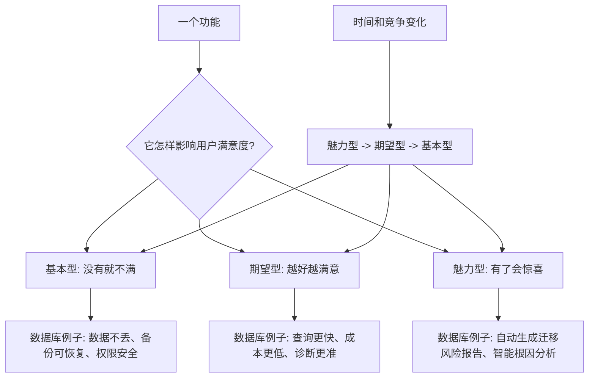

## 产品经理思维筑基课: Kano 模型: 功能分为基本型、期望型、魅力型

### 作者
digoal

### 日期
2026-05-17

### 标签
产品经理 , Kano模型 , 基本型功能 , 期望型功能 , 魅力型功能 , 用户满意度 , 数据库产品 , 云服务 , 功能分类 , 产品优先级

----

## 背景

> 面向对象: 高中生、大学生、产品经理新人、技术型产品经理  
> 核心问题: 为什么有些功能做了用户没感觉，没做却会骂；有些功能越强用户越满意；有些功能一开始很惊喜，后来又变成理所当然？  
> 先说结论: Kano 模型提醒产品经理，功能对满意度的影响不是一样的。基本型功能缺失会强烈不满，做好了也只是“应该的”；期望型功能越好越满意；魅力型功能会带来惊喜，但会随市场成熟逐渐变成期望型甚至基本型。

## 一张图先看懂



## 求真讲法

### 它到底说了什么

Kano 模型是一种理解“功能和用户满意度关系”的方法。它最常用的分类是:

| 类型 | 用户感受 | 做好了 | 没做好 |
|---|---|---|---|
| 基本型 | 这是应该有的 | 不会特别夸 | 强烈不满 |
| 期望型 | 越多越好、越强越好 | 满意度上升 | 满意度下降 |
| 魅力型 | 没想到你还能这样 | 惊喜、传播 | 通常不会抱怨 |

生活里很容易理解:

```text
住酒店:
干净床单、热水、安全门锁 = 基本型。
房间更大、位置更好、早餐更丰富 = 期望型。
免费升级套房、主动准备生日蛋糕 = 魅力型。
```

如果酒店没有热水，你不会因为它送了蛋糕就满意。基本型没做好，魅力型很难补救。

产品也是一样。数据库产品如果数据会丢、备份不可恢复、权限不安全，再多 AI 功能也很难建立信任。

### 它是怎么来的

Kano 模型通常追溯到日本质量管理学者狩野纪昭及其合作者对质量属性和顾客满意关系的研究。它的价值在于提醒团队: 用户满意度不是所有功能线性相加。

传统需求列表容易把所有功能当成同一类:

```text
功能 A: 重要
功能 B: 重要
功能 C: 重要
```

Kano 模型会追问:

```text
这个功能缺失时，用户会不会强烈不满?
这个功能做得越好，用户是否越满意?
这个功能是否会带来超预期惊喜?
这个功能是否已经从惊喜变成行业标配?
```

人们选择 Kano 模型，是因为它能解释很多产品现象:

| 现象 | Kano 解释 |
|---|---|
| 做了很多功能，用户仍不满意 | 可能基本型没做好 |
| 某个功能用户不夸，但出问题就投诉 | 它是基本型 |
| 性能提升后用户愿意付费 | 它可能是期望型 |
| 新功能一开始很火，后来没人提 | 魅力型变成了默认期待 |

### 它依赖哪些假设

**假设 1: 用户满意度不是单维度的。**  
不同功能影响满意度的方式不同，不能简单用“有没有价值”统一判断。

**假设 2: 用户期待会随时间变化。**  
今天的魅力型，明天可能变成期望型；行业普及后，还可能变成基本型。

**假设 3: 不同用户群对同一功能分类可能不同。**  
对个人开发者来说，“自动备份”可能是魅力型；对金融企业来说，它是基本型。

**假设 4: 功能分类必须结合场景。**  
同一个功能在测试环境和生产环境里的重要性不同。生产数据库里的备份恢复，与临时测试库里的备份恢复，不是同一优先级。

### 常见误解

**误解 1: 基本型不重要，因为做好了用户也不夸。**  
恰好相反。基本型是信任底座。用户不夸，是因为它属于准入门槛。

**误解 2: 魅力型最值得优先做。**  
不一定。如果基本型没过关，魅力型会变成装饰。只有底座稳定后，魅力型才可能放大传播和差异化。

**误解 3: 一个功能永远属于同一类。**  
不是。分类会随行业成熟、竞品普及、用户经验和场景变化而变化。

**误解 4: Kano 模型可以直接替代优先级排序。**  
不能。Kano 只是一个视角。实际排序还要看用户规模、收入影响、研发成本、风险、战略价值和时间窗口。

## 求存讲法

### 它有什么用

Kano 模型能帮助产品经理避免三种错误:

1. 把基本型当成无聊功能而长期忽视。
2. 把魅力型当成救命稻草，用炫功能掩盖底座问题。
3. 把所有需求放在同一张表里比较，却不区分满意度机制。

它可以帮助 PM 重新组织路线图:

```text
先保证基本型不失守。
再提升期望型竞争力。
最后用魅力型创造差异和传播。
```

这不是固定顺序，而是风险意识。基本型出现缺口时，通常要优先修补。

### 它怎么迁移到数据库软件和云服务产品

数据库和云服务里，Kano 模型特别有用，因为许多关键能力不是“显眼功能”，而是“用户不允许你犯错”的底线。

| Kano 类型 | 数据库/云服务例子 | 产品含义 |
|---|---|---|
| 基本型 | 数据正确、备份可恢复、权限安全、连接稳定、账单清楚 | 没有就失去信任 |
| 期望型 | 查询更快、扩容更快、成本更低、诊断更准、迁移更顺 | 做得越好越有竞争力 |
| 魅力型 | 自动生成迁移报告、智能根因解释、异常前预警、成本优化建议 | 带来惊喜和差异化 |

技术型 PM 要小心一个问题: 数据库/云服务的基本型通常不容易被用户主动提出。

用户可能不会说:

```text
我希望你的备份真的能恢复。
我希望权限系统不要越权。
我希望升级不要破坏执行计划。
```

但这些一旦出问题，用户会立刻失去信任。

### 它的适用范围和边界

适用范围:

- 需求分类。
- 版本规划。
- 用户满意度分析。
- 竞品功能判断。
- 数据库/云服务可靠性、性能、成本、智能化能力排序。
- 客户投诉和续费流失复盘。

边界:

| 场景 | 应该怎么处理 |
|---|---|
| 安全漏洞、数据损坏 | 不只是基本型，而是红线，应立即处理 |
| 新市场探索 | 魅力型可能更重要，但要控制生产风险 |
| 专家用户产品 | 专家可能把高级控制当作基本型 |
| 低频关键功能 | 不能因使用频率低而低估，比如恢复演练 |
| 多角色产品 | 分别判断使用者、购买者、审批者的 Kano 类型 |

Kano 模型不是让产品经理机械分类，而是提醒 PM: 同一个功能对不同用户和不同场景的满意度机制不同。

### 正例: 怎么用它提升能力

假设你负责云数据库路线图，有这些候选项:

```text
1. 备份恢复演练报告。
2. 查询性能提升 20%。
3. AI 自动解释慢 SQL 根因。
4. 控制台主题换肤。
5. 账单成本异常提醒。
```

可以先用 Kano 视角分类:

| 需求 | Kano 判断 | 理由 |
|---|---|---|
| 备份恢复演练报告 | 基本型/期望型 | 生产用户需要确认能恢复 |
| 查询性能提升 20% | 期望型 | 越快越满意，但要看稳定性 |
| AI 慢 SQL 根因解释 | 魅力型/期望型 | 如果可信，会形成差异化 |
| 控制台主题换肤 | 可能是无差异型 | 对核心任务帮助有限 |
| 账单成本异常提醒 | 期望型/基本型 | 大客户可能把账单可解释当准入 |

更成熟的排序可能是:

```text
先补备份恢复演练报告，
再做查询性能提升和账单异常提醒，
AI 慢 SQL 根因解释先做灰度验证，
主题换肤暂不进入主线。
```

这个判断背后的逻辑是: 先守住信任底座，再提升竞争力，最后做差异化惊喜。

### 反例: 前提不成立会怎样

反例一: 用魅力型掩盖基本型缺口。

某数据库产品大力宣传 AI 助手，可以自动生成 SQL、解释报错、推荐索引。但真实使用中:

- 备份恢复流程不清楚。
- 权限审计不完整。
- 慢 SQL 告警误报多。
- 升级兼容风险没有提示。

结果用户演示时觉得新鲜，但不敢生产上线。

失败的前提是: “魅力型功能能带来足够满意度”。当前提“基本型已达标”不成立时，魅力型无法抵消信任问题。

反例二: 把期望型误当基本型，过度承诺。

某云服务承诺“所有查询都自动优化到最快”。这听起来像基本承诺，但实际数据库查询受数据分布、索引、并发、锁、参数、业务 SQL 写法影响，无法保证所有场景最优。上线后用户发现部分查询没有改善，反而认为产品失信。

失败的前提是: “性能优化可以像热水供应一样被保证”。性能通常是期望型，应该承诺可观测、可解释、可优化，而不是绝对最优。

## 思考

### Kano 分类检查表

```text
如果没有它，用户会不会强烈不满?
如果做得更好，用户是否愿意更多使用或付费?
如果突然提供它，用户会不会惊喜?
它是否已经是竞品标配?
不同用户角色对它的期待是否不同?
它会不会从魅力型逐渐变成基本型?
```

### 需求会迁移

```text
早期:
自动备份是惊喜。

成熟期:
自动备份是期望。

生产级市场:
自动备份、恢复验证、审计报告都是基本要求。
```

产品经理必须持续更新对 Kano 分类的判断。市场成熟后，过去的亮点可能只是今天的门槛。

### 与学习和生活的迁移

Kano 模型也能解释人与人合作中的满意度。

| 合作能力 | Kano 类型 |
|---|---|
| 按时完成、不失联 | 基本型 |
| 质量越高、效率越高 | 期望型 |
| 主动发现风险并提出方案 | 魅力型 |

如果一个同学经常不交作业，即使偶尔做出漂亮 PPT，也很难让团队信任。基本型缺失时，魅力型很难救场。

## 最后记住

1. Kano 模型提醒我们: 功能对满意度的影响方式不同。
2. 基本型缺失会强烈不满，做好了只是应该的。
3. 期望型越强越满意，常常决定竞争力。
4. 魅力型能创造惊喜，但会随时间变成期望型甚至基本型。
5. 数据库和云服务 PM 必须先守住数据正确、稳定、安全、可恢复这些基本型，再谈炫功能。

## 参考资料

- Noriaki Kano, Nobuhiku Seraku, Fumio Takahashi, Shinichi Tsuji, “Attractive Quality and Must-Be Quality”, 1984: Kano 模型的经典论文。
- ISO/IEC 25010 软件质量模型: 可靠性、安全性、可维护性等质量属性可帮助识别技术产品基本型能力。
- Marty Cagan, *Inspired*: 产品发现需要同时考虑价值、可用性、可行性和商业可行性。
- Clayton Christensen, *Competing Against Luck*: 用户任务视角有助于判断功能是否真正改善用户进展。
- Site Reliability Engineering, Google: 可靠性、SLO、错误预算等思想有助于理解技术产品基本型要求。
- 本文对数据库软件、云服务场景的解释基于通用产品管理、基础设施产品、云计算和数据库运维实践归纳。
  
#### [PostgreSQL 解决方案集合](../201706/20170601_02.md "40cff096e9ed7122c512b35d8561d9c8")
  
  
#### [德哥 / digoal's Github - 公益是一辈子的事.](https://github.com/digoal/blog/blob/master/README.md "22709685feb7cab07d30f30387f0a9ae")
  
  
#### [About 德哥](https://github.com/digoal/blog/blob/master/me/readme.md "a37735981e7704886ffd590565582dd0")
  
  

  
