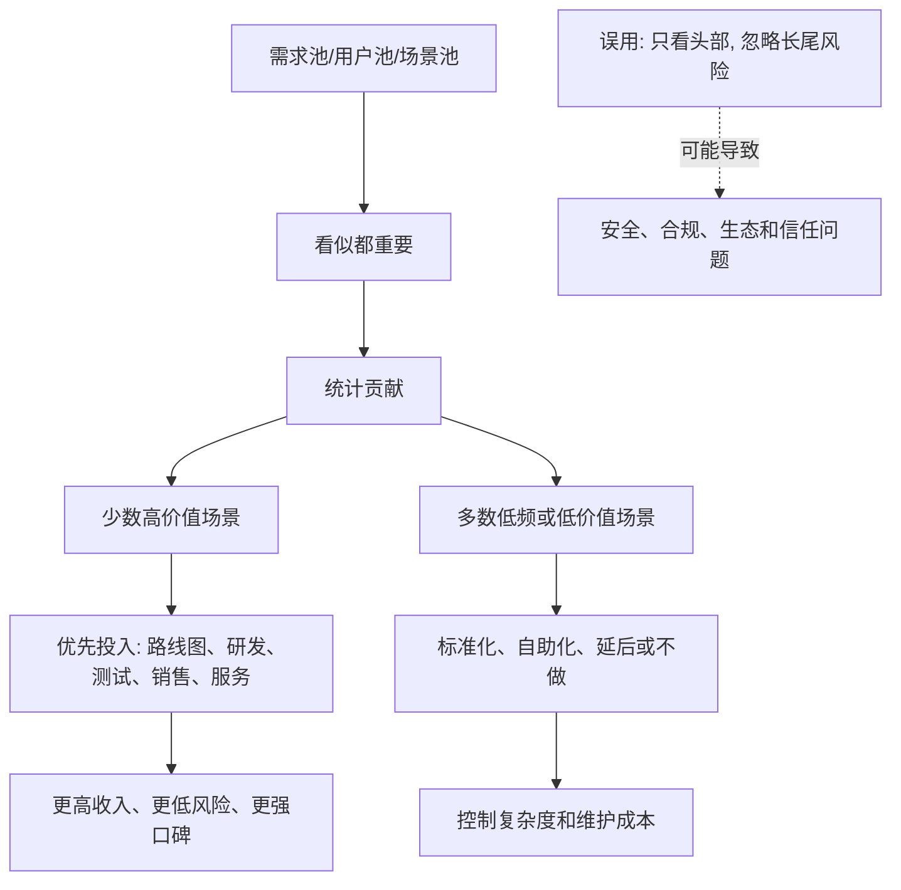

## 产品经理思维筑基课: 80/20 法则: 少数场景贡献多数价值

### 作者
digoal

### 日期
2026-05-17

### 标签
产品经理 , 80/20法则 , 帕累托法则 , 高价值场景 , 需求排序 , 数据库产品 , 云服务 , 关键少数 , 产品策略 , 技术产品

----

## 背景

> 面向对象: 高中生、大学生、产品经理新人、技术型产品经理  
> 核心问题: 为什么产品经理不能平均对待所有用户、所有需求、所有场景？  
> 先说结论: 80/20 法则提醒我们，很多系统里的价值、收入、问题、风险和使用量，并不是平均分布的。产品经理要找到少数最关键的用户、场景、任务和瓶颈，把有限资源优先投到最能改变结果的地方。

## 一张图先看懂



## 求真讲法

### 它到底说了什么

80/20 法则，也常被称为帕累托法则。它的通俗表达是:

```text
少数原因，贡献了多数结果。
```

它不一定刚好是 80% 和 20%。真实世界可能是 70/30、90/10，甚至 99/1。重点不是数字，而是“不均匀分布”。

生活里很容易看到:

| 场景 | 可能的 80/20 现象 |
|---|---|
| 学习 | 少数薄弱知识点导致多数失分 |
| 时间管理 | 少数任务决定大部分成果 |
| 销售 | 少数客户贡献多数收入 |
| 软件质量 | 少数模块产生多数 bug |
| 产品使用 | 少数功能贡献多数使用时长 |

产品经理使用 80/20 法则，不是为了偷懒，而是为了识别杠杆点。资源有限时，平均用力常常意味着哪里都不够强。

### 它是怎么来的

80/20 法则通常追溯到意大利经济学家 Vilfredo Pareto 对财富和土地分布不均的观察。后来，人们把类似的不均匀分布现象迁移到质量管理、经营分析、产品管理、时间管理和工程系统里。

它在产品管理中有价值，是因为产品团队经常面对这样的表面混乱:

```text
很多用户都在提需求。
很多功能都有人用。
很多问题都值得修。
很多客户都希望被满足。
```

80/20 视角会追问:

```text
哪些用户贡献了最多收入?
哪些场景贡献了最多使用量?
哪些问题造成了最大损失?
哪些功能支撑了核心任务?
哪些故障消耗了最多工单?
哪些能力最影响成交和续费?
```

它的动机是把产品决策从“平均公平”转向“结果贡献”。

### 它依赖哪些假设

**假设 1: 价值分布是不均匀的。**  
如果所有用户、场景、需求的价值完全相同，80/20 思维就没有意义。但多数产品里，价值分布并不平均。

**假设 2: 高价值部分可以被识别。**  
产品经理需要通过收入、使用量、留存、工单、故障损失、迁移阻塞、战略价值等证据找到关键少数。

**假设 3: 资源投入会产生机会成本。**  
投入长尾需求，就会减少对核心场景的投入。投入低价值功能，就可能错过高价值能力。

**假设 4: 关键少数不是永远不变的。**  
市场阶段、客户结构、技术架构、竞争格局变化后，过去的 20% 可能不再是未来的 20%。

### 常见误解

**误解 1: 80/20 就是只服务大客户。**  
不是。大客户可能贡献收入，但不一定代表通用市场。关键少数可以是高频场景、高风险问题、高增长用户，也可以是战略入口。

**误解 2: 80/20 就是放弃长尾。**  
不是。长尾可以通过自助化、标准化、生态、文档、插件机制来低成本覆盖。不能让长尾吞掉主线，也不能粗暴忽视长尾风险。

**误解 3: 80/20 是精确数学公式。**  
不是。它是经验性观察和思维工具。产品经理不能机械追求 80 和 20 的比例。

**误解 4: 当前贡献最大，就一定最该优先。**  
不一定。有些当前贡献小的场景，可能是未来增长入口；有些当前贡献大的客户，可能是不可复用定制。

## 求存讲法

### 它有什么用

80/20 法则能帮助产品经理做四件事:

1. 识别最值得投入的用户和场景。
2. 找到造成最大损失的问题和瓶颈。
3. 避免被低价值噪音需求拖散。
4. 把路线图从“功能均摊”改成“结果聚焦”。

产品经理可以把需求池拆成几类:

| 类型 | 处理方式 |
|---|---|
| 高价值高复用 | 优先进入主线 |
| 高价值低复用 | 谨慎评估，尽量抽象成通用能力 |
| 低价值高频 | 优化体验或自动化 |
| 低价值低频 | 延后、自助化或明确不做 |
| 低频高风险 | 不能只按频率低估，要看损失 |

### 它怎么迁移到数据库软件和云服务产品

数据库和云服务里的 80/20 现象非常常见。

| 领域 | 可能的关键少数 |
|---|---|
| 收入 | 少数行业、少数大客户、少数规格贡献多数收入 |
| 性能 | 少数 SQL、少数表、少数热点 key 造成多数压力 |
| 成本 | 少数实例、少数存储类型、少数低利用资源造成多数浪费 |
| 故障 | 少数模块、少数变更类型、少数依赖造成多数事故 |
| 工单 | 少数报错、少数配置问题、少数迁移阶段造成多数咨询 |
| 迁移 | 少数兼容问题阻塞多数迁移项目 |
| 生态 | 少数语言驱动、ORM、BI 工具覆盖多数客户 |

技术型 PM 要把 80/20 用到更细的产品判断里:

```text
不是“优化数据库性能”，
而是“优化头部 20% 负载里造成 80% 延迟的查询类型”。

不是“支持所有迁移场景”，
而是“先支持贡献 80% 迁移机会的源库版本、对象类型和业务模式”。
```

这会让需求从口号变成可执行路线图。

### 它的适用范围和边界

适用范围:

- 版本路线图排序。
- 目标客户和行业选择。
- 数据库性能优化。
- 工单和故障治理。
- 云服务成本优化。
- 迁移工具和兼容性规划。
- 销售资源、客户成功和专家支持分配。

边界:

| 场景 | 应该怎么处理 |
|---|---|
| 安全漏洞 | 即使影响少数用户，也可能必须优先 |
| 数据正确性 | 不能因为低频就忽略 |
| 合规要求 | 不适合简单按贡献排序 |
| 生态能力 | 长尾插件和工具可能影响整体采用 |
| 新兴市场 | 当前数据小，不代表未来价值低 |
| 平台型产品 | 过度聚焦头部可能破坏开放性和生态 |

80/20 法则强调聚焦，但不授权产品经理忽视底线风险。

### 正例: 怎么用它提升能力

假设你负责云数据库的慢 SQL 诊断产品。需求池里有很多声音:

```text
支持更多图表。
增加 AI 对话。
导出诊断报告。
支持锁等待分析。
支持执行计划对比。
增加索引建议。
支持更多数据库版本。
```

用 80/20 思维，先看真实数据:

| 数据源 | 发现 |
|---|---|
| 工单 | 70% 性能工单集中在慢查询、锁等待、执行计划变化 |
| 生产指标 | 15% SQL 模板贡献 85% CPU 消耗 |
| 客户访谈 | DBA 最痛苦的是无法解释“为什么昨天还快今天变慢” |
| 销售反馈 | 大客户 PoC 最常问诊断证据链和报告导出 |

于是第一阶段排序可以是:

```text
1. 慢 SQL 模板聚合。
2. 执行计划变化对比。
3. 锁等待分析。
4. 诊断证据链报告导出。
5. AI 对话先做内部灰度。
```

这个排序不是功能最酷，而是对高价值问题最集中。

### 反例: 前提不成立会怎样

反例一: 平均满足所有需求，核心场景不够强。

某数据库产品为了显得全面，同时支持几十种小功能: 多种报表、各种导入格式、冷门配置入口、控制台美化。但核心生产客户最关心的备份恢复、SQL 诊断、权限审计一直不够扎实。

结果:

- 演示时功能很多。
- PoC 时关键能力掉链子。
- 研发长期维护大量低频功能。
- 用户不敢把核心业务迁过来。

失败的前提是: “覆盖越多场景，产品越强”。真实情况是，少数核心场景如果不够强，长尾功能不会转化为信任。

反例二: 只看当前收入，错过未来关键场景。

某云数据库发现大部分收入来自传统 OLTP 负载，于是长期忽视向量检索、实时分析、Serverless 等新场景。短期看资源很聚焦，但几年后客户架构变化，新业务负载转向其他平台。

失败的前提是: “当前 80% 收入 = 未来 80% 价值”。80/20 需要动态更新，不能把历史分布当成永久真理。

## 思考

### 80/20 诊断清单

```text
哪些 20% 客户贡献多数收入?
哪些 20% 场景贡献多数使用?
哪些 20% 问题造成多数工单?
哪些 20% SQL 消耗多数资源?
哪些 20% 功能影响多数续费?
哪些 20% 风险可能造成最大损失?
哪些 20% 新机会可能决定未来增长?
```

注意最后两问: 80/20 不只看现在的使用和收入，也要看风险和未来。

### 一个反事实问题

如果你把所有用户、所有需求、所有场景平均对待，表面看很公平，但结果可能是:

```text
核心用户觉得不够深。
长尾用户觉得不够全。
研发觉得维护太累。
销售觉得没有杀手能力。
老板觉得增长不明显。
```

平均用力经常不是公平，而是没有选择。

### 与学习和生活的迁移

学习也符合 80/20 思维。

| 学习问题 | 80/20 问法 |
|---|---|
| 总是丢分 | 哪几类题贡献多数失分？ |
| 时间不够 | 哪些任务决定多数成绩？ |
| 背了很多 | 哪些概念是后续知识的基础？ |
| 很努力但没进步 | 哪些习惯造成多数低效？ |

它不是让你只学 20%，而是让你先找到最有杠杆的 20%。

## 最后记住

1. 80/20 法则的重点不是精确比例，而是不均匀分布。
2. 产品经理要识别少数高价值场景、客户、问题、风险和机会。
3. 数据库和云服务里，少数负载、SQL、故障类型、兼容问题常常贡献多数影响。
4. 80/20 不能用来忽视安全、数据正确性、合规和低频高损失风险。
5. 成熟 PM 会动态更新关键少数，而不是把历史头部当成永久答案。

## 参考资料

- Vilfredo Pareto 关于财富分布不均的观察: 80/20 法则常见历史来源。
- Richard Koch, *The 80/20 Principle*: 将帕累托思想推广到商业、管理和个人效率。
- Joseph M. Juran 的质量管理思想: “vital few and trivial many” 有助于理解少数关键原因造成多数质量问题。
- Donald G. Reinertsen, *The Principles of Product Development Flow*: 延迟成本、队列和经济性有助于产品优先级判断。
- Marty Cagan, *Inspired*: 产品团队需要围绕价值、可用性、可行性和商业可行性做取舍。
- 本文对数据库软件、云服务场景的解释基于通用产品管理、基础设施产品、云计算和数据库运维实践归纳。
  
#### [PostgreSQL 解决方案集合](../201706/20170601_02.md "40cff096e9ed7122c512b35d8561d9c8")
  
  
#### [德哥 / digoal's Github - 公益是一辈子的事.](https://github.com/digoal/blog/blob/master/README.md "22709685feb7cab07d30f30387f0a9ae")
  
  
#### [About 德哥](https://github.com/digoal/blog/blob/master/me/readme.md "a37735981e7704886ffd590565582dd0")
  
  

  
