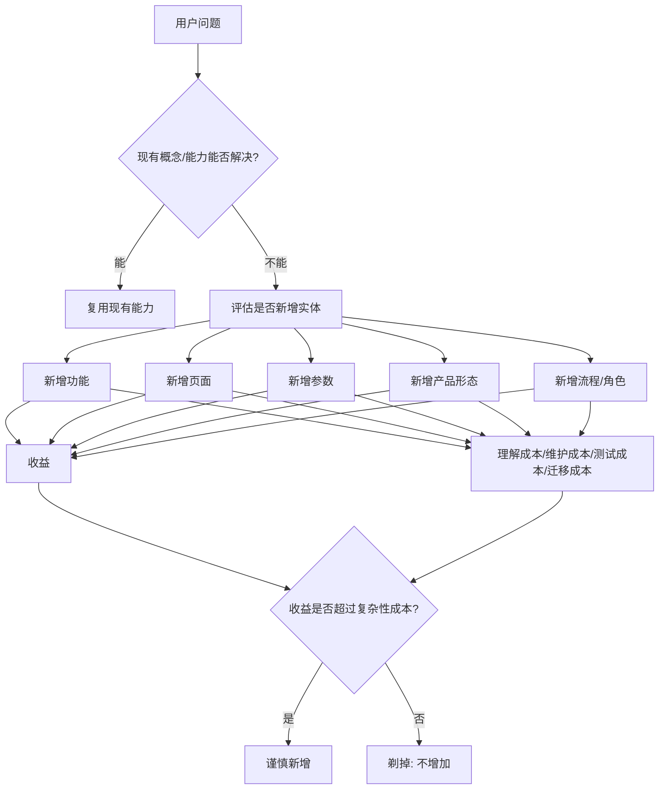

## 产品经理思维筑基课: 奥卡姆剃刀: 不增加不必要的实体

### 作者
digoal

### 日期
2026-05-17

### 标签
产品经理 , 奥卡姆剃刀 , 产品简化 , 不必要实体 , 概念设计 , 数据库产品 , 云服务 , 参数设计 , 复杂性成本 , 产品架构

----

## 背景

> 面向对象: 高中生、大学生、产品经理新人、技术型产品经理  
> 核心问题: 为什么产品经理不能随便增加新概念、新入口、新流程、新配置和新产品形态？  
> 先说结论: 奥卡姆剃刀提醒我们，在解释力和解决力足够的前提下，不要增加不必要的实体。放到产品管理里，就是不要为了看起来完整、专业或灵活，就创造多余功能、概念、参数、页面、角色和流程。复杂性如果不能换来真实价值，就会变成用户理解成本和团队维护成本。

## 一张图先看懂



## 求真讲法

### 它到底说了什么

奥卡姆剃刀常被概括为:

```text
如无必要，勿增实体。
```

这里的“实体”不是只指物体，也可以指解释、假设、概念、分类、流程、模块、配置项。它不是说“最简单的解释一定正确”，而是说:

```text
当两个方案都能解释或解决问题时，
优先选择假设更少、结构更简单、额外负担更小的方案。
```

生活里很容易理解:

```text
你早上迟到。

解释 A: 昨晚睡太晚，早上闹钟没听见。
解释 B: 手机系统 bug、闹钟被神秘关闭、路上所有红灯都故意针对你。

如果没有更多证据，解释 A 更值得先相信。
```

产品里也是一样。用户想“更快找到慢 SQL 原因”，不一定要新建一个“智能数据库宇宙驾驶舱”。可能先把慢 SQL、执行计划变化、锁等待、资源水位放到同一个诊断报告里，就能解决大部分问题。

### 它是怎么来的

奥卡姆剃刀通常与中世纪哲学家 William of Ockham 相关。它在科学、哲学、工程和产品设计中常被当作一种简约原则，而不是严格证明出来的定理。

产品经理选择它，是因为产品复杂性会持续累积:

| 新增实体 | 带来的隐藏成本 |
|---|---|
| 新功能 | 研发、测试、文档、客服、版本兼容 |
| 新页面 | 导航复杂、用户学习成本、权限管理 |
| 新参数 | 配置错误、解释成本、故障排查成本 |
| 新角色 | 权限矩阵、审批流程、组织理解成本 |
| 新产品线 | 定价、销售、交付、品牌定位、维护周期 |
| 新术语 | 培训、文档、销售话术和用户心智成本 |

复杂性不是一次性成本。只要产品还活着，它就会持续消耗团队和用户。

### 它依赖哪些假设

**假设 1: 多个方案都能解决当前问题。**  
奥卡姆剃刀只在“解释力或解决力接近”时有意义。如果简单方案解决不了问题，就不能为了简单而硬选简单。

**假设 2: 新增实体会带来长期成本。**  
一个新概念上线后，要被研发维护、测试覆盖、销售解释、用户学习、客服支持、文档更新。

**假设 3: 用户注意力和理解能力有限。**  
产品越复杂，用户越难知道该点哪里、该信什么、该怎么排障。

**假设 4: 简洁本身不是目的，解决问题才是目的。**  
奥卡姆剃刀不是反对复杂系统，而是反对没有必要的复杂性。

### 常见误解

**误解 1: 奥卡姆剃刀就是永远选最简单方案。**  
不是。它要求在能解决问题的前提下减少不必要复杂性。不能解决问题的简单方案，只是偷懒。

**误解 2: 少功能一定比多功能好。**  
不一定。少功能如果无法完成用户任务，也不是好产品。关键是功能是否必要、是否可复用、是否值得维护。

**误解 3: 专业产品就应该复杂。**  
不是。专业不等于概念堆叠。专业产品要把必要复杂性组织好，而不是把所有复杂性直接扔给用户。

**误解 4: 新概念能体现创新。**  
不一定。很多新概念只是旧问题换名字。真正的创新应该降低用户完成任务的成本，而不是增加解释负担。

## 求存讲法

### 它有什么用

奥卡姆剃刀能帮助产品经理在立项、设计和路线图中不断追问:

```text
这个新功能是否真的必要?
能不能用已有能力解决?
这个新概念是否让用户更懂，还是更糊涂?
这个参数是否必须暴露?
这个入口是否会分散主路径?
这个产品形态是否值得长期维护?
```

它的作用不是让团队保守，而是让团队把复杂性花在真正有价值的地方。

### 它怎么迁移到数据库软件和云服务产品

数据库和云服务本来就复杂。每新增一个实体，都会进入长期维护链路。

| 产品决策 | 奥卡姆剃刀式追问 |
|---|---|
| 新增数据库参数 | 是否能用场景模板或自动调优替代？ |
| 新建一个控制台页面 | 是否能合并到现有诊断链路？ |
| 新增一个实例规格 | 是否有足够负载和收入支撑？ |
| 新增一个产品名 | 用户是否能理解它和现有产品的差别？ |
| 新增一个告警类型 | 是否会增加误报和告警疲劳？ |
| 新增一种迁移模式 | 是否能复用现有全量/增量/校验能力？ |
| 新增一个 AI 入口 | 是否真的比现有报告、搜索、工单更好？ |

技术型 PM 要特别小心“概念膨胀”。例如:

```text
实例、集群、节点、租户、工作区、项目、命名空间、服务单元、计算组、资源组
```

这些概念每多一个，用户就要理解它和其他概念的关系。除非它解决了明确问题，否则就是产品心智债。

### 它的适用范围和边界

适用范围:

- 产品信息架构。
- 控制台导航。
- 需求立项。
- 参数设计。
- 产品命名和包装。
- 数据库规格、版本、形态规划。
- 云服务告警、诊断、计费、权限模型设计。

边界:

| 场景 | 应该怎么处理 |
|---|---|
| 简单方案无法覆盖核心场景 | 必须引入必要复杂性 |
| 专家用户需要精确控制 | 可以暴露高级参数，但要分层 |
| 合规和安全要求 | 不能为了简化省掉审计、权限、确认 |
| 平台型生态 | 适度增加扩展点可能有长期价值 |
| 性能和可靠性要求 | 内部架构复杂可以接受，但用户模型要清楚 |

奥卡姆剃刀不是“砍掉复杂系统”，而是“砍掉不必要的复杂性”。

### 正例: 怎么用它提升能力

假设你负责云数据库的“成本优化”能力。团队提出三个方案:

```text
方案 A: 新建一个独立产品，叫智能成本治理中心。
方案 B: 在每个实例详情页增加成本诊断卡片。
方案 C: 在现有账单页增加数据库成本异常、规格建议和可执行优化动作。
```

用奥卡姆剃刀判断:

| 问题 | 判断 |
|---|---|
| 用户已有账单心智吗 | 有，账单页是自然入口 |
| 是否必须新建产品名 | 不一定，可能增加理解成本 |
| 是否必须每个实例分散展示 | 不一定，成本治理需要汇总视角 |
| 哪个方案新增实体最少 | 方案 C |
| 哪个方案仍能解决核心问题 | 方案 C 可能足够 |

因此第一版可以选择:

```text
在现有账单页增加数据库成本异常检测、优化建议和一键跳转执行。
```

等用户行为证明这个能力足够重要，再考虑是否升级为独立模块。这就是先用最少新增实体验证价值。

### 反例: 前提不成立会怎样

反例一: 为每类用户造一个新产品名。

某云数据库团队为了营销，给同一套数据库能力包装出多个名称:

```text
开发者数据库、企业级数据库、智能数据库、Serverless 数据库、云原生数据库、自治数据库。
```

结果:

- 用户不知道它们是不是同一个东西。
- 销售解释成本上升。
- 文档重复。
- 定价和功能边界混乱。
- 研发其实维护的是同一套底层能力。

失败的前提是: “更多产品名能覆盖更多市场”。如果新实体没有清晰差异和独立价值，它只会增加心智成本。

反例二: 为了“灵活”暴露大量参数。

某数据库控制台把几十个内核参数直接暴露给普通用户，理由是“给用户更多选择”。结果:

- 用户不知道怎么配。
- 错误配置导致性能下降。
- 工单大量增加。
- 研发很难判断默认行为。

失败的前提是: “更多可配置项 = 更强产品”。对多数用户来说，场景模板、安全默认值和专家模式，比平铺参数更有价值。

## 思考

### 产品里的“实体”清单

```text
一个功能是实体。
一个页面是实体。
一个按钮是实体。
一个概念是实体。
一个参数是实体。
一个角色是实体。
一种规格是实体。
一种计费项是实体。
一个产品名是实体。
一条流程也是实体。
```

每新增一个实体，都要问: 它是否值得用户学习、研发维护、销售解释、客服支持和长期演进？

### 一个反事实问题

如果今天禁止你新增任何新页面、新产品名、新术语和新参数，只允许你复用现有结构解决问题，你会怎么做？

这个限制不一定永远合理，但它能逼产品经理先寻找更简单的路径:

```text
能合并就别拆。
能复用就别新建。
能默认就别让用户选。
能用旧概念解释就别造新词。
能用报告解决就别新开控制台。
```

### 与学习和生活的迁移

奥卡姆剃刀也适合个人学习和工作。

| 场景 | 不必要实体 | 更简单做法 |
|---|---|---|
| 做计划 | 十几个复杂标签 | 只分今天、本周、以后 |
| 学知识 | 一上来建庞大笔记系统 | 先围绕问题整理 |
| 写文章 | 堆很多概念 | 用一条主线讲清楚 |
| 做项目 | 建很多群和表格 | 先明确目标、负责人、截止时间 |

复杂工具不能替代清晰问题。很多时候，先把不必要的实体剃掉，真正的问题才会露出来。

## 最后记住

1. 奥卡姆剃刀不是“越简单越好”，而是“不增加不必要的实体”。
2. 产品里的实体包括功能、页面、概念、参数、角色、流程、规格、计费项和产品名。
3. 数据库和云服务本来就复杂，更要克制新增概念和配置。
4. 简化不能牺牲安全、合规、可靠性和专家必要控制。
5. 好的 PM 会先复用现有能力验证价值，再谨慎创造新实体。

## 参考资料

- William of Ockham 相关的简约原则: 常被概括为“如无必要，勿增实体”。
- Don Norman, *The Design of Everyday Things*: 可理解性、映射、反馈和约束有助于减少用户认知负担。
- John Maeda, *The Laws of Simplicity*: 简化需要组织、隐藏、排序和赋予意义。
- Marty Cagan, *Inspired*: 产品团队应围绕价值、可用性、可行性和商业可行性做取舍。
- Frederick P. Brooks, *The Mythical Man-Month*: 软件复杂度和概念完整性对产品成功有长期影响。
- 本文对数据库软件、云服务场景的解释基于通用产品管理、基础设施产品、云计算和数据库运维实践归纳。
  
#### [PostgreSQL 解决方案集合](../201706/20170601_02.md "40cff096e9ed7122c512b35d8561d9c8")
  
  
#### [德哥 / digoal's Github - 公益是一辈子的事.](https://github.com/digoal/blog/blob/master/README.md "22709685feb7cab07d30f30387f0a9ae")
  
  
#### [About 德哥](https://github.com/digoal/blog/blob/master/me/readme.md "a37735981e7704886ffd590565582dd0")
  
  

  
