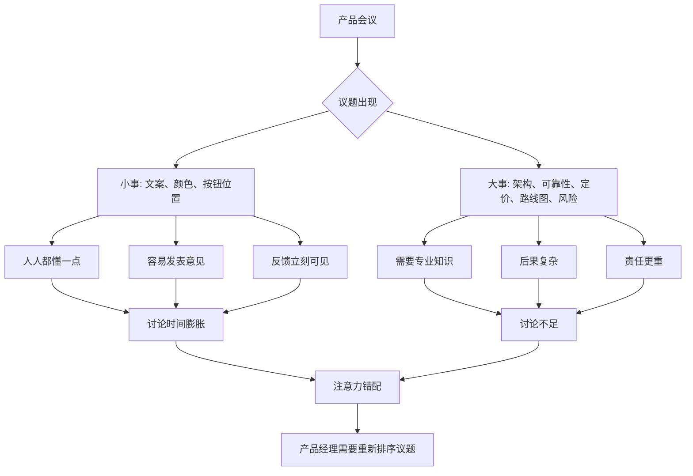

## 产品经理思维筑基课: 帕金森琐碎定律: 组织容易在小事上花过多时间

### 作者
digoal

### 日期
2026-05-17

### 标签
产品经理 , 帕金森琐碎定律 , 会议管理 , 注意力错配 , 产品评审 , 数据库产品 , 云服务 , 决策质量 , 技术风险 , 组织行为

----

## 背景

> 面向对象: 高中生、大学生、产品经理新人、技术型产品经理  
> 核心问题: 为什么团队开会时，大家常常热烈讨论按钮文案、页面颜色、报表样式，却对架构风险、数据安全、商业取舍和可靠性问题沉默？  
> 先说结论: 帕金森琐碎定律提醒我们，组织容易把大量注意力花在人人都能发表意见的小事上，而不是花在真正重要但复杂、困难、需要专业判断的大事上。产品经理要识别这种注意力错配，把讨论拉回高价值、高风险、高影响的问题。

## 一张图先看懂



## 求真讲法

### 它到底说了什么

帕金森琐碎定律，也常被称为 “bike-shedding”，意思是:

```text
组织容易在琐碎、易懂、低风险的问题上花费过多时间，
却在复杂、重要、高风险的问题上讨论不足。
```

它常用一个故事解释: 委员会讨论核电站预算时很快通过，因为问题太专业，大家不敢多说；讨论自行车棚怎么建、刷什么颜色时却争论很久，因为人人都能发表意见。

产品会议里也常见:

| 议题 | 组织反应 |
|---|---|
| 按钮叫“确认”还是“提交” | 很多人有意见 |
| 控制台图表颜色 | 很多人能参与 |
| 数据库备份恢复链路是否可靠 | 只有少数人能判断 |
| 云服务定价是否伤害长期毛利 | 需要财务、销售、产品共同分析 |
| 自动升级失败如何回滚 | 需要研发、运维、测试深入讨论 |

这条定律不是说小事不重要，而是说小事容易吸走超过其价值的组织注意力。

### 它是怎么来的

这一定律来自英国作家 C. Northcote Parkinson 对组织行为的讽刺性观察。它不是数学定理，而是对组织会议和决策偏差的经验总结。

人们选择它作为管理和产品决策工具，是因为很多团队的失败不是“不努力”，而是努力错配:

```text
最容易讨论的事，占用了最多会议时间。
最需要讨论的事，反而被留到最后。
```

产品经理特别容易遇到这种问题，因为产品工作横跨用户、设计、研发、销售、运营、财务和管理层。参与者越多，越容易出现“大家都能说的小事讨论过度”。

### 它依赖哪些假设

**假设 1: 组织成员对不同议题的理解门槛不同。**  
文案、颜色、布局大家都能发表意见；数据库一致性、计费模型、SLA、灰度回滚就需要专业背景。

**假设 2: 人们倾向于在低风险议题上表达。**  
小事说错了代价低，大事说错了可能暴露专业不足或承担责任。

**假设 3: 会议时间和注意力是有限资源。**  
讨论小事不是免费行为。它会挤占重大问题的判断时间。

**假设 4: 重要议题通常更抽象、更慢反馈。**  
可靠性、架构债、长期毛利、生态策略不像按钮颜色那样立刻可见，因此更容易被低估。

### 常见误解

**误解 1: 琐碎定律说明细节不重要。**  
不是。细节会影响体验。问题在于讨论时间要与影响程度匹配，不能让低影响细节吞掉高影响决策。

**误解 2: 只有外行才会讨论小事。**  
不是。专家也可能因为疲惫、压力或组织氛围，逃避困难议题，转而讨论容易达成参与感的小事。

**误解 3: 产品经理应该禁止别人提小问题。**  
不是。PM 应该管理议题优先级和决策机制，而不是压制反馈。小问题可以异步收集、快速决策、交给负责人处理。

**误解 4: 大问题一定要开长会。**  
不一定。大问题需要清楚材料、明确决策点、合适参与者和充分预读，而不是无限开会。

## 求存讲法

### 它有什么用

帕金森琐碎定律能帮助产品经理管理团队注意力。

产品经理在会议前要问:

```text
这次会议真正要解决什么决策?
哪些议题需要集体判断?
哪些议题可以由负责人直接定?
哪些议题只是征求意见，不应占用主会议?
最贵的风险有没有被放到前面讨论?
```

它能帮助团队避免三类问题:

| 问题 | 表现 |
|---|---|
| 注意力错配 | 小事讨论很久，大事草草带过 |
| 责任稀释 | 人人评论细节，没人承担关键决策 |
| 假性参与 | 会议热闹，但没有解决真正风险 |

### 它怎么迁移到数据库软件和云服务产品

数据库和云服务产品里的“大事”常常不显眼，但影响巨大。

| 容易被过度讨论的小事 | 容易被低估的大事 |
|---|---|
| 控制台字段顺序 | 备份是否真的可恢复 |
| 告警文案语气 | 告警是否准确、可行动 |
| 报表图表颜色 | 账单是否可解释、可追溯 |
| AI 助手头像 | AI 建议是否有证据链和回滚边界 |
| 首页卡片布局 | 生产故障时是否能定位和恢复 |
| 产品命名 | 产品边界、定价、SLA 是否清楚 |

技术型 PM 要特别小心“可见性偏差”: 页面上看得到的东西容易被讨论，底层可靠性、数据正确性、安全审计、容量水位、兼容风险不容易被看见，却更影响用户是否敢上线。

### 它的适用范围和边界

适用范围:

- 产品评审。
- 路线图评审。
- 设计评审。
- 事故复盘。
- 定价评审。
- 大客户需求评审。
- 数据库/云服务发布前风险评审。

边界:

| 场景 | 应该怎么处理 |
|---|---|
| 用户高频路径的细节 | 细节可能是大事，要用数据判断 |
| 法律、合规、品牌文案 | 看似小，可能风险大 |
| 新手引导和错误提示 | 对激活和安全操作可能很关键 |
| 低成本快速修正 | 不必上升到大战略讨论 |
| 高层拍板会议 | 仍要准备材料，避免只讨论易懂表象 |

琐碎定律不是按“事情大小的表面”分类，而是按影响、风险和决策成本分类。

### 正例: 怎么用它提升能力

假设你负责云数据库的“自动升级”评审。会议里大家开始讨论:

```text
升级按钮放左边还是右边?
升级完成页要不要加动画?
文案叫“立即升级”还是“开始升级”?
```

这些问题可以讨论，但不应先讨论。PM 可以把议题重新排序:

| 优先级 | 议题 | 为什么 |
|---|---|---|
| 1 | 哪些版本支持自动升级 | 决定风险边界 |
| 2 | 升级前兼容性检查 | 决定用户是否敢用 |
| 3 | 升级失败回滚策略 | 决定事故影响 |
| 4 | 维护窗口和通知机制 | 决定业务影响 |
| 5 | 审计记录和升级报告 | 决定责任可追溯 |
| 6 | 按钮文案和页面细节 | 影响体验，但应在风险后讨论 |

这样不是忽略体验，而是先处理高风险决策，再处理低风险体验。

### 反例: 前提不成立会怎样

反例一: 设计评审变成颜色评审。

某数据库诊断功能评审会上，团队花了 40 分钟讨论图表配色，只花 5 分钟讨论诊断结论是否可信。上线后用户反馈:

- 图表看起来不错。
- 但根因判断不准确。
- 缺少证据链。
- 无法区分锁等待、资源不足和执行计划变化。

失败的前提是: “可视化体验是这个功能最关键的问题”。真实关键问题是诊断可信度，而不是图表颜色。

反例二: 路线图评审被功能名字带偏。

某云服务季度规划会上，大家围绕“AI DBA 助手”这个名字讨论很久，却没有深入讨论:

- 目标用户是谁。
- 是否接入监控和工单。
- AI 建议错误时如何追责。
- 是否支持权限、审计和回滚。
- 做完后如何验证价值。

结果上线后演示效果不错，但生产客户不敢用。

失败的前提是: “命名和包装是最大不确定性”。实际上，责任边界、可信度和接入生产流程才是关键不确定性。

## 思考

### 会议防琐碎清单

```text
这次会议的决策点是什么?
影响最大的风险是否排在前面?
每个议题是否有时间盒?
哪些问题可以异步评论?
哪些问题应交给负责人拍板?
哪些议题需要专业材料预读?
会议结束后，谁负责哪个决定?
```

这张清单的目的不是减少讨论，而是让讨论配得上问题的重要性。

### 一个反事实问题

如果一场产品评审只能讨论 30 分钟，你会把时间花在哪里？

```text
5 分钟讨论按钮文案，
还是 5 分钟确认回滚策略?

10 分钟讨论页面布局，
还是 10 分钟确认数据一致性风险?

15 分钟讨论功能命名，
还是 15 分钟确认用户是否真的会采用?
```

时间分配就是优先级。会议时间花在哪里，团队真实关心的东西就在哪里。

### 与学习和生活的迁移

学习也有琐碎定律。

| 琐碎投入 | 更关键的问题 |
|---|---|
| 买很多笔记本 | 是否真的理解知识 |
| 调整笔记颜色 | 是否能做题和复述 |
| 研究学习软件 | 是否每天稳定学习 |
| 纠结计划模板 | 是否抓住薄弱点 |

不是说工具和形式没用，而是不要让形式感替代真正进步。

## 最后记住

1. 帕金森琐碎定律说的是注意力错配: 小事容易被过度讨论，大事容易讨论不足。
2. 产品经理要管理会议议题和决策顺序，把注意力拉回高价值、高风险问题。
3. 数据库和云服务里，备份恢复、可靠性、安全、可解释、回滚和 SLA 往往比页面表象更关键。
4. 小事不是不重要，而是讨论时间要与影响程度匹配。
5. 成熟 PM 不让会议热闹替代决策质量。

## 参考资料

- C. Northcote Parkinson, *Parkinson's Law, or The Pursuit of Progress*: 帕金森定律及琐碎定律相关思想来源。
- Poul-Henning Kamp, “A bike shed”: bike-shedding 在软件工程文化中的经典表述。
- Frederick P. Brooks, *The Mythical Man-Month*: 软件项目中沟通成本、复杂度和决策质量的重要性。
- Marty Cagan, *Inspired*: 产品团队需要围绕价值、可用性、可行性和商业可行性做判断。
- Site Reliability Engineering, Google: 可靠性、风险和错误预算思想有助于技术产品评审聚焦关键问题。
- 本文对数据库软件、云服务场景的解释基于通用产品管理、基础设施产品、云计算和数据库运维实践归纳。
  
#### [PostgreSQL 解决方案集合](../201706/20170601_02.md "40cff096e9ed7122c512b35d8561d9c8")
  
  
#### [德哥 / digoal's Github - 公益是一辈子的事.](https://github.com/digoal/blog/blob/master/README.md "22709685feb7cab07d30f30387f0a9ae")
  
  
#### [About 德哥](https://github.com/digoal/blog/blob/master/me/readme.md "a37735981e7704886ffd590565582dd0")
  
  

  
