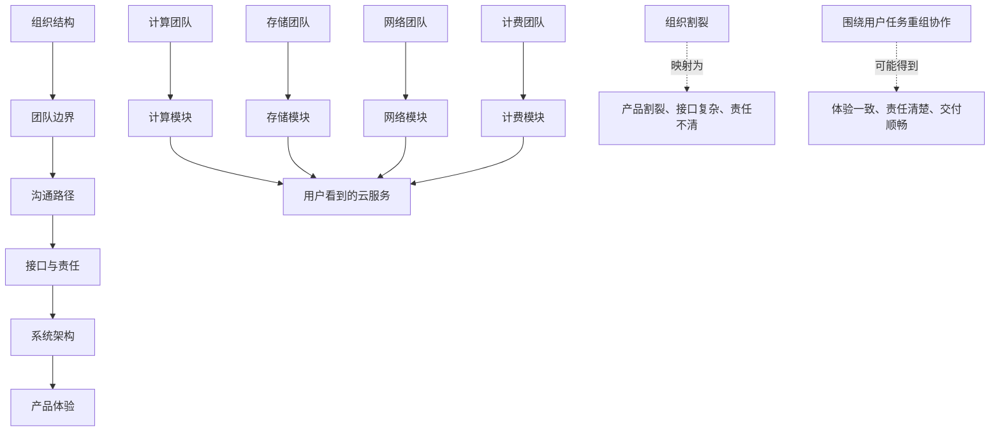

## 产品经理思维筑基课: 康威定律: 系统设计会映射组织结构

### 作者
digoal

### 日期
2026-05-17

### 标签
产品经理 , 康威定律 , 组织结构 , 系统设计 , 跨团队协作 , 数据库产品 , 云服务 , 产品架构 , 端到端体验 , 组织边界

----

## 背景

> 面向对象: 高中生、大学生、产品经理新人、技术型产品经理  
> 核心问题: 为什么一个产品明明功能都做了，用户却感觉割裂、难用、责任不清？  
> 先说结论: 康威定律提醒我们，系统架构和产品体验往往会长得像组织沟通结构。如果团队边界割裂，产品也容易割裂；如果组织协作链路混乱，用户体验、API、计费、权限、故障处理也会混乱。产品经理不能只设计功能，还要设计跨团队协作边界。

## 一张图先看懂



## 求真讲法

### 它到底说了什么

康威定律通常表述为:

```text
设计系统的组织，其设计结果会复制这个组织的沟通结构。
```

换成产品经理能直接使用的话:

```text
产品长什么样，常常不只由用户需求决定，
还由团队怎么分工、怎么沟通、怎么负责决定。
```

一个简单例子:

```text
学校要做一个活动报名系统。

如果学生会分成宣传组、报名组、财务组、场地组，
但彼此不怎么沟通，
最后系统可能变成:
宣传页一个入口，报名表一个入口，缴费另一个入口，
场地通知再发群消息。

每个组都完成了自己的部分，
但学生感觉整个流程很割裂。
```

这就是康威定律在体验层面的表现: 组织怎么断，产品就容易怎么断。

### 它是怎么来的

康威定律来自 Melvin Conway 1968 年的论文 “How Do Committees Invent?”。它不是数学定理，而是对复杂系统开发中组织沟通和系统结构关系的观察。

它有用，是因为很多产品问题表面上是功能问题，背后其实是组织问题:

| 表面问题 | 可能的组织原因 |
|---|---|
| 控制台入口分散 | 各团队各做各的页面 |
| API 风格不一致 | 不同团队没有统一设计规范 |
| 故障责任不清 | 服务边界和责任边界不一致 |
| 计费解释困难 | 产品、资源、账单团队模型不统一 |
| 迁移流程割裂 | 兼容、同步、校验、切换由不同团队分段负责 |
| 用户要开多个工单 | 内部协作没有端到端负责人 |

产品经理选择康威定律，是为了提醒自己: 如果只改页面，不改协作边界，很多体验问题会反复出现。

### 它依赖哪些假设

**假设 1: 系统需要多人或多团队协作完成。**  
单人小工具不太明显。越是复杂产品，如数据库、云服务、企业软件，康威效应越强。

**假设 2: 团队之间的沟通成本会影响设计。**  
沟通成本高的团队，倾向于通过接口、模块、流程把边界固定下来。久而久之，组织边界就变成系统边界。

**假设 3: 局部目标会塑造局部产品。**  
计算团队优化计算指标，存储团队优化存储指标，计费团队优化计费准确性。如果缺少端到端目标，用户体验就可能被切碎。

**假设 4: 组织结构可以被设计。**  
康威定律不是宿命。团队可以通过端到端小组、平台接口、共同目标、统一设计规范和责任人机制，改变系统呈现。

### 常见误解

**误解 1: 康威定律只讲软件架构。**  
不是。它同样影响产品体验、权限模型、API、文档、工单流程、销售交付和客户成功。

**误解 2: 组织结构决定一切，产品经理无能为力。**  
不是。PM 不能随意改组织架构，但可以推动端到端目标、跨团队评审、统一用户路径和明确责任边界。

**误解 3: 团队边界越少越好。**  
不一定。复杂系统必须分工。问题不在于有边界，而在于边界是否围绕用户任务和系统稳定性设计。

**误解 4: 只要设一个协调人就能解决。**  
不一定。协调人能缓解沟通问题，但如果目标、接口、责任和资源不匹配，产品仍会割裂。

## 求存讲法

### 它有什么用

康威定律能帮助产品经理看见“需求背后的组织约束”。

当产品体验割裂时，PM 不应只问:

```text
这个页面怎么改?
这个按钮放哪里?
这个接口怎么封装?
```

还要问:

```text
这个用户任务跨了哪些团队?
谁对端到端结果负责?
团队指标是否互相冲突?
系统接口是否暴露了内部组织边界?
故障时责任如何流转?
```

它能帮助 PM 从“功能拼接者”变成“端到端体验设计者”。

### 它怎么迁移到数据库软件和云服务产品

数据库和云服务是康威定律的高发区。因为一个看似简单的云数据库，背后通常涉及很多团队:

| 团队 | 关注点 | 如果割裂，用户会看到什么 |
|---|---|---|
| 数据库内核 | 性能、事务、复制、兼容 | 参数和行为难解释 |
| 控制台 | 页面、流程、交互 | 只做表层操作，不能解释底层状态 |
| 存储 | 容量、快照、备份 | 备份恢复体验割裂 |
| 网络 | VPC、连接、白名单 | 连接问题责任不清 |
| 安全 | IAM、审计、密钥 | 权限入口分散 |
| 计费 | 规格、账单、优惠 | 成本解释不连贯 |
| 运维/SRE | 告警、故障、容量 | 故障处理路径复杂 |
| 客户成功 | 迁移、培训、续费 | 交付和产品能力脱节 |

例如用户想完成一个任务:

```text
把自建 PostgreSQL 迁移到云数据库并生产上线。
```

这个任务至少跨越:

```text
兼容评估 -> 数据同步 -> 网络打通 -> 权限配置 -> 性能压测
-> 切换窗口 -> 监控告警 -> 备份恢复 -> 账单评估 -> 工单支持
```

如果每段由不同团队独立负责，且没有端到端 Owner，用户就会感到“每个功能都有，但没有一条路”。

### 它的适用范围和边界

适用范围:

- 云服务控制台设计。
- 数据库迁移产品。
- API 和 SDK 一致性。
- 计费、权限、审计模型。
- 故障处理和工单流程。
- 跨团队路线图。
- 平台化产品和企业级交付。

边界:

| 场景 | 应该怎么处理 |
|---|---|
| 单团队小产品 | 康威效应较弱，但仍要注意角色分工 |
| 高度专业模块 | 保留专业团队边界，但要统一用户接口 |
| 强监管职责 | 责任边界不能为了体验随意模糊 |
| 平台型产品 | 内部模块可以复杂，外部模型必须清楚 |
| 紧急项目 | 可以临时协调，但上线后要补齐责任机制 |

康威定律不是要求取消组织分工，而是要求产品经理识别哪些组织边界不应该暴露给用户。

### 正例: 怎么用它提升能力

假设云数据库团队要改进“生产迁移上线”体验。

原来的组织方式:

| 团队 | 各自交付 |
|---|---|
| 迁移工具团队 | 数据同步工具 |
| 内核团队 | 兼容性列表 |
| 网络团队 | VPC 配置文档 |
| 控制台团队 | 创建实例页面 |
| 运维团队 | 监控告警模板 |
| 客户成功 | 人工迁移手册 |

用户看到的是六段割裂流程。

应用康威定律后的产品设计，不是只改页面，而是建立端到端迁移任务:

```text
迁移项目
  -> 源库扫描
  -> 兼容风险报告
  -> 网络连通性检查
  -> 数据同步和校验
  -> 性能压测建议
  -> 切换计划
  -> 回滚预案
  -> 上线后监控
```

同时组织上设一个端到端迁移 Owner，协调各团队接口、指标和发布节奏。

这就是“反向康威”: 先定义用户需要的系统形态，再调整组织协作方式来支持它。

### 反例: 前提不成立会怎样

反例一: 控制台复制组织架构。

某云平台控制台导航按内部团队划分:

```text
计算、存储、网络、安全、计费、监控、工单。
```

对内部来说很清楚，但用户想完成的是:

```text
创建一个可上线的生产数据库。
```

结果用户必须在多个页面之间跳转，自己拼出完整路径:

- 去计算页选规格。
- 去网络页配白名单。
- 去安全页配权限。
- 去存储页看备份。
- 去监控页配告警。
- 去计费页估成本。

失败的前提是: “内部团队边界适合作为用户任务边界”。真实情况是，用户按任务行动，不按组织结构行动。

反例二: 故障处理映射责任割裂。

某云数据库出现连接抖动。数据库团队说实例正常，网络团队说链路正常，安全团队说权限没问题，客户成功只能转工单。用户最后收到多个局部结论，却没人解释端到端原因。

失败的前提是: “每个团队负责自己的模块就够了”。对用户来说，系统是否可用是端到端结果，不是局部模块自证清白。

## 思考

### 康威检查表

```text
这个用户任务跨了哪些团队?
用户是否看到了不该看到的内部边界?
是否有端到端 Owner?
团队指标是否服务同一个用户结果?
API、文档、权限、计费是否使用同一套概念?
故障时是否有人负责完整解释?
如果按用户任务重组页面和流程，会长什么样?
```

这张表能帮助 PM 从功能视角进入系统视角。

### 一个反事实问题

如果用户完全不知道你的组织结构，他会怎样设计这个产品？

他可能不会说:

```text
我想先去网络团队页面，再去安全团队页面，再去计费团队页面。
```

他更可能说:

```text
我想创建一个生产可用的数据库。
我想安全地迁移一个旧系统。
我想在故障时快速恢复业务。
我想解释这笔账单为什么变高。
```

用户任务和组织边界不一致时，产品经理要决定: 是让用户适应组织，还是推动组织适应用户任务。

### 与学习和生活的迁移

康威定律也能解释很多协作问题。

| 协作方式 | 最后产物 |
|---|---|
| 每个人各写一段文章，没人统稿 | 文章风格割裂 |
| 小组只按学科分工，不按目标协作 | 展示材料拼凑感强 |
| 项目没人负责最终结果 | 每个部分都做了，但整体不好用 |
| 有统一目标和总负责人 | 结果更连贯 |

一个作品是否连贯，经常取决于背后的协作是否连贯。

## 最后记住

1. 康威定律说的是: 系统设计会映射组织沟通结构。
2. 产品割裂，常常不是页面问题，而是团队边界、目标和责任问题。
3. 数据库和云服务产品尤其容易把内核、网络、安全、计费、运维边界暴露给用户。
4. 好的技术型 PM 要围绕用户任务设计端到端路径和跨团队责任。
5. 反向康威的关键是: 先定义理想系统和用户体验，再调整组织协作来支撑它。

## 参考资料

- Melvin E. Conway, “How Do Committees Invent?”, 1968: 康威定律的经典来源。
- James O. Coplien, Neil B. Harrison, *Organizational Patterns of Agile Software Development*: 组织模式与软件结构关系。
- Matthew Skelton, Manuel Pais, *Team Topologies*: 通过团队拓扑和交互模式设计软件组织。
- Frederick P. Brooks, *The Mythical Man-Month*: 复杂软件系统中的沟通成本和概念完整性。
- Marty Cagan, *Inspired*: 产品团队需要围绕用户价值、可行性和商业可行性组织协作。
- 本文对数据库软件、云服务场景的解释基于通用产品管理、基础设施产品、云计算和数据库运维实践归纳。
  
#### [PostgreSQL 解决方案集合](../201706/20170601_02.md "40cff096e9ed7122c512b35d8561d9c8")
  
  
#### [德哥 / digoal's Github - 公益是一辈子的事.](https://github.com/digoal/blog/blob/master/README.md "22709685feb7cab07d30f30387f0a9ae")
  
  
#### [About 德哥](https://github.com/digoal/blog/blob/master/me/readme.md "a37735981e7704886ffd590565582dd0")
  
  

  
