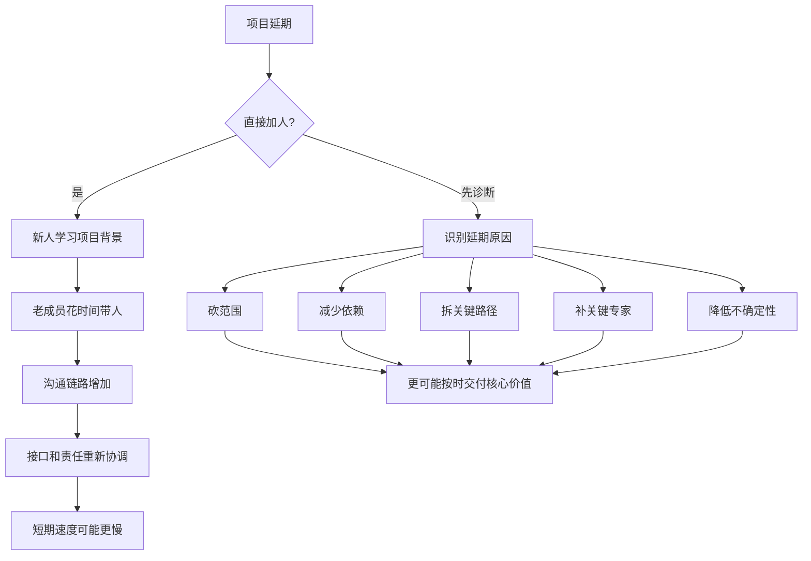

## 产品经理思维筑基课: 布鲁克斯法则: 延误项目加人可能更慢

### 作者
digoal

### 日期
2026-05-17

### 标签
产品经理 , 布鲁克斯法则 , 项目延期 , 人月神话 , 关键路径 , 数据库产品 , 云服务 , 研发管理 , 沟通成本 , 范围管理

----

## 背景

> 面向对象: 高中生、大学生、产品经理新人、技术型产品经理  
> 核心问题: 为什么软件项目延期时，简单加人不一定能加速，甚至可能更慢？  
> 先说结论: 布鲁克斯法则提醒我们，软件项目不是搬砖，不能把工作量简单平均分给更多人。项目越晚，加人越可能带来学习成本、沟通成本、协调成本和返工成本。产品经理面对延期，第一反应不应是“再加几个人”，而应是重排范围、识别关键路径、减少依赖和降低不确定性。

## 一张图先看懂



## 求真讲法

### 它到底说了什么

布鲁克斯法则来自软件工程经典著作《人月神话》。它常被概括为:

```text
向一个已经延期的软件项目增加人手，只会让它更晚。
```

这句话不是说任何时候加人都没用，而是强调一个反直觉事实:

```text
软件项目的工作量不能像搬箱子一样无限并行。
```

比如一个人搬 100 个箱子很慢，10 个人可能快很多。但一个新人加入复杂软件项目，不能马上产出。他需要理解:

- 业务目标是什么；
- 架构如何设计；
- 代码和接口在哪里；
- 哪些坑不能踩；
- 测试和发布流程是什么；
- 谁负责哪个模块；
- 当前延期的真正原因是什么。

这些都需要时间，而且会占用老成员时间。

### 它是怎么来的

Fred Brooks 在 IBM 大型软件项目经验中观察到，软件项目的复杂度不只来自写代码，还来自沟通、协调、概念一致性和系统集成。

项目延期后加人，常见问题是:

| 成本 | 表现 |
|---|---|
| 学习成本 | 新人要理解项目背景、架构、代码和业务 |
| 带人成本 | 老成员要解释、评审、答疑，短期产出下降 |
| 沟通成本 | 人越多，沟通链路越多 |
| 集成成本 | 并行开发后合并、测试、排错更复杂 |
| 决策成本 | 更多人参与后，责任和接口需要重新协调 |

所以布鲁克斯法则不是反对团队扩张，而是反对在项目已经延期、范围已经混乱、关键路径没有拆清时，用加人掩盖管理问题。

### 它依赖哪些假设

**假设 1: 项目任务不能完全并行。**  
如果任务之间依赖很强，加人不能线性提速。数据库内核、云服务控制面、计费系统、迁移工具往往都有复杂依赖。

**假设 2: 新人需要学习上下文。**  
项目越复杂，学习成本越高。延期项目通常文档不足、边界不清，新人上手更慢。

**假设 3: 老成员时间是稀缺资源。**  
关键成员既要开发，又要带人、评审、协调，可能被打断更多。

**假设 4: 沟通成本随人数上升。**  
团队从 3 人变 6 人，不只是多 3 个人，而是多出很多同步、接口、评审和决策关系。

### 常见误解

**误解 1: 布鲁克斯法则说永远不能加人。**  
不是。早期加人、加熟悉系统的人、加到可独立并行的任务上，可能有效。问题在于“已经延期的复杂项目上盲目加人”。

**误解 2: 延期都是研发效率低。**  
不一定。延期可能来自需求变动、范围膨胀、依赖阻塞、风险低估、测试不足、决策迟缓和产品目标不清。

**误解 3: 人月可以直接相加。**  
不是。10 个人 1 个月不等于 1 个人 10 个月。很多软件工作需要顺序推进、共同理解和集成验证。

**误解 4: 加人失败是新人能力不行。**  
不一定。很多时候是组织没有把任务拆成可独立交付的模块，也没有准备好文档、接口和明确责任。

## 求存讲法

### 它有什么用

布鲁克斯法则能帮助产品经理在项目延期时保持清醒。

当项目延期，PM 不应只问:

```text
还差几个人?
谁能来帮忙?
能不能周末加班?
```

更应该问:

```text
延期的真正原因是什么?
关键路径在哪里?
哪些范围可以砍?
哪些依赖可以解耦?
哪些工作可以并行?
哪些人必须保护不被打断?
哪些风险需要提前验证?
```

产品经理的责任不是用更多人维持原计划幻觉，而是让团队重新回到可交付状态。

### 它怎么迁移到数据库软件和云服务产品

数据库和云服务项目尤其容易触发布鲁克斯法则，因为它们有很强的系统依赖。

| 项目类型 | 为什么加人不一定有效 |
|---|---|
| 数据库内核功能 | 事务、优化器、存储、复制互相影响 |
| 自动升级 | 兼容检查、备份、回滚、控制台、运维流程都相关 |
| 迁移工具 | 评估、同步、校验、切换、回滚链路长 |
| 云服务计费 | 规格、资源、账单、折扣、合同、财务口径复杂 |
| 权限审计 | IAM、实例、操作日志、合规要求相互依赖 |
| 容灾能力 | 网络、存储、复制、DNS、监控、演练共同决定结果 |

例如“云数据库跨地域容灾”延期，不一定是少两个工程师。真正原因可能是:

```text
RPO/RTO 目标没定清。
同步复制和异步复制边界没定。
控制台流程和底层能力不匹配。
故障切换后的应用连接策略没确定。
演练和回滚方案没有验证。
```

这时盲目加人，可能只是让更多人进入混乱。

### 它的适用范围和边界

适用范围:

- 已延期的软件项目。
- 多团队协作项目。
- 数据库/云服务复杂功能。
- 关键发布窗口前的范围调整。
- 大客户承诺交付风险。
- 技术债治理和系统重构。

边界:

| 场景 | 加人是否可能有效 |
|---|---|
| 早期规划阶段 | 可能有效，因为学习和分工成本可提前吸收 |
| 独立测试、文档、数据整理 | 可能有效，前提是任务边界清楚 |
| 可并行的插件或适配器 | 可能有效，前提是接口稳定 |
| 核心架构未定 | 加人通常无效，先定架构和边界 |
| 发布前集成混乱 | 盲目加人通常更糟 |

布鲁克斯法则不是绝对禁止加人，而是要求先判断任务是否可并行、上下文是否可传递、接口是否稳定。

### 正例: 怎么用它提升能力

假设你负责“云数据库自动小版本升级”，项目已经延期两周。管理层问: 能不能再加 3 个人？

成熟 PM 不应直接回答“能”或“不能”，而是先拆原因:

| 延期原因 | 处理方式 |
|---|---|
| 升级前兼容检查规则未定 | 由核心专家集中决策，不适合加普通人 |
| 控制台页面还没完成 | 可加前端或设计支持 |
| 回滚演练未完成 | 需要 SRE、测试和内核共同压缩验证路径 |
| 文档和通知模板缺失 | 可并行补人 |
| 支持所有版本范围太大 | 砍范围，第一版只支持低风险版本 |

更合理的计划可能是:

```text
1. 第一版只支持两个稳定版本。
2. 自动升级改为“用户确认后执行”。
3. 回滚策略作为上线前硬门槛。
4. 文档、通知、测试数据由新增人员并行补齐。
5. 核心升级链路继续由原关键成员负责，减少打断。
```

这不是拒绝加人，而是把人加到能真正并行的地方。

### 反例: 前提不成立会怎样

反例一: 延期后把新人塞进核心链路。

某数据库迁移项目延期。团队临时加入 5 个新人，让他们分担兼容性、数据校验、切换和回滚开发。结果:

- 新人不熟悉边界，反复问老成员。
- 老成员花大量时间评审和解释。
- 多个模块接口不一致。
- 集成测试暴露更多问题。
- 项目继续延期。

失败的前提是: “更多人等于更多产出”。真实情况是，核心链路高度耦合，新人学习和集成成本超过了短期收益。

反例二: 不砍范围，只要求加班加人。

某云服务要在季度末上线成本优化、自动扩缩容、账单异常提醒和 AI 建议。项目落后后，团队增加人手并加班，但产品范围不变。上线后:

- 成本建议不准。
- 自动扩缩容缺少预算保护。
- 账单异常解释不清。
- AI 建议没有证据链。

失败的前提是: “时间不够可以用人力补”。实际上，问题是范围过大、风险未验证、质量门槛不清。

## 思考

### 延期诊断清单

```text
延期是因为范围太大，还是估算太乐观?
关键路径是哪一条?
哪些任务必须顺序完成?
哪些任务可以独立并行?
新人是否能不打断关键成员就产出?
是否有稳定接口和文档?
哪些功能可以延期?
哪些质量红线不能砍?
```

这张清单能帮助 PM 把延期讨论从“缺人”转向“系统性约束”。

### 一个反事实问题

如果项目延期后不允许加人，你会怎么做？

这个限制能逼团队看见真正的选择:

```text
砍范围。
降承诺。
拆阶段。
减少依赖。
保护关键路径。
提前验证最大风险。
把低风险任务外包或并行。
```

如果这些动作不做，即使加人，也很可能只是扩大混乱。

### 与学习和生活的迁移

学习也有类似规律。

```text
一个小组报告明天交。
如果今天才把 5 个新同学加进来，
他们需要理解主题、资料、结构和分工。
原来的同学还要解释和协调。
最后可能不但没更快，反而更乱。
```

更好的办法可能是:

```text
保留原来的主线作者。
新增同学只负责查资料、校对、做图、排版。
砍掉不必要章节。
先完成核心结论。
```

这和软件项目一样: 加人要加在可并行、低耦合、边界清楚的任务上。

## 最后记住

1. 布鲁克斯法则说的是: 延误的软件项目盲目加人，可能让项目更慢。
2. 原因在于学习成本、带人成本、沟通成本、集成成本和决策成本。
3. 数据库和云服务项目依赖强、风险高，更不能用加人掩盖范围和架构问题。
4. 延期时，PM 应先诊断关键路径、砍范围、减依赖，再决定是否加人。
5. 加人只有在任务可并行、接口稳定、上下文清楚时，才更可能有效。

## 参考资料

- Frederick P. Brooks, *The Mythical Man-Month*: 布鲁克斯法则和“人月”误区的经典来源。
- Steve McConnell, *Software Estimation*: 软件估算、进度风险和项目控制相关实践。
- Donald G. Reinertsen, *The Principles of Product Development Flow*: 队列、批量、延迟成本和产品开发流动效率。
- Gene Kim, Jez Humble, Patrick Debois, John Willis, *The DevOps Handbook*: 复杂软件交付中的反馈、自动化和协作。
- Marty Cagan, *Inspired*: 产品团队需要在价值、可用性、可行性和商业可行性之间做取舍。
- 本文对数据库软件、云服务场景的解释基于通用产品管理、基础设施产品、云计算和数据库运维实践归纳。
  
#### [PostgreSQL 解决方案集合](../201706/20170601_02.md "40cff096e9ed7122c512b35d8561d9c8")
  
  
#### [德哥 / digoal's Github - 公益是一辈子的事.](https://github.com/digoal/blog/blob/master/README.md "22709685feb7cab07d30f30387f0a9ae")
  
  
#### [About 德哥](https://github.com/digoal/blog/blob/master/me/readme.md "a37735981e7704886ffd590565582dd0")
  
  

  
