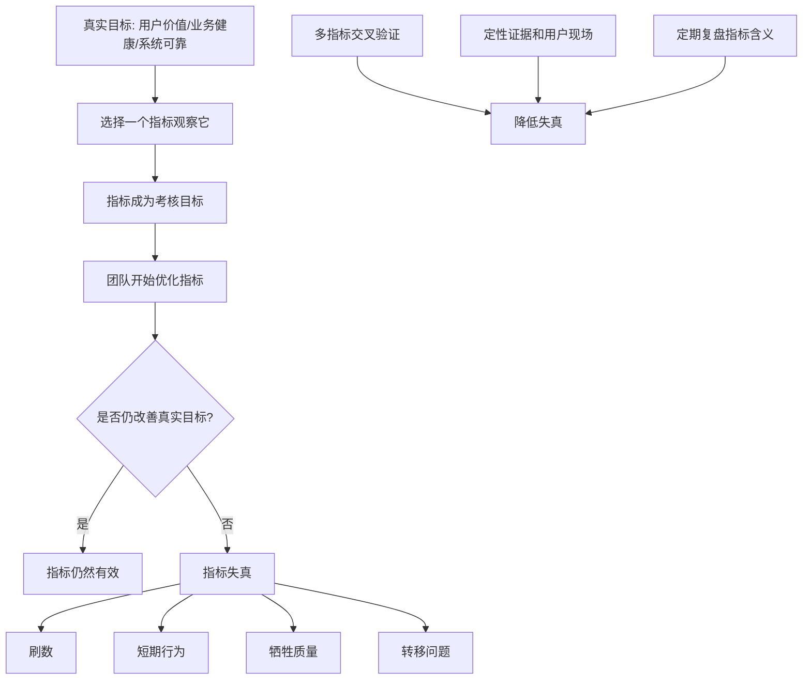

## 产品经理思维筑基课: 古德哈特定律: 指标一旦成为目标，就会失真

### 作者
digoal

### 日期
2026-05-17

### 标签
产品经理 , 古德哈特定律 , 指标失真 , 产品指标 , 数据驱动 , 数据库产品 , 云服务 , KPI , 用户价值 , 指标设计

----

## 背景

> 面向对象: 高中生、大学生、产品经理新人、技术型产品经理  
> 核心问题: 为什么团队明明在追指标，产品却可能变差？  
> 先说结论: 指标本来是观察真实世界的仪表盘。一旦指标被当成唯一目标，人们就会优化指标本身，而不一定优化指标背后的真实价值。产品经理要用指标帮助判断，而不能让指标替代判断。

## 一张图先看懂



## 求真讲法

### 它到底说了什么

古德哈特定律常被概括为:

```text
当一个指标成为目标，它就不再是一个好指标。
```

更准确地说，当人们知道某个数字会被用来评价、考核、奖励或惩罚时，他们就会改变行为去提高这个数字。问题是，数字变好不一定代表真实目标变好。

生活里很容易理解:

| 真实目标 | 指标 | 指标失真方式 |
|---|---|---|
| 学生真正掌握知识 | 考试分数 | 只背题型，不理解原理 |
| 身体更健康 | 体重下降 | 极端节食，肌肉和精力下降 |
| 班级更爱读书 | 借书数量 | 借很多书但不读 |
| 工作更高效 | 在线时长 | 人坐着很久但产出很低 |

产品里也是一样。用户活跃、点击率、工单关闭时长、可用性、成本下降、发布数量，这些指标都有价值，但都可能被误用。

### 它是怎么来的

古德哈特定律来自经济学和政策管理中的观察。Charles Goodhart 曾指出，当某个统计规律被用作政策控制目标时，它原来的统计关系就会失效。后来这句话被广泛迁移到管理、教育、产品、增长和工程领域。

产品经理选择这条定律，是因为产品团队非常依赖指标:

```text
日活、留存、转化、点击率、续费率、故障率、SLA、工单时长、成本、毛利、发布频率。
```

这些指标能帮助团队看见问题，但也可能制造问题。指标越接近绩效、奖金、晋升和部门排名，越容易被优化到失真。

| 产品指标 | 可能的失真 |
|---|---|
| 点击率 | 用夸张入口骗点击 |
| 功能使用率 | 默认开启或强制曝光 |
| 工单关闭时长 | 快速关闭但没有解决根因 |
| 发布数量 | 拆碎功能刷发布 |
| 成本下降 | 牺牲稳定性和用户体验 |
| SLA 达标 | 只统计有利口径，忽略局部严重故障 |

### 它依赖哪些假设

**假设 1: 指标只是现实的代理。**  
指标不是目标本身。留存不是用户价值本身，SLA 不是可靠性全部，成本下降不是商业健康全部。

**假设 2: 人会响应激励。**  
当指标影响评价和奖励，团队会自然改变行为去提升指标。

**假设 3: 指标无法覆盖所有重要维度。**  
任何单一指标都会遗漏一些东西。被遗漏的部分，可能在追指标过程中被牺牲。

**假设 4: 系统会适应测量方式。**  
一旦组织长期使用某个指标，业务流程、产品设计、汇报方式都会围绕它调整，指标的原始含义会变化。

### 常见误解

**误解 1: 古德哈特定律说明不要看指标。**  
不是。它说明不能迷信单一指标。没有指标，团队容易凭感觉；只有指标，团队容易被数字绑架。

**误解 2: 指标失真就是有人故意作假。**  
不一定。很多失真来自正常激励。团队可能没有恶意，只是为了达成被要求的数字，逐渐偏离真实目标。

**误解 3: 多设几个指标就不会失真。**  
不一定。指标组合能降低风险，但如果所有指标都变成机械考核，仍然会被优化和博弈。

**误解 4: 技术指标比业务指标更客观，所以不会失真。**  
不对。技术指标也会失真。比如只追平均延迟，可能掩盖 P99 延迟；只追可用率，可能忽略数据正确性和恢复能力。

## 求存讲法

### 它有什么用

古德哈特定律能帮助产品经理建立更成熟的指标观:

```text
指标是问题线索，不是最终答案。
指标要服务判断，不要替代判断。
指标要成组使用，不要孤立使用。
指标要定期校准，不要永久迷信。
```

产品经理设计指标时，要问:

| 问题 | 含义 |
|---|---|
| 这个指标代理的真实目标是什么 | 防止忘记初衷 |
| 它可能被怎样刷高 | 提前识别失真路径 |
| 哪些重要东西没有被它覆盖 | 找到保护性指标 |
| 指标变好时用户是否真的变好 | 用行为和访谈验证 |
| 指标变差时是否一定是坏事 | 避免误杀长期投资 |

### 它怎么迁移到数据库软件和云服务产品

数据库和云服务产品高度依赖指标，但也特别容易被指标误导。

| 指标 | 看起来代表 | 可能失真 |
|---|---|---|
| SLA 可用率 | 服务可靠 | 忽略局部客户严重故障、数据错误、性能抖动 |
| 平均延迟 | 性能好 | 掩盖 P95/P99 长尾延迟 |
| 工单关闭时长 | 支持效率高 | 快速关闭但问题反复出现 |
| 成本下降 | 资源效率高 | 降低冗余，削弱高峰承载和容灾能力 |
| 自动扩缩容成功率 | 弹性能力强 | 忽略扩缩容导致的账单波动和性能抖动 |
| 备份成功率 | 数据安全 | 备份成功不等于恢复成功 |
| 功能使用率 | 用户喜欢 | 默认开启、入口强推也会提高使用率 |

技术型 PM 要特别警惕“漂亮技术指标”掩盖真实风险。

例如:

```text
备份成功率 99.99%
```

听起来很好，但用户真正关心的是:

```text
出事时能不能恢复?
恢复到哪个时间点?
恢复要多久?
恢复后数据是否一致?
谁验证过恢复流程?
```

所以备份产品不能只看备份成功率，还要看恢复演练成功率、RPO、RTO、校验结果和用户是否能完成恢复。

### 它的适用范围和边界

适用范围:

- 产品增长指标。
- 功能使用指标。
- 客户成功和支持指标。
- 云服务可靠性指标。
- 数据库性能指标。
- 成本优化和资源利用率。
- 团队绩效和路线图管理。

边界:

| 场景 | 应该怎么处理 |
|---|---|
| 安全和数据正确性 | 不能用单一达标率掩盖严重事故 |
| 长期基础建设 | 短期指标可能变差，要用阶段性指标解释 |
| 新产品探索 | 早期数据少，要结合访谈和行为证据 |
| 企业级销售 | 成交周期长，不能只看短期转化 |
| 低频高损失事件 | 频率指标会低估风险，要看影响半径 |

古德哈特定律不是反指标，而是反“指标崇拜”。

### 正例: 怎么用它提升能力

假设你负责云数据库的“慢 SQL 诊断”功能。团队提出一个目标:

```text
让慢 SQL 诊断功能使用率提升到 60%。
```

这个目标有风险。团队可能通过强弹窗、默认跳转、频繁提醒把使用率拉高，但用户未必真的解决问题。

更好的指标组合可以是:

| 真实目标 | 指标 |
|---|---|
| 用户能发现问题 | 慢 SQL 风险被查看率 |
| 用户能理解原因 | 诊断报告停留时间、展开证据链比例 |
| 用户敢采取行动 | 建议采纳率、变更单生成率 |
| 行动真的有效 | 优化后延迟下降、CPU 下降、回滚率 |
| 不制造新风险 | 写入延迟、错误率、工单反复率 |
| 用户长期认可 | 重复使用率、续费客户使用深度 |

这时，使用率仍然有用，但它只是指标组的一部分。PM 不再问“怎么让用户点更多”，而是问“用户是否真的更快解决性能问题”。

### 反例: 前提不成立会怎样

反例一: 追求工单关闭时长，问题反复出现。

某云服务团队把“平均工单关闭时长”作为核心目标。短期看，指标明显变好。但几个月后:

- 客户重复提交同类问题。
- 一线支持倾向于快速给临时方案。
- 根因分析和产品修复没人负责。
- 大客户满意度下降。

失败的前提是: “工单关闭快 = 客户问题解决好”。真实目标是问题被解决，而不是工单状态变成已关闭。

反例二: 追求成本下降，损害可靠性。

某云数据库为了提升资源利用率，持续压缩冗余资源。成本指标改善，但高峰期扩容失败增多，部分区域故障恢复变慢。

失败的前提是: “资源成本越低 = 产品经营越健康”。对云服务来说，成本要和可靠性、容量水位、客户体验、SLA 风险一起看。

## 思考

### 指标防失真清单

```text
这个指标代理的真实目标是什么?
用户是否真的从指标改善中受益?
团队可能如何刷高这个指标?
哪个保护性指标能防止副作用?
有没有长尾用户或低频高损失场景被忽略?
指标口径是否透明?
指标是否需要定期重新校准?
```

### 一个反事实问题

如果某个指标变好，但用户并没有更愿意:

- 使用；
- 迁移；
- 付费；
- 续费；
- 推荐；
- 把关键业务交给你；

那这个指标到底说明了什么？

产品经理要尊重数字，但不能把数字当成现实本身。

### 与学习和生活的迁移

学习也会遇到古德哈特定律。

| 真实目标 | 被误用的指标 | 可能后果 |
|---|---|---|
| 真正理解 | 学习时长 | 坐很久但没吸收 |
| 能解决题目 | 刷题数量 | 只追数量，不复盘错因 |
| 身体健康 | 体重 | 忽略力量、睡眠和精力 |
| 阅读能力 | 读书本数 | 快速翻完但没有思考 |

好指标应该帮助你看见真实进步，而不是替代真实进步。

## 最后记住

1. 古德哈特定律提醒我们: 指标一旦成为目标，就可能失真。
2. 指标是现实的代理，不是现实本身。
3. 数据库和云服务里，SLA、平均延迟、备份成功率、工单时长都需要防止误读。
4. 好的产品指标要有目标指标、过程指标、结果指标和保护性指标。
5. 成熟 PM 用指标发现问题，用用户现场和系统机制解释问题，而不是被单一数字牵着走。

## 参考资料

- Charles Goodhart 关于货币政策指标失效的论述: 古德哈特定律的来源。
- Marilyn Strathern, “Improving Ratings”: 常见表述 “When a measure becomes a target, it ceases to be a good measure” 的重要来源之一。
- Donald T. Campbell 关于社会指标和激励扭曲的研究: 与古德哈特定律高度相关。
- Site Reliability Engineering, Google: SLI、SLO、错误预算等实践有助于理解可靠性指标如何设计。
- Marty Cagan, *Inspired*: 产品团队需要围绕真实用户价值，而不是孤立指标做判断。
- 本文对数据库软件、云服务场景的解释基于通用产品管理、基础设施产品、云计算和数据库运维实践归纳。
  
#### [PostgreSQL 解决方案集合](../201706/20170601_02.md "40cff096e9ed7122c512b35d8561d9c8")
  
  
#### [德哥 / digoal's Github - 公益是一辈子的事.](https://github.com/digoal/blog/blob/master/README.md "22709685feb7cab07d30f30387f0a9ae")
  
  
#### [About 德哥](https://github.com/digoal/blog/blob/master/me/readme.md "a37735981e7704886ffd590565582dd0")
  
  

  
