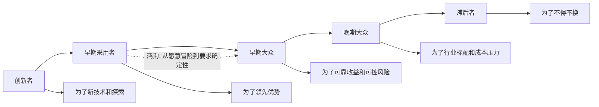

## 产品经理思维筑基课: 创新扩散曲线: 不同用户采用新产品的理由不同

### 作者
digoal

### 日期
2026-05-17

### 标签
产品经理 , 创新扩散曲线 , 用户采用 , 跨越鸿沟 , 早期用户 , 主流市场 , 数据库产品 , 云服务 , 产品推广 , 技术采用

----

## 背景

> 面向对象: 高中生、大学生、产品经理新人、技术型产品经理  
> 核心问题: 为什么一个新产品早期用户很喜欢，到了主流市场却卖不动、推不动、落不了地？  
> 先说结论: 创新扩散曲线提醒产品经理，不同阶段的用户采用新产品的理由不同。早期用户愿意冒险尝鲜，主流用户更关心可靠性、案例、成本、迁移、服务和风险。技术型产品尤其不能把早期用户的兴奋，误判成大规模市场已经准备好。

## 一张图先看懂



## 求真讲法

### 它到底说了什么

创新扩散曲线描述的是: 一个新想法、新技术、新产品，不会被所有人同时采用，而是会按不同人群逐步扩散。

常见分层是:

| 用户类型 | 典型特点 | 采用理由 |
|---|---|---|
| 创新者 | 喜欢试新技术，能忍受不稳定 | 探索、学习、技术兴趣 |
| 早期采用者 | 愿意用新方案获得领先优势 | 差异化、效率、战略机会 |
| 早期大众 | 谨慎务实，重视证明和可靠性 | 成熟案例、明确收益、低风险 |
| 晚期大众 | 等行业普及后再跟进 | 成本压力、标准化、被动跟随 |
| 滞后者 | 尽量不换旧方案 | 不得不迁移、旧方案不可用 |

这条定律的关键不是画一条漂亮曲线，而是提醒产品经理:

```text
不同用户不是在问同一个问题。
```

早期用户可能问:

```text
这个技术够不够先进?
我能不能抢先获得优势?
```

主流企业用户可能问:

```text
它稳定吗?
有人成功用过吗?
出了问题谁负责?
迁移成本多高?
能不能通过安全和采购评审?
```

### 它是怎么来的

创新扩散理论通常与 Everett Rogers 的《创新的扩散》相关。后来 Geoffrey Moore 在《跨越鸿沟》中进一步强调: 从早期市场走向主流市场时，会遇到明显断层。早期采用者愿意承担不确定性，主流用户需要完整解决方案和可信证明。

产品经理选择这条定律，是因为很多产品失败在一个误判:

```text
早期有人喜欢 = 主流市场会采用
```

但早期喜欢和主流采用之间，隔着很多东西:

| 早期用户能接受 | 主流用户通常要求 |
|---|---|
| 文档不完整 | 清晰文档和培训 |
| 功能不完整 | 端到端流程 |
| 偶尔出错 | 稳定 SLA 和支持 |
| 手动配置 | 自动化和默认值 |
| 自己排障 | 厂商支持和责任边界 |
| 技术新鲜 | 业务价值和案例证明 |

### 它依赖哪些假设

**假设 1: 用户风险偏好不同。**  
有人愿意尝鲜，有人只在别人验证后采用。技术产品越关键，风险偏好差异越明显。

**假设 2: 产品成熟度会影响采用人群。**  
早期产品可以靠新颖性吸引创新者；主流市场需要可靠性、可复制交付和生态支持。

**假设 3: 市场采用需要社会证明。**  
主流用户常常需要案例、标杆客户、行业实践、第三方评测和内部背书。

**假设 4: 采用理由会随阶段变化。**  
同一个功能，早期可能因为“先进”被采用，后期可能因为“行业标配”被采用。

### 常见误解

**误解 1: 有早期用户就说明产品市场匹配已经完成。**  
不一定。早期用户可能只是能忍受缺陷的探索者，不能代表主流市场。

**误解 2: 主流用户保守，所以不重要。**  
不是。主流用户通常决定收入规模、生态规模和长期稳定性。保守不是愚蠢，而是在管理风险。

**误解 3: 同一套卖点可以打所有用户。**  
不行。创新者听技术优势，主流用户听风险控制，晚期用户听标准化和成本。

**误解 4: 扩散曲线是自然发生的。**  
不是。产品要通过案例、渠道、服务、迁移工具、定价、生态和信任机制推动扩散。

## 求存讲法

### 它有什么用

创新扩散曲线能帮助产品经理回答三个问题:

1. 当前产品真正适合哪类用户？
2. 下一阶段用户为什么还不采用？
3. 产品要补什么能力，才能从早期用户走向主流用户？

它让 PM 不再只问:

```text
用户喜不喜欢这个功能?
```

而是问:

```text
哪一类用户会因为哪一种理由采用?
他担心什么?
什么证据能让他从观望变成采用?
```

### 它怎么迁移到数据库软件和云服务产品

数据库和云服务的采用风险高，所以扩散阶段非常明显。

| 阶段 | 数据库/云服务用户的典型采用理由 |
|---|---|
| 创新者 | 想试新内核、新架构、新模型、新云形态 |
| 早期采用者 | 希望用 Serverless、HTAP、向量检索、自治运维取得领先 |
| 早期大众 | 看到同行案例、迁移工具成熟、SLA 可信后采用 |
| 晚期大众 | 行业都上云、成本压力明确、旧系统难维护后采用 |
| 滞后者 | 旧版本停服、硬件不可用、合规或供应商要求才迁移 |

技术型 PM 要特别注意:

```text
开发者说好用，不等于企业敢上线。
PoC 成功，不等于核心系统会迁移。
测试环境采用，不等于生产环境采用。
单个团队采用，不等于组织采购采用。
```

从早期到主流，产品要补齐的不只是功能，还包括:

| 主流采用需要 | 数据库/云服务中的表现 |
|---|---|
| 成功案例 | 同行业、同规模、同负载客户案例 |
| 迁移路径 | 评估、同步、校验、切换、回滚 |
| 风险控制 | SLA、备份恢复、审计、权限、安全评审 |
| 成本解释 | 账单预测、成本优化、资源利用率 |
| 服务能力 | 工单、专家支持、故障响应、培训 |
| 生态兼容 | 驱动、ORM、BI、监控、DevOps 工具 |

### 它的适用范围和边界

适用范围:

- 新产品上市。
- 技术产品从试用走向规模化。
- 数据库新引擎、新架构、新云服务形态推广。
- Serverless、AI DBA、向量数据库、HTAP 等新能力商业化。
- 客户分层、定价、案例、渠道和生态策略。

边界:

| 场景 | 应该怎么处理 |
|---|---|
| 强制合规变化 | 采用可能不是自然扩散，而是被外部约束推动 |
| 已高度成熟品类 | 用户分层仍存在，但创新扩散不再是主矛盾 |
| 免费工具 | 试用扩散快，但深度采用仍要看价值和信任 |
| 基础设施产品 | 扩散曲线更慢，因为迁移和风险成本高 |
| 企业采购 | 采用者、使用者、审批者可能处在不同心理阶段 |

创新扩散曲线不是预测命运的曲线，而是帮助 PM 识别当前采用阻力。

### 正例: 怎么用它提升能力

假设你负责“Serverless 云数据库”。

早期用户可能被这些卖点打动:

```text
不用管实例。
按量付费。
自动弹性。
适合不确定流量。
```

但主流企业客户可能会问:

```text
冷启动会不会影响交易?
账单能不能预测?
长连接怎么处理?
高峰期资源是否有保障?
出现性能抖动怎么定位?
能不能和现有监控、审计、权限体系打通?
```

所以从早期采用走向主流采用，产品路线图不能只继续强化“自动弹性”，还要补:

| 主流阻力 | 产品补齐 |
|---|---|
| 担心延迟抖动 | 冷启动指标、预热机制、延迟 SLA |
| 担心账单不可控 | 预算上限、成本预测、异常提醒 |
| 担心不可观测 | 扩缩容历史、资源水位、性能解释 |
| 担心生产风险 | 灰度、回滚、演练、专家支持 |
| 担心生态不兼容 | 驱动、连接池、ORM 最佳实践 |

这时，PM 不只是推广一个新形态，而是在为下一类用户补齐采用理由。

### 反例: 前提不成立会怎样

反例一: 用早期用户反馈误判主流市场。

某数据库产品在开发者社区很受欢迎。早期用户喜欢它性能强、架构新、API 灵活。团队于是认为企业市场会快速采用。结果进入大客户后发现:

- 安全审计不完整。
- 迁移工具不成熟。
- 缺少行业案例。
- 故障支持能力不足。
- 采购方无法评估长期风险。

失败的前提是: “早期用户喜欢 = 主流用户会采用”。真实情况是，主流用户采用的是确定性，不只是先进性。

反例二: 对保守用户讲技术愿景。

某云服务面向传统企业推广 AI DBA，一直强调大模型、自动化、智能决策。但客户真正担心:

- AI 建议错了谁负责。
- 是否有审计记录。
- 能不能只给建议不自动执行。
- 是否能解释证据链。
- 是否能接入现有变更流程。

失败的前提是: “技术愿景足以驱动采用”。对保守型企业用户，可信控制比新鲜感更重要。

## 思考

### 用户采用阶段检查表

```text
当前最活跃用户是哪一类?
他们采用的主要理由是什么?
下一类用户为什么还不采用?
他们缺的是功能、案例、服务、迁移路径，还是信任?
我们的销售话术是否仍停留在早期用户阶段?
产品成熟度是否配得上主流用户承诺?
```

### 一个反事实问题

如果你把早期用户喜欢的东西全部加倍:

```text
更先进的技术。
更多实验功能。
更灵活的配置。
更快的迭代。
```

主流用户就一定会采用吗？

不一定。主流用户可能真正需要的是:

```text
更少不确定性。
更清楚的责任。
更可靠的迁移。
更稳定的支持。
更可信的案例。
```

### 与学习和生活的迁移

创新扩散曲线也能解释班级里新工具的传播。

| 人群 | 采用新学习工具的理由 |
|---|---|
| 最早尝试的人 | 好奇、喜欢新鲜 |
| 第二批人 | 看到早期同学效率变高 |
| 大多数人 | 老师推荐、同学都在用、资料完整 |
| 最晚的人 | 旧方法不够用，或者被要求使用 |

推广一个新方法，不是对所有人说同一句话，而是回答不同阶段的人最关心的问题。

## 最后记住

1. 创新扩散曲线提醒我们: 不同用户采用新产品的理由不同。
2. 早期用户买先进性，主流用户买确定性、案例、服务和低风险。
3. 数据库和云服务从试用到生产采用，中间隔着迁移、审计、SLA、成本和责任边界。
4. 不能用开发者社区热度直接推断企业级采购和核心系统上线。
5. 好的技术型 PM 会为下一阶段用户补齐采用理由，而不是只强化上一阶段用户喜欢的卖点。

## 参考资料

- Everett M. Rogers, *Diffusion of Innovations*: 创新扩散理论的经典来源。
- Geoffrey A. Moore, *Crossing the Chasm*: 强调早期市场和主流市场之间的鸿沟。
- Clayton Christensen, *Competing Against Luck*: 用户采用产品是为了完成任务和取得进展。
- Marty Cagan, *Inspired*: 产品团队需要同时验证价值、可用性、可行性和商业可行性。
- Geoffrey A. Moore, *Inside the Tornado*: 技术产品进入主流市场后的扩张策略。
- 本文对数据库软件、云服务场景的解释基于通用产品管理、基础设施产品、云计算和数据库运维实践归纳。
  
#### [PostgreSQL 解决方案集合](../201706/20170601_02.md "40cff096e9ed7122c512b35d8561d9c8")
  
  
#### [德哥 / digoal's Github - 公益是一辈子的事.](https://github.com/digoal/blog/blob/master/README.md "22709685feb7cab07d30f30387f0a9ae")
  
  
#### [About 德哥](https://github.com/digoal/blog/blob/master/me/readme.md "a37735981e7704886ffd590565582dd0")
  
  

  
