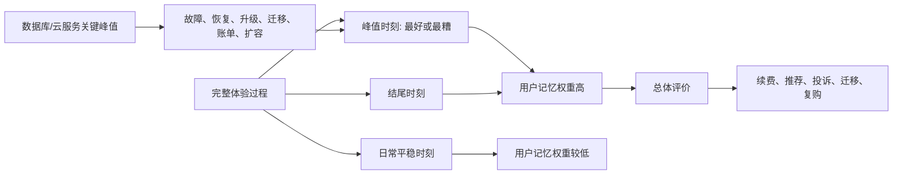

## 产品经理思维筑基课: 体验峰终定律: 用户记住峰值和结尾

### 作者
digoal

### 日期
2026-05-17

### 标签
产品经理 , 峰终定律 , 用户体验 , 关键时刻 , 用户记忆 , 数据库产品 , 云服务 , 故障体验 , 迁移体验 , 技术产品

----

## 背景

> 面向对象: 高中生、大学生、产品经理新人、技术型产品经理  
> 核心问题: 为什么用户对一次产品体验的记忆，常常不是全过程的平均值，而是被某几个关键时刻决定？  
> 先说结论: 体验峰终定律提醒产品经理，用户回忆一次体验时，最容易记住情绪最强的峰值时刻和最后的结尾时刻。对数据库、云服务这类技术产品来说，峰值往往出现在故障、迁移、升级、扩容、账单异常、恢复演练等关键场景；结尾则决定用户是否觉得“这件事被妥善解决”。

## 一张图先看懂



## 求真讲法

### 它到底说了什么

体验峰终定律，常被称为 Peak-End Rule。它的意思是:

```text
人们回忆一段经历时，往往不是按全过程平均打分，
而是特别受两个部分影响:
峰值时刻和结束时刻。
```

峰值可以是好峰值，也可以是坏峰值。

生活里很容易理解:

| 经历 | 用户可能记住什么 |
|---|---|
| 去餐厅吃饭 | 最惊艳的一道菜，或最后结账是否顺利 |
| 看电影 | 最震撼的桥段，或结尾是否收住 |
| 坐飞机 | 最严重的延误，或落地后行李是否顺利 |
| 看病 | 最痛苦的等待，或医生最后是否讲清楚 |

用户不会像机器一样把每一分钟平均起来。他会把最强烈的时刻和最后的结果，压缩成对整段体验的记忆。

产品也是一样。一个云数据库平时运行 99 天都很稳定，但第 100 天故障恢复混乱，客户可能记住的是那次混乱。

### 它是怎么来的

峰终定律来自行为经济学和心理学研究，常与 Daniel Kahneman 等人的实验相关。相关研究发现，人们对痛苦或愉快经历的回忆，会受到体验峰值和结束时刻强烈影响，而不是只由持续时间决定。

产品经理选择它，是因为用户体验并不是平均分布的。很多关键判断发生在少数时刻:

```text
第一次上手。
第一次成功。
第一次失败。
第一次付费。
第一次迁移。
第一次故障。
第一次找支持。
最后一次沟通。
最后一份报告。
最后一次账单。
```

这些时刻会塑造用户对产品的长期印象。

### 它依赖哪些假设

**假设 1: 用户记忆不是完整录像。**  
用户不会保存全过程细节，而会用少数强烈片段代表整体体验。

**假设 2: 情绪强度会影响记忆权重。**  
惊喜、恐惧、愤怒、安心、失控、被照顾，这些情绪会让体验更容易被记住。

**假设 3: 结尾会影响用户对事件是否“已解决”的判断。**  
即使中间有问题，如果最后解释清楚、补救到位，用户评价可能改善；反之，最后草草收场会放大负面记忆。

**假设 4: 技术产品的峰值常常发生在高风险时刻。**  
数据库、云服务、基础设施不是每天都让用户兴奋，但一旦故障、迁移、恢复、升级发生，情绪峰值会非常强。

### 常见误解

**误解 1: 峰终定律说明日常体验不重要。**  
不是。日常稳定是底座。峰终定律只是说明用户记忆权重不平均，不是允许团队忽视长期质量。

**误解 2: 做一个惊喜峰值就能弥补所有问题。**  
不一定。对技术产品来说，坏峰值的杀伤力通常比好峰值更大。一次数据丢失很难靠一个炫功能弥补。

**误解 3: 结尾就是页面最后一步。**  
不是。结尾可能是工单关闭、迁移报告、升级结果、故障复盘、账单解释、客服回访。用户认为事情结束的那个时刻，才是结尾。

**误解 4: 峰终定律只适合消费产品。**  
不对。企业软件、数据库和云服务更需要关注关键时刻，因为这些时刻往往关系到业务责任和组织信任。

## 求存讲法

### 它有什么用

峰终定律能帮助产品经理识别“关键体验时刻”。

产品经理不应只问:

```text
整体流程是否可用?
页面是否都做完?
平均满意度是多少?
```

还要问:

```text
用户最紧张的时刻在哪里?
用户最容易失控的时刻在哪里?
用户最需要确认的结尾是什么?
哪个坏峰值会毁掉信任?
哪个好峰值能建立信心?
```

它特别适合做:

| 场景 | 关注重点 |
|---|---|
| 新用户 onboarding | 第一次成功是否足够快 |
| 迁移流程 | 最危险的切换时刻是否可控 |
| 故障处理 | 最焦虑时刻是否有解释和进度 |
| 账单异常 | 最后是否解释清楚并给出动作 |
| 版本升级 | 升级结束是否有报告和回滚保障 |
| 客户支持 | 工单关闭是否让用户确认问题已解决 |

### 它怎么迁移到数据库软件和云服务产品

数据库和云服务的峰值通常不是“页面很好看”，而是“风险是否被控制住”。

| 关键时刻 | 可能的坏峰值 | 更好的设计 |
|---|---|---|
| 创建生产实例 | 参数太多、成本不清 | 场景模板、成本预估、安全检查 |
| 数据迁移 | 同步失败、数据不一致 | 进度、校验、断点续传、回滚方案 |
| 主备切换 | 业务中断、原因不明 | 切换状态、影响范围、恢复建议 |
| 版本升级 | 执行计划变化、插件不兼容 | 预检查、灰度、升级报告 |
| 账单异常 | 费用突然增加 | 异常解释、资源明细、优化建议 |
| 故障工单 | 等不到回应 | 状态页、时间线、责任人、复盘 |
| 恢复演练 | 不知道能否恢复 | 恢复点、RTO/RPO、校验报告 |

技术型 PM 要把这些关键时刻当成产品体验的主战场。平时控制台再漂亮，如果故障时用户看不到状态、原因、恢复时间和下一步，信任会快速下降。

### 它的适用范围和边界

适用范围:

- 用户首次使用。
- 企业客户 PoC。
- 数据库迁移。
- 故障处理。
- 备份恢复。
- 版本升级。
- 扩缩容。
- 账单和续费。
- 工单和客户成功。

边界:

| 场景 | 应该怎么处理 |
|---|---|
| 高频日常操作 | 不能只靠峰值，要持续降低摩擦 |
| 安全和数据正确性 | 不能用“好结尾”掩盖真实事故 |
| 长周期企业采购 | 峰值很多，要分阶段管理 |
| 自动化后台任务 | 用户看不见过程，也要给结果解释 |
| 低频高风险功能 | 使用少不代表不重要，峰值权重更高 |

峰终定律不是让 PM 做表演式体验，而是提醒 PM 管好用户最容易形成长期记忆的时刻。

### 正例: 怎么用它提升能力

假设你负责“云数据库迁移到生产”的产品体验。

用户的完整过程很长:

```text
评估 -> 建实例 -> 配网络 -> 全量同步 -> 增量同步 -> 校验
-> 压测 -> 切换 -> 观察 -> 关闭旧库 -> 复盘
```

峰终视角会特别关注两个地方:

| 时刻 | 为什么重要 | 产品设计 |
|---|---|---|
| 峰值: 生产切换 | 风险最高，用户最紧张 | 切换倒计时、延迟水位、校验状态、回滚按钮、专家在线 |
| 结尾: 迁移完成 | 决定用户如何记住这次迁移 | 迁移报告、数据校验结果、性能对比、风险清单关闭、后续监控建议 |

如果切换时信息透明、可回滚，完成后报告清楚，用户更容易把这次迁移记成“可控、专业、可信”。这比只优化前面某个普通表单更能影响长期信任。

### 反例: 前提不成立会怎样

反例一: 平时体验不错，故障峰值失控。

某云数据库平时控制台体验流畅、文档清楚、价格合理。但一次故障中:

- 状态页长时间不更新。
- 工单只回复“处理中”。
- 没有说明影响范围。
- 恢复后没有复盘报告。

结果客户记住的不是平时顺滑，而是“关键时刻不透明、不可靠”。

失败的前提是: “日常平均体验好就够了”。对技术产品来说，故障峰值会强烈影响长期信任。

反例二: 问题解决了，但结尾很差。

某客户账单异常，客服和工程团队最终确认是资源配置导致，并给出优化方案。但最后只是关闭工单，没有给出清晰账单解释、费用影响、后续预警和避免方法。客户仍然不满。

失败的前提是: “问题技术上解决了，体验就结束了”。用户需要的是一个能让他向财务和管理层交代的结尾。

## 思考

### 峰终体验检查表

```text
用户在整个流程中最紧张的时刻是什么?
最坏峰值可能出现在哪里?
有没有办法让坏峰值可见、可控、可回滚?
能否设计一个明确的好峰值?
用户认为事情结束的时刻是什么?
结尾是否给出了结果、解释、证据和下一步?
这个结尾能否帮助用户向组织交代?
```

### 一个反事实问题

如果用户半年后只记得两件事:

```text
最糟糕的一刻。
最后怎么收场。
```

你会重新设计哪些产品环节？

对数据库和云服务来说，答案通常不是“再美化首页”，而是:

```text
故障状态页。
迁移切换页。
恢复演练报告。
升级完成报告。
账单异常解释。
工单关闭确认。
```

### 与学习和生活的迁移

峰终定律也能解释学习和合作体验。

| 场景 | 峰值 | 结尾 |
|---|---|---|
| 小组合作 | 争论最激烈的一次 | 最后成果是否被认可 |
| 一门课程 | 最难但讲透的一课 | 结课时是否形成体系 |
| 一次考试 | 最卡住的一道题 | 交卷后是否有把握 |
| 一次旅行 | 最惊喜或最糟糕的时刻 | 回程是否顺利 |

人们对一段经历的记忆，常常不是平均值，而是关键点。

## 最后记住

1. 峰终定律说的是: 用户特别记住峰值时刻和结尾时刻。
2. 技术产品的峰值常发生在故障、迁移、升级、扩容、账单和恢复场景。
3. 好的结尾要给用户结果、解释、证据、下一步和可交代材料。
4. 日常体验重要，但坏峰值和坏结尾会极大消耗信任。
5. 技术型 PM 要把关键时刻当成产品体验主战场，而不是只优化平均流程。

## 参考资料

- Daniel Kahneman, Barbara L. Fredrickson, Charles A. Schreiber, Donald A. Redelmeier 关于峰终定律和记忆效用的相关研究。
- Daniel Kahneman, *Thinking, Fast and Slow*: 经验自我与记忆自我的区分有助于理解峰终效应。
- Don Norman, *The Design of Everyday Things*: 反馈、可见性和错误恢复对关键体验有重要意义。
- Site Reliability Engineering, Google: 故障响应、SLO、复盘和可靠性实践有助于管理技术产品关键时刻。
- Marty Cagan, *Inspired*: 产品团队需要围绕真实用户价值和可用性设计体验。
- 本文对数据库软件、云服务场景的解释基于通用产品管理、基础设施产品、云计算和数据库运维实践归纳。
  
#### [PostgreSQL 解决方案集合](../201706/20170601_02.md "40cff096e9ed7122c512b35d8561d9c8")
  
  
#### [德哥 / digoal's Github - 公益是一辈子的事.](https://github.com/digoal/blog/blob/master/README.md "22709685feb7cab07d30f30387f0a9ae")
  
  
#### [About 德哥](https://github.com/digoal/blog/blob/master/me/readme.md "a37735981e7704886ffd590565582dd0")
  
  

  
