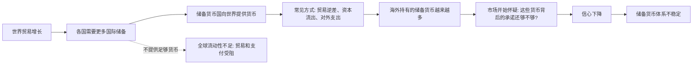

## 思维筑基课: 特里芬难题
  
### 作者  
digoal  
  
### 日期  
2026-05-17  
  
### 标签  
国际贸易 , 结算货币 , 货币储备 , 贸易逆差 , 资本流出 , 全球流动性  
  
----  
  
## 背景
  

> 面向对象: 高中生  
> 核心问题: 为什么一种货币越被全世界需要，反而越可能让别人怀疑它靠不靠谱？  
> 先说结论: 特里芬难题说的是“全球储备货币发行国”的结构性矛盾: 它必须不断向世界提供本国货币，才能让国际贸易和金融有足够流动性；但货币流到国外越多，别人越担心它还能不能维持承诺和信用。

## 一张图先看懂



可以把它想成学校食堂的饭票。

如果全校都用一个班发行的饭票，别的班想买饭，就需要这个班不断把饭票发出去。可饭票发得越多，大家越会问: 这个班真的有足够的钱、饭和信用来保证每张饭票都能用吗？不发，大家没饭票；发太多，大家不信饭票。这就是难题。

## 求真讲法

### 它到底说了什么

特里芬难题不是一个数学定理，而是国际货币体系中的一个结构性判断。

它讨论的是这样的情形:

1. 世界需要一种大家都愿意接受的“储备货币”。
2. 这个储备货币通常由某个国家发行。
3. 世界经济越大，其他国家越需要持有更多这种货币。
4. 发行国要把货币送到世界手里，往往需要持续对外支出、投资，或者长期出现国际收支逆差。
5. 可是逆差和海外货币存量越大，别人越担心发行国的支付能力、政策纪律和承诺可信度。

所以它的核心矛盾是:

| 世界需要什么 | 储备货币国要怎么做 | 代价是什么 |
|---|---|---|
| 更多国际流动性 | 向世界提供更多本国货币 | 可能积累外部赤字 |
| 更强货币信用 | 控制货币外流和赤字 | 世界可能缺少储备货币 |

一句更短的话:

> 给得少，世界不够用；给得多，世界不放心。

### 它是怎么来的

这个难题常用于解释布雷顿森林体系的内在矛盾。

1944 年以后，布雷顿森林体系确立了一种安排: 许多国家的货币盯住美元，美元按固定价格与黄金挂钩。美元因此成为国际储备和结算的核心货币。问题是，世界贸易增长需要越来越多美元；但如果海外美元越来越多，而美国黄金储备有限，别人就会怀疑: 美国是否还能按承诺把美元兑换成黄金？

罗伯特·特里芬在 20 世纪中期指出了这个矛盾。按他的判断，如果美国不向世界提供美元，国际贸易会缺少流动性；如果美国持续向世界提供美元，又会削弱美元可兑换黄金的信心。后来，1971 年美国停止美元与黄金的官方兑换，布雷顿森林体系走向终结，这常被看作特里芬难题的一次经典体现。

用一个简化时间线表示:

```text
1944  布雷顿森林体系建立
      ↓
1950s 世界贸易恢复和扩张，各国需要更多美元储备
      ↓
1960s 海外美元增加，美元兑金承诺受到怀疑
      ↓
1971  美国停止美元兑换黄金
      ↓
1973  主要货币转向浮动汇率，旧体系结束
```

### 它依赖哪些假设

特里芬难题成立，需要一些关键前提:

1. 世界需要某种共同接受的国际储备资产。
2. 这个储备资产主要由单一国家的本国货币承担。
3. 发行国的国内目标和全球目标并不总是一致。
4. 全球对储备货币的需求会随贸易、金融和安全需求增长。
5. 储备货币的信用依赖某种承诺: 过去可能是兑换黄金，现在更多是财政、货币政策、法治、资产市场深度和地缘信用。

其中第 2 条最关键。如果世界储备不是靠单一国家货币，而是靠多种货币、黄金、特别提款权或其他制度安排共同承担，难题会被分散，但不一定消失。

### 常见误解

**误解一: 特里芬难题等于“美元一定马上崩溃”。**  
不对。它讲的是结构性张力，不是具体崩溃日期。储备货币可以在矛盾中维持很久，只要它的市场深度、制度信用和替代品不足以改变格局。

**误解二: 只要美国有贸易逆差，就是坏事。**  
不一定。对全球来说，美国逆差可能意味着美元流出，给别国提供储备和结算资产。但长期逆差也可能积累信用压力。关键是规模、用途、融资质量和市场信心。

**误解三: 黄金时代没有信用问题。**  
也不对。黄金约束看似硬，但如果承诺兑换的货币数量远大于可用黄金，信用问题反而会更尖锐。

**误解四: 换一种货币当老大就能彻底解决。**  
未必。如果还是“一个国家的货币服务全世界”，新发行国也会面对类似矛盾。

## 求存讲法

### 它有什么用

特里芬难题帮助我们理解一个大问题:

> 国际货币体系不是单纯的“谁强谁说了算”，而是“谁提供公共产品，谁就承担系统压力”。

储备货币是一种全球公共产品。它让国际贸易、投资、债务和央行储备有共同计价单位。但发行它的国家不是世界政府，它首先要照顾本国就业、通胀、财政、选民和金融稳定。国内目标与全球需求之间，就会产生冲突。

### 它怎么迁移到熟悉领域

这个难题可以迁移到很多生活场景:

| 场景 | “储备货币”对应什么 | 难题是什么 |
|---|---|---|
| 班级小卖部 | 大家都认的欠条 | 欠条太少不方便交易，太多没人相信 |
| 平台积分 | 平台发行的积分 | 积分少用户不活跃，积分多会贬值 |
| 公司内部资源 | 领导批准的预算额度 | 批少了项目停滞，批多了预算失控 |
| 个人信用 | 朋友都愿意借你的信用 | 你帮太少没人依赖你，帮太多自己信用透支 |

它提醒我们: 任何被别人广泛依赖的“信用工具”，都会遇到一个问题: 使用范围越大，维护信用的成本越高。

### 它的适用范围和边界

适用时:

1. 某个主体发行的信用工具被大量外部人使用。
2. 外部人需要它来完成交易、储备或协调。
3. 发行主体的承诺能力有限。
4. 使用规模扩大后，别人会重新评估它的信用。

不适用或要谨慎使用时:

1. 讨论的不是储备资产或信用工具，而只是普通商品。
2. 发行者可以无限履约且不会影响信用，这在现实中很少见。
3. 有足够强的多中心替代机制，单一发行者压力被显著分散。
4. 问题来自短期政策错误，而不是结构性“流动性与信心”冲突。

### 正例: 怎么用它提升能力

假设你是一个学习小组里最会数学的人。大家都来问你题，你的讲解就像“储备货币”: 是大家解决问题的共同工具。

你如果完全不帮，组里的学习效率下降；你如果什么问题都帮、作业也替别人做，短期大家很依赖你，长期会出现两个问题:

1. 你的时间被透支，自己的学习质量下降。
2. 别人开始怀疑你的帮助是否可靠，甚至把你当成免费答案机器。

更好的办法是建立制度: 固定答疑时间、要求提问者先写出思路、把常见题型整理成共享笔记。这样，你不是无限“发行信用”，而是把个人信用变成可持续的规则。

这就是从特里芬难题迁移出的能力:

> 当别人依赖你的资源时，不要只问“我要不要给”，还要问“怎样给才不会透支信用”。

### 反例: 前提不成立会怎样

反例一: 把特里芬难题用于普通商品。

比如有人说: “奶茶店卖得越多，大家越不信任它，所以这是特里芬难题。”这个说法不成立。奶茶不是储备货币，也不是大家用来结算和储备的信用工具。卖得多可能带来质量管理问题，但那不是“全球流动性与信用承诺”的矛盾。

反例二: 忽略替代机制。

如果一个班的饭票只是很多支付方式之一，大家还可以直接用校园卡、现金、手机支付，那么这个班发不发饭票就不是整个系统的关键。此时“单一发行者服务全系统”的假设不成立，特里芬难题就会弱很多。

## 思考

特里芬难题最值得思考的地方，不是“美元会不会马上失去地位”，而是一个更普遍的问题:

> 当一个国家、平台、组织或个人成为别人依赖的中心时，它还能不能同时满足“被更多人使用”和“被更多人信任”？

可以继续追问:

1. 如果世界需要一个共同货币，但世界没有共同政府，这个货币的信用由谁负责？
2. 如果储备货币国必须向外提供资产，它的国内选民愿不愿意长期承担这种成本？
3. 如果多种货币共同承担储备功能，系统会更稳，还是会因为协调困难变得更脆弱？
4. 在数字货币、稳定币和跨境支付系统发展后，特里芬难题会消失，还是换一种形式出现？

从更高层看，特里芬难题讲的是“中心化信用”的代价。中心越强，大家越依赖它；大家越依赖它，它越容易被自己的承诺压住。

## 最后记住

1. 特里芬难题的核心是“全球流动性”和“储备货币信用”之间的冲突。
2. 在布雷顿森林体系下，美元要给世界使用，又要维持兑金承诺，这让矛盾变得特别清楚。
3. 它不是预言某种货币必然马上崩溃，而是说明单一国家货币承担全球公共功能时会有结构性压力。
4. 它可以迁移到生活中: 任何被广泛依赖的信用工具，都要防止“用得越多，信任越薄”。
5. 真正的解决方向通常不是简单换一个中心，而是设计更可持续的规则、约束和替代机制。

## 参考资料

1. Federal Reserve History, "Creation of the Bretton Woods System", https://www.federalreservehistory.org/essays/bretton-woods-created
2. Federal Reserve History, "Nixon Ends Convertibility of U.S. Dollars to Gold and Announces Wage/Price Controls", https://www.federalreservehistory.org/essays/gold-convertibility-ends
3. International Monetary Fund, "Money Matters: System in Crisis (1959-1971)", https://www.imf.org/external/np/exr/center/mm/eng/mm_sc_03.htm
4. European Central Bank, Lorenzo Bini Smaghi, "The Triffin dilemma revisited", 2011, https://www.ecb.europa.eu/press/key/date/2011/html/sp111003.en.html
5. Council on Foreign Relations, "The Dollar: The World's Reserve Currency", https://www.cfr.org/backgrounders/dollar-worlds-reserve-currency

  
  
#### [PostgreSQL 解决方案集合](../201706/20170601_02.md "40cff096e9ed7122c512b35d8561d9c8")
  
  
#### [德哥 / digoal's Github - 公益是一辈子的事.](https://github.com/digoal/blog/blob/master/README.md "22709685feb7cab07d30f30387f0a9ae")
  
  
#### [About 德哥](https://github.com/digoal/blog/blob/master/me/readme.md "a37735981e7704886ffd590565582dd0")
  
  

  
