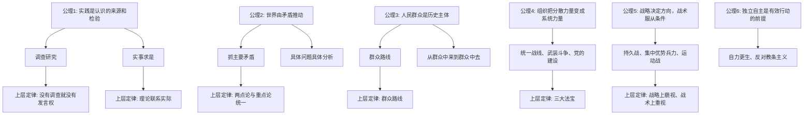
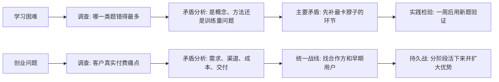

## 毛选思维筑基课: 《毛泽东选集》: 从底层公理到上层定律的思维地图

### 作者
digoal

### 日期
2026-05-17

### 标签
毛泽东选集 , 毛泽东思想 , 底层公理 , 上层定律 , 实践论 , 矛盾论 , 群众路线 , 组织力量 , 战略思维 , 独立自主

----

## 背景

> 面向对象: 思维筑基课学习者  
> 核心问题: 《毛泽东选集》不是一组孤立文章，而是一套关于认识、矛盾、组织、斗争、群众、战略的思维系统。它的底层公理是什么？由这些公理能推出哪些经典上层定律？  
> 先说结论: 《毛泽东选集》的底层不是“背结论”，而是“从实际出发、在矛盾中抓主要方面、通过实践检验认识、依靠群众形成组织力量、用战略统摄战术”。上层定律则是这些公理在革命、战争、组织、宣传、调查、治理中的稳定表达。

说明: 本文以通行《毛泽东选集》第一至第四卷为主，兼及学习体系中经常并读的《实践论》《矛盾论》《论持久战》《改造我们的学习》《反对本本主义》《关于领导方法的若干问题》等文本。这里的“公理”和“定律”是课程化表达，不是说毛泽东本人以数学公理体系写作，而是把反复出现的思想前提和方法论抽象出来。

## 一张图先看懂



## 求真讲法

### 它到底说了什么

《毛泽东选集》里的很多文章，表面上在回答不同问题: 怎样打仗、怎样建党、怎样调查农村、怎样看待抗日战争、怎样反对主观主义、怎样做宣传、怎样处理人民内部矛盾。  

但把这些文章放在一起，会发现它们背后共享一套思维骨架:

1. 不从书本和愿望出发，而从现实关系出发。
2. 不把世界看成静止对象，而看成由矛盾推动的变化过程。
3. 不把人群当作被动对象，而把群众看作历史行动的主体。
4. 不相信松散热情天然能胜利，而强调组织、纪律、路线和方法。
5. 不用单点成败判断大局，而用阶段、力量对比、战略空间判断趋势。
6. 不照搬外部经验，而要求在本国、本地、本时的条件中重新验证。

如果用一句话概括: 《毛选》的思维系统，就是把“现实条件、矛盾结构、群众力量、组织能力、战略时间”放进同一个分析框架。

### 它是怎么来的

这套思想不是在书斋里预设出来的，而是在中国革命的长期实践中逐步形成的。早期文章重视调查和农民问题，中期文章集中讨论认识论、矛盾论、军事战略和统一战线，后期文章更多处理新民主主义、政权建设、文艺、党的作风和群众工作。

可以把它看成一个循环:

```text
现实问题
  ↓
调查研究: 看到真实结构
  ↓
矛盾分析: 找到主次、敌友、阶段
  ↓
路线制定: 把认识变成组织化行动
  ↓
群众实践: 检验、修正、扩大
  ↓
新的现实问题
```

这解释了为什么《毛选》中常同时出现哲学、军事、组织和宣传。它们不是四套互不相干的知识，而是同一套方法在不同领域的展开。

### 底层公理一: 实践是认识的来源和检验

这一公理的意思是: 人不是先在脑中拥有完整真理，再去套现实；人是在实践中接触现实、形成认识，再通过实践检验和修正认识。

它支撑了几个经典判断:

| 上层定律 | 核心意思 | 对应的思维要求 |
| --- | --- | --- |
| 没有调查就没有发言权 | 不掌握事实结构，就不能下判断 | 先问材料从哪里来 |
| 实事求是 | 从实际对象内部找规律 | 不用立场替代分析 |
| 理论联系实际 | 理论必须能解释并指导具体问题 | 不把理论当装饰 |
| 从实践到认识再到实践 | 认识要循环升级 | 不把一次判断当终局 |

这个公理反对两种错误: 一种是经验主义，只见局部经验，不会抽象规律；另一种是教条主义，只背现成结论，不看现实变化。

### 底层公理二: 矛盾是事物发展的动力

《矛盾论》提供了《毛选》最核心的分析工具: 事物内部有矛盾，矛盾有主要和次要，矛盾双方有主要方面和次要方面，不同阶段的主要矛盾会变化。

这不是一句“万物都有矛盾”的空话。它真正有用的地方在于逼迫人回答四个问题:

1. 当前最主要的问题是什么？
2. 这个问题中的主要方面是谁？
3. 次要矛盾会不会在条件变化后上升？
4. 解决一个矛盾会不会制造新的矛盾？

由此推出的上层定律包括:

| 上层定律 | 解释 | 常见误用 |
| --- | --- | --- |
| 具体问题具体分析 | 同一原则在不同条件下有不同形式 | 把“具体”变成没有原则 |
| 抓主要矛盾 | 先解决决定全局的关键问题 | 把唯一问题误当主要问题 |
| 两点论与重点论统一 | 既看多方面，又抓主导方面 | 只讲平衡，不敢排序 |
| 阶段论 | 不同阶段任务不同 | 用昨天的任务解决今天的问题 |

这个公理特别适合训练“结构感”。它要求我们不要只问“谁对谁错”，还要问“什么关系在推动变化”。

### 底层公理三: 人民群众是历史主体

《毛选》中的群众观点不是简单地说“群众重要”，而是说历史行动的真实力量存在于广大群众之中。领导、理论、组织如果脱离群众，就会失去信息来源、合法性来源和执行力量。

它推出了最经典的上层定律: 群众路线。

群众路线可以拆成三步:

1. 从群众中来: 收集分散的经验、要求、情绪和问题。
2. 加工集中: 用理论和路线把分散认识变成系统认识。
3. 到群众中去: 让群众理解、检验、执行，再反馈修正。

这里的关键不是“迎合群众”，而是“把群众经验上升为可组织、可执行、可检验的路线”。如果只收集意见不加工，就是尾巴主义；如果只发布命令不吸收经验，就是命令主义。

### 底层公理四: 组织把分散力量变成历史力量

《毛选》中反复强调党的建设、统一战线、武装斗争，并不是偏离哲学，而是哲学进入行动层后的必然结果。现实中的力量不是自动聚合的。没有组织，群众的愿望是分散的；没有路线，组织的行动是盲目的；没有纪律，路线难以执行。

因此形成了“三大法宝”:

| 法宝 | 解决的问题 | 思维本质 |
| --- | --- | --- |
| 统一战线 | 谁可以联合，谁必须斗争 | 敌友结构分析 |
| 武装斗争 | 在极端对抗条件下如何保存和发展力量 | 力量关系分析 |
| 党的建设 | 谁来保证方向、纪律和自我修正 | 组织能力分析 |

对现代学习和管理而言，它可以迁移为: 目标联盟、执行机制、核心团队建设。没有联盟，资源不足；没有执行，目标空转；没有核心团队，系统无法持续迭代。

### 底层公理五: 战略时间比一时胜负更重要

《论持久战》的经典价值，不只在于判断抗战会经历阶段，更在于提供了一种战略时间观: 当短期力量不占优时，不能用一次会战的输赢定义整个局势，而要看长期力量如何变化。

它推出几条上层定律:

1. 战略上藐视敌人，战术上重视敌人。
2. 保存自己，消灭敌人。
3. 集中优势兵力，各个歼灭敌人。
4. 以空间换时间，在时间中改变力量对比。
5. 主动性来自对条件、阶段和节奏的掌握。

这些原则的共同点是: 不把勇敢误当战略，不把退却误当失败，不把局部胜利误当全局胜利。

### 底层公理六: 独立自主是有效行动的前提

《毛选》强烈反对照搬外部经验，尤其反对把外来理论、上级指示、书本公式直接当成现实答案。独立自主不是封闭，而是说任何理论进入中国现实、本地现实、具体任务时，都必须经过重新调查、重新判断、重新组织。

这条公理推出:

| 上层定律 | 核心意思 |
| --- | --- |
| 反对本本主义 | 书本不能代替实际调查 |
| 自力更生 | 不能把成败寄托在外部恩赐上 |
| 独立自主 | 外部经验要经过本地化检验 |
| 中国化 | 普遍理论必须和具体历史条件结合 |

它的反面是“拿来主义式教条”: 看见别人成功，就复制别人的术语、组织、流程，却不分析自己的条件是否相同。

### 底层公理七: 思想、语言和文艺也是组织力量

《在延安文艺座谈会上的讲话》《反对党八股》《整顿党的作风》等文章说明，《毛选》并不把语言看成表达工具那么简单。语言会组织认识，文风会影响群众理解，宣传会塑造行动方向。

由此推出:

1. 文风必须服务对象，而不是服务作者优越感。
2. 宣传必须连接群众经验，而不是堆砌空话。
3. 思想教育不是装饰，而是组织行动的一部分。
4. 批评与自我批评是组织自我修正机制。

这条公理对写作课尤其重要: 文章不是词句漂亮就有力量，而是要能改变读者对问题结构的看法。

## 求存讲法

### 它有什么用

把《毛选》抽象成公理和定律，最大的用处不是模仿历史情境，而是训练一种高强度的现实分析能力:

1. 遇到复杂问题，先调查，而不是先表态。
2. 看到一堆问题，先排序，而不是平均用力。
3. 面对强弱差距，先判断阶段，而不是情绪化冒进。
4. 组织行动时，先找群众基础和执行机制，而不是只写口号。
5. 学习外部经验时，先问条件是否相同，而不是复制结论。

### 它怎么迁移到熟悉领域

可以把《毛选》的方法迁移到学习、创业、管理、写作和技术决策中。



换成更简单的话:

| 场景 | 不是这样 | 而是这样 |
| --- | --- | --- |
| 学习 | “我就是不聪明” | 找出主要薄弱点并集中突破 |
| 写作 | “我要写得华丽” | 先判断读者困惑和文章任务 |
| 管理 | “大家加油” | 建立目标、分工、反馈和纪律 |
| 创业 | “别人这样做成功了” | 先调查本地客户和资源条件 |
| 投资 | “热点一定能赚” | 分析主要矛盾、阶段和力量对比 |

### 它的适用范围和边界

这套方法很强，但不能乱用。它有几个边界:

1. 它适合处理复杂社会系统、组织行动、战略判断、学习迁移问题。
2. 它不适合替代专业科学实验、法律判断、医学诊断、工程计算。
3. 它强调斗争和矛盾，但现实生活中有些问题更适合合作、制度设计和长期建设。
4. 它要求调查事实，如果没有事实材料，只套“主要矛盾”等词，会变成空洞标签。
5. 它产生于特定历史条件，迁移时必须去历史化地提取方法，而不能机械复制具体做法。

### 正例: 怎么用它提升能力

假设一个学生数学成绩长期不好。普通说法是“多刷题”。用《毛选》的思维框架，步骤会不同:

1. 实践公理: 先拿最近十次错题做调查。
2. 矛盾公理: 区分错因是概念不清、计算不稳、题型不熟，还是考试时间分配错误。
3. 主要矛盾: 如果 60% 错题来自函数概念混乱，就先集中补函数，而不是平均刷题。
4. 组织公理: 制定每天 30 分钟概念复述、20 分钟典型题、10 分钟错题复盘的执行机制。
5. 实践检验: 一周后用新题验证，而不是靠感觉判断。

这就是“调查研究、抓主要矛盾、路线执行、实践检验”的完整闭环。

### 反例: 前提不成立会怎样

一个创业团队看到某家公司靠短视频获客成功，于是立刻全员做短视频。但他们没有调查自己的客户群是否在短视频平台决策，没有分析产品是否适合短链路转化，也没有组织稳定的内容生产和销售承接。结果流量有了，成交没有，团队还被内容工作拖垮。

这个失败不是因为“短视频错了”，而是因为几个前提不成立:

1. 没有调查客户真实购买路径，违背实践公理。
2. 没有抓主要矛盾，把获客误当成交瓶颈。
3. 没有本地化验证，违背独立自主公理。
4. 没有组织承接机制，流量无法转化为业务力量。

### 一张“公理到定律”总表

| 底层公理 | 经典上层定律 | 一句话解释 | 现代迁移 |
| --- | --- | --- | --- |
| 实践是认识的来源和检验 | 没有调查就没有发言权 | 判断必须建立在事实材料上 | 做决策前先拿真实数据 |
| 实事求是 | 理论联系实际 | 规律要从对象内部找 | 不让模板压过现实 |
| 矛盾推动发展 | 抓主要矛盾 | 复杂问题要排序 | 找杠杆点 |
| 矛盾有阶段变化 | 具体问题具体分析 | 条件变，策略也要变 | 动态调整计划 |
| 群众是历史主体 | 群众路线 | 从群众经验中形成路线 | 用户研究和组织反馈 |
| 组织创造力量 | 三大法宝 | 联盟、执行、核心队伍缺一不可 | 生态、交付、团队 |
| 战略时间决定胜负 | 持久战 | 在时间中改变力量对比 | 长周期竞争 |
| 独立自主 | 反对本本主义 | 外部经验必须本地化 | 不盲目复制最佳实践 |
| 思想也是力量 | 反对党八股 | 语言要服务对象和行动 | 写作要解决读者问题 |

### 一个极简 SVG: 方法闭环

<svg width="720" height="220" viewBox="0 0 720 220" xmlns="http://www.w3.org/2000/svg" role="img" aria-label="毛选方法闭环">
  <rect x="20" y="80" width="120" height="56" rx="8" fill="#e8f2ff" stroke="#2563eb"/>
  <text x="80" y="113" text-anchor="middle" font-size="16" fill="#111827">调查事实</text>
  <rect x="170" y="80" width="120" height="56" rx="8" fill="#fff7ed" stroke="#ea580c"/>
  <text x="230" y="113" text-anchor="middle" font-size="16" fill="#111827">分析矛盾</text>
  <rect x="320" y="80" width="120" height="56" rx="8" fill="#f0fdf4" stroke="#16a34a"/>
  <text x="380" y="113" text-anchor="middle" font-size="16" fill="#111827">制定路线</text>
  <rect x="470" y="80" width="120" height="56" rx="8" fill="#fdf2f8" stroke="#db2777"/>
  <text x="530" y="113" text-anchor="middle" font-size="16" fill="#111827">组织实践</text>
  <rect x="600" y="80" width="100" height="56" rx="8" fill="#f8fafc" stroke="#475569"/>
  <text x="650" y="113" text-anchor="middle" font-size="16" fill="#111827">反馈修正</text>
  <path d="M140 108 L170 108" stroke="#111827" stroke-width="2" marker-end="url(#arrow)"/>
  <path d="M290 108 L320 108" stroke="#111827" stroke-width="2" marker-end="url(#arrow)"/>
  <path d="M440 108 L470 108" stroke="#111827" stroke-width="2" marker-end="url(#arrow)"/>
  <path d="M590 108 L600 108" stroke="#111827" stroke-width="2" marker-end="url(#arrow)"/>
  <path d="M650 136 C620 195, 110 195, 80 136" fill="none" stroke="#111827" stroke-width="2" marker-end="url(#arrow)"/>
  <defs>
    <marker id="arrow" markerWidth="10" markerHeight="10" refX="8" refY="3" orient="auto">
      <path d="M0,0 L0,6 L9,3 z" fill="#111827"/>
    </marker>
  </defs>
</svg>

## 思考

### 反事实问题一: 如果没有“实践公理”，会发生什么？

那就会出现两种极端: 要么只会背理论，用概念压现实；要么只会堆经验，看不到经验背后的结构。前者容易空，后者容易散。

### 反事实问题二: 如果只讲“矛盾”，不讲“群众”，会发生什么？

会变成聪明人的纸面分析。分析可能很漂亮，但没有群众经验输入，也没有群众行动承接，最后只能停在判断层，不能进入改变现实的层面。

### 反事实问题三: 如果只讲“群众”，不讲“组织”，会发生什么？

会把分散情绪误当历史力量。群众力量要变成现实力量，需要路线、组织、纪律、干部、反馈机制。没有这些，热情容易涨落，行动难以持续。

### 反事实问题四: 如果只讲“战略”，不重视“战术”，会发生什么？

会把长期正确变成短期失败。战略方向再对，也必须经过具体条件下的战术实现。战略上看趋势，战术上看代价、节奏、资源和执行。

### 用一句课内问题检验是否学懂

当你遇到一个复杂问题时，能不能按下面六问回答:

1. 我掌握的事实来自哪里？
2. 当前主要矛盾是什么？
3. 这个矛盾的主要方面是什么？
4. 谁是可以依靠、联合、影响和争取的力量？
5. 现在处在什么阶段，不能急着做什么？
6. 我的方案如何被实践检验并修正？

如果能回答这六问，就不是在背《毛选》，而是在使用它的思维方法。

## 最后记住

1. 《毛选》的底层公理之一是实践: 先调查，再判断，再实践检验。
2. 《毛选》的核心分析工具是矛盾: 看主次、看阶段、看条件变化。
3. 《毛选》的行动基础是群众: 经验来自群众，力量也来自群众。
4. 《毛选》的组织逻辑是把分散力量变成系统力量: 联盟、执行、核心队伍缺一不可。
5. 《毛选》的战略观是用时间和阶段改变力量对比: 不被一时胜负牵着走。
6. 《毛选》的迁移边界是必须具体化: 可以学方法，不能机械复制历史做法。

## 参考资料

1. 毛泽东: 《毛泽东选集》第一卷至第四卷，人民出版社通行版本。
2. 毛泽东: 《实践论》。
3. 毛泽东: 《矛盾论》。
4. 毛泽东: 《反对本本主义》。
5. 毛泽东: 《论持久战》。
6. 毛泽东: 《新民主主义论》。
7. 毛泽东: 《改造我们的学习》。
8. 毛泽东: 《关于领导方法的若干问题》。
9. 毛泽东: 《论联合政府》。
10. 毛泽东: 《在延安文艺座谈会上的讲话》。
  
#### [PostgreSQL 解决方案集合](../201706/20170601_02.md "40cff096e9ed7122c512b35d8561d9c8")
  
  
#### [德哥 / digoal's Github - 公益是一辈子的事.](https://github.com/digoal/blog/blob/master/README.md "22709685feb7cab07d30f30387f0a9ae")
  
  
#### [About 德哥](https://github.com/digoal/blog/blob/master/me/readme.md "a37735981e7704886ffd590565582dd0")
  
  

  
